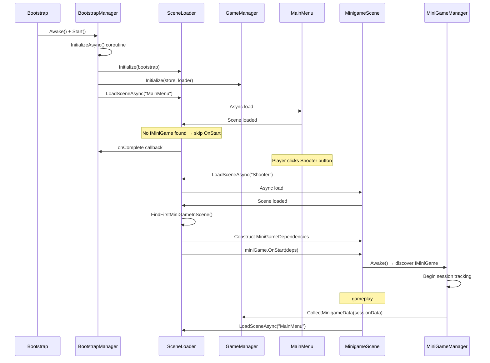

# CubiWare — Developer Guide

> **Last updated:** 2026-05-11 (Post-Refactoring)
> **Unity Version:** 2022.3 LTS (URP)  
> **Scripting Runtime:** .NET Standard 2.1  
> **Namespace Convention:** `CubiWare.{Module}` (e.g. `CubiWare.Core`, `CubiWare.Core.Interfaces`, `CubiWare.Core.Services`, `CubiWare.Core.Logging`, `CubiWare.Core.Data`, `ARcadeRush.Core` for legacy singletons, `ARcadeRush.Minigames`)

---

## Table of Contents

1. [Project Architecture](#1-project-architecture)
2. [Bootstrap Initialization Sequence](#2-bootstrap-initialization-sequence)
3. [Service Layer & Interfaces](#3-service-layer--interfaces)
4. [Logging Infrastructure](#4-logging-infrastructure)
5. [Singleton System (Post-Refactoring)](#5-singleton-system-post-refactoring)
6. [Scene Flow](#6-scene-flow)
7. [MiniGameRegistry & Adding a New Minigame](#7-minigameregistry--adding-a-new-minigame)
8. [Data Persistence Patterns](#8-data-persistence-patterns)
9. [Hand Pipeline](#9-hand-pipeline)
10. [Face Pipeline](#10-face-pipeline)
11. [Camera System](#11-camera-system)
12. [UI Components](#12-ui-components)
13. [LLM Integration](#13-llm-integration)
14. [Shooter Minigame](#14-shooter-minigame)
15. [Build Settings](#15-build-settings)
16. [Troubleshooting](#16-troubleshooting)

---

## 1. Project Architecture

### 1.1 Namespace Map

```
CubiWare.Core                  — BootstrapManager, MiniGameManager, MiniGameRegistry
CubiWare.Core.Interfaces       — ICameraFeed, IHandDetector, IFaceDetector, ILLMService,
                                  IDataStore, IInteractionLogger, IMiniGameLifecycle,
                                  IMinigameSessionData
CubiWare.Core.Services         — CameraFeedProvider, HandDetectorService, FaceDetectorService,
                                  GroqLLMService, PlayerPrefsDataStore, LogManager,
                                  InteractionEvent
CubiWare.Core.Logging          — ServiceLogger, LogLevel, LogContext, ServiceErrorCode,
                                  AbstractMediaPipeLLM
CubiWare.Core.Data             — UserData, MinigameSessionData
ARcadeRush.Core                — GameManager, SceneLoader (legacy namespace, retained)
ARcadeRush.Minigames.Shooter   — ShooterGame, ShooterHandController, GunController,
                                  TargetManager, Target
```

### 1.2 Folder Structure

```
Assets/
├── Scenes/
│   ├── Bootstrap.unity       [Build Index 0] — Entry point
│   ├── MainMenu.unity        [Build Index 1] — Hub / minigame selector
│   └── Shooter.unity         [Build Index 2] — Shooter minigame
├── Scripts/
│   ├── Core/                  — Singletons, BootstrapManager, MiniGameManager
│   │   ├── Interfaces/       — 8 interface contracts (Phase 1)
│   │   ├── Services/         — Service implementations + LogManager (Phase 3)
│   │   ├── Logging/          — ServiceLogger, AbstractMediaPipeLLM (Phase 2)
│   │   └── Data/             — UserData, MinigameSessionData (Phase 5)
│   ├── Hand/                  — Hand tracking pipeline
│   ├── Face/                  — Face landmark pipeline
│   ├── UI/                    — Reusable UI widgets
│   └── Minigames/
│       └── Shooter/           — Shooter minigame logic
├── Prefabs/                   — Reusable prefabs
├── Resources/                 — ScriptableObjects (GroqConfig)
└── StreamingAssets/
    └── mediapipe/             — MediaPipe model files
```

### 1.3 Architecture Layers

```
┌─────────────────────────────────────────────────────────────────┐
│                       MINIGAME LAYER                             │
│  ShooterGame, TargetManager, GunController, ShooterHandController│
│  Consumes: ICameraFeed, IHandDetector, ILLMService via wrappers  │
│  Reports:  MinigameSessionData → GameManager                     │
│  Logs via: ServiceLogger (errors) + LogManager (interactions)    │
└───────────────────────────┬─────────────────────────────────────┘
                            │
┌───────────────────────────┴─────────────────────────────────────┐
│                       SERVICE LAYER                              │
│  CameraFeedProvider  │  HandDetectorService                      │
│  FaceDetectorService │  GroqLLMService                           │
│  PlayerPrefsDataStore│  LogManager                               │
│  Implements interfaces from CubiWare.Core.Interfaces             │
└───────────────────────────┬─────────────────────────────────────┘
                            │
┌───────────────────────────┴─────────────────────────────────────┐
│                       BOOTSTRAP LAYER                            │
│  BootstrapManager  │  SceneLoader  │  GameManager                │
│  MiniGameManager   │  MiniGameRegistry                           │
│  Owns: init sequence, lifecycle, scene transitions               │
└───────────────────────────┬─────────────────────────────────────┘
                            │
┌───────────────────────────┴─────────────────────────────────────┐
│                       LOGGING INFRASTRUCTURE                      │
│  ServiceLogger (system errors) │ LogManager (interaction data)   │
│  ServiceErrorCode (28 codes)   │ LogLevel (Trace→Fatal)          │
│  LogContext (CallerMemberName) │ AbstractMediaPipeLLM (base)     │
└─────────────────────────────────────────────────────────────────┘
```

---

## 2. Bootstrap Initialization Sequence

### 2.1 Overview

[`BootstrapManager`](Assets/Scripts/Core/BootstrapManager.cs) is a singleton in the Bootstrap scene that orchestrates a 12-step initialization sequence. It runs as a coroutine (`InitializeAsync()`) to ensure ordered startup of all services before loading the MainMenu.

### 2.2 Init Sequence (12 Steps)

```
Step  1: ServiceLogger.Instance          — Lazy singleton, auto-created
Step  2: Create PlayerPrefsDataStore     — Transitional IDataStore
Step  3: SceneLoader.Initialize(this)    — Register for coordinated startup
Step  4: GameManager.Initialize(store,   — Accept dependencies, load saved data
           sceneLoader)
Step  5: CameraFeedProvider ready        — Confirms CameraFeedCtrl.Awake()
Step  6: HandDetectorService ready       — Confirms MediaPipeController.Start()
Step  7: FaceDetectorService ready       — Same controller, face detection
Step  8: GroqLLMService ready            — Confirms LLMConnector.Awake()
Step  9: BootstrapState = Initialized    — Mark as complete
Step 10: Log completion
Step 11: SceneLoader.LoadSceneAsync(     — Async load MainMenu
           "MainMenu")
Step 12: On complete → callback logs     — MainMenu scene is now active
```

### 2.3 Shutdown Sequence (Reverse Order)

When the application quits, [`BootstrapManager.ShutdownAsync()`](Assets/Scripts/Core/BootstrapManager.cs:156) runs:

```
Reverse Step 8: Shutdown GroqLLMService      — Via LLMConnector.OnDestroy
Reverse Step 7: Shutdown FaceDetectorService  — Via MediaPipeController.OnDestroy
Reverse Step 6: Shutdown HandDetectorService  — Via MediaPipeController.OnDestroy
Reverse Step 5: Shutdown CameraFeedProvider   — CameraFeedCtrl.StopCamera()
Reverse Step 4: Shutdown GameManager          — SaveUserDataAsync()
State = ShutDown
```

### 2.4 BootstrapSelfDestruct

[`BootstrapSelfDestruct`](Assets/Scripts/Core/BootstrapSelfDestruct.cs) subscribes to `SceneManager.sceneLoaded`. When a non-Bootstrap scene loads (e.g., a minigame scene), it:
1. Unsubscribes from `sceneLoaded`
2. Destroys the Bootstrap root GameObject

This prevents the Bootstrap scene's GameObjects from persisting into game scenes where they are not needed.

---

## 3. Service Layer & Interfaces

### 3.1 Interface Contracts

All interfaces live in [`Assets/Scripts/Core/Interfaces/`](Assets/Scripts/Core/Interfaces/):

| Interface              | File                                                                                | Key Methods                                                                              |
| ---------------------- | ----------------------------------------------------------------------------------- | ---------------------------------------------------------------------------------------- |
| `ICameraFeed`          | [`ICameraFeed.cs`](Assets/Scripts/Core/Interfaces/ICameraFeed.cs)                   | `InitializeAsync()`, `Start()`, `Stop()`, `Release()` — shared camera texture            |
| `IHandDetector`        | [`IHandDetector.cs`](Assets/Scripts/Core/Interfaces/IHandDetector.cs)               | `InitializeAsync(config, cameraFeed)`, `Start()`, `Stop()`, `Release()` — hand landmarks |
| `IFaceDetector`        | [`IFaceDetector.cs`](Assets/Scripts/Core/Interfaces/IFaceDetector.cs)               | `InitializeAsync(config, cameraFeed)`, `Start()`, `Stop()`, `Release()` — face landmarks |
| `ILLMService`          | [`ILLMService.cs`](Assets/Scripts/Core/Interfaces/ILLMService.cs)                   | `AskAsync()`, `Ask()`, `Cancel()`, `Release()` — LLM API abstraction                     |
| `IDataStore`           | [`IDataStore.cs`](Assets/Scripts/Core/Interfaces/IDataStore.cs)                     | `SaveAsync<T>()`, `LoadAsync<T>()`, `DeleteAsync()`, `ExistsAsync()`, `ClearAsync()`     |
| `IInteractionLogger`   | [`IInteractionLogger.cs`](Assets/Scripts/Core/Interfaces/IInteractionLogger.cs)     | `Record()`, `GetSessionLog()`, `FlushAsync()`, `FlushAndShutdownAsync()`                 |
| `IMiniGameLifecycle`   | [`IMiniGameLifecycle.cs`](Assets/Scripts/Core/Interfaces/IMiniGameLifecycle.cs)     | `OnMinigameStart()`, `OnMinigameEnd()`, `OnMinigamePause()`, `OnMinigameResume()`        |
| `IMinigameSessionData` | [`IMinigameSessionData.cs`](Assets/Scripts/Core/Interfaces/IMinigameSessionData.cs) | `MinigameId`, `Score`, `DurationSeconds`, `IsCompleted`, `CustomStats`                   |

### 3.2 Service Implementations

| Interface            | Implementation         | File                                                                              | Notes                                                       |
| -------------------- | ---------------------- | --------------------------------------------------------------------------------- | ----------------------------------------------------------- |
| `ICameraFeed`        | `CameraFeedProvider`   | [`CameraFeedProvider.cs`](Assets/Scripts/Core/Services/CameraFeedProvider.cs)     | Shared singleton, consumed by detector services + minigames |
| `IHandDetector`      | `HandDetectorService`  | [`HandDetectorService.cs`](Assets/Scripts/Core/Services/HandDetectorService.cs)   | Extends `AbstractMediaPipeLLM`                              |
| `IFaceDetector`      | `FaceDetectorService`  | [`FaceDetectorService.cs`](Assets/Scripts/Core/Services/FaceDetectorService.cs)   | Extends `AbstractMediaPipeLLM`                              |
| `ILLMService`        | `GroqLLMService`       | [`GroqLLMService.cs`](Assets/Scripts/Core/Services/GroqLLMService.cs)             | Extends `AbstractMediaPipeLLM`                              |
| `IDataStore`         | `PlayerPrefsDataStore` | [`PlayerPrefsDataStore.cs`](Assets/Scripts/Core/Services/PlayerPrefsDataStore.cs) | Transitional — wraps `PlayerPrefs`                          |
| `IInteractionLogger` | `LogManager`           | [`LogManager.cs`](Assets/Scripts/Core/Services/LogManager.cs)                     | Singleton, in-memory buffer + flush                         |

### 3.3 Wrapper Pattern (Backward Compatibility)

Existing controllers were NOT rewritten. Instead, they were refactored using a **delegation pattern**:

```
Old API                            New Internal Delegate
─────────────────────────────────────────────────────────
CameraFeedCtrl.Instance     →     CameraFeedProvider (ICameraFeed)
MediaPipeController.Instance →    HandDetectorService (IHandDetector)
                                     + FaceDetectorService (IFaceDetector)
LLMConnector.Instance       →     GroqLLMService (ILLMService)
```

This means:
- **Old code** still works: `CameraFeedCtrl.Instance.StartCamera()` delegates internally
- **New code** can use interfaces directly: `ICameraFeed cameraFeed = CameraFeedCtrl.Instance`
- **Future consumers** can accept `ICameraFeed` in constructors for testability

### 3.4 AbstractMediaPipeLLM

[`AbstractMediaPipeLLM`](Assets/Scripts/Core/Logging/AbstractMediaPipeLLM.cs) is the abstract base class for all detection and AI services. It provides:

- **Error notification** with consistent `ServiceErrorCode` enum
- **Structured logging** via `ServiceLogger`
- **Lifecycle** (`Initialize()`, `Shutdown()`, `IsInitialized`)
- **Cancellation token source** (CTS) pattern for cooperative cancellation
- **Retry logic** with configurable attempts and delay

Derived classes implement:
```csharp
protected abstract Task<bool> InitializeInternal();
protected abstract void ShutdownInternal();
protected abstract void LogDebug(string message);
protected abstract void LogWarning(string message);
protected abstract void LogError(ServiceErrorCode code, string message);
```

---

## 4. Logging Infrastructure

### 4.1 Two-Tier Architecture

| Tier                 | Component                                                       | Purpose                                                  | Output                               |
| -------------------- | --------------------------------------------------------------- | -------------------------------------------------------- | ------------------------------------ |
| **System Errors**    | [`ServiceLogger`](Assets/Scripts/Core/Logging/ServiceLogger.cs) | Structured error/exception logging for internal services | Unity Console + `OnLogEmitted` event |
| **Interaction Data** | [`LogManager`](Assets/Scripts/Core/Services/LogManager.cs)      | Player-minigame interaction event recording              | Memory buffer + `IDataStore` flush   |

### 4.2 ServiceLogger Usage

[`ServiceLogger`](Assets/Scripts/Core/Logging/ServiceLogger.cs) is a thread-safe singleton with a circular buffer (max 100 entries) and an `OnLogEmitted` event for external sinks.

**Getting the instance:**
```csharp
private readonly ServiceLogger _logger = ServiceLogger.Instance;
```

**Logging methods:**
```csharp
_logger.LogTrace("ComponentName", "Detailed debug message");
_logger.LogDebug("ComponentName", "Debug information");
_logger.LogInfo("ComponentName", "Normal operational message");
_logger.LogWarning("ComponentName", "Something unusual happened");
_logger.LogError("ComponentName", "Something failed", ServiceErrorCode.CameraStartFailed);
_logger.LogFatal("ComponentName", "Unrecoverable error", ServiceErrorCode.MediaPipeInitFailed);
```

**LogLevel hierarchy** (defined in [`LogLevel.cs`](Assets/Scripts/Core/Logging/LogLevel.cs)):
```
Trace (0) → Debug (1) → Info (2) → Warning (3) → Error (4) → Fatal (5)
```

**Setting minimum level:**
```csharp
ServiceLogger.Instance.MinimumLevel = LogLevel.Debug;  // Show debug and above
```

**Subscribing to log events:**
```csharp
ServiceLogger.Instance.OnLogEmitted += context => {
    // Route to UI, file, or external sink
    Debug.Log(context.ToString());
};
```

### 4.3 ServiceErrorCode Categories

Defined in [`ServiceErrorCode.cs`](Assets/Scripts/Core/Logging/ServiceErrorCode.cs) — 28 codes across 7 categories:

| Category      | Range   | Examples                                                                                                     |
| ------------- | ------- | ------------------------------------------------------------------------------------------------------------ |
| General       | 0-99    | `None`, `Unknown`, `NotInitialized`, `AlreadyInitialized`, `InvalidConfig`, `Timeout`, `OperationCancelled`  |
| Camera        | 100-199 | `CameraPermissionDenied`, `CameraNotFound`, `CameraStartFailed`, `CameraFrameNull`                           |
| MediaPipe     | 200-299 | `MediaPipeModelNotFound`, `MediaPipeInitFailed`, `MediaPipeProcessingError`, `MediaPipeResultNull`           |
| LLM           | 300-399 | `LLMAuthFailed`, `LLMRateLimited`, `LLMConnectionFailed`, `LLMResponseParseFailed`, `LLMRequestTimeout`      |
| Data Store    | 400-499 | `DataStoreSerializationFailed`, `DataStoreDeserializationFailed`, `DataStoreKeyNotFound`, `DataStoreIOError` |
| Scene Loading | 500-599 | `SceneLoadFailed`, `SceneNotFound`, `SceneMinigameNotFound`                                                  |
| Minigame      | 600-699 | `MinigameInitFailed`, `MinigameStateError`                                                                   |
| LogManager    | 700-799 | `LogManagerBufferFull`, `LogManagerFlushFailed`                                                              |

### 4.4 LogContext Structure

[`LogContext`](Assets/Scripts/Core/Logging/LogContext.cs) captures structured information with `CallerMemberName`:

```csharp
var context = LogContext.Info(
    source: "Hand3DProjector",
    message: "Hand landmarks projected successfully",
    errorCode: ServiceErrorCode.None,
    memberName: nameof(ProjectLandmarks)
);
```

### 4.5 Interaction Event Schema (LogManager)

All player-minigame interactions use a consistent schema via [`LogManager`](Assets/Scripts/Core/Services/LogManager.cs):

```json
{
  "eventType": "ShotFired",
  "minigameId": "MG_Shooter",
  "timestamp": "2026-05-11T18:30:00.000Z",
  "payload": {
    "ammoRemaining": 5,
    "aimPosition": {"x": 0.5, "y": 0.3},
    "gestureUsed": "ClosedFist"
  }
}
```

**Standard event types:** `GameStarted`, `GameEnded`, `ShotFired`, `ShotHit`, `ShotMissed`, `ReloadStarted`, `ReloadCompleted`, `GestureDetected`, `EmotionClassified`, `WaveStarted`, `WaveCompleted`, `ScoreChanged`, `LLMQuerySent`, `LLMResponseReceived`.

---

## 5. Singleton System (Post-Refactoring)

### 5.1 Bootstrap-Managed Singletons

All singletons are now managed by [`BootstrapManager`](Assets/Scripts/Core/BootstrapManager.cs) with simplified `Awake()` methods.

| Singleton             | File                                                                   | Role                                                                           |
| --------------------- | ---------------------------------------------------------------------- | ------------------------------------------------------------------------------ |
| `GameManager`         | [`GameManager.cs`](Assets/Scripts/Core/GameManager.cs)                 | State machine + data aggregator. `Initialize(store, loader)`                   |
| `SceneLoader`         | [`SceneLoader.cs`](Assets/Scripts/Core/SceneLoader.cs)                 | Async scene loading + IMiniGame discovery. `Initialize(bootstrap)`             |
| `CameraFeedCtrl`      | [`CameraFeedCtrl.cs`](Assets/Scripts/Core/CameraFeedCtrl.cs)           | Camera wrapper → delegates to `CameraFeedProvider`                             |
| `MediaPipeController` | [`MediaPipeController.cs`](Assets/Scripts/Core/MediaPipeController.cs) | Hand+Face wrapper → delegates to `HandDetectorService` + `FaceDetectorService` |
| `LLMConnector`        | [`LLMConnector.cs`](Assets/Scripts/Core/LLMConnector.cs)               | LLM wrapper → delegates to `GroqLLMService`                                    |

### 5.2 GameManager API

```csharp
// Bootstrap initialization
public void Initialize(IDataStore dataStore, SceneLoader sceneLoader);

// State transitions
public void StartGame(IMiniGame game);
public void EndGame();
public void AddScore(int delta);
public void PauseGame();
public void ResumeGame();

// Data aggregation
public void CollectMinigameData(MinigameSessionData sessionData);
public Task SaveUserDataAsync();
public Task LoadUserDataAsync();
public IDataStore DataStore { get; }

// Cleanup
public void SelfDestruct();

// Events
public event Action OnGameStarted;
public event Action OnGameEnded;
public event Action<int> OnScoreChanged;
public event Action OnGamePaused;
public event Action OnGameResumed;
```

### 5.3 SceneLoader API

```csharp
// Bootstrap initialization
public void Initialize(BootstrapManager bootstrap);

// Legacy (blocking)
public void LoadScene(int index, LoadSceneMode mode = LoadSceneMode.Single);

// Legacy (delayed)
public void LoadSceneDelayed(int index, float delay, LoadSceneMode mode = LoadSceneMode.Single);

// Primary entry point — async + IMiniGame discovery
public void LoadSceneAsync(string sceneName, Action onComplete = null);
```

---

## 6. Scene Flow

### 6.1 Build Index Assignment

| Index | Scene             | Purpose                         |
| ----- | ----------------- | ------------------------------- |
| 0     | `Bootstrap.unity` | Entry point, creates singletons |
| 1     | `MainMenu.unity`  | Minigame selection hub          |
| 2     | `Shooter.unity`   | Shooter minigame                |

> **Note:** Build Indices must be updated in **File → Build Settings** whenever a new scene is added or removed.

### 6.2 Full Scene Transition Flow



### 6.3 The Init Bridge Fix

The critical fix: [`SceneLoader.LoadSceneAsync()`](Assets/Scripts/Core/SceneLoader.cs:66) now **automatically discovers and starts** any `IMiniGame` implementer after a scene finishes loading:

```csharp
// After async scene load completes:
var miniGame = FindFirstMiniGameInScene();
if (miniGame != null)
{
    var deps = new MiniGameDependencies { ... };
    miniGame.OnStart(deps);
}
onComplete?.Invoke();
```

This ensures `IMiniGame.OnStart(deps)` is **always** called when a scene with a minigame is loaded through the proper pipeline.

---

## 7. MiniGameRegistry & Adding a New Minigame

### 7.1 MiniGameRegistry

[`MiniGameRegistry`](Assets/Scripts/Core/MiniGameRegistry.cs) is a static class that maps scene names to `IMiniGame` types and provides build-index lookup:

```csharp
// Get build index by scene name
int index = MiniGameRegistry.GetSceneIndex("Shooter");  // Returns 2

// Get IMiniGame type for a scene
Type type = MiniGameRegistry.GetMinigameType("Shooter");  // Returns typeof(ShooterGame)

// Register a new minigame at runtime
MiniGameRegistry.Register<ShooterGame>("Shooter");
```

The static constructor auto-registers known minigames:
```csharp
static MiniGameRegistry()
{
    TryRegister("Shooter", "ARcadeRush.Minigames.Shooter.ShooterGame");
    TryRegister("FruitNinja", null);    // Placeholder
    TryRegister("EmotionTest", null);   // Placeholder
    TryRegister("Simon", null);         // Placeholder
}
```

### 7.2 Step-by-Step: Adding a New Minigame

#### Step 1: Create the scene

Create a new scene at `Assets/Scenes/MG_{Name}.unity`. The scene should contain:
- An object with your `IMiniGame` implementation
- A `MiniGameManager` component if you want lifecycle management
- A camera + light
- Any minigame-specific GameObjects

#### Step 2: Implement IMiniGame

```csharp
using ARcadeRush.Core;

public class MyMinigame : MonoBehaviour, IMiniGame
{
    public int SceneIndex => 3;  // Your build index

    public void OnStart(MiniGameDependencies deps)
    {
        // Called by SceneLoader.LoadSceneAsync() after scene loads
        _gameManager = deps.GameManager;
        _cameraFeed = deps.Camera;
        _mediaPipe = deps.MediaPipe;
        _llm = deps.LLM;
    }

    public void OnEnd()
    {
        // Clean up, report scores, etc.
    }
}
```

#### Step 3: Register in MiniGameRegistry

In [`MiniGameRegistry.cs`](Assets/Scripts/Core/MiniGameRegistry.cs), add your scene path and registration:

```csharp
// In _scenePaths dictionary:
{ "MyMinigame", "Assets/Scenes/MG_MyMinigame.unity" },

// In static constructor:
TryRegister("MyMinigame", "ARcadeRush.Minigames.MyMinigame");
```

#### Step 4: Wire into MainMenu

In [`MainMenuController.cs`](Assets/Scripts/UI/MainMenuController.cs):

```csharp
_startMyMinigameBtn.onClick.AddListener(() =>
{
    int index = MiniGameRegistry.GetSceneIndex("MyMinigame");
    if (index >= 0)
        SceneLoader.Instance.LoadScene(index);
});
```

#### Step 5: Add to Build Settings

Open **File → Build Settings** and ensure the new scene is added with the correct index.

#### Step 6: (Optional) Use MiniGameManager for Lifecycle Tracking

Add a [`MiniGameManager`](Assets/Scripts/Core/MiniGameManager.cs) component to your scene root. It will:
- Discover your `IMiniGame` automatically in `Awake()`
- Track session start/end times
- Report `MinigameSessionData` to `GameManager.CollectMinigameData()`
- Forward lifecycle events if your minigame implements `IMiniGameLifecycle`

---

## 8. Data Persistence Patterns

### 8.1 IDataStore Interface

[`IDataStore`](Assets/Scripts/Core/Interfaces/IDataStore.cs) provides async persistence:

```csharp
public interface IDataStore
{
    Task<bool> SaveAsync<T>(string key, T data);
    Task<T> LoadAsync<T>(string key);
    Task<bool> DeleteAsync(string key);
    Task<bool> ExistsAsync(string key);
    Task ClearAsync();
}
```

### 8.2 PlayerPrefsDataStore (Transitional)

[`PlayerPrefsDataStore`](Assets/Scripts/Core/Services/PlayerPrefsDataStore.cs) is the current implementation. It serializes data as JSON via `JsonUtility` and stores in `PlayerPrefs`.

```csharp
// Saving
var store = new PlayerPrefsDataStore();
await store.SaveAsync("user_data", new UserData { LastScore = 100 });

// Loading
UserData loaded = await store.LoadAsync<UserData>("user_data");
```

### 8.3 Where Data is Persisted

| Data               | Source                                                                      | Key                       | Frequency               |
| ------------------ | --------------------------------------------------------------------------- | ------------------------- | ----------------------- |
| User scores        | [`GameManager.SaveUserDataAsync()`](Assets/Scripts/Core/GameManager.cs:93)  | `"user_data"`             | On application quit     |
| User scores (load) | [`GameManager.LoadUserDataAsync()`](Assets/Scripts/Core/GameManager.cs:120) | `"user_data"`             | On bootstrap init       |
| Interaction logs   | [`LogManager.FlushAsync()`](Assets/Scripts/Core/Services/LogManager.cs)     | `"interaction_log"`       | On game end or shutdown |
| Hand calibration   | [`HandDepthCalibrator`](Assets/Scripts/Hand/HandDepthCalibrator.cs)         | `"Calibration_Near"` etc. | On calibration change   |

### 8.4 Future DataStore Implementations

The `IDataStore` interface makes it easy to add new providers without modifying consumers:

- **`JsonDataStore`** — file-based persistence using `Application.persistentDataPath`
- **`CloudDataStore`** — cloud save provider
- **`ProfileDataStore`** — per-user profile system

To add a new provider, simply implement `IDataStore` and pass it to `GameManager.Initialize()`:

```csharp
var jsonStore = new JsonDataStore("saves/");
GameManager.Instance.Initialize(jsonStore, SceneLoader.Instance);
```

---

## 9. Hand Pipeline

### 9.1 Pipeline Overview

```
MediaPipeController (raw NormalizedLandmarks)
  │  Delegates to HandDetectorService (IHandDetector)
  ▼
Hand3DProjector (2D → 3D world-space conversion)
  │  Uses depth calibration (Near/Mid/Far)
  │  Exposes: LandmarkWorldPositions[21]
  │
  ├──► GestureDetector (event-based gesture recognition)
  │     Events: OnClosedFist, OnOpenHand, OnPointing, OnThumbDown
  │
  ├──► HandModel (visual skeleton — spheres + lines)
  │
  └──► HandDepthCalibrator (runtime calibration, IDataStore)
```

All logging in this pipeline uses `ServiceLogger` instead of `Debug.Log`.

### 9.2 Hand3DProjector

[`Hand3DProjector.cs`](Assets/Scripts/Hand/Hand3DProjector.cs)

Converts normalized 2D MediaPipe landmarks (0–1 range) into 3D world positions. Uses a **three-point depth calibration** (Near/Mid/Far) with lerp to determine Z-depth from hand scale.

**Key property:** `public Vector3[] LandmarkWorldPositions { get; }` — array of 21 world-space positions.

**Landmark indices (MediaPipe hand topology):**
| Index | Name       | Usage                       |
| ----- | ---------- | --------------------------- |
| 0     | Wrist      | Root                        |
| 4     | Thumb Tip  | Thumb-down detection        |
| 5     | Index MCP  | Base of index finger        |
| 8     | Index Tip  | **Aim direction** (Shooter) |
| 12    | Middle Tip | Pointing detection          |
| 20    | Pinky Tip  | Pointing detection          |

### 9.3 GestureDetector

[`GestureDetector.cs`](Assets/Scripts/Hand/GestureDetector.cs)

| Event          | Detection Logic                                 |
| -------------- | ----------------------------------------------- |
| `OnClosedFist` | All finger tips curled toward palm              |
| `OnOpenHand`   | All fingers extended                            |
| `OnPointing`   | Index extended, others curled                   |
| `OnThumbDown`  | Index pointing + thumb tip below thumb IP joint |

### 9.4 HandModel

[`HandModel.cs`](Assets/Scripts/Hand/HandModel.cs)

Visualizes the detected hand as a skeleton using 21 spheres connected by 20 `LineRenderer` segments.

### 9.5 HandDepthCalibrator

[`HandDepthCalibrator.cs`](Assets/Scripts/Hand/HandDepthCalibrator.cs)

Runtime calibration tool. Keys:
- **1** — Calibrate Near
- **2** — Calibrate Mid
- **3** — Calibrate Far
- **R** — Reset to defaults

Calibration values are persisted via `IDataStore` (with `PlayerPrefs` fallback).

---

## 10. Face Pipeline

```
MediaPipeController (raw NormalizedLandmarks)
  │  Delegates to FaceDetectorService (IFaceDetector)
  ▼
FaceLandmarkReader (computes 4 normalized metrics)
  │  • mouthOpenness  (0-1)
  │  • leftEyeOpenness (0-1)
  │  • rightEyeOpenness (0-1)
  │  • browRaise       (0-1)
  │
  ▼
EmotionClassifier (threshold-based, 8-frame smoothing)
     Output: EmotionLabel (Happy / Surprised / Angry / Neutral)
     Events: OnEmotionChanged
```

All logging in this pipeline uses `ServiceLogger`.

### 10.1 FaceLandmarkReader

[`FaceLandmarkReader.cs`](Assets/Scripts/Face/FaceLandmarkReader.cs)

Reads 478 MediaPipe face landmarks and computes normalized ratios.

### 10.2 EmotionClassifier

[`EmotionClassifier.cs`](Assets/Scripts/Face/EmotionClassifier.cs)

| Emotion   | Rule                                                                      |
| --------- | ------------------------------------------------------------------------- |
| Happy     | `mouthOpenness > 0.08` AND `browRaise < 0.1`                              |
| Surprised | `mouthOpenness > 0.12` AND `eyeOpennessAvg > 0.35` AND `browRaise > 0.15` |
| Angry     | `mouthOpenness < 0.04` AND `browRaise < 0.05` AND `eyeOpenness < 0.25`    |
| Neutral   | None of the above (default state)                                         |

---

## 11. Camera System

[`CameraFeedCtrl.cs`](Assets/Scripts/Core/CameraFeedCtrl.cs) wraps [`CameraFeedProvider`](Assets/Scripts/Core/Services/CameraFeedProvider.cs) (implements `ICameraFeed`).

### Setup

1. The `CameraFeedCtrl` singleton is created in the Bootstrap scene
2. It does NOT auto-start — must be triggered by user action ("Encender" button)
3. On `StartCamera()`:
   - Requests `WebCam` permission (Android/iOS)
   - Starts the first available `WebCamTexture`
   - Routes frames to the assigned `RawImage` via `SetOutputImage()`

### CameraConfigUI

[`CameraConfigUI.cs`](Assets/Scripts/UI/CameraConfigUI.cs) provides the "Encender" button and a gear panel with camera device dropdown.

### CameraOverlay

[`CameraOverlay.cs`](Assets/Scripts/UI/CameraOverlay.cs) maintains aspect ratio of the camera feed by adjusting the `RectTransform` scale on `Update()`.

---

## 12. UI Components

### 12.1 HUDController

[`HUDController.cs`](Assets/Scripts/UI/HUDController.cs)

| Method                                                       | Purpose                                   |
| ------------------------------------------------------------ | ----------------------------------------- |
| `UpdateTimer(float seconds)`                                 | Shows `MM:SS` format                      |
| `UpdateScore(int score)`                                     | Shows current score                       |
| `ShowEmotion(EmotionLabel label)`                            | Shows detected emotion with color coding  |
| `SetHUDVisible(bool)`                                        | Toggles all HUD elements                  |
| `ShowPauseOverlay(string message)`                           | Shows a pause overlay with custom message |
| `HidePauseOverlay()`                                         | Hides the pause overlay                   |
| `ShowStartMenu(string title, int? lastScore, string prompt)` | Shows start/game-over menu                |
| `HideStartMenu()`                                            | Hides the start menu                      |

### 12.2 DebugTrackerUI

[`DebugTrackerUI.cs`](Assets/Scripts/UI/DebugTrackerUI.cs) — Real-time debug overlay showing current gesture and emotion.

### 12.3 DialogueUI

[`DialogueUI.cs`](Assets/Scripts/UI/DialogueUI.cs) — Displays text with fade-in/hold/fade-out animation.

### 12.4 MainMenuController

[`MainMenuController.cs`](Assets/Scripts/UI/MainMenuController.cs) — Handles minigame selection using `MiniGameRegistry` instead of hardcoded build indices.

---

## 13. LLM Integration

### 13.1 Configuration

1. Locate [`GroqConfig.asset`](Assets/Resources/GroqConfig.asset) in `Assets/Resources/`
2. Set your API key in the Inspector

### 13.2 LLMConnector API

[`LLMConnector.cs`](Assets/Scripts/Core/LLMConnector.cs) wraps [`GroqLLMService`](Assets/Scripts/Core/Services/GroqLLMService.cs) (implements `ILLMService`).

```csharp
public void Ask(
    string systemPrompt,
    string userMessage,
    Action<string> onComplete,
    Action<string> onError = null
);
```

- `systemPrompt` — System role definition
- `userMessage` — The player's response or query
- `onComplete` — Callback with the LLM response text
- `onError` — Callback with error message

**Rate limiting:** Automatic retry with exponential backoff (up to 3 retries) on 429 response.

---

## 14. Shooter Minigame

The shooter minigame content from the original guide remains largely unchanged. See [`docs/shooter_implementation.md`](docs/shooter_implementation.md) for detailed implementation documentation.

### 14.1 Overview

```
Shooter.unity (Index 2)
├── Main Camera (field of view ~60°)
├── Directional Light
├── ShooterGameController
│   └── ShooterGame.cs (IMiniGame implementation)
├── TargetManager
│   └── TargetManager.cs (row grouping, round-robin activation)
├── Targets (parent)
│   └── Target_Easy/Med/Hard (pre-placed, start disabled)
├── HUDController (timer + score + ammo + pause overlay)
└── HandController
    └── ShooterHandController.cs (aim + fire mechanics)
```

### 14.2 Key Post-Refactoring Changes

| Aspect                | Before                                 | After                                                          |
| --------------------- | -------------------------------------- | -------------------------------------------------------------- |
| Scene loading         | `SceneLoader.LoadScene(2)`             | `SceneLoader.LoadSceneAsync("Shooter")` via `MiniGameRegistry` |
| Init bridge           | `OnStart(deps)` never called           | Called by `SceneLoader` after async load                       |
| Build indices         | Hardcoded 2, 3, 4                      | `MiniGameRegistry.GetSceneIndex("Shooter")`                    |
| Dependency resolution | `FindFirstObjectByType<GameManager>()` | `GameAudioController.Initialize(GameManager)`                  |
| Logging               | `Debug.Log`                            | `ServiceLogger` (structured)                                   |
| Debug entry           | `DebugStartGame()` always compiled     | `#if UNITY_EDITOR` guarded                                     |

### 14.3 DebugStartGame()

Wrapped in `#if UNITY_EDITOR` for editor-only testing:

```csharp
#if UNITY_EDITOR
[ContextMenu("Start Game (Debug)")]
public void DebugStartGame()
{
    // Creates MiniGameDependencies from singleton instances
    // and calls OnStart(deps)
}
#endif
```

Right-click the `ShooterGame` component in the Inspector and select `"Start Game (Debug)"` during development.

---

## 15. Build Settings

### Current Configuration

| Index | Scene                           | Required |
| ----- | ------------------------------- | -------- |
| 0     | `Assets/Scenes/Bootstrap.unity` | Yes      |
| 1     | `Assets/Scenes/MainMenu.unity`  | Yes      |
| 2     | `Assets/Scenes/Shooter.unity`   | Yes      |

### Adding a New Scene

1. Create the scene in `Assets/Scenes/`
2. **File → Build Settings → Add Open Scenes**
3. Reorder to the correct index
4. Register the scene path in [`MiniGameRegistry._scenePaths`](Assets/Scripts/Core/MiniGameRegistry.cs:28)
5. Register the minigame type in [`MiniGameRegistry` static constructor](Assets/Scripts/Core/MiniGameRegistry.cs:46)
6. Wire the MainMenu button using `MiniGameRegistry.GetSceneIndex("Name")`
7. Update this documentation

---

## 16. Troubleshooting

### "MediaPipe model files not found"

Ensure model files are in `Assets/StreamingAssets/mediapipe/`:
- `hand_landmarker.task`
- `face_landmarker.task`

### "SceneLoader Instance is missing"

You started from a scene other than Bootstrap. Always start play mode from `Bootstrap.unity` (index 0).

### Camera feed not showing

1. Click **"Encender"** button to start the camera
2. Check the dropdown selects the correct camera device
3. Verify the `RawImage` is assigned to `CameraFeedCtrl._outputImage`

### Thumb-down gesture not working

- Ensure good lighting and hand visibility
- The thumb must be visibly pointing downward while the index is extended
- Check the debug overlay shows "ThumbDown" when gesture is detected

### IMiniGame.OnStart() not being called

Verify that the scene was loaded through `SceneLoader.LoadSceneAsync()`. Direct scene loads bypass the init bridge fix. The scene must contain a `MonoBehaviour` that implements `IMiniGame`.

### BootstrapManager not starting

Ensure `BootstrapManager` is on a root `GameObject` in `Bootstrap.unity` and has `DontDestroyOnLoad` in its `Awake()`. The game must start from `Bootstrap.unity` (build index 0).

### ServiceLogger not logging

Check `ServiceLogger.Instance.MinimumLevel`. The default is `LogLevel.Info`, so `LogTrace` and `LogDebug` messages are silently discarded. Set to `LogLevel.Trace` to see all messages.
