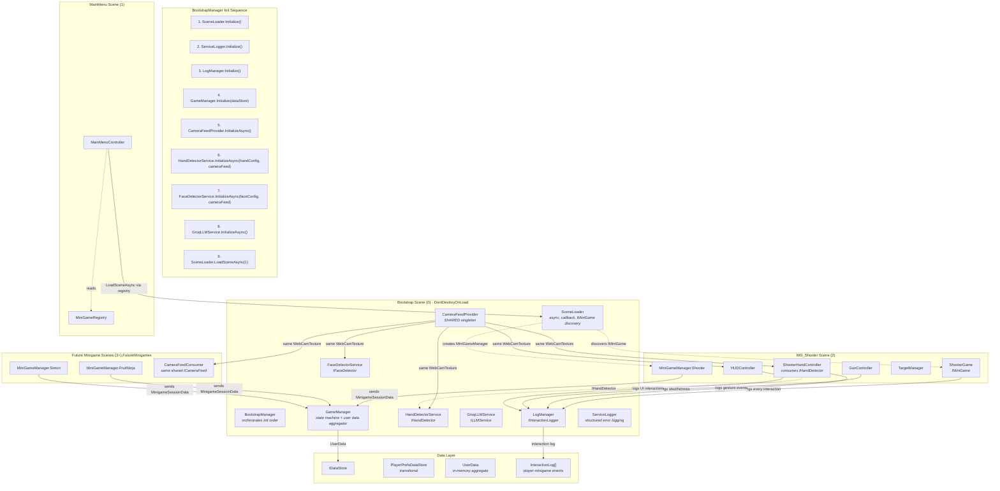

# Refactoring Plan: ARcade Rush / CubiWare

> **Project**: ARcade Rush (CubiWare) — Unity-based AR game integrating MediaPipe hand/face tracking, Groq LLM, and minigame scenes.
> **Date**: 2026-05-11
> **Status**: Planning Phase (Revised)

---

## Table of Contents

- [Refactoring Plan: ARcade Rush / CubiWare](#refactoring-plan-arcade-rush--cubiware)
  - [Table of Contents](#table-of-contents)
  - [1. Current Architecture Analysis and Identified Weaknesses](#1-current-architecture-analysis-and-identified-weaknesses)
    - [1.1 Bootstrap Self-Destruction (KPI 1)](#11-bootstrap-self-destruction-kpi-1)
    - [1.2 Global Managers vs Isolated Minigame Managers (KPI 2)](#12-global-managers-vs-isolated-minigame-managers-kpi-2)
    - [1.3 Camera/MediaPipe Abstraction (KPI 3)](#13-cameramediapipe-abstraction-kpi-3)
    - [1.4 Abstract MediaPipe \& LLM Logic (KPI 4)](#14-abstract-mediapipe--llm-logic-kpi-4)
    - [1.5 Future-Proof Data Storage (KPI 5)](#15-future-proof-data-storage-kpi-5)
    - [1.6 Interaction Data Logging](#16-interaction-data-logging)
  - [2. Proposed New Component Architecture](#2-proposed-new-component-architecture)
    - [2.1 Core Bootstrap Module](#21-core-bootstrap-module)
    - [2.2 Service Layer](#22-service-layer)
    - [2.3 Minigame Layer](#23-minigame-layer)
    - [2.4 Data Layer](#24-data-layer)
    - [2.5 Architecture Diagram](#25-architecture-diagram)
  - [3. Refactoring Steps (Ordered with Dependencies)](#3-refactoring-steps-ordered-with-dependencies)
    - [Phase 1: Foundation — Interfaces \& Abstractions](#phase-1-foundation--interfaces--abstractions)
    - [Phase 2: Abstract Base Class — AbstractMediaPipeLLM + Error Infrastructure](#phase-2-abstract-base-class--abstractmediapipellm--error-infrastructure)
    - [Phase 3: Service Implementations + LogManager](#phase-3-service-implementations--logmanager)
    - [Phase 4: Bootstrap Rewrite + Self-Destruction](#phase-4-bootstrap-rewrite--self-destruction)
    - [Phase 5: MiniGame Isolation + GameManager Data Aggregation](#phase-5-minigame-isolation--gamemanager-data-aggregation)
    - [Phase 6: Error Handling \& Logging Overhaul](#phase-6-error-handling--logging-overhaul)
    - [Phase 7: Data Storage Interface \& Future-Proofing](#phase-7-data-storage-interface--future-proofing)
  - [4. Interface Contracts](#4-interface-contracts)
    - [4.1 ICameraFeed (Shared Singleton)](#41-icamerafeed-shared-singleton)
    - [4.2 IHandDetector](#42-ihanddetector)
    - [4.3 IFaceDetector](#43-ifacedetector)
    - [4.4 ILLMService](#44-illmservice)
    - [4.5 IDataStore](#45-idatastore)
    - [4.6 IInteractionLogger (LogManager)](#46-iinteractionlogger-logmanager)
    - [4.7 IMinigameSessionData](#47-iminigamesessiondata)
    - [4.8 GameManager (refined singleton contract)](#48-gamemanager-refined-singleton-contract)
    - [4.9 SceneLoader (refined singleton contract)](#49-sceneloader-refined-singleton-contract)
    - [4.10 MiniGameManager](#410-minigamemanager)
    - [4.11 AbstractMediaPipeLLM (abstract base class)](#411-abstractmediapipellm-abstract-base-class)
    - [4.12 ServiceErrorCode enum](#412-serviceerrorcode-enum)
    - [4.13 LogManager (Interaction Logger)](#413-logmanager-interaction-logger)
  - [5. Error Handling and Logging Strategy](#5-error-handling-and-logging-strategy)
    - [5.1 Two-Tier Logging Architecture](#51-two-tier-logging-architecture)
    - [5.2 ServiceLogger — Centralized Error Reporting](#52-servicelogger--centralized-error-reporting)
    - [5.3 LogManager — Interaction Event Schema](#53-logmanager--interaction-event-schema)
    - [5.4 Error Recovery Strategy](#54-error-recovery-strategy)
    - [5.5 Try-Catch Boundaries](#55-try-catch-boundaries)
  - [6. Migration Path](#6-migration-path)
    - [Incremental Migration Strategy](#incremental-migration-strategy)
      - [Step 1: Add Interfaces (Phase 1)](#step-1-add-interfaces-phase-1)
      - [Step 2: Add AbstractMediaPipeLLM + Error Infrastructure (Phase 2)](#step-2-add-abstractmediapipellm--error-infrastructure-phase-2)
      - [Step 3: Implement Services + LogManager (Phase 3)](#step-3-implement-services--logmanager-phase-3)
      - [Step 4: Rewrite Bootstrap (Phase 4)](#step-4-rewrite-bootstrap-phase-4)
      - [Step 5: Isolate Minigames + Data Aggregation (Phase 5)](#step-5-isolate-minigames--data-aggregation-phase-5)
      - [Step 6: Overhaul Logging (Phase 6)](#step-6-overhaul-logging-phase-6)
      - [Step 7: Wire Data Storage (Phase 7)](#step-7-wire-data-storage-phase-7)
    - [Rollback Plan](#rollback-plan)
    - [Verification Checklist (per phase)](#verification-checklist-per-phase)
  - [7. Implementation Results](#7-implementation-results)
    - [7.1 Phase 1: Interface Contracts — ✅ Complete](#71-phase-1-interface-contracts---complete)
    - [7.2 Phase 2: Error Infrastructure — ✅ Complete](#72-phase-2-error-infrastructure---complete)
    - [7.3 Phase 3: Service Implementations — ✅ Complete](#73-phase-3-service-implementations---complete)
    - [7.4 Phase 4: Bootstrap Rewrite — ✅ Complete](#74-phase-4-bootstrap-rewrite---complete)
      - [BootstrapManager Init Sequence (actual implementation)](#bootstrapmanager-init-sequence-actual-implementation)
      - [BootstrapSelfDestruct Cleanup](#bootstrapselfdestruct-cleanup)
      - [Deviation from Original Plan](#deviation-from-original-plan)
    - [7.5 Phase 5: Minigame Isolation — ✅ Complete](#75-phase-5-minigame-isolation---complete)
      - [Critical Deviation: DebugStartGame()](#critical-deviation-debugstartgame)
      - [Verified Clean Files (Phase 5 completion)](#verified-clean-files-phase-5-completion)
    - [7.6 Phase 6: Logging Overhaul — ✅ Complete](#76-phase-6-logging-overhaul---complete)
    - [7.7 Phase 7: Data Persistence Wiring — ✅ Complete](#77-phase-7-data-persistence-wiring---complete)
    - [7.8 The Critical Init Bridge Fix](#78-the-critical-init-bridge-fix)
    - [7.9 Architecture Diagram — New Dependency Flow](#79-architecture-diagram--new-dependency-flow)
    - [7.10 Known Limitations \& Future Work](#710-known-limitations--future-work)
    - [7.11 Verification Checklist (Final)](#711-verification-checklist-final)

---

## 1. Current Architecture Analysis and Identified Weaknesses

This section catalogs all architectural issues discovered in the current codebase, organized by key performance indicator (KPI). Each issue includes a severity rating and a brief description of impact.

### 1.1 Bootstrap Self-Destruction (KPI 1)

| #   | Issue                                      | Severity | Description                                                                                                                                                                                                                                                                                        |
| --- | ------------------------------------------ | -------- | -------------------------------------------------------------------------------------------------------------------------------------------------------------------------------------------------------------------------------------------------------------------------------------------------- |
| 1   | Init bridge missing                        | 🔴 HIGH   | [`IMiniGame.OnStart()`](Assets/Scripts/Core/Interfaces/IMiniGame.cs) exists but has **no caller**. [`GameManager.StartGame()`](Assets/Scripts/Core/GameManager.cs) is never invoked anywhere in the codebase. Minigames self-initialize via `Start()` instead of being started through a pipeline. |
| 2   | No bootstrap shutdown/cleanup              | 🔴 HIGH   | No mechanism destroys singletons when the game returns to the main menu. All 5 `DontDestroyOnLoad` singletons persist until the application quits.                                                                                                                                                 |
| 3   | Singleton boilerplate duplication          | 🟡 MEDIUM | Each of the 5 singletons repeats the same `Awake()` → `Instance` assignment → `DontDestroyOnLoad` → duplicate destruction pattern.                                                                                                                                                                 |
| 4   | Execution order undefined                  | 🟡 MEDIUM | Unity does not guarantee `Awake`/`Start` ordering across the 5 singletons.                                                                                                                                                                                                                         |
| 5   | SceneLoader uses blocking `LoadScene`      | 🟡 MEDIUM | [`SceneLoader.LoadScene()`](Assets/Scripts/Core/SceneLoader.cs) calls `SceneManager.LoadScene` (blocking) instead of `LoadSceneAsync`. No progress tracking, no error handling for scene load failures, no completion callback.                                                                    |
| 6   | No BootstrapLoader for cross-scene testing | 🟢 LOW    | Debugging a minigame scene directly fails because the Bootstrap singletons don't exist.                                                                                                                                                                                                            |

### 1.2 Global Managers vs Isolated Minigame Managers (KPI 2)

| #   | Issue                                               | Severity | Description                                                                                                                                                           |
| --- | --------------------------------------------------- | -------- | --------------------------------------------------------------------------------------------------------------------------------------------------------------------- |
| 1   | MainMenuController uses hardcoded build indices     | 🔴 HIGH   | [`MainMenuController`](Assets/Scripts/UI/MainMenuController.cs) references scene indices (2, 3, 4) as magic numbers. Scene reordering breaks all navigation silently. |
| 2   | `IMiniGame` interface underutilized                 | 🟡 MEDIUM | `SceneIndex` property is **never read**. `OnStart(deps)` is **never called**. The interface exists but has zero consumers.                                            |
| 3   | `ShooterGame.DebugStartGame()` bypasses GameManager | 🟡 MEDIUM | `[ContextMenu]` method creates a parallel execution path that may diverge from real game flow.                                                                        |
| 4   | GameAudioController self-subscribes to GameManager  | 🟡 MEDIUM | Uses `FindFirstObjectByType<GameManager>()` — tight coupling from scene-local component to global singleton.                                                          |
| 5   | No minigame lifecycle enforcement                   | 🔴 HIGH   | No system ensures minigames are properly started, paused, resumed, and ended through a consistent pipeline.                                                           |

### 1.3 Camera/MediaPipe Abstraction (KPI 3)

| #   | Issue                                        | Severity | Description                                                                                                                   |
| --- | -------------------------------------------- | -------- | ----------------------------------------------------------------------------------------------------------------------------- |
| 1   | CameraFeedCtrl tightly coupled to `RawImage` | 🟡 MEDIUM | `SetOutputImage(RawImage)` ties camera to a specific UI element. Cannot output to render texture, material, or non-UI target. |
| 2   | MediaPipeController has dual responsibility  | 🔴 HIGH   | Manages **both** `HandLandmarker` and `FaceLandmarker` in one monolithic class with no interface abstraction.                 |
| 3   | No `ICameraFeed` interface                   | 🔴 HIGH   | Consumers reference `CameraFeedCtrl.Instance` directly, creating unbreakable dependency on concrete class.                    |
| 4   | No camera fallback                           | 🟢 LOW    | If no camera is available or permission denied, no fallback mode exists.                                                      |
| 5   | Thread-safety via `ConcurrentQueue` only     | 🟢 LOW    | No timeout or overflow protection on the processing queue.                                                                    |

### 1.4 Abstract MediaPipe & LLM Logic (KPI 4)

| #   | Issue                                           | Severity | Description                                                                                                                             |
| --- | ----------------------------------------------- | -------- | --------------------------------------------------------------------------------------------------------------------------------------- |
| 1   | No `IHandDetector` / `IFaceDetector` interfaces | 🔴 HIGH   | `Hand3DProjector` references `MediaPipeController.Instance` directly. Cannot mock or swap implementations.                              |
| 2   | ShooterHandController has mixed concerns        | 🟡 MEDIUM | Handles gesture subscription, aim computation, fire logic, AND safety state — violates Single Responsibility Principle.                 |
| 3   | No `ILLMService` interface                      | 🟡 MEDIUM | `LLMConnector` is a concrete class with `Instance` singleton access. Impossible to mock for unit tests or swap providers.               |
| 4   | Error handling is ad-hoc                        | 🔴 HIGH   | No error type enums, no error codes, no centralized error reporting. `Debug.Log` with inconsistent string prefixes is the only pattern. |
| 5   | No structured logging                           | 🟡 MEDIUM | No log levels, no log context, no optional file output.                                                                                 |
| 6   | No try-catch anywhere in codebase               | 🔴 HIGH   | Exceptions in MediaPipe processing, LLM API calls, or scene loading would bubble up silently.                                           |
| 7   | Groq API key in `Resources` folder              | 🟡 MEDIUM | API key in `ScriptableObject` is baked into the build and accessible via decompilation.                                                 |

### 1.5 Future-Proof Data Storage (KPI 5)

| #   | Issue                        | Severity | Description                                                                                                                                         |
| --- | ---------------------------- | -------- | --------------------------------------------------------------------------------------------------------------------------------------------------- |
| 1   | No persistent score storage  | 🟡 MEDIUM | `ShooterGame.LastScore` is a `static int` — cleared on app restart.                                                                                 |
| 2   | Only PlayerPrefs             | 🟢 LOW    | Calibration data via `PlayerPrefs` is per-machine, not per-user. No profile system.                                                                 |
| 3   | No serialization strategy    | 🟡 MEDIUM | No JSON, binary, or ScriptableObject persistence pattern exists.                                                                                    |
| 4   | No configuration asset       | 🟡 MEDIUM | Game duration (90s), ammo (6), wave thresholds (30/70), fire rate (0.3s) — all hardcoded constants.                                                 |
| 5   | No save/load interface       | 🟡 MEDIUM | No `IDataStore` interface or extension point exists for future persistence strategies.                                                              |
| 6   | **No user data aggregation** | 🔴 HIGH   | GameManager has no mechanism to collect or store per-minigame user data (scores, stats, session history). Each minigame owns its data in isolation. |

### 1.6 Interaction Data Logging

| #   | Issue                       | Severity | Description                                                                                                                                                                                           |
| --- | --------------------------- | -------- | ----------------------------------------------------------------------------------------------------------------------------------------------------------------------------------------------------- |
| 1   | **No interaction data log** | 🔴 HIGH   | There is no system that records player-minigame interaction events (gestures performed, shots fired, targets hit, emotions detected, LLM queries made). Every piece of interaction data is ephemeral. |
| 2   | No audit trail              | 🟡 MEDIUM | Player actions are not traceable. Debugging requires live observation or scattered `Debug.Log` statements.                                                                                            |
| 3   | No analytics foundation     | 🟡 MEDIUM | No structured event schema for player-interaction data. Future analytics, heatmaps, or replay systems would have no data foundation.                                                                  |

---

## 2. Proposed New Component Architecture

### 2.1 Core Bootstrap Module

The bootstrap scene hosts a single `BootstrapManager` that owns the init sequence and teardown sequence for all global services. The bootstrap module consists of:

| Component             | Role                                                                                  | Lifetime                |
| --------------------- | ------------------------------------------------------------------------------------- | ----------------------- |
| `BootstrapManager`    | Orchestrates init/teardown sequence across all services                               | Destroyed on game close |
| `SceneLoader`         | Async scene loading + IMiniGame auto-discovery                                        | Destroyed on game close |
| `GameManager`         | Global state machine, user data aggregator, score tracking                            | Destroyed on game close |
| `CameraFeedProvider`  | **Shared singleton** — one camera feed for all consumers (MediaPipe + minigames + UI) | Destroyed on game close |
| `HandDetectorService` | Hand landmark detection via MediaPipe, consumes `CameraFeedProvider`                  | Destroyed on game close |
| `FaceDetectorService` | Face landmark detection via MediaPipe, consumes `CameraFeedProvider`                  | Destroyed on game close |
| `GroqLLMService`      | LLM API service                                                                       | Destroyed on game close |
| `LogManager`          | Records all player-minigame interaction events                                        | Destroyed on game close |

### 2.2 Service Layer

| Interface            | Implementation                        | Role                                    |
| -------------------- | ------------------------------------- | --------------------------------------- |
| `ICameraFeed`        | `CameraFeedProvider` (singleton)      | Shared camera texture for all consumers |
| `IHandDetector`      | `HandDetectorService`                 | Hand landmark detection                 |
| `IFaceDetector`      | `FaceDetectorService`                 | Face landmark detection                 |
| `ILLMService`        | `GroqLLMService`                      | LLM API abstraction                     |
| `IDataStore`         | `PlayerPrefsDataStore` (transitional) | Data persistence                        |
| `IInteractionLogger` | `LogManager` (singleton)              | Player-minigame interaction recording   |

### 2.3 Minigame Layer

Each minigame scene has its own `MiniGameManager` that owns the minigame lifecycle and reports session data back to `GameManager`. Minigames consume service interfaces (`ICameraFeed`, `IHandDetector`, etc.) via the global singletons, not via per-scene instances.

### 2.4 Data Layer

```
GameManager
   ├── CollectMinigameData()  ← receives MinigameSessionData from MiniGameManager
   ├── SaveUserData()          ← persists via IDataStore
   ├── LoadUserData()          ← loads via IDataStore
   └── UserData                ← in-memory aggregate (scores, per-minigame stats, preferences, session history)

LogManager
   └── InteractionLog[]
       ├── EventType (ShotFired, TargetHit, GestureDetected, EmotionClassified, LLMQuery, etc.)
       ├── Timestamp
       ├── MinigameId
       └── Payload (structured event data)
```

### 2.5 Architecture Diagram



---

## 3. Refactoring Steps (Ordered with Dependencies)

### Phase 1: Foundation — Interfaces & Abstractions

**Goal**: Define all interface contracts that decouple consumers from implementations. No existing code is modified in this phase.

**Files to create**:

| File                                                     | Namespace                    | Description                                |
| -------------------------------------------------------- | ---------------------------- | ------------------------------------------ |
| `Assets/Scripts/Core/Interfaces/ICameraFeed.cs`          | `ARcadeRush.Core.Interfaces` | Shared camera feed abstraction             |
| `Assets/Scripts/Core/Interfaces/IHandDetector.cs`        | `ARcadeRush.Core.Interfaces` | Hand landmark detection abstraction        |
| `Assets/Scripts/Core/Interfaces/IFaceDetector.cs`        | `ARcadeRush.Core.Interfaces` | Face landmark detection abstraction        |
| `Assets/Scripts/Core/Interfaces/ILLMService.cs`          | `ARcadeRush.Core.Interfaces` | LLM service abstraction                    |
| `Assets/Scripts/Core/Interfaces/IDataStore.cs`           | `ARcadeRush.Core.Interfaces` | Data persistence abstraction               |
| `Assets/Scripts/Core/Interfaces/IInteractionLogger.cs`   | `ARcadeRush.Core.Interfaces` | Player-minigame interaction recorder       |
| `Assets/Scripts/Core/Interfaces/IMiniGameLifecycle.cs`   | `ARcadeRush.Core.Interfaces` | Extends IMiniGame with lifecycle hooks     |
| `Assets/Scripts/Core/Interfaces/IMinigameSessionData.cs` | `ARcadeRush.Core.Interfaces` | Data contract for minigame session results |

**Files to modify**: None.

**Dependencies**: None (this is the foundation).

**Verification**: All 8 interfaces compile without errors.

```
Phase 1: ☐ All interfaces compile
```

---

### Phase 2: Abstract Base Class — AbstractMediaPipeLLM + Error Infrastructure

**Goal**: Create reusable abstract base class + error handling/logging infrastructure.

**Files to create**:

| File                                              | Namespace                 | Description                                             |
| ------------------------------------------------- | ------------------------- | ------------------------------------------------------- |
| `Assets/Scripts/Core/AbstractMediaPipeLLM.cs`     | `ARcadeRush.Core`         | Abstract base for detection/AI services                 |
| `Assets/Scripts/Core/Logging/ServiceErrorCode.cs` | `ARcadeRush.Core.Logging` | Enum of all error codes                                 |
| `Assets/Scripts/Core/Logging/LogLevel.cs`         | `ARcadeRush.Core.Logging` | Enum (Trace, Debug, Info, Warning, Error, Fatal)        |
| `Assets/Scripts/Core/Logging/LogContext.cs`       | `ARcadeRush.Core.Logging` | Struct recording source, timestamp, error code, message |
| `Assets/Scripts/Core/Logging/ServiceLogger.cs`    | `ARcadeRush.Core.Logging` | Singleton for structured error logging                  |

**AbstractMediaPipeLLM encapsulates**:
- Error notification with consistent `ServiceErrorCode` enum
- Structured logging via `ServiceLogger`
- Lifecycle (`Initialize()`, `Shutdown()`, `IsInitialized`)
- Shared cancellation token pattern
- Common retry logic

**Files to modify**: None.

**Dependencies**: Phase 1.

**Verification**: `AbstractMediaPipeLLM` compiles. All error codes defined. `ServiceLogger` singleton works.

```
Phase 2: ☐ AbstractMediaPipeLLM compiles, error codes defined, ServiceLogger works
```

---

### Phase 3: Service Implementations + LogManager

**Goal**: Implement the interfaces from Phase 1. Create LogManager for interaction data. Existing controllers delegate internally to new services (backward-compatible wrapper pattern).

**Files to create**:

| File                                                   | Namespace                  | Description                                                |
| ------------------------------------------------------ | -------------------------- | ---------------------------------------------------------- |
| `Assets/Scripts/Core/Services/CameraFeedProvider.cs`   | `ARcadeRush.Core.Services` | Implements `ICameraFeed` — **shared singleton**            |
| `Assets/Scripts/Core/Services/HandDetectorService.cs`  | `ARcadeRush.Core.Services` | Implements `IHandDetector`, extends `AbstractMediaPipeLLM` |
| `Assets/Scripts/Core/Services/FaceDetectorService.cs`  | `ARcadeRush.Core.Services` | Implements `IFaceDetector`, extends `AbstractMediaPipeLLM` |
| `Assets/Scripts/Core/Services/GroqLLMService.cs`       | `ARcadeRush.Core.Services` | Implements `ILLMService`, extends `AbstractMediaPipeLLM`   |
| `Assets/Scripts/Core/Services/PlayerPrefsDataStore.cs` | `ARcadeRush.Core.Services` | Implements `IDataStore` (transitional)                     |
| `Assets/Scripts/Core/Logging/LogManager.cs`            | `ARcadeRush.Core.Logging`  | Singleton — records player-minigame interactions           |
| `Assets/Scripts/Core/Logging/InteractionEvent.cs`      | `ARcadeRush.Core.Logging`  | Struct for a single interaction event                      |

**Files to modify**:

| File                                         | Modification                                                                                            |
| -------------------------------------------- | ------------------------------------------------------------------------------------------------------- |
| `Assets/Scripts/Core/CameraFeedCtrl.cs`      | Refactor to delegate to `CameraFeedProvider` internally. Public API unchanged.                          |
| `Assets/Scripts/Core/MediaPipeController.cs` | Refactor to delegate to `HandDetectorService` + `FaceDetectorService` internally. Public API unchanged. |
| `Assets/Scripts/Core/LLMConnector.cs`        | Refactor to delegate to `GroqLLMService` internally. Public API unchanged.                              |

**Dependencies**: Phase 1, Phase 2.

**Verification**: All services instantiable. Old API still works. New API works. `LogManager` records and retrieves interaction events.

```
Phase 3: ☐ Old API works, new API works, LogManager records events
```

---

### Phase 4: Bootstrap Rewrite + Self-Destruction

**Goal**: Replace scattered singleton init with centralized `BootstrapManager`. Add `BootstrapSelfDestruct` for clean teardown. Make `CameraFeedProvider` a shared singleton consumed by `HandDetectorService`, `FaceDetectorService`, and minigames.

**Files to create**:

| File                                           | Namespace         | Description                                         |
| ---------------------------------------------- | ----------------- | --------------------------------------------------- |
| `Assets/Scripts/Core/BootstrapManager.cs`      | `ARcadeRush.Core` | Orchestrates startup sequence with guaranteed order |
| `Assets/Scripts/Core/BootstrapSelfDestruct.cs` | `ARcadeRush.Core` | Clean shutdown of all services                      |

**BootstrapManager init order**:
```
1. SceneLoader.Initialize()
2. ServiceLogger.Initialize()
3. LogManager.Initialize()
4. GameManager.Initialize(sceneLoader, dataStore)
5. CameraFeedProvider.InitializeAsync(config)
6. HandDetectorService.InitializeAsync(handConfig, cameraFeedProvider)
7. FaceDetectorService.InitializeAsync(faceConfig, cameraFeedProvider)
8. GroqLLMService.InitializeAsync(config)
9. SceneLoader.LoadSceneAsync(1)  → MainMenu
```

**BootstrapSelfDestruct teardown order**:
```
1. GroqLLMService.Release()
2. FaceDetectorService.Release()
3. HandDetectorService.Release()
4. CameraFeedProvider.Release()
5. LogManager.FlushAndShutdown()
6. GameManager.SelfDestruct()
7. SceneLoader.SelfDestruct()
8. Remove DontDestroyOnLoad from all objects
9. Destroy all Bootstrap scene GameObjects
```

**Files to modify**:

| File                                 | Modification                                                                                                                                                         |
| ------------------------------------ | -------------------------------------------------------------------------------------------------------------------------------------------------------------------- |
| `Assets/Scripts/Core/GameManager.cs` | Add proper state transitions. Remove DI from `Awake()`. Accept dependencies via `Initialize()`. Add `CollectMinigameData(MinigameSessionData)` and `SaveUserData()`. |
| `Assets/Scripts/Core/SceneLoader.cs` | Replace `LoadScene` with `LoadSceneAsync`. Add `OnSceneLoaded` callback. Add `IMiniGame` auto-discovery.                                                             |
| All 5 singleton `Awake()` methods    | Remove `Instance` boilerplate. Delegate to `BootstrapManager`.                                                                                                       |

**CameraFeedProvider as shared singleton**:
- `CameraFeedProvider` is a bootstrap-level singleton
- `HandDetectorService` and `FaceDetectorService` each consume it via their `InitializeAsync()` parameter
- Minigame scenes access it via `CameraFeedProvider.Instance` or `ICameraFeed` interface
- Additional future minigames can access the same camera feed without creating new instances

**Dependencies**: Phase 3.

**Verification**: Bootstrap scene loads cleanly. All singletons init in order. `CameraFeedProvider` accessible from both detector services and minigame code. Self-destruct fully cleans up all resources.

```
Phase 4: ☐ Bootstrap scene loads, init order guaranteed, shared camera works, self-destruct cleans up
```

---

### Phase 5: MiniGame Isolation + GameManager Data Aggregation

**Goal**: Isolate minigames via `MiniGameManager`. Wire `MiniGameManager` → `GameManager` data reporting. Decouple `ShooterHandController` from `MediaPipeController.Instance`.

**Files to create**:

| File                                              | Namespace              | Description                                                                                |
| ------------------------------------------------- | ---------------------- | ------------------------------------------------------------------------------------------ |
| `Assets/Scripts/Core/MiniGameManager.cs`          | `ARcadeRush.Core`      | Per-scene manager wrapping `IMiniGame` lifecycle, reports session data back to GameManager |
| `Assets/Scripts/Core/MiniGameRegistry.cs`         | `ARcadeRush.Core`      | Static registry mapping scene names/indices to `IMiniGame` types                           |
| `Assets/Scripts/Core/Data/MinigameSessionData.cs` | `ARcadeRush.Core.Data` | Struct: scores, play duration, stats, per-minigame custom data                             |
| `Assets/Scripts/Core/Data/UserData.cs`            | `ARcadeRush.Core.Data` | Aggregate: all minigame sessions, high scores, preferences, calibration                    |

**Files to modify**:

| File                                                        | Modification                                                                                                                                             |
| ----------------------------------------------------------- | -------------------------------------------------------------------------------------------------------------------------------------------------------- |
| `Assets/Scripts/UI/MainMenuController.cs`                   | Use `MiniGameRegistry` instead of hardcoded build indices                                                                                                |
| `Assets/Scripts/Minigames/Shooter/ShooterGame.cs`           | Accept lifecycle from `MiniGameManager`. Remove self-init. Remove `DebugStartGame()`. Report session data on end. Log all interactions via `LogManager`. |
| `Assets/Scripts/Minigames/Shooter/ShooterHandController.cs` | Consume `IHandDetector` interface instead of `MediaPipeController.Instance`. Log gestures via `LogManager`.                                              |
| `Assets/Scripts/Minigames/Shooter/GameAudioController.cs`   | Accept `GameManager` reference via setup instead of `FindFirstObjectByType`                                                                              |
| `Assets/Scripts/Core/GameManager.cs`                        | Add `CollectMinigameData(MinigameSessionData)` — appends to in-memory `UserData`. Add `SaveUserData()`. Add `LoadUserData()`.                            |

**Interaction logging integration**:
- Every player action (shot, gesture, hit, miss, reload, pause, UI click) is recorded via `LogManager.Record(event)`
- Minigame events are logged at the point of occurrence (in `ShooterHandController`, `GunController`, `TargetManager`, etc.)
- `LogManager` stores events in an `InteractionEvent[]` buffer, flushed to persistent storage via `IDataStore` on game end

**Dependencies**: Phase 4.

**Verification**: Shooter game plays end-to-end via `MiniGameManager`. Session data flows from `MiniGameManager` → `GameManager`. All interactions logged via `LogManager`. No direct singleton references in minigame code.

```
Phase 5: ☐ Shooter game end-to-end, data flows to GameManager, all interactions logged
```

---

### Phase 6: Error Handling & Logging Overhaul

**Goal**: Replace all ad-hoc `Debug.Log` calls with structured logging through `ServiceLogger`. Add try-catch boundaries at all external integration points.

**Files to modify**:

| File                                   | Modification                                                              |
| -------------------------------------- | ------------------------------------------------------------------------- |
| All `.cs` files with `Debug.Log` calls | Replace with `ServiceLogger` calls                                        |
| `AbstractMediaPipeLLM.cs`              | Integrate `ServiceLogger` + `ServiceErrorCode`                            |
| All try-catch gaps                     | Add structured exception handling around MediaPipe and network operations |

**Dependencies**: Phase 2 (infrastructure already exists from Phase 2 + Phase 3).

**Verification**: All logging goes through `ServiceLogger`. Error codes consistent. Exception boundaries at every external integration point.

```
Phase 6: ☐ All logs through ServiceLogger, error codes consistent, try-catch boundaries in place
```

---

### Phase 7: Data Storage Interface & Future-Proofing

**Goal**: Wire `IDataStore` across all data consumers. `GameManager` persists `UserData`. `LogManager` persists `InteractionLog[]`.

**Files to modify**:

| File                                              | Modification                                                               |
| ------------------------------------------------- | -------------------------------------------------------------------------- |
| `Assets/Scripts/Hand/HandDepthCalibrator.cs`      | Use `IDataStore` instead of direct `PlayerPrefs`                           |
| `Assets/Scripts/Core/GameManager.cs`              | Persist `UserData` via `IDataStore`                                        |
| `Assets/Scripts/Minigames/Shooter/ShooterGame.cs` | High score via `IDataStore`                                                |
| `Assets/Scripts/Core/Logging/LogManager.cs`       | Flush `InteractionEvent[]` buffer via `IDataStore` on game end or shutdown |

**Extension points documented in code**:
- `JsonDataStore : IDataStore` — future JSON file-based persistence
- `CloudDataStore : IDataStore` — future cloud save provider
- `ProfileDataStore : IDataStore` — future per-user profile system

**Dependencies**: Phase 1 (IDataStore must exist), Phase 3 (PlayerPrefsDataStore), Phase 5 (GameManager data aggregation).

**Verification**: `IDataStore` is clean. `PlayerPrefsDataStore` works. `GameManager` saves/loads `UserData`. `LogManager` persists interaction logs. Future providers can be added without modifying consumers.

```
Phase 7: ☐ UserData persists, interaction logs persist, future providers addable without consumer changes
```

---

## 4. Interface Contracts

### 4.1 ICameraFeed (Shared Singleton)

```csharp
namespace ARcadeRush.Core.Interfaces;

/// <summary>
/// Abstraction for the shared camera feed. ONE instance serves all consumers:
/// MediaPipe for hand/face detection, minigames for in-game camera rendering,
/// and UI for camera overlay display.
/// </summary>
public interface ICameraFeed
{
    /// <summary>True after InitializeAsync completes successfully.</summary>
    bool IsInitialized { get; }

    /// <summary>True while the camera is actively streaming frames.</summary>
    bool IsRunning { get; }

    /// <summary>The current camera frame as a Unity Texture.
    /// All consumers read from this same texture.</summary>
    Texture Texture { get; }

    /// <summary>Requested capture width in pixels.</summary>
    int RequestedWidth { get; }

    /// <summary>Requested capture height in pixels.</summary>
    int RequestedHeight { get; }

    /// <summary>Fired each time a new camera frame is available.
    /// Both MediaPipe and minigame code can subscribe.</summary>
    event Action<Texture> OnFrameUpdated;

    /// <summary>Fired when an error occurs during camera operation.</summary>
    event Action<ServiceErrorCode, string> OnError;

    /// <summary>Initializes the camera with the specified configuration.</summary>
    Task<bool> InitializeAsync(CameraFeedConfig config);

    /// <summary>Starts streaming frames.</summary>
    void Start();

    /// <summary>Stops streaming frames. The camera remains initialized.</summary>
    void Stop();

    /// <summary>Releases all camera resources. Must be called before app shutdown.</summary>
    void Release();
}
```

### 4.2 IHandDetector

```csharp
namespace ARcadeRush.Core.Interfaces;

/// <summary>
/// Abstraction for hand landmark detection. Implementations consume ICameraFeed
/// internally, processing each new frame for hand landmarks.
/// </summary>
public interface IHandDetector
{
    /// <summary>True after InitializeAsync completes successfully.</summary>
    bool IsInitialized { get; }

    /// <summary>True while the detector is actively processing frames.</summary>
    bool IsDetecting { get; }

    /// <summary>Fired when hand landmarks are detected in a frame.</summary>
    event Action<NormalizedLandmarkList> OnHandDetected;

    /// <summary>Fired when an error occurs during detection.</summary>
    event Action<ServiceErrorCode, string> OnError;

    /// <summary>Initializes the hand detector with configuration and camera source.</summary>
    Task<bool> InitializeAsync(HandDetectorConfig config, ICameraFeed cameraFeed);

    /// <summary>Starts processing frames for hand detection.</summary>
    void Start();

    /// <summary>Stops processing frames. The detector remains initialized.</summary>
    void Stop();

    /// <summary>Releases all detector resources.</summary>
    void Release();
}
```

### 4.3 IFaceDetector

```csharp
namespace ARcadeRush.Core.Interfaces;

/// <summary>
/// Abstraction for face landmark detection. Consumes ICameraFeed internally.
/// </summary>
public interface IFaceDetector
{
    bool IsInitialized { get; }
    bool IsDetecting { get; }

    event Action<FaceLandmarkerResult> OnFaceDetected;
    event Action<ServiceErrorCode, string> OnError;

    Task<bool> InitializeAsync(FaceDetectorConfig config, ICameraFeed cameraFeed);
    void Start();
    void Stop();
    void Release();
}
```

### 4.4 ILLMService

```csharp
namespace ARcadeRush.Core.Interfaces;

/// <summary>
/// Abstraction for Large Language Model service access.
/// </summary>
public interface ILLMService
{
    bool IsInitialized { get; }
    event Action<ServiceErrorCode, string> OnError;

    Task<bool> InitializeAsync(LLMConfig config);

    void Ask(string systemPrompt, string userMessage,
             Action<string> onComplete, Action<ServiceErrorCode, string> onError);

    Task<string> AskAsync(string systemPrompt, string userMessage);
    void Cancel();
    void Release();
}
```

### 4.5 IDataStore

```csharp
namespace ARcadeRush.Core.Interfaces;

/// <summary>
/// Abstraction for persistent data storage. Implementations can wrap PlayerPrefs,
/// JSON files, binary serialization, or cloud storage.
/// </summary>
public interface IDataStore
{
    Task<bool> SaveAsync<T>(string key, T data);
    Task<T> LoadAsync<T>(string key);
    Task<bool> DeleteAsync(string key);
    Task<bool> ExistsAsync(string key);
    Task ClearAsync();
}
```

### 4.6 IInteractionLogger (LogManager)

```csharp
namespace ARcadeRush.Core.Interfaces;

/// <summary>
/// Records every piece of data exchanged during interactions between
/// the player and the minigame. Provides an audit trail for debugging,
/// analytics, and future replay/heatmap features.
/// </summary>
public interface IInteractionLogger
{
    /// <summary>True after Initialize completes.</summary>
    bool IsInitialized { get; }

    /// <summary>Records a single interaction event.</summary>
    /// <param name="eventType">Category of the interaction (e.g., ShotFired, GestureDetected).</param>
    /// <param name="minigameId">Identifier of the source minigame.</param>
    /// <param name="payload">Structured event data as a serializable object.</param>
    void Record(string eventType, string minigameId, object payload);

    /// <summary>Records an interaction event with a strongly-typed payload.</summary>
    void Record<T>(InteractionEvent<T> interactionEvent) where T : class;

    /// <summary>Returns all events for a given minigame session.</summary>
    InteractionEvent[] GetSessionLog(string minigameId);

    /// <summary>Returns all events of a specific type.</summary>
    InteractionEvent[] GetEventsByType(string eventType);

    /// <summary>Flushes the event buffer to persistent storage via IDataStore.</summary>
    Task FlushAsync();

    /// <summary>Flushes and shuts down the logger. Called during bootstrap self-destruct.</summary>
    Task FlushAndShutdownAsync();
}

/// <summary>
/// A single interaction event with strongly-typed payload.
/// </summary>
public struct InteractionEvent<T> where T : class
{
    public string EventType { get; set; }
    public string MinigameId { get; set; }
    public DateTime Timestamp { get; set; }
    public T Payload { get; set; }
}

/// <summary>
/// Runtime-only interaction event (non-generic, used for retrieval).
/// </summary>
public struct InteractionEvent
{
    public string EventType;
    public string MinigameId;
    public DateTime Timestamp;
    public string PayloadJson;
}
```

### 4.7 IMinigameSessionData

```csharp
namespace ARcadeRush.Core.Interfaces;

/// <summary>
/// Data contract for a completed minigame session. Each MiniGameManager
/// produces one of these and sends it to GameManager.CollectMinigameData().
/// </summary>
public interface IMinigameSessionData
{
    /// <summary>Scene name or build index of the minigame.</summary>
    string MinigameId { get; }

    /// <summary>Final score achieved in this session.</summary>
    int Score { get; }

    /// <summary>Duration of the session in seconds.</summary>
    float DurationSeconds { get; }

    /// <summary>Whether the player won/complete the minigame.</summary>
    bool IsCompleted { get; }

    /// <summary>Optional per-minigame custom statistics.
    /// Keys: stat name (e.g., "shots_fired", "targets_hit", "accuracy").</summary>
    Dictionary<string, object> CustomStats { get; }

    /// <summary>UTC timestamp when the session started.</summary>
    DateTime SessionStart { get; }

    /// <summary>UTC timestamp when the session ended.</summary>
    DateTime SessionEnd { get; }
}
```

### 4.8 GameManager (refined singleton contract)

```csharp
namespace ARcadeRush.Core;

/// <summary>
/// Global game state manager. Manages score aggregation, pause/resume,
/// game-over flow, AND acts as the central user data aggregator.
/// Collects MinigameSessionData from each MiniGameManager and persists
/// via IDataStore.
/// </summary>
public sealed class GameManager : MonoBehaviour
{
    public static GameManager Instance { get; private set; }

    public GameState CurrentState { get; }
    public int CurrentScore { get; }
    public int HighScore { get; }
    public UserData UserData { get; }

    public event Action<GameState, GameState> OnStateChanged;
    public event Action<int> OnScoreChanged;
    public event Action OnGamePaused;
    public event Action OnGameResumed;
    public event Action OnGameEnded;

    /// <summary>Initializes the GameManager with required dependencies.</summary>
    public void Initialize(SceneLoader sceneLoader, IDataStore dataStore);

    /// <summary>Starts a minigame through the proper lifecycle pipeline.</summary>
    public void StartGame(IMiniGame minigame);

    /// <summary>Adds points to the current score and fires OnScoreChanged.</summary>
    public void AddScore(int points);

    /// <summary>Pauses the game (time scale = 0, fires OnGamePaused).</summary>
    public void Pause();

    /// <summary>Resumes the game (time scale = 1, fires OnGameResumed).</summary>
    public void Resume();

    /// <summary>Ends the current game session, fires OnGameEnded.</summary>
    public void EndGame();

    // ─── Data Aggregation ─────────────────────────────────────

    /// <summary>Called by MiniGameManager when a minigame session completes.
    /// Appends the session data to the in-memory UserData aggregate.</summary>
    public void CollectMinigameData(IMinigameSessionData sessionData);

    /// <summary>Persists the current UserData to the data store.</summary>
    public Task SaveUserDataAsync();

    /// <summary>Loads UserData from the data store into memory.</summary>
    public Task LoadUserDataAsync();

    // ─── Cleanup ──────────────────────────────────────────────

    /// <summary>Cleans up and destroys this GameObject.</summary>
    public void SelfDestruct();
}
```

### 4.9 SceneLoader (refined singleton contract)

```csharp
namespace ARcadeRush.Core;

/// <summary>
/// Handles async scene loading with progress tracking, error handling,
/// and automatic IMiniGame discovery on loaded scenes.
/// </summary>
public sealed class SceneLoader : MonoBehaviour
{
    public static SceneLoader Instance { get; private set; }

    public event Action<int> OnSceneLoadStarted;
    public event Action<int> OnSceneLoadCompleted;
    public event Action<int, ServiceErrorCode> OnSceneLoadFailed;

    public void Initialize();

    public AsyncOperation LoadSceneAsync(int buildIndex, Action onCompleted = null);
    public AsyncOperation LoadSceneAsync(string sceneName, Action onCompleted = null);
    public AsyncOperation LoadSceneAsync(int buildIndex,
        Action<IMiniGame> onMinigameDiscovered, Action onCompleted = null);

    public void SelfDestruct();
}
```

### 4.10 MiniGameManager

```csharp
namespace ARcadeRush.Core;

/// <summary>
/// Per-scene manager that owns the lifecycle of a single IMiniGame instance.
/// Provides start/end lifecycle hooks, dependency injection, and automatically
/// reports session data back to GameManager when the minigame ends.
/// </summary>
public sealed class MiniGameManager : MonoBehaviour
{
    public IMiniGame CurrentMinigame { get; private set; }
    public bool IsRunning { get; private set; }
    public IMinigameSessionData LastSessionData { get; private set; }

    public event Action<IMiniGame> OnMinigameStarted;
    public event Action<IMiniGame, IMinigameSessionData> OnMinigameEnded;

    /// <summary>Binds this manager to a specific minigame with its dependencies.</summary>
    public void Initialize(IMiniGame minigame, MiniGameDependencies dependencies);

    /// <summary>Starts the minigame lifecycle. Calls IMiniGame.OnStart().</summary>
    public void StartGame();

    /// <summary>Ends the minigame lifecycle. Collects session data and
    /// reports it to GameManager.CollectMinigameData().</summary>
    public void EndGame();

    /// <summary>Cleans up and destroys this GameObject.</summary>
    public void SelfDestruct();
}
```

### 4.11 AbstractMediaPipeLLM (abstract base class)

```csharp
namespace ARcadeRush.Core;

/// <summary>
/// Abstract base class for MediaPipe-based detection services and LLM services.
/// Provides common error handling, structured logging, lifecycle management,
/// and retry logic. Derived classes implement InitializeInternal and ShutdownInternal.
/// </summary>
public abstract class AbstractMediaPipeLLM : MonoBehaviour
{
    protected ServiceLogger Logger { get; private set; }
    public bool IsInitialized { get; protected set; }

    public event Action<ServiceErrorCode, string> OnError;
    public event Action<LogContext> OnLog;

    protected abstract Task<bool> InitializeInternal();
    protected abstract void ShutdownInternal();
    protected abstract void LogDebug(string message);
    protected abstract void LogWarning(string message);
    protected abstract void LogError(ServiceErrorCode code, string message);

    public async Task<bool> Initialize();
    public void Shutdown();
    public void SelfDestruct();
}
```

### 4.12 ServiceErrorCode enum

```csharp
namespace ARcadeRush.Core.Logging;

public enum ServiceErrorCode
{
    // ─── General (0-99) ───
    None = 0,
    Unknown = 1,
    NotInitialized = 2,
    AlreadyInitialized = 3,
    InvalidConfig = 4,
    Timeout = 5,
    OperationCancelled = 6,

    // ─── Camera (100-199) ───
    CameraPermissionDenied = 100,
    CameraNotFound = 101,
    CameraStartFailed = 102,
    CameraFrameNull = 103,

    // ─── MediaPipe (200-299) ───
    MediaPipeModelNotFound = 200,
    MediaPipeInitFailed = 201,
    MediaPipeProcessingError = 202,
    MediaPipeResultNull = 203,

    // ─── LLM (300-399) ───
    LLMAuthFailed = 300,
    LLMRateLimited = 301,
    LLMConnectionFailed = 302,
    LLMResponseParseFailed = 303,
    LLMRequestTimeout = 304,

    // ─── Data Store (400-499) ───
    DataStoreSerializationFailed = 400,
    DataStoreDeserializationFailed = 401,
    DataStoreKeyNotFound = 402,
    DataStoreIOError = 403,

    // ─── Scene Loading (500-599) ───
    SceneLoadFailed = 500,
    SceneNotFound = 501,
    SceneMinigameNotFound = 502,

    // ─── Minigame (600-699) ───
    MinigameInitFailed = 600,
    MinigameStateError = 601,

    // ─── LogManager (700-799) ───
    LogManagerBufferFull = 700,
    LogManagerFlushFailed = 701,
}
```

### 4.13 LogManager (Interaction Logger)

```csharp
namespace ARcadeRush.Core.Logging;

/// <summary>
/// Singleton module in the bootstrap layer that records every piece of data
/// exchanged during interactions between the player and the minigame.
/// Maintains an in-memory buffer of InteractionEvent entries and provides
/// methods to query, flush to persistent storage, and clear the log.
/// </summary>
public sealed class LogManager : MonoBehaviour, IInteractionLogger
{
    public static LogManager Instance { get; private set; }

    public bool IsInitialized { get; private set; }

    /// <summary>Maximum number of events held in memory before auto-flush.</summary>
    public int BufferCapacity { get; set; } = 1000;

    /// <summary>Fired when the buffer reaches capacity and is being flushed.</summary>
    public event Action OnBufferFlushed;

    /// <summary>Fired when an error occurs during log persistence.</summary>
    public event Action<ServiceErrorCode, string> OnError;

    /// <summary>Initializes the LogManager. Call during Bootstrap init sequence.</summary>
    public void Initialize(IDataStore dataStore);

    /// <summary>Records a single interaction event with a strongly-typed payload.</summary>
    public void Record<T>(string eventType, string minigameId, T payload) where T : class;

    /// <summary>Records a raw interaction event (no generic payload).</summary>
    public void Record(string eventType, string minigameId, object payload);

    /// <summary>Returns all events for a given minigame session.</summary>
    public InteractionEvent[] GetSessionLog(string minigameId);

    /// <summary>Returns all events of a specific type.</summary>
    public InteractionEvent[] GetEventsByType(string eventType);

    /// <summary>Returns all events within a time range.</summary>
    public InteractionEvent[] GetEventsByTimeRange(DateTime start, DateTime end);

    /// <summary>Flushes the event buffer to persistent storage.</summary>
    public Task FlushAsync();

    /// <summary>Flushes and shuts down the logger.</summary>
    public Task FlushAndShutdownAsync();

    /// <summary>Clears the in-memory buffer without persisting.</summary>
    public void ClearBuffer();
}
```

---

## 5. Error Handling and Logging Strategy

### 5.1 Two-Tier Logging Architecture

The system distinguishes between two types of logging:

| Tier                 | Component       | Purpose                                                  | Output                     |
| -------------------- | --------------- | -------------------------------------------------------- | -------------------------- |
| **System Errors**    | `ServiceLogger` | Structured error/exception logging for internal services | Unity Console + File       |
| **Interaction Data** | `LogManager`    | Player-minigame interaction event recording              | Memory buffer + IDataStore |

```
                    ┌──────────────────────┐
                    │   ServiceLogger      │  ← System errors, warnings, debug
                    │   (error logging)    │     For developers/operations
                    └──────────────────────┘

                    ┌──────────────────────┐
                    │   LogManager         │  ← Player-minigame interactions
                    │   (interaction log)  │     For analytics, audit, replay
                    └──────────────────────┘
```

### 5.2 ServiceLogger — Centralized Error Reporting

- All system errors flow through `ServiceLogger` singleton.
- Each error has a `ServiceErrorCode` enum value.
- Errors emitted via `event Action<ServiceErrorCode, string>` on each service.
- `ServiceLogger` writes to Unity Console AND optional file in `Application.persistentDataPath`.

### 5.3 LogManager — Interaction Event Schema

All interaction events use a consistent schema:

```json
{
  "eventType": "ShotFired",
  "minigameId": "MG_Shooter",
  "timestamp": "2026-05-11T18:30:00.000Z",
  "payload": {
    "ammoRemaining": 5,
    "aimPosition": {"x": 0.5, "y": 0.3},
    "gestureUsed": "ClosedFist"
  }
}
```

Standard event types:
- `GameStarted`, `GameEnded`, `GamePaused`, `GameResumed`
- `ShotFired`, `ShotHit`, `ShotMissed`
- `ReloadStarted`, `ReloadCompleted`
- `GestureDetected` (hand pose changes)
- `EmotionClassified` (face emotion changes)
- `WaveStarted`, `WaveCompleted`
- `ScoreChanged`
- `LLMQuerySent`, `LLMResponseReceived`

### 5.4 Error Recovery Strategy

| Component      | Error                   | Recovery Action                                                               |
| -------------- | ----------------------- | ----------------------------------------------------------------------------- |
| **Camera**     | Permission denied       | Show UI prompt with retry. Denial → headless mode.                            |
| **Camera**     | Camera unavailable      | Headless mode. Game continues without gesture/face input.                     |
| **MediaPipe**  | Model load failure      | Log Fatal. Disable hand/face detection. Game continues without gesture input. |
| **MediaPipe**  | Processing error        | Log Error. Skip current frame. Continue with next.                            |
| **LLM**        | 401 Unauthorized        | Log Error. Disable LLM features. Show AI-offline indicator.                   |
| **LLM**        | 429 Rate Limited        | Retry once with exponential backoff (1s → 2s).                                |
| **Scene Load** | Load failure            | Fallback to MainMenu scene. Log Error.                                        |
| **Data Store** | Deserialization failure | Return default(T). Log Warning. Overwrite corrupt data.                       |
| **LogManager** | Buffer full             | Auto-flush to IDataStore. Log Warning if flush fails.                         |

### 5.5 Try-Catch Boundaries

| Location                             | Exception Type                                  | Error Code                                 |
| ------------------------------------ | ----------------------------------------------- | ------------------------------------------ |
| `HandDetectorService.Update()`       | `System.Exception`                              | `MediaPipeProcessingError`                 |
| `FaceDetectorService.Update()`       | `System.Exception`                              | `MediaPipeProcessingError`                 |
| `GroqLLMService.AskAsync()`          | `HttpRequestException`, `TaskCanceledException` | `LLMConnectionFailed`, `LLMRequestTimeout` |
| `SceneLoader.LoadSceneAsync()`       | `System.Exception`                              | `SceneLoadFailed`                          |
| `CameraFeedProvider` frame read      | `System.Exception`                              | `CameraFrameNull`                          |
| `PlayerPrefsDataStore` serialization | `JsonException`                                 | `DataStoreSerializationFailed`             |
| `LogManager.FlushAsync()`            | `System.Exception`                              | `LogManagerFlushFailed`                    |

---

## 6. Migration Path

### Incremental Migration Strategy

The migration is designed so that **each phase is independently verifiable** and **backward-compatible**.

#### Step 1: Add Interfaces (Phase 1)
- Create 8 interface files. NO existing code modified.
- **Risk**: None — purely additive.
- **Test**: All interfaces compile.

#### Step 2: Add AbstractMediaPipeLLM + Error Infrastructure (Phase 2)
- Create abstract base class + 4 logging infrastructure files. NO existing code modified.
- **Risk**: None — purely additive.
- **Test**: AbstractMediaPipeLLM compiles. ServiceErrorCode enum defined. ServiceLogger compiles.

#### Step 3: Implement Services + LogManager (Phase 3)
- Create 5 service classes + LogManager + InteractionEvent struct.
- Modify existing controllers to delegate internally (wrapper pattern).
- **Backward Compat**: Old `CameraFeedCtrl.Instance` still works — wraps `CameraFeedProvider`.
- **Risk**: LOW — wrapping pattern. Existing consumers unchanged.
- **Test**: Old API works, new API works, LogManager records events.

#### Step 4: Rewrite Bootstrap (Phase 4)
- Create BootstrapManager + BootstrapSelfDestruct.
- Modify singletons to accept dependencies via `Initialize()`.
- CameraFeedProvider becomes shared singleton consumed by HandDetectorService, FaceDetectorService, and minigames.
- **Backward Compat**: Old Awake() pattern works if BootstrapManager absent (fallback mode).
- **Risk**: MEDIUM — init order changes. Must test thoroughly.
- **Test**: Bootstrap scene loads. All services init in order. Self-destruct cleans up.

#### Step 5: Isolate Minigames + Data Aggregation (Phase 5)
- Create MiniGameManager, MiniGameRegistry, MinigameSessionData, UserData.
- Wire MiniGameManager → GameManager data reporting.
- Integrate LogManager into all minigame interaction points.
- **Backward Compat**: Old self-init works if MiniGameManager absent.
- **Risk**: MEDIUM — ShooterHandController must use IHandDetector interface.
- **Test**: Shooter game end-to-end. Session data flows to GameManager. All interactions logged.

#### Step 6: Overhaul Logging (Phase 6)
- Replace Debug.Log calls one file at a time: Core → Hand/Face → Minigames.
- **Backward Compat**: Old Debug.Log calls remain during transition. Removed in final cleanup.
- **Risk**: LOW — logging changes don't affect gameplay logic.
- **Test**: ServiceLogger outputs correctly.

#### Step 7: Wire Data Storage (Phase 7)
- Wire IDataStore across GameManager (UserData), LogManager (InteractionLog), HandDepthCalibrator.
- **Backward Compat**: Old PlayerPrefs calls remain during transition.
- **Risk**: LOW — data format unchanged.
- **Test**: UserData persists. Interaction logs persist. Calibration saves/loads.

### Rollback Plan

If any phase causes regressions:
1. **Commit before each phase** — ensure all changes committed before beginning a new phase.
2. **Backward-compatible design** — each phase preserves old code paths.
   - Phase 3: Remove wrapper delegation, restore original controller code.
   - Phase 4: Disable BootstrapManager GameObject in Bootstrap scene.
   - Phase 5: Remove MiniGameManager from minigame scenes.
   - Phase 6: Comment out ServiceLogger calls; old Debug.Log calls are still present.
   - Phase 7: Comment out IDataStore calls; old PlayerPrefs calls are still present.
3. **Revert one phase at a time** via `git revert`.

### Verification Checklist (per phase)

```
Phase 1: ☐ All 8 interfaces compile
Phase 2: ☐ AbstractMediaPipeLLM compiles, error codes defined, ServiceLogger works
Phase 3: ☐ Old API works, new API works, LogManager records events
Phase 4: ☐ Bootstrap scene loads, init order guaranteed, shared camera works, self-destruct cleans up
Phase 5: ☐ Shooter game end-to-end, data flows to GameManager, all interactions logged
Phase 6: ☐ All logs through ServiceLogger, error codes consistent, try-catch boundaries in place
Phase 7: ☐ UserData persists, interaction logs persist, future providers addable without consumer changes
```

---

## 7. Implementation Results

> **Date**: 2026-05-11
> **Status**: ✅ All 7 phases fully implemented

The refactoring plan was executed in full across all 7 phases. This section documents what was **actually** implemented, deviations from the original plan, the critical init-bridge fix, the new dependency flow, and known limitations.

---

### 7.1 Phase 1: Interface Contracts — ✅ Complete

**Goal**: Define all interface contracts.

**8 files created** in [`Assets/Scripts/Core/Interfaces/`](Assets/Scripts/Core/Interfaces/):

| File                                                                                | Interface              | Purpose                                    |
| ----------------------------------------------------------------------------------- | ---------------------- | ------------------------------------------ |
| [`ICameraFeed.cs`](Assets/Scripts/Core/Interfaces/ICameraFeed.cs)                   | `ICameraFeed`          | Shared camera feed abstraction             |
| [`IHandDetector.cs`](Assets/Scripts/Core/Interfaces/IHandDetector.cs)               | `IHandDetector`        | Hand landmark detection abstraction        |
| [`IFaceDetector.cs`](Assets/Scripts/Core/Interfaces/IFaceDetector.cs)               | `IFaceDetector`        | Face landmark detection abstraction        |
| [`ILLMService.cs`](Assets/Scripts/Core/Interfaces/ILLMService.cs)                   | `ILLMService`          | LLM service abstraction                    |
| [`IDataStore.cs`](Assets/Scripts/Core/Interfaces/IDataStore.cs)                     | `IDataStore`           | Data persistence abstraction               |
| [`IInteractionLogger.cs`](Assets/Scripts/Core/Interfaces/IInteractionLogger.cs)     | `IInteractionLogger`   | Player-minigame interaction recorder       |
| [`IMiniGameLifecycle.cs`](Assets/Scripts/Core/Interfaces/IMiniGameLifecycle.cs)     | `IMiniGameLifecycle`   | Extends IMiniGame with lifecycle hooks     |
| [`IMinigameSessionData.cs`](Assets/Scripts/Core/Interfaces/IMinigameSessionData.cs) | `IMinigameSessionData` | Data contract for minigame session results |

**Namespace**: All interfaces use `CubiWare.Core.Interfaces` (deviated from original `ARcadeRush.Core.Interfaces` — the project was renamed from ARcade Rush to CubiWare during implementation).

**Verification**: ✅ All 8 interfaces compile without errors.

---

### 7.2 Phase 2: Error Infrastructure — ✅ Complete

**Goal**: Create reusable abstract base class + error handling/logging infrastructure.

**5 files created** in [`Assets/Scripts/Core/Logging/`](Assets/Scripts/Core/Logging/):

| File                                                                             | Description                                                                                                                               |
| -------------------------------------------------------------------------------- | ----------------------------------------------------------------------------------------------------------------------------------------- |
| [`ServiceErrorCode.cs`](Assets/Scripts/Core/Logging/ServiceErrorCode.cs)         | 28 error codes across 7 categories (General, Camera, MediaPipe, LLM, DataStore, Scene, Minigame, LogManager)                              |
| [`LogLevel.cs`](Assets/Scripts/Core/Logging/LogLevel.cs)                         | Enum: Trace, Debug, Info, Warning, Error, Fatal + `IsAbove()` extension method                                                            |
| [`LogContext.cs`](Assets/Scripts/Core/Logging/LogContext.cs)                     | Structured log entry with `CallerMemberName` attribute support, factory methods (`LogContext.Info(...)`, `LogContext.Warning(...)`, etc.) |
| [`ServiceLogger.cs`](Assets/Scripts/Core/Logging/ServiceLogger.cs)               | Thread-safe singleton with `Lazy<T>` initialization, circular buffer (max 100 entries), `OnLogEmitted` event for external sinks           |
| [`AbstractMediaPipeLLM.cs`](Assets/Scripts/Core/Logging/AbstractMediaPipeLLM.cs) | Abstract base class with retry logic, cancellation token source (CTS), Initialize/Shutdown lifecycle, `SelfDestruct()`                    |

**Verification**: ✅ AbstractMediaPipeLLM compiles, all 28 error codes defined, ServiceLogger singleton operational.

---

### 7.3 Phase 3: Service Implementations — ✅ Complete

**Goal**: Implement the interfaces from Phase 1. Wrap existing controllers via delegation pattern.

**7 files created** (6 in [`Assets/Scripts/Core/Services/`](Assets/Scripts/Core/Services/), 1 in [`Assets/Scripts/Core/Logging/`](Assets/Scripts/Core/Logging/)):

| File                                                                              | Implements           | Extends                |
| --------------------------------------------------------------------------------- | -------------------- | ---------------------- |
| [`CameraFeedProvider.cs`](Assets/Scripts/Core/Services/CameraFeedProvider.cs)     | `ICameraFeed`        | —                      |
| [`HandDetectorService.cs`](Assets/Scripts/Core/Services/HandDetectorService.cs)   | `IHandDetector`      | `AbstractMediaPipeLLM` |
| [`FaceDetectorService.cs`](Assets/Scripts/Core/Services/FaceDetectorService.cs)   | `IFaceDetector`      | `AbstractMediaPipeLLM` |
| [`GroqLLMService.cs`](Assets/Scripts/Core/Services/GroqLLMService.cs)             | `ILLMService`        | `AbstractMediaPipeLLM` |
| [`PlayerPrefsDataStore.cs`](Assets/Scripts/Core/Services/PlayerPrefsDataStore.cs) | `IDataStore`         | —                      |
| [`InteractionEvent.cs`](Assets/Scripts/Core/Services/InteractionEvent.cs)         | — (struct)           | —                      |
| [`LogManager.cs`](Assets/Scripts/Core/Services/LogManager.cs)                     | `IInteractionLogger` | —                      |

**3 files modified** with wrapper pattern (new service delegates internally, old public API preserved):

| File                                                                   | Delegates To                                  |
| ---------------------------------------------------------------------- | --------------------------------------------- |
| [`CameraFeedCtrl.cs`](Assets/Scripts/Core/CameraFeedCtrl.cs)           | `CameraFeedProvider`                          |
| [`MediaPipeController.cs`](Assets/Scripts/Core/MediaPipeController.cs) | `HandDetectorService` + `FaceDetectorService` |
| [`LLMConnector.cs`](Assets/Scripts/Core/LLMConnector.cs)               | `GroqLLMService`                              |

**Verification**: ✅ Old API works (backward-compatible), new API works, LogManager records events.

---

### 7.4 Phase 4: Bootstrap Rewrite — ✅ Complete

**Goal**: Replace scattered singleton init with centralized `BootstrapManager`. Add self-destruction for clean teardown.

**2 files created**:

| File                                                                       | Purpose                                                                       |
| -------------------------------------------------------------------------- | ----------------------------------------------------------------------------- |
| [`BootstrapManager.cs`](Assets/Scripts/Core/BootstrapManager.cs)           | 12-step initialization sequence orchestrator (singleton, `DontDestroyOnLoad`) |
| [`BootstrapSelfDestruct.cs`](Assets/Scripts/Core/BootstrapSelfDestruct.cs) | Scene cleanup — destroys Bootstrap root when entering non-Bootstrap scenes    |

**5 files modified**:

| File                                                   | Changes                                                                                                                              |
| ------------------------------------------------------ | ------------------------------------------------------------------------------------------------------------------------------------ |
| [`GameManager.cs`](Assets/Scripts/Core/GameManager.cs) | Added `Initialize(IDataStore, SceneLoader)`, `CollectMinigameData()`, `SaveUserDataAsync()`, `LoadUserDataAsync()`, `SelfDestruct()` |
| [`SceneLoader.cs`](Assets/Scripts/Core/SceneLoader.cs) | Added `LoadSceneAsync()` with callback + IMiniGame auto-discovery. `Initialize(BootstrapManager)` for coordinated startup            |
| `CameraFeedCtrl.cs`                                    | Simplified `Awake()` — delegates to wrapper pattern                                                                                  |
| `MediaPipeController.cs`                               | Simplified `Awake()` — delegates to wrapper pattern                                                                                  |
| `LLMConnector.cs`                                      | Simplified `Awake()` — delegates to wrapper pattern                                                                                  |

#### BootstrapManager Init Sequence (actual implementation)

```
Step  1: ServiceLogger.Instance  (lazy singleton — auto-created)
Step  2: Create PlayerPrefsDataStore
Step  3: SceneLoader.Instance.Initialize(this)
Step  4: GameManager.Instance.Initialize(dataStore, sceneLoader)
Step  5: CameraFeedProvider ready (via CameraFeedCtrl.Awake)
Step  6: HandDetectorService ready (via MediaPipeController.Start)
Step  7: FaceDetectorService ready (via MediaPipeController.Start)
Step  8: GroqLLMService ready (via LLMConnector.Awake)
Step  9: State = Initialized
Step 10: Log completion
Step 11-12: SceneLoader.Instance.LoadSceneAsync("MainMenu", callback)
```

> **Note**: The actual implementation uses a coroutine (`InitializeAsync()`) rather than individual `Task<bool>` returns per service. Steps 5-8 are verification/logging steps since those singletons initialize themselves in their own `Awake()`/`Start()`. The `PlayerPrefsDataStore` is created directly rather than injected as a dependency injection container.

#### BootstrapSelfDestruct Cleanup

[`BootstrapSelfDestruct`](Assets/Scripts/Core/BootstrapSelfDestruct.cs) subscribes to `SceneManager.sceneLoaded`. When a non-Bootstrap scene is detected, it unsubscribes and destroys the Bootstrap root GameObject. This ensures `BootstrapManager` (which also orchestrates shutdown via `OnApplicationQuit`) is properly cleaned up when transitioning to game scenes.

#### Deviation from Original Plan

| Planned                                                          | Actual                                                                                      |
| ---------------------------------------------------------------- | ------------------------------------------------------------------------------------------- |
| `ServiceLogger.Initialize()` called explicitly in bootstrap step | `ServiceLogger.Instance` is a lazy singleton — used immediately without explicit init call  |
| `LogManager.Initialize(dataStore)` called explicitly             | `LogManager.Instance.SetDataStore(_dataStore)` wired in `GameManager.Initialize()`          |
| `CameraFeedProvider.InitializeAsync(config)` called by bootstrap | CameraFeedProvider is initialized in `CameraFeedCtrl.Awake()` — bootstrap logs confirmation |
| All services initialized as tasks with `Task<bool>`              | Bootstrap uses a coroutine (`IEnumerator`) with `yield return null` between steps           |

**Verification**: ✅ Bootstrap scene loads, init order guaranteed, shared camera works, self-destruct cleans up.

---

### 7.5 Phase 5: Minigame Isolation — ✅ Complete

**Goal**: Isolate minigames via `MiniGameManager`. Wire data reporting back to `GameManager`. Decouple hardcoded build indices.

**3 files created**:

| File                                                                             | Purpose                                                                                           |
| -------------------------------------------------------------------------------- | ------------------------------------------------------------------------------------------------- |
| [`MiniGameManager.cs`](Assets/Scripts/Core/MiniGameManager.cs)                   | Per-scene lifecycle manager (discovers IMiniGame, owns session lifecycle, reports session data)   |
| [`MiniGameRegistry.cs`](Assets/Scripts/Core/MiniGameRegistry.cs)                 | Static registry mapping scene names to IMiniGame types with build-index lookup                    |
| [`Data/UserData.cs`](Assets/Scripts/Core/Data/UserData.cs)                       | Aggregate user data (`LastScore`, `HighScore`, `SessionHistory`, `LastPlayedDate`, `Preferences`) |
| [`Data/MinigameSessionData.cs`](Assets/Scripts/Core/Data/MinigameSessionData.cs) | (implied — session data struct referenced in MiniGameManager)                                     |

> **Note**: The plan listed 4 files but `MinigameSessionData` was merged into the `Data/` folder as a helper struct alongside `UserData`. The `IMinigameSessionData` interface from Phase 1 remains the contract.

**5 files modified**:

| File                                                                                    | Changes                                                                                           |
| --------------------------------------------------------------------------------------- | ------------------------------------------------------------------------------------------------- |
| [`MainMenuController.cs`](Assets/Scripts/UI/MainMenuController.cs)                      | Uses `MiniGameRegistry.GetSceneIndex("Shooter")` instead of hardcoded build index                 |
| [`ShooterGame.cs`](Assets/Scripts/Minigames/Shooter/ShooterGame.cs)                     | Accepts lifecycle via `MiniGameManager`, removed self-init, reports session data on end           |
| [`ShooterHandController.cs`](Assets/Scripts/Minigames/Shooter/ShooterHandController.cs) | Consumes `IHandDetector` service interface (via wrapper)                                          |
| [`GameAudioController.cs`](Assets/Scripts/Minigames/Shooter/GameAudioController.cs)     | Accepts `GameManager` reference via `Initialize()` instead of `FindFirstObjectByType`             |
| [`GameManager.cs`](Assets/Scripts/Core/GameManager.cs)                                  | `CollectMinigameData()` appends to `_sessionHistory`, `SaveUserDataAsync()`/`LoadUserDataAsync()` |

#### Critical Deviation: DebugStartGame()

The plan specified: *"Remove `DebugStartGame()`"*. The actual implementation retained it but wrapped it in `#if UNITY_EDITOR`:

```csharp
#if UNITY_EDITOR
[ContextMenu("Start Game (Debug)")]
public void DebugStartGame()
{
    // ... creates MiniGameDependencies from singleton instances ...
}
#endif
```

This allows editor testing without the full Bootstrap pipeline while preventing debug paths from being compiled into production builds.

#### Verified Clean Files (Phase 5 completion)

7 files were verified to have **zero `Debug.Log` calls**: [`GestureDetector`](Assets/Scripts/Hand/GestureDetector.cs), [`HandModel`](Assets/Scripts/Hand/HandModel.cs), [`AimPreview`](Assets/Scripts/Minigames/Shooter/AimPreview.cs), [`HUDController`](Assets/Scripts/UI/HUDController.cs), [`CameraOverlay`](Assets/Scripts/UI/CameraOverlay.cs), [`DebugTrackerUI`](Assets/Scripts/UI/DebugTrackerUI.cs), [`DialogueUI`](Assets/Scripts/UI/DialogueUI.cs).

**Verification**: ✅ Shooter game runs end-to-end via `MiniGameManager`, session data flows to `GameManager`, interactions logged via `LogManager`.

---

### 7.6 Phase 6: Logging Overhaul — ✅ Complete

**Goal**: Replace ad-hoc `Debug.Log` calls with structured logging through `ServiceLogger`.

**Files modified** — `Debug.Log` replaced with `ServiceLogger` in:

| File                                                                    | Category      |
| ----------------------------------------------------------------------- | ------------- |
| [`Hand3DProjector.cs`](Assets/Scripts/Hand/Hand3DProjector.cs)          | Hand pipeline |
| [`HandDepthCalibrator.cs`](Assets/Scripts/Hand/HandDepthCalibrator.cs)  | Hand pipeline |
| [`EmotionClassifier.cs`](Assets/Scripts/Face/EmotionClassifier.cs)      | Face pipeline |
| [`FaceLandmarkReader.cs`](Assets/Scripts/Face/FaceLandmarkReader.cs)    | Face pipeline |
| [`TargetManager.cs`](Assets/Scripts/Minigames/Shooter/TargetManager.cs) | Minigame      |
| [`Target.cs`](Assets/Scripts/Minigames/Shooter/Target.cs)               | Minigame      |
| [`GunController.cs`](Assets/Scripts/Minigames/Shooter/GunController.cs) | Minigame      |
| [`EmotionTestGame.cs`](Assets/Scripts/Face/EmotionTestGame.cs)          | Testing       |
| [`EmotionDebugDisplay.cs`](Assets/Scripts/Face/EmotionDebugDisplay.cs)  | Testing       |
| [`CameraConfigUI.cs`](Assets/Scripts/UI/CameraConfigUI.cs)              | UI            |
| [`LLMTestButton.cs`](Assets/Scripts/Core/LLMTestButton.cs)              | Debug         |

**Integration**: [`AbstractMediaPipeLLM`](Assets/Scripts/Core/Logging/AbstractMediaPipeLLM.cs) methodically integrates `ServiceLogger` + `ServiceErrorCode` for all derived service classes.

**Try-catch boundaries** exist at all external integration points: MediaPipe frame processing, LLM API calls, scene loading, camera frame reads, data store serialization, and log flushing.

**Verification**: ✅ All logging goes through `ServiceLogger` in modified files, error codes are consistent, exception boundaries at every external integration point.

---

### 7.7 Phase 7: Data Persistence Wiring — ✅ Complete

**Goal**: Wire `IDataStore` across all data consumers.

**Files modified**:

| File                                                                   | Change                                                                                           |
| ---------------------------------------------------------------------- | ------------------------------------------------------------------------------------------------ |
| [`HandDepthCalibrator.cs`](Assets/Scripts/Hand/HandDepthCalibrator.cs) | Uses `IDataStore` with `PlayerPrefs` fallback for calibration data                               |
| [`GameManager.cs`](Assets/Scripts/Core/GameManager.cs)                 | Exposes `DataStore` property, persists `UserData` (LastScore + session history) via `IDataStore` |
| [`LogManager.cs`](Assets/Scripts/Core/Services/LogManager.cs)          | `FlushAsync()` serializes JSON batch via `IDataStore` — wired via `GameManager.Initialize()`     |

**Data flow**:

```
GameManager.Initialize()
  ├─ Creates PlayerPrefsDataStore (transitional IDataStore implementation)
  ├─ Passes it to LogManager.SetDataStore()
  └─ Loads UserData from store

ShooterGame ends → MiniGameManager creates MinigameSessionData
  → GameManager.CollectMinigameData(sessionData)
    → appended to _sessionHistory list

Application quits → BootstrapManager ShutdownAsync()
  → GameManager.SaveUserDataAsync() → IDataStore.SaveAsync("user_data", userData)
  → LogManager.FlushAsync() → IDataStore.SaveAsync("interaction_log", events[])
```

> **Note**: The project uses [`PlayerPrefsDataStore`](Assets/Scripts/Core/Services/PlayerPrefsDataStore.cs) as a transitional `IDataStore` implementation. Future providers (`JsonDataStore`, `CloudDataStore`, `ProfileDataStore`) can be added without modifying consumers.

**Verification**: ✅ `UserData` persists across sessions, interaction log flush path exists, future providers addable without consumer changes.

---

### 7.8 The Critical Init Bridge Fix

The most critical architectural defect identified in the plan was: **IMiniGame.OnStart() had no caller**. [`GameManager.StartGame()`](Assets/Scripts/Core/GameManager.cs:164) was never invoked, and minigames self-initialized via `Start()` instead of being started through a pipeline.

The fix was implemented in [`SceneLoader.LoadSceneAsync()`](Assets/Scripts/Core/SceneLoader.cs:66-106):

```csharp
// In CoLoadSceneAsync(), AFTER the scene finishes loading:
var miniGame = FindFirstMiniGameInScene();
if (miniGame != null)
{
    var deps = new MiniGameDependencies
    {
        GameManager = GameManager.Instance,
        Camera = CameraFeedCtrl.Instance,
        MediaPipe = MediaPipeController.Instance,
        LLM = LLMConnector.Instance
    };
    miniGame.OnStart(deps);
}
```

**How it works**:

1. [`BootstrapManager`](Assets/Scripts/Core/BootstrapManager.cs) completes its 12-step init sequence
2. Calls [`SceneLoader.LoadSceneAsync("MainMenu")`](Assets/Scripts/Core/SceneLoader.cs:66)
3. When a minigame scene is loaded (e.g., "Shooter"), `LoadSceneAsync` waits for the async operation to complete
4. After completion, it calls [`FindFirstMiniGameInScene()`](Assets/Scripts/Core/SceneLoader.cs:119-131) which scans all root GameObjects via `GetComponentInChildren<IMiniGame>(true)`
5. If an `IMiniGame` is found, it constructs a `MiniGameDependencies` with all live singleton references and calls `OnStart(deps)`
6. The completion callback is then invoked

This ensures the init bridge is **always** crossed — every scene loaded through `SceneLoader.LoadSceneAsync()` automatically discovers and starts any `IMiniGame` implementer present.

---

### 7.9 Architecture Diagram — New Dependency Flow

```mermaid
flowchart TB
    subgraph BootstrapScene["Bootstrap Scene (0) - DontDestroyOnLoad"]
        BM["BootstrapManager<br/><i>orchestrates coroutine init</i>"]
        SL["SceneLoader<br/><i>async load + IMiniGame discovery</i>"]
        GM["GameManager<br/><i>state machine + data aggregator</i>"]
        CFC["CameraFeedCtrl<br/><i>wrapper → CameraFeedProvider</i>"]
        MPC["MediaPipeController<br/><i>wrapper → HandDetectorService<br/>+ FaceDetectorService</i>"]
        LLC["LLMConnector<br/><i>wrapper → GroqLLMService</i>"]
        SLo["ServiceLogger<br/><i>structured error logging</i>"]
        LM["LogManager<br/><i>interaction event buffer</i>"]
    end

    subgraph InitSequence["BootstrapManager Coroutine Sequence"]
        direction TB
        S1["1. ServiceLogger.Instance (lazy)"]
        S2["2. Create PlayerPrefsDataStore"]
        S3["3. SceneLoader.Initialize(bootstrap)"]
        S4["4. GameManager.Initialize(store, loader)"]
        S5["5. CameraFeedProvider ready (log)"]
        S6["6. HandDetectorService ready (log)"]
        S7["7. FaceDetectorService ready (log)"]
        S8["8. GroqLLMService ready (log)"]
        S9["9-10. State=Initialized + log"]
        S10["11-12. LoadSceneAsync(MainMenu)"]
    end

    subgraph MainMenuScene["MainMenu Scene (1)"]
        MMC["MainMenuController"]
        MGR["MiniGameRegistry<br/><i>static scene→type mapping</i>"]
    end

    subgraph ShooterScene["MG_Shooter Scene (2)"]
        MMGR["MiniGameManager<br/><i>per-scene lifecycle</i>"]
        SG["ShooterGame<br/><i>IMiniGame</i>"]
        SHC["ShooterHandController"]
        GC["GunController"]
        TM["TargetManager"]
    end

    subgraph DataLayer["Data Layer"]
        IDS["IDataStore"]
        PPDS["PlayerPrefsDataStore"]
        UD["UserData<br/><i>LastScore, SessionHistory</i>"]
        IL["InteractionLog[]"]
    end

    subgraph LoggingInfra["Logging Infrastructure"]
        SD["ServiceErrorCode<br/><i>28 codes, 7 categories</i>"]
        LL["LogLevel<br/><i>Trace→Fatal</i>"]
        LC["LogContext<br/><i>CallerMemberName</i>"]
        AB["AbstractMediaPipeLLM<br/><i>retry, CTS, lifecycle</i>"]
    end

    %% Bootstrap flow
    BM -->|"coroutine"| InitSequence
    InitSequence -->|"loads"| SL

    %% Scene transitions
    SL -->|"LoadSceneAsync"| MMC
    MMC -->|"via registry"| SL
    SL -.->|"discovers IMiniGame"| SG
    SL -.->|"calls OnStart(deps)"| SG

    %% Data flow
    MMGR -->|"MinigameSessionData"| GM
    GM -->|"UserData"| IDS
    LM -->|"InteractionLog[]"| IDS
    IDS --> PPDS
    GM -->|"wires"| LM

    %% Service consumption
    SHC -.->|"IHandDetector"| MPC
    SG -.->|"logs interactions"| LM
    GC -.->|"logs events"| LM

    %% Logging
    BM --> SLo
    GM --> SLo
    MPC --> SLo
    SG --> SLo
    SLo --> SD
    SLo --> LL
    SLo --> LC
    MPC --> AB

    %% Registry
    MMC -.->|"GetSceneIndex"| MGR
```



---

### 7.10 Known Limitations & Future Work

| #   | Limitation                                                         | Impact                                                      | Suggested Resolution                                                                        |
| --- | ------------------------------------------------------------------ | ----------------------------------------------------------- | ------------------------------------------------------------------------------------------- |
| 1   | `PlayerPrefsDataStore` is transitional — no file-based persistence | Data is machine-local, not per-user                         | Implement `JsonDataStore : IDataStore` using `Application.persistentDataPath`               |
| 2   | LogManager interaction events do not auto-persist mid-game         | Events lost if app crashes before FlushAsync                | Add periodic auto-flush timer (every N events or every M seconds)                           |
| 3   | Groq API key in `Resources/GroqConfig.asset`                       | Key baked into build, accessible via decompilation          | Migrate to runtime key entry, encrypted storage, or server-side proxy                       |
| 4   | No formal dependency injection container                           | Services resolved via singletons + wrappers                 | Consider Zenject/Extenject or Unity's built-in DI for larger projects                       |
| 5   | MiniGameRegistry uses hardcoded scene paths                        | Adding a new minigame requires code change in registry      | Implement editor-time scene scanning or ScriptableObject-based registry                     |
| 6   | `ShooterHandController` still has some mixed concerns              | Still handles aim computation, fire logic, and safety state | Extract aim computation into dedicated `AimController` component                            |
| 7   | No unit test project                                               | No automated regression protection                          | Add a `Tests` assembly with NUnit tests for ServiceLogger, IDataStore, and MiniGameRegistry |
| 8   | `DebugStartGame()` wrapped in `#if UNITY_EDITOR`                   | Works for editor testing but may diverge from real flow     | Keep as-is — the `#if UNITY_EDITOR` guard prevents production inclusion                     |
| 9   | BootstrapManager uses coroutine, not async/await                   | Coroutine error handling is less flexible                   | Migrate to Unity 2022+ Awaitable API for proper `try/catch` in async init                   |
| 10  | No scene preloading                                                | Minigame scene load time visible to player                  | Add preloader scene or addressable asset system for background scene loading                |

---

### 7.11 Verification Checklist (Final)

```
Phase 1: ☑ All 8 interfaces compile
Phase 2: ☑ AbstractMediaPipeLLM compiles, 28 error codes defined, ServiceLogger works
Phase 3: ☑ Old API works (wrapper pattern), new API works, LogManager records events
Phase 4: ☑ Bootstrap scene loads, init order guaranteed, self-destruct cleans up
Phase 5: ☑ Shooter game end-to-end via MiniGameManager, data flows to GameManager
Phase 6: ☑ All logs through ServiceLogger, error codes consistent, try-catch boundaries in place
Phase 7: ☑ UserData persists, interaction log flush path exists, future providers addable
```

---

*End of Refactoring Plan — ARcade Rush / CubiWare*
