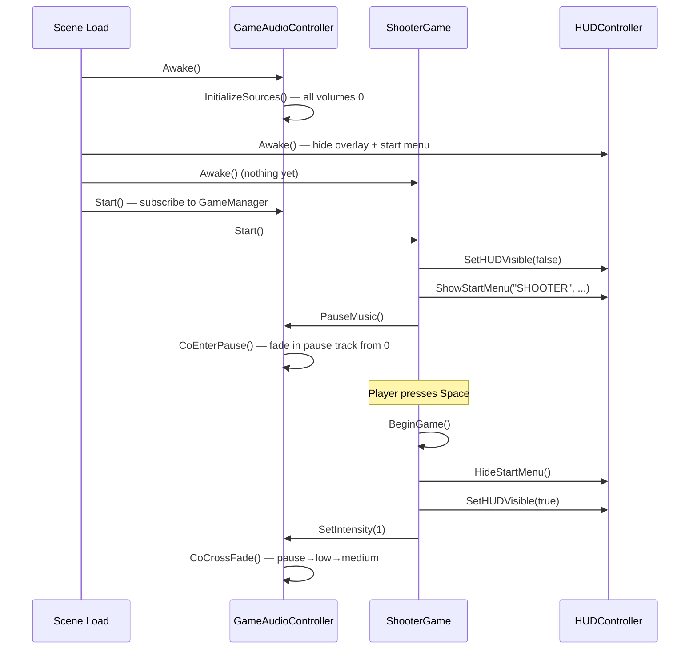

# Architectural Analysis: Scene Initialization Gap

## The Problem

When the Shooter scene loads:
1. HUD elements are visible (not hidden for start menu)
2. Start menu panel is hidden
3. Game music (Low intensity track) plays instead of pause music

## Two Initialization Paths

### Path 1: Production (Bootstrap → MainMenu → Shooter)
```
Bootstrap scene (index 0)
  └─ SceneLoader.Start() detects index 0
       └─ Loads MainMenu scene (index 1)
            └─ MainMenuController.Start() wires buttons
                 └─ User clicks "Shooter" button
                      └─ SceneLoader.LoadSceneDelayed(3)
                           └─ Shooter scene loads
                                ├─ HUDController.Awake() → hides pause overlay + start menu ✓
                                ├─ GameAudioController.Start() → InitializeSources()
                                │    └─ Plays Low track at 0.8 volume ✗ (game music, not pause)
                                └─ ShooterGame — NO Awake/Start → does nothing ✗
                                     └─ Nobody calls OnStart() → start menu stays hidden ✗
```

### Path 2: Debug (Direct scene load in editor)
```
Shooter scene loaded directly
  ├─ HUDController.Awake() → hides pause overlay + start menu ✓
  ├─ GameAudioController.Start() → plays Low track ✗
  └─ ShooterGame — does nothing
       └─ User must right-click → "Start Game (Debug)" manually
```

## Three Architectural Gaps

### Gap 1: No initialization bridge from scene load to IMiniGame.OnStart()

The interface defines the contract:

[`IMiniGame`](Assets/Scripts/Core/IMiniGame.cs:11)
```csharp
public interface IMiniGame
{
    void OnStart(MiniGameDependencies deps);
    void OnEnd();
    int SceneIndex { get; }
}
```

[`GameManager.StartGame()`](Assets/Scripts/Core/GameManager.cs:33) accepts an `IMiniGame`:
```csharp
public void StartGame(IMiniGame game)
{
    CurrentMiniGame = game;
    State = GameState.Playing;
    CurrentScore = 0;
    OnScoreChanged?.Invoke(CurrentScore);
    OnGameStarted?.Invoke();
}
```

**But `StartGame()` is never called with the minigame instance.** The chain breaks here:
- `MainMenuController` loads the scene but does NOT find the `IMiniGame` component and call `OnStart()`
- `SceneLoader` just loads scenes — no `OnSceneLoaded` callback that discovers minigames
- Nobody bridges "scene loaded" → "find IMiniGame" → "call OnStart()"

### Gap 2: GameAudioController.Start() creates a race condition

[`GameAudioController.Start()`](Assets/Scripts/Minigames/Shooter/GameAudioController.cs:151):
```csharp
private void Start()
{
    InitializeSources();  // Plays Low track at 0.8 immediately
    // Self-subscribe to GameManager events
}
```

[`InitializeSources()`](Assets/Scripts/Minigames/Shooter/GameAudioController.cs:181):
```csharp
private void InitializeSources()
{
    ConfigureMusicSource(_lowSource);     // set outputAudioMixerGroup
    ConfigureMusicSource(_mediumSource);
    ConfigureMusicSource(_highSource);
    ConfigureMusicSource(_pauseSource);

    if (_lowSource != null) _lowSource.Play();       // STARTS PLAYING
    if (_mediumSource != null) _mediumSource.Play();
    if (_highSource != null) _highSource.Play();
    if (_pauseSource != null) _pauseSource.Stop();

    SetSourceVolume(_lowSource, _musicVolume);       // AUDIBLE
    SetSourceVolume(_mediumSource, 0f);
    SetSourceVolume(_highSource, 0f);
    SetSourceVolume(_pauseSource, 0f);
}
```

Even if `ShooterGame.Start()` calls `PauseMusic()` afterwards, there's a **perceptible frame** where the Low track plays before the cross-fade to pause music completes. Unity's default execution order between separate MonoBehaviours is undefined.

### Gap 3: HUDController.Awake() hides start menu as defensive default

[`HUDController.Awake()`](Assets/Scripts/UI/HUDController.cs:46):
```csharp
private void Awake()
{
    // ...
    _pauseOverlay?.SetActive(false);    // Correct: pause hidden by default
    _startMenuPanel?.SetActive(false);  // Correct defensively, but nothing shows it back
}
```

The start menu is hidden by default (correct defensive init), but no code path exists that shows it on scene load. The only code that shows it is `ShowStartMenu()`, which is called inside `DebugStartGame()` and `OnStart()` — neither of which runs automatically.

## Why Simply Adding `ShooterGame.Start()` Is Tricky

### Conflict with Race Condition

If we add:
```csharp
private void Start()
{
    if (_isPlaying) return;
    _hudController?.SetHUDVisible(false);
    _hudController?.ShowStartMenu("SHOOTER", ...);
    _audioController?.PauseMusic();   // ← Race: audio already playing Low track
    _isPlaying = true;
    _isGamePaused = true;
}
```

`GameAudioController.Start()` may run before or after `ShooterGame.Start()` — Unity doesn't guarantee order. If audio starts first, the Low track plays briefly before `PauseMusic()` kicks in.

### Conflict with Dual Initialization

If the Bootstrap path is fixed later (Gap 1), `OnStart()` would be called externally. The `_isPlaying` guard prevents re-entry, but state flags like `_hasGameEnded`, `_deps`, subscriptions need careful handling:
- `ShooterGame.Start()` sets `_isPlaying = true`
- Later, Bootstrap calls `OnStart(deps)` → `DebugStartGame()` returns early... but `_deps` is never set
- The game would work in standalone mode but not through Bootstrap

## Proposed Solution: Combined Fix

### Step 1: Self-initialization in `ShooterGame.Start()`
Add `Start()` that sets UI state and calls `PauseMusic()`.

### Step 2: `GameAudioController` silent initialization
Add a `_startSilent` flag or modify `InitializeSources()` to start all volumes at 0 by default. Add a separate `UnmuteGameMusic()` method that transitions to normal game audio. This eliminates the race condition entirely.

### Step 3: Fix the architecture bridge (optional, future)
Either:
- **A**: Make `MainMenuController` find `IMiniGame` in the loaded scene and call `StartGame()` + `OnStart()`
- **B**: Add a `SceneManager.sceneLoaded` handler in a persistent singleton that auto-discovers and initializes minigames
- **C**: Accept that each minigame self-initializes via `Start()` (simplest, what we're doing)

## Proposed Changes — File by File

### [`ShooterGame.cs`](Assets/Scripts/Minigames/Shooter/ShooterGame.cs)
Add `Start()` method that performs initial setup without audio race:
```csharp
private void Start()
{
    if (_isPlaying) return;
    _hasGameEnded = false;
    _hudController?.SetHUDVisible(false);
    _hudController?.ShowStartMenu("SHOOTER", LastScore > 0 ? LastScore : null, "PRESS SPACE TO START");
    _gameReady = false;
    _isGamePaused = true;
    _isPlaying = true;
    // Audio silence is handled by GameAudioController.Awake() — see step 2
}
```

### [`GameAudioController.cs`](Assets/Scripts/Minigames/Shooter/GameAudioController.cs)
Move `InitializeSources()` to `Awake()` and start all volumes at 0. Add public `SetInitialVolume(float vol)` or have `PauseMusic()` drive the first audible state:
```csharp
private void Awake()
{
    InitializeSources();
    // Start silent — all volumes at 0
    SetSourceVolume(_lowSource, 0f);
    SetSourceVolume(_mediumSource, 0f);
    SetSourceVolume(_highSource, 0f);
    SetSourceVolume(_pauseSource, 0f);
}

private void Start()
{
    // Subscribe to GameManager events (needs Start for singleton readiness)
    GameManager gm = FindFirstObjectByType<GameManager>();
    if (gm != null)
    {
        gm.OnGamePaused += PauseMusic;
        gm.OnGameResumed += ResumeMusic;
    }
}
```

Then `PauseMusic()` becomes the first audible state, starting the pause track from zero volume.


