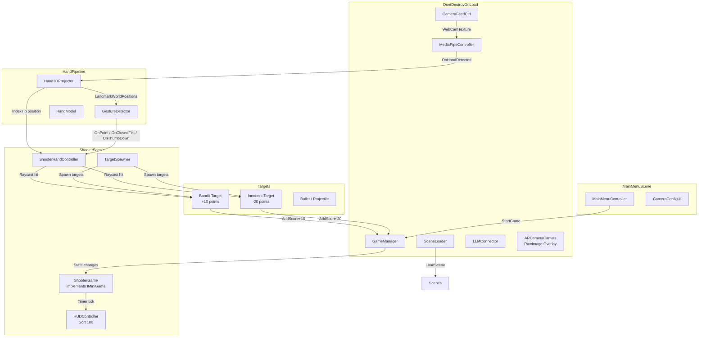

# ARcade Rush — Updated Completion Plan (Shooter)

> **Date:** 2026-05-03  
> **Scope:** Complete the refactoring + build **Shooter** minigame as the prototype  
> **Previous plan replaced:** Interrogatorio → Shooter

---

## Project Overview

**ARcade Rush** — Unity 2022.3 LTS (URP) minigame platform using:
- **MediaPipe** (homuler plugin) for real-time hand/face tracking via webcam
- **Groq Cloud API** (LLM `llama-3-8b-8192`) for dynamic dialogue *(not used in Shooter)*
- Prototype focuses on **Shooter** — a hand-tracked shooting gallery with 3 rows of bandits and innocents
- Target: Windows standalone, Spanish UI

---

## Shooter Minigame — Design

### Concept
A shooting gallery room with 3 rows of targets (near, mid, far). The player's **real hand** is projected as a 3D hand in the center of the screen. The **index finger direction** determines where bullets go via raycast. **Closing the fist** fires.

### Gesture Requirements
| Gesture | Purpose | Detection |
|---|---|---|
| **Point / Finger Gun** | Aim (index extended, thumb optionally up) | Index tip (8) above MCP (5), others below their MCP |
| **Closed Fist** | Shoot | All 5 fingertips below their MCP joints |
| **Thumb Down** | Safety/reload/switch mode (optional) | Thumb tip (4) below IP joint (3) while index points |

### Scene Contents (`MG_Shooter.unity`)
| GameObject | Components | Notes |
|---|---|---|
| `[Game]` | `ShooterGame.cs` | Root logic. Implements `IMiniGame`. |
| `[HandAim]` | `ShooterHandController.cs` | Listens to Hand3DProjector, casts ray from index tip, fires on fist |
| `[TargetManager]` | `TargetSpawner.cs` | Spawns bandits/innocents in 3 rows at intervals |
| `Canvas_HUD` | `HUDController.cs`, TMP elements | Score, timer, ammo counter? Sort order 100 |
| `AR Camera` | Camera, CameraFeedCtrl ref | Persistent from Bootstrap |

### Scoring Rules
| Action | Score |
|---|---|
| Hit bandit | +10 |
| Hit innocent | -20 |
| Miss | 0 |

### Timer
- 90 seconds per round
- On timeout, show Results screen, return to MainMenu

---

## Current State Assessment

### ✅ COMPLETED — Shared Infrastructure (17 scripts)

| Category | Files | Status |
|---|---|---|
| **Core** | GameManager, CameraFeedCtrl, MediaPipeController, LLMConnector, SceneLoader, IMiniGame, GroqConfig, LLMTestButton | **DONE** |
| **Hand** | Hand3DProjector, GestureDetector, HandModel, HandTool, HandDepthCalibrator | **DONE** |
| **Face** | FaceLandmarkReader, EmotionClassifier | **DONE** *(available for future minigames)* |
| **UI** | CameraOverlay, CameraConfigUI, DebugTrackerUI, DialogueUI, HUDController, MainMenuController | **DONE** |

### ❌ REMAINING — Shooter-specific code + scene wiring

---

## Phase Breakdown

### Phase A — Configuration & Fixes

| # | Task | Details | Files |
|---|---|---|---|
| A1 | Fix MediaPipe plugin path | Update from Linux local path to Windows-compatible path or git URL | [`Packages/manifest.json`](Packages/manifest.json:3) |
| A2 | Clean duplicate model files | Delete root copies, keep only `mediapipe/` subfolder | `Assets/StreamingAssets/face_landmarker.task`, `hand_landmarker.task` (root) |
| A3 | Create GroqConfig.asset | Create via menu `Assets > Create > ARcadeRush > GroqConfig`. Set API key. *(Needed for future minigames even if Shooter doesn't use LLM)* | `Assets/Resources/GroqConfig.asset` |
| A4 | Fix scene indices | Remove DummyTesting refs, update indices | [`MainMenuController.cs`](Assets/Scripts/UI/MainMenuController.cs) |

### Phase B — New Shooter Scripts

| # | Task | Details | Namespace |
|---|---|---|---|
| B1 | Create `Target.cs` | MonoBehaviour with: `enum TargetType { Bandit, Innocent }`, `OnHit()` → points to GameManager, destroy self, VFX | `ARcadeRush.Minigames.Shooter` |
| B2 | Create `TargetSpawner.cs` | Spawns targets in 3 depth rows (near/mid/far). Configurable spawn interval, mix ratio of bandits:innocents. Uses object pooling. | `ARcadeRush.Minigames.Shooter` |
| B3 | Create `ShooterHandController.cs` | Reads `Hand3DProjector.LandmarkWorldPositions[8]` (index tip). Casts ray in index finger direction. On fist detection → fire bullet (instantiate projectile or hitscan). On thumb-down → safety toggle. | `ARcadeRush.Minigames.Shooter` |
| B4 | Create `ShooterGame.cs` | Implements `IMiniGame`. Timer (90s). Score tracking via GameManager. Spawns targets. Wire up hand controller. On timeout → EndGame → return to MainMenu. | `ARcadeRush.Minigames.Shooter` |
| B5 | Add thumb-down to GestureDetector | Add `GestureType.ThumbDown` detection: thumb tip (4) below IP joint (3) while index points. Add `event Action OnThumbDown`. | [`GestureDetector.cs`](Assets/Scripts/Hand/GestureDetector.cs) |

### Phase C — Scenes & Prefabs

| # | Task | Details |
|---|---|---|
| C1 | Create Bootstrap prefab + scene | `[Bootstrap]` root with DontDestroyOnLoad. Children: GameManager, CameraFeedCtrl, MediaPipeController, LLMConnector, SceneLoader. Persistent Canvas for camera overlay. |
| B2 | Create ARCameraCanvas prefab | Canvas with RawImage child, CameraOverlay component, AspectRatioFitter.EnvelopeParent |
| C3 | Wire MainMenu scene | Buttons: "Shooter" (main), "Testing" (debug scene button optional). Wire to MainMenuController. Add CameraConfigUI for manual camera start. |
| C4 | Create MG_Shooter.unity scene | Full hierarchy per design table above. Set build index to 2. |
| C5 | Create target prefabs | Bandit prefab + Innocent prefab (placeholder cubes with Target.cs). Different colors for distinction. |
| C6 | Create bullet/projectile prefab | Simple sphere/visual with TrailRenderer, moves in straight line, destroys on hit. |

### Phase D — Cleanup

| # | Task | Details |
|---|---|---|
| D1 | Delete `Assets/Scenes/HandTracker/` | Legacy — all functionality migrated |
| D2 | Delete `Assets/Scenes/FaceEmotionTracking/` | Empty scene, no scripts |
| D3 | Delete `Assets/Scenes/Llm/` | GroqCaller.cs migrated to LLMConnector |
| D4 | Delete `Assets/Scenes/HandModelTracker/` | Not used in prototype |
| D5 | Delete `Assets/Scenes/SampleScene.unity` | Default sample scene |
| D6 | Delete `Assets/Scenes/MaiMenu/` | Empty/typo'd folder |
| D7 | Delete `Assets/Scenes/DummyTesting.unity` | Not part of prototype |
| D8 | Delete Interrogatorio minigame scripts | `InterrogatorioGame.cs`, `NPCController.cs`, `EmotionEvaluator.cs`, `ResponseHandler.cs` and their `Interrogatorio/` folder |
| D9 | Delete `Assets/Scenes/MG_Interrogatorio.unity` | Replaced by MG_Shooter |
| D10 | Update Build Settings | Final order: 0=Bootstrap, 1=MainMenu, 2=MG_Shooter |

### Phase E — Verification

| # | Check | How to Verify |
|---|---|---|
| E1 | Camera feed visible in all scenes | Click "Start Camera" in MainMenu. Feed visible. |
| E2 | Hand skeleton tracks correctly | Move hand slowly. Skeleton follows without teleporting. |
| E3 | Index point detected | Console logs `OnPoint` when extending index finger. |
| E4 | Closed fist detected | Console logs `OnClosedFist` when making a fist. |
| E5 | Thumb-down detected | Console logs `OnThumbDown` when thumb is lowered while pointing. |
| E6 | Aim ray follows index finger | Visual debug line (or bullet direction) matches index finger orientation. |
| E7 | Fist fires bullet | Closing fist creates a projectile traveling forward. |
| E8 | Targets spawn in 3 rows | Near/mid/far rows visible and at correct depths. |
| E9 | Bandit hit → +10 score | Console logs +10, target destroyed. |
| E10 | Innocent hit → -20 score | Console logs -20, target destroyed. |
| E11 | Timer counts down | HUD timer decrements from 90 to 0, stops and ends game at 0. |
| E12 | Game ends on timeout | Loads MainMenu after 2s results delay. |
| E13 | Bootstrap persists | `GameManager.Instance != null` after scene load. |
| E14 | Zero NullReferenceExceptions | Play 2 full rounds, Console shows zero NREs. |

### Phase F — Developer Documentation

| # | Task | Details |
|---|---|---|
| F1 | Document singleton architecture | Explain how to access `GameManager.Instance`, `CameraFeedCtrl.Instance`, `MediaPipeController.Instance`, `LLMConnector.Instance`, `SceneLoader.Instance`. Include Awake pattern and DontDestroyOnLoad. |
| F2 | Document IMiniGame interface | Explain how to implement `IMiniGame` to add a new minigame: `OnStart(MiniGameDependencies)`, `OnEnd()`, `SceneIndex`. Include step-by-step: create script → implement interface → register in MainMenu → add scene to Build Settings. |
| F3 | Document Hand pipeline | Explain how to use `Hand3DProjector` (landmark positions, world space), `GestureDetector` (events: OnOpenHand, OnClosedFist, OnPoint, OnPinch, OnPinchRelease, OnThumbDown), and `HandModel` (visual skeleton). |
| F4 | Document Face pipeline | Explain `FaceLandmarkReader` (NormalizedMetrics array) and `EmotionClassifier` (OnEmotionChanged event, EmotionLabel enum, threshold rules, 8-frame smoothing). |
| F5 | Document UI components | Explain reusable components: `CameraOverlay`, `CameraConfigUI`, `DebugTrackerUI`, `DialogueUI`, `HUDController`. What each does and how to wire them. |
| F6 | Document LLM integration | Explain `LLMConnector.Ask()` signature, prompt template pattern, GroqConfig setup, error handling (rate limit retry, auth failure). |
| F7 | Document how to add a new minigame | End-to-end recipe: create scene → create script implementing IMiniGame → add to Build Settings → add button in MainMenuController → ensure singletons are alive (start from Bootstrap). |
| F8 | Save as `docs/developer-guide.md` | Single markdown file in the docs folder for easy access. |

---

## Architecture Diagram



---

## Code Fixes Required

### Fix 1: Add ThumbDown to GestureDetector
In [`GestureDetector.cs`](Assets/Scripts/Hand/GestureDetector.cs):
- Add `GestureType.ThumbDown` to enum
- Add `public event Action OnThumbDown`
- Detection rule: index pointing + thumb tip (4) y > IP joint (3) y (thumb lowered)
- Fire only on transition

### Fix 2: MainMenuController scene indices
```csharp
// Change from scene 3 (Interrogatorio) to scene 2 (Shooter)
_startInterrogatorioBtn.onClick.AddListener(() => LoadScene(2));
// Also rename button variable for clarity
```

---

## Files to Create (New)

| File | Path |
|---|---|
| `Target.cs` | `Assets/Scripts/Minigames/Shooter/Target.cs` |
| `TargetSpawner.cs` | `Assets/Scripts/Minigames/Shooter/TargetSpawner.cs` |
| `ShooterHandController.cs` | `Assets/Scripts/Minigames/Shooter/ShooterHandController.cs` |
| `ShooterGame.cs` | `Assets/Scripts/Minigames/Shooter/ShooterGame.cs` |
| `MG_Shooter.unity` | `Assets/Scenes/MG_Shooter.unity` |
| `Bandit.prefab` | `Assets/Prefabs/Shooter/Bandit.prefab` |
| `Innocent.prefab` | `Assets/Prefabs/Shooter/Innocent.prefab` |
| `Bullet.prefab` | `Assets/Prefabs/Shooter/Bullet.prefab` |

## Files to Delete

| File | Reason |
|---|---|
| `Assets/Scenes/MG_Interrogatorio.unity` | Replaced by Shooter |
| `Assets/Scenes/DummyTesting.unity` | Not in prototype |
| `Assets/Scripts/Minigames/Interrogatorio/` (folder) | Replaced by Shooter |
| `Assets/Scenes/HandTracker/` | Legacy |
| `Assets/Scenes/FaceEmotionTracking/` | Legacy |
| `Assets/Scenes/Llm/` | Legacy |
| `Assets/Scenes/HandModelTracker/` | Legacy |
| `Assets/Scenes/SampleScene.unity` | Legacy |
| `Assets/Scenes/MaiMenu/` | Empty typos |
| `Assets/StreamingAssets/face_landmarker.task` (root) | Duplicate |
| `Assets/StreamingAssets/hand_landmarker.task` (root) | Duplicate |

---

*ARcade Rush · Shooter Prototype Plan · PUCV 2026*
