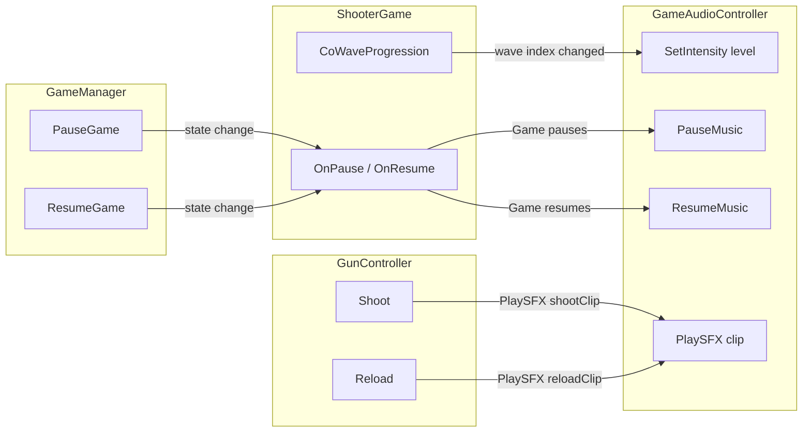
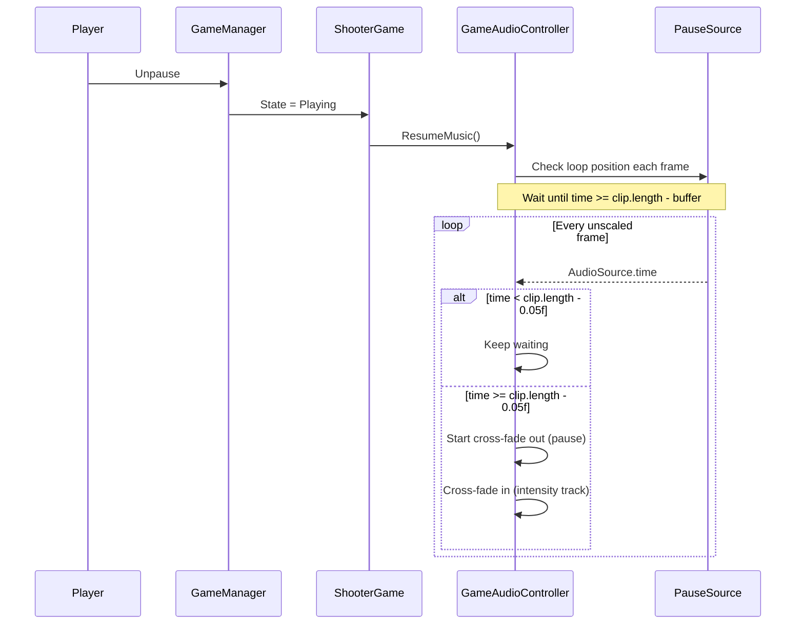

# Step 6 — GameAudioController Plan

> Based on [`plans/remaining-tasks.md`](plans/remaining-tasks.md), user refinements to the soundtrack system, and existing code analysis.

---

## Requirements

1. **3 music loops** with different intensities: Easy (low), Medium, Hard (high)
2. **All 3 tracks play simultaneously** — the active track is audible, others are muted
3. **Cross-fading** between tracks when intensity changes
4. **Mute non-active tracks** when one is active
5. **Pause soundtrack** — plays during pause
6. **On unpause**, wait for the pause soundtrack's current loop to finish naturally, *then* cross-fade back to the appropriate intensity track
7. **SFX slots** for shoot sound and reload sound

---

## Architecture

### Audio Source Strategy

4 dedicated `AudioSource` components, each created on a child GameObject at runtime:
| Source | Clip | Loop | Behavior |
|--------|------|------|----------|
| `_lowSource` | `_lowIntensityTrack` | Yes | Easy/Low intensity music |
| `_mediumSource` | `_mediumIntensityTrack` | Yes | Medium intensity music |
| `_highSource` | `_highIntensityTrack` | Yes | Hard intensity music |
| `_pauseSource` | `_pauseTrack` | Yes | Pause menu music |

All 4 play from the moment the game starts. The controller adjusts volumes to make only the relevant track audible.

### Integration Points



### Resume Flow (Wait for Loop End)



---

## Files to Create

### 1. `Assets/Scripts/Minigames/Shooter/GameAudioController.cs`

**Namespace:** `ARcadeRush.Minigames.Shooter`

A `MonoBehaviour` designed to be the root of a **prefab** (`MusicController.prefab`), containing 5 child GameObjects each with a pre-configured `AudioSource` component. The prefab architecture makes it modular, reusable, and easy to configure in the Inspector.

**Prefab Structure:**
```
MusicController (GameAudioController.cs)
├── LowSource        (AudioSource, loop, ignoreListenerPause)
├── MediumSource     (AudioSource, loop, ignoreListenerPause)
├── HighSource       (AudioSource, loop, ignoreListenerPause)
├── PauseSource      (AudioSource, loop, ignoreListenerPause)
└── SFXSource        (AudioSource, playOnAwake=false, ignoreListenerPause)
```

The child `AudioSource` GameObjects are assigned in the Inspector via `[SerializeField]` references — no runtime creation needed. AudioClips are also assigned via Inspector on the child sources or on the controller script.

**Inspector Fields:**

| Field | Type | Default | Description |
|-------|------|---------|-------------|
| `_lowSource` | `AudioSource` | — | Child GameObject with Easy/Low intensity loop |
| `_mediumSource` | `AudioSource` | — | Child GameObject with Medium intensity loop |
| `_highSource` | `AudioSource` | — | Child GameObject with Hard intensity loop |
| `_pauseSource` | `AudioSource` | — | Child GameObject with pause soundtrack loop |
| `_sfxSource` | `AudioSource` | — | Child GameObject for one-shot SFX |
| `_musicVolume` | `float` | 0.8f | Master volume for music tracks |
| `_sfxVolume` | `float` | 1.0f | Volume for SFX one-shots |
| `_fadeDuration` | `float` | 0.5f | Duration of cross-fade transitions (seconds, unscaled) |
| `_pauseFadeDuration` | `float` | 0.3f | Duration of fade when entering pause (shorter, unscaled) |

**Private State:**

| Field | Type | Description |
|-------|------|-------------|
| `_currentIntensity` | `int` | 0 = none, 1 = Low, 2 = Medium, 3 = High |
| `_isPaused` | `bool` | Whether pause music is active |
| `_isTransitioning` | `bool` | Prevents concurrent fade coroutines |

**Public API:**

```csharp
/// <summary>Set game intensity level. 0 = none, 1 = Low, 2 = Medium, 3 = High.</summary>
public void SetIntensity(int level)

/// <summary>Play a one-shot sound effect through the SFX channel.</summary>
public void PlaySFX(AudioClip clip)

/// <summary>Transition from current intensity track to pause soundtrack.</summary>
public void PauseMusic()

/// <summary>Wait for pause track loop to end, then transition back to current intensity.</summary>
public void ResumeMusic()
```

**Key Implementation Details:**

- **Awake()**: No runtime creation needed — sources are already children of the prefab. Ensure all music sources are playing and at correct initial volumes. Set active track = `_musicVolume`, others = 0, pause source = 0.

- **Start()**: Begin playing all music sources (they were set to not play on awake so we control startup). Set `_currentIntensity = 0` (none).

- **SetIntensity(int level)**: Validate level (1-3). If same as `_currentIntensity`, return. If `_isTransitioning`, return. Start `CoCrossFade(currentSource, newSource)`. Track the level.

- **CoCrossFade(AudioSource fadeOut, AudioSource fadeIn)**: Set `_isTransitioning = true`. Lerp `fadeOut.volume` from current → 0 and `fadeIn.volume` from 0 → `_musicVolume` over `_fadeDuration` using `Time.unscaledDeltaTime`. Set `_isTransitioning = false`.

- **PauseMusic()**: If `_isPaused`, return. Set `_isPaused = true`. If `_isTransitioning`, wait. Rapidly fade down current intensity source to 0 over `_pauseFadeDuration`. Fade up pause source to `_musicVolume`. Start pause source from beginning of clip (`_pauseSource.time = 0`).

- **ResumeMusic()**: If not `_isPaused`, return. Start `CoWaitForPauseLoopEnd()`.

- **CoWaitForPauseLoopEnd()**: Every unscaled frame, check `_pauseSource.time`. When `_pauseSource.time >= _pauseTrack.length - 0.05f` (near loop point), start fade: ramp down pause source to 0, ramp up the appropriate intensity source to `_musicVolume`. Set `_isPaused = false`.

**Why unscaled time?** GameManager sets `Time.timeScale = 0f` when pausing. Audio controller logic must continue running. Using `WaitForSecondsRealtime` and `Time.unscaledDeltaTime` ensures fade coroutines and loop detection work during pause.

---

## Files to Modify

### 2. `Assets/Scripts/Minigames/Shooter/ShooterGame.cs`

**Changes:**

| # | Location | Change |
|---|----------|--------|
| 1 | Serialized fields (~line 23) | Add `[SerializeField] private GameAudioController _audioController;` |
| 2 | `DebugStartGame()` (~line 54) | Call `_audioController?.SetIntensity(1)` — start with Low intensity |
| 3 | `OnStart()` (~line 89) | Call `_audioController?.SetIntensity(1)` |
| 4 | `CoRunRowWave()` (~line 202) | When `rowLabel` changes and score threshold is met (wave advances), call `_audioController?.SetIntensity(1/2/3)` based on wave index |
| 5 | `OnEnd()` (~line 128) | Call `_audioController?.PauseMusic()` or stop audio appropriately |
| 6 | Pause handling | Wire `_audioController` pause/resume calls in response to GameManager pause state changes |

**Intensity mapping:**
- Wave 0 (Easy, `rowLabel = "Easy"`) → `SetIntensity(1)`
- Wave 1 (Medium) → `SetIntensity(2)`
- Wave 2 (Hard) → `SetIntensity(3)`

This is called once when entering a new wave, not every batch cycle. The best place is at the start of `CoRunRowWave()` or when the `rowLabel` changes.

### 3. `Assets/Scripts/Minigames/Shooter/GunController.cs`

**Changes:**

| # | Location | Change |
|---|----------|--------|
| 1 | Serialized fields (~line 28) | Add reference field for GameAudioController (or just clips) |
| 2 | `Shoot()` (~line 157) | After successful shot, call `_audioController?.PlaySFX(_shootSFX)` |
| 3 | `Reload()` (~line 183) | After reload starts, call `_audioController?.PlaySFX(_reloadSFX)` |

**Alternative approach:** Rather than storing SFX clips in GunController, they could be stored in GameAudioController. GunController would just call `_audioController.PlayShootSFX()` / `_audioController.PlayReloadSFX()`. Or `_audioController.PlaySFX(clip)` if GunController keeps its own clip references. Both are valid — the plan file suggests keeping clips in GameAudioController and having GunController reference it.

### 4. `Assets/Scripts/Core/GameManager.cs`

**Changes:**

| # | Location | Change |
|---|----------|--------|
| 1 | Events (~line 16) | Add `public event Action OnGamePaused;` and `public event Action OnGameResumed;` |
| 2 | `PauseGame()` (~line 62) | Fire `OnGamePaused?.Invoke()` after setting state |
| 3 | `ResumeGame()` (~line 71) | Fire `OnGameResumed?.Invoke()` after setting state |

These events allow ShooterGame (or any future minigame) to react to pause state without tight coupling.

---

## Detailed Implementation of CoWaitForPauseLoopEnd

```csharp
private IEnumerator CoWaitForPauseLoopEnd()
{
    _isTransitioning = true;

    // Wait for the pause track to reach near the end of its current loop
    float loopEndThreshold = 0.05f;
    float clipLength = _pauseTrack != null ? _pauseTrack.length : 1f;

    while (_pauseSource != null && _pauseSource.isPlaying)
    {
        float remaining = clipLength - _pauseSource.time;
        if (remaining <= loopEndThreshold)
            break;
        yield return null; // Wait for next unscaled frame
    }

    // Now cross-fade: pause out, intensity in
    AudioSource intensitySource = GetIntensitySource(_currentIntensity);
    float elapsed = 0f;
    while (elapsed < _fadeDuration && intensitySource != null && _pauseSource != null)
    {
        elapsed += Time.unscaledDeltaTime;
        float t = Mathf.Clamp01(elapsed / _fadeDuration);
        float smoothT = Mathf.SmoothStep(0f, 1f, t);
        _pauseSource.volume = Mathf.Lerp(_musicVolume, 0f, smoothT);
        intensitySource.volume = Mathf.Lerp(0f, _musicVolume, smoothT);
        yield return null;
    }

    if (_pauseSource != null)
    {
        _pauseSource.volume = 0f;
        _pauseSource.Stop();
    }
    if (intensitySource != null)
        intensitySource.volume = _musicVolume;

    _isPaused = false;
    _isTransitioning = false;
}
```

---

## Scene Wiring

### Step 1 — Create the Prefab

1. In the Unity Editor, create an empty GameObject named `MusicController`
2. Attach `GameAudioController.cs`
3. Create 5 children: `LowSource`, `MediumSource`, `HighSource`, `PauseSource`, `SFXSource`
4. Add `AudioSource` to each child, configure:
   - All music sources: `Loop = true`, `Play On Awake = false`, `Ignore Listener Pause = true`
   - `SFXSource`: `Loop = false`, `Play On Awake = false`, `Ignore Listener Pause = true`
5. Assign the 5 `AudioSource` references in `GameAudioController`'s Inspector slots
6. Assign `AudioClip` assets to each child `AudioSource`'s `Clip` field
7. Drag the `MusicController` GameObject into `Assets/Prefabs/` to create the prefab

### Step 2 — Place in Scene

- Drag the `MusicController` prefab into the Shooter scene hierarchy
- On `ShooterGame` component: assign `_audioController` → `MusicController`
- On `GunController` component: assign `_audioController` → `MusicController`

---

## Edge Cases & Considerations

| Scenario | Behavior |
|----------|----------|
| Game starts → first wave | `SetIntensity(1)` → Low track plays |
| Wave advances Easy→Medium | Cross-fade from Low source → Medium source over `_fadeDuration` |
| Wave advances Medium→Hard | Cross-fade from Medium source → High source |
| Player pauses mid-game | Fade out current source (~0.3s), start pause track from beginning |
| Player unpauses | Wait for pause track loop end, then cross-fade back to correct intensity source |
| Player unpauses near loop end | Threshold check detects near-loop, transitions within the same frame |
| Player pauses & unpauses rapidly | Guard against concurrent transitions via `_isTransitioning` flag |
| Game ends while paused | `OnEnd()` → stop all AudioSources directly |
| SFX during quiet moments | SFX plays on dedicated `_sfxSource` — independent of music volumes |
| No clips assigned | Null checks on all clips/sources — gracefully degrades (no audio) |
