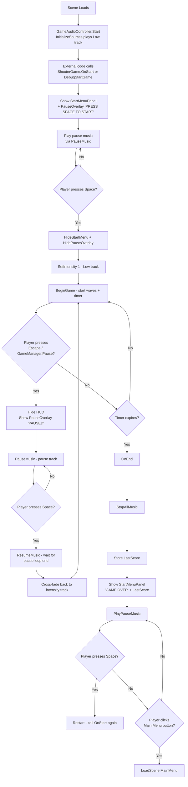

# Game Flow Enhancement Plan — Start Menu, Pause, Game Over

## 1. Current State vs. Desired State

| Aspect | Current Code Behavior | Desired Behavior |
|--------|----------------------|------------------|
| **Scene load / start** | Shows `"PRESS SPACE TO START"` text overlay via [`ShowPauseOverlay()`](Assets/Scripts/UI/HUDController.cs:158). All music silenced via [`StartSilent()`](Assets/Scripts/Minigames/Shooter/GameAudioController.cs:95). | Show a proper **start menu** (title + "PRESS SPACE") with **pause music** playing. |
| **Gameplay** | After Space → [`BeginGame()`](Assets/Scripts/Minigames/Shooter/ShooterGame.cs:391) → intensity music starts via `SetIntensity(1)`. Correct. | Same — already works. |
| **Pause** | [`HandleGamePaused()`](Assets/Scripts/Minigames/Shooter/ShooterGame.cs:351) → hides HUD, shows "PAUSED" overlay. [`GameAudioController`](Assets/Scripts/Minigames/Shooter/GameAudioController.cs) auto-subscribes to `GameManager.OnGamePaused` → calls `PauseMusic()`. | Same — already works. |
| **Game Over** | [`OnEnd()`](Assets/Scripts/Minigames/Shooter/ShooterGame.cs:153) → stores `LastScore` → **loads MainMenu scene** via `SceneLoader.LoadScene(1)`. | Stay in **same scene**. Show start/game-over panel with **final score**, **title**, and buttons for **Restart** / **Main Menu**. |

## 2. Key Gaps Identified

### Gap A: No dedicated Start Menu panel
The "start menu" is currently just a text overlay (`_pauseOverlay` + `_pauseText` = "PRESS SPACE TO START"). There's no title, no score display, no start button. The user's hierarchy already has a `Start/GameOver Menu` sibling GameObject — it needs to be wired.

### Gap B: Pause music doesn't play on start menu
Current flow: [`InitializeSources()`](Assets/Scripts/Minigames/Shooter/GameAudioController.cs:181) plays Low track at 0.8 → [`StartSilent()`](Assets/Scripts/Minigames/Shooter/GameAudioController.cs:95) zeros everything → silence. The pause source never plays. We need the **pause music** to play while the start menu is shown.

### Gap C: Game Over loads different scene instead of staying in-scene
`OnEnd()` currently loads the MainMenu scene. Instead, it should:
1. Stop all music
2. Show the Start/GameOver panel with final score
3. Play pause music
4. Wire Restart (reload this scene) and Main Menu (load scene 1) buttons

## 3. Required Changes

### File 1: [`Assets/Scripts/UI/HUDController.cs`](Assets/Scripts/UI/HUDController.cs)

**Add Start Menu panel support:**

```csharp
[Header("Start Menu")]
[SerializeField] private GameObject _startMenuPanel;      // The Start/GameOver Menu GO
[SerializeField] private TMP_Text _startMenuTitleText;    // e.g. "SHOOTER"
[SerializeField] private TMP_Text _startMenuScoreText;    // "Last Score: X" or hidden on fresh start
```

**New methods:**

```csharp
/// <summary>Show the start menu panel. If lastScore is null, hide the score display.</summary>
public void ShowStartMenu(string title, int? lastScore, string promptMessage)
{
    if (_startMenuPanel != null) _startMenuPanel.SetActive(true);
    if (_startMenuTitleText != null) _startMenuTitleText.text = title;
    
    if (_startMenuScoreText != null)
    {
        if (lastScore.HasValue)
            _startMenuScoreText.text = $"Last Score: {lastScore.Value}";
        else
            _startMenuScoreText.gameObject.SetActive(false);
    }
    
    // Also show the pause overlay with the prompt (e.g. "PRESS SPACE TO START")
    if (_pauseOverlay != null) _pauseOverlay.SetActive(true);
    if (_pauseText != null) _pauseText.text = promptMessage;
}

public void HideStartMenu()
{
    if (_startMenuPanel != null) _startMenuPanel.SetActive(false);
    if (_pauseOverlay != null) _pauseOverlay.SetActive(false);
}
```

**Expose `_gameOverPanel` methods are already implemented** — `ShowGameOver()` (line 277) and `HideGameOver()` (line 318) already work correctly.

**Awake() update (line 54):** Add `_startMenuPanel?.SetActive(false)` to ensure it starts hidden.

### File 2: [`Assets/Scripts/Minigames/Shooter/ShooterGame.cs`](Assets/Scripts/Minigames/Shooter/ShooterGame.cs)

**A. `OnStart()` (line 105) — Replace pause overlay with start menu + pause music:**

Replace lines 143-148:
```csharp
// Show start menu with pause music instead of silent start
_gameReady = false;
_isGamePaused = true;
_isPlaying = true;

// Show start menu
_hudController?.ShowStartMenu("SHOOTER", LastScore > 0 ? LastScore : null, "PRESS SPACE TO START");
_hudController?.SetHUDVisible(false);

// Play pause music instead of StartSilent
_audioController?.PauseMusic();
```

**B. `DebugStartGame()` (line 63) — Same change:**

Replace lines 94-99 with the same start menu + pause music logic.

**C. `BeginGame()` (line 391) — Also hide start menu:**

Add `_hudController?.HideStartMenu();` alongside the existing `HidePauseOverlay()` and `SetHUDVisible(true)` calls (line 397-398).

**D. `OnEnd()` (line 153) — Replace scene load with in-scene game over:**

Instead of loading the MainMenu scene, change the end flow to:

```csharp
public void OnEnd()
{
    if (_hasGameEnded) return;
    _hasGameEnded = true;

    _gunController?.SetAimPreviewActive(false);
    _gunController?.SetDebugInputAllowed(false);

    _audioController?.StopAllMusic();

    LastScore = _score;
    _isPlaying = false;
    _gameReady = false;

    if (_waveCo != null) { StopCoroutine(_waveCo); _waveCo = null; }
    CancelInvoke(nameof(TimerTick));

    if (_targetManager != null) _targetManager.DeactivateAll();

    // Unsubscribe from events (same as current code)
    if (_deps?.GameManager != null) { /* unsubscribe */ EndGame(); }
    if (_gunController != null) { /* unsubscribe */ }

    // Show game over / start menu in-scene
    _hudController?.SetHUDVisible(false);
    _hudController?.HidePauseOverlay();
    
    // Show the start menu panel with final score and game over title
    _hudController?.ShowStartMenu("GAME OVER", LastScore, "PRESS SPACE TO RESTART");
    
    // Play pause music for the menu
    _audioController?.PauseMusic();

    // The next Space press should restart rather than begin
    // This is handled in Update() — see note below
}
```

**E. `Update()` (line 414) — Handle restart on Space after game over:**

Add a new state check. When `_hasGameEnded` is true and Space is pressed, restart the game:

```csharp
private void Update()
{
    if (!_isPlaying && _hasGameEnded && Input.GetKeyDown(_unpauseKey))
    {
        // Restart the game
        if (_deps != null)
            OnStart(_deps);
        else
            DebugStartGame();
        return;
    }
    
    if (!_isPlaying) return;
    
    // ... existing unpause logic ...
}
```

**F. Add a field for the main menu scene button:**

Add a method to load the main menu when the button is pressed:
```csharp
public void LoadMainMenu()
{
    if (SceneLoader.Instance != null)
        SceneLoader.Instance.LoadScene(_mainMenuSceneIndex);
}
```

### File 3: [`Assets/Scripts/Minigames/Shooter/GameAudioController.cs`](Assets/Scripts/Minigames/Shooter/GameAudioController.cs)

**A. Add `PlayPauseMusic()` method — starts pause music independently:**

```csharp
/// <summary>
/// Start playing the pause music directly (for start menu / game over screen).
/// Silences all intensity tracks.
/// </summary>
public void PlayPauseMusic()
{
    if (_isTransitioning) return;
    
    // Silence all intensity sources
    SetSourceVolume(_lowSource, 0f);
    SetSourceVolume(_mediumSource, 0f);
    SetSourceVolume(_highSource, 0f);
    
    // Start pause track
    if (_pauseSource != null && _pauseSource.clip != null)
    {
        _pauseSource.time = 0f;
        _pauseSource.volume = _musicVolume;
        _pauseSource.Play();
    }
    
    _currentIntensity = 0;
    _isPaused = true;
}
```

**B. Modify [`PauseMusic()`](Assets/Scripts/Minigames/Shooter/GameAudioController.cs:108) — handle case where no intensity is active:**

Currently `PauseMusic()` gets the current intensity source to fade out (line 252). If `_currentIntensity == 0` (no source), the fade-out loop runs with `currentSource = null` which is harmless (null check at line 262). But we should ensure the pause source starts correctly. The current code already handles `currentSource == null` via the null-conditional check at line 262. So this is already safe — just ensure it works when `_currentIntensity == 0`.

Actually, looking more carefully at the current `PauseMusic()` flow:
- It calls `CoEnterPause()` (line 114)
- `CoEnterPause()` gets `GetIntensitySource(_currentIntensity)` → returns null if `_currentIntensity == 0`
- Fades out null (no-op)
- Then starts pause source from beginning

This would work fine. So `_audioController?.PauseMusic()` can be used directly even when no intensity is playing.

### File 4: Scene Hierarchy (Unity Editor)

**Assign the new `_startMenuPanel`, `_startMenuTitleText`, `_startMenuScoreText` fields** on the [`HUDController`](Assets/Scripts/UI/HUDController.cs) component (attached to `MainCanvas`):

```
MainCanvas (Canvas) (HUDController)
├── HUD (Panel) — ammo, time, score, etc.
├── PauseOverlay (GameObject with TMP_Text child)  ← already wired
└── Start/GameOver Menu (GameObject)
    ├── TitleText (TMP_Text)          → _startMenuTitleText
    ├── LastScoreText (TMP_Text)      → _startMenuScoreText
    └── (optional) Buttons for Restart / MainMenu
```

**Wire the Main Menu button** in the Start/GameOver Menu to call `ShooterGame.LoadMainMenu()`.

## 4. Game Flow Diagram



## 5. New / Modified Fields Summary

| File | Field/Method | Type | Action |
|------|-------------|------|--------|
| [`HUDController.cs`](Assets/Scripts/UI/HUDController.cs) | `_startMenuPanel` | `[SerializeField] GameObject` | **Add** |
| [`HUDController.cs`](Assets/Scripts/UI/HUDController.cs) | `_startMenuTitleText` | `[SerializeField] TMP_Text` | **Add** |
| [`HUDController.cs`](Assets/Scripts/UI/HUDController.cs) | `_startMenuScoreText` | `[SerializeField] TMP_Text` | **Add** |
| [`HUDController.cs`](Assets/Scripts/UI/HUDController.cs) | `ShowStartMenu(title, lastScore, prompt)` | `public void` | **Add** |
| [`HUDController.cs`](Assets/Scripts/UI/HUDController.cs) | `HideStartMenu()` | `public void` | **Add** |
| [`ShooterGame.cs`](Assets/Scripts/Minigames/Shooter/ShooterGame.cs) | `OnStart()` lines 143-148 | Logic change | **Modify** — use start menu + pause music |
| [`ShooterGame.cs`](Assets/Scripts/Minigames/Shooter/ShooterGame.cs) | `DebugStartGame()` lines 94-99 | Logic change | **Modify** — same as OnStart |
| [`ShooterGame.cs`](Assets/Scripts/Minigames/Shooter/ShooterGame.cs) | `BeginGame()` line 397-398 | Add `HideStartMenu()` | **Modify** |
| [`ShooterGame.cs`](Assets/Scripts/Minigames/Shooter/ShooterGame.cs) | `OnEnd()` line 153 | Logic change | **Modify** — in-scene game over instead of scene load |
| [`ShooterGame.cs`](Assets/Scripts/Minigames/Shooter/ShooterGame.cs) | `Update()` line 414 | Add restart check | **Modify** |
| [`ShooterGame.cs`](Assets/Scripts/Minigames/Shooter/ShooterGame.cs) | `LoadMainMenu()` | `public void` | **Add** |
| [`GameAudioController.cs`](Assets/Scripts/Minigames/Shooter/GameAudioController.cs) | `PlayPauseMusic()` | `public void` | **Add** (optional — `PauseMusic()` may suffice) |
| **Scene** | `Start/GameOver Menu` GameObject | Hierarchy | **Wire Inspector** slots |

## 6. Execution Order

1. **Add fields + methods to [`HUDController.cs`](Assets/Scripts/UI/HUDController.cs)** — `_startMenuPanel`, `_startMenuTitleText`, `_startMenuScoreText`, `ShowStartMenu()`, `HideStartMenu()`, `Awake()` init
2. **Add [`PlayPauseMusic()`](Assets/Scripts/Minigames/Shooter/GameAudioController.cs) to `GameAudioController.cs`** (or verify `PauseMusic()` handles zero-intensity case)
3. **Modify [`ShooterGame.cs`](Assets/Scripts/Minigames/Shooter/ShooterGame.cs)** — `OnStart()`, `DebugStartGame()`, `BeginGame()`, `OnEnd()`, `Update()`, add `LoadMainMenu()`
4. **Scene wiring** — Assign the new SerializedFields in the Unity Editor Inspector on the [`HUDController`](Assets/Scripts/UI/HUDController.cs) component
5. **Wire Main Menu button** on the Start/GameOver Menu to call `ShooterGame.LoadMainMenu()`
6. **Update [`docs/shooter_implementation.md`](docs/shooter_implementation.md)** with the new game flow
