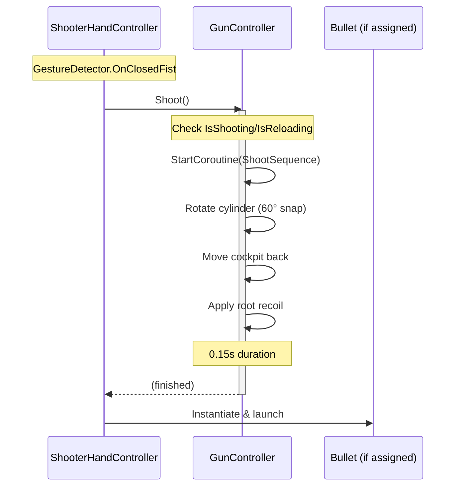
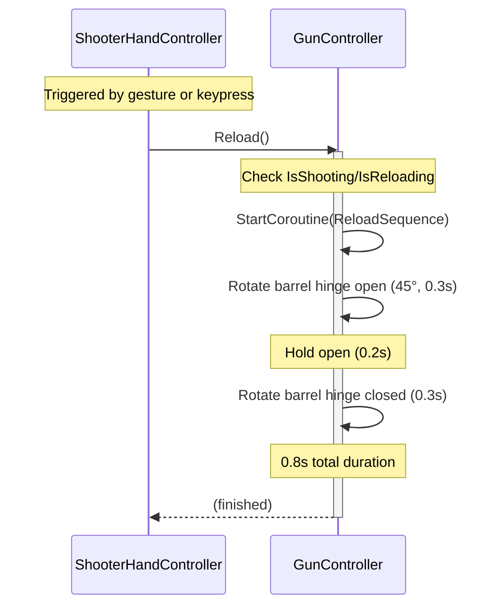
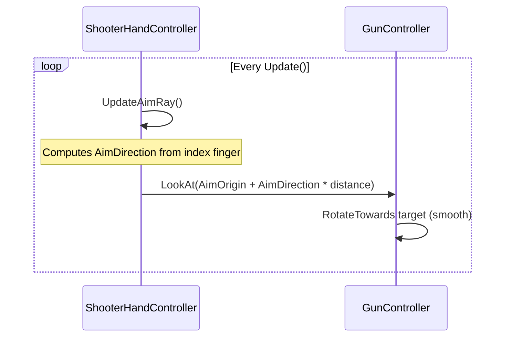

# Gun Prefab — Implementation Plan

> **Objective:** Create a self-contained Gun Prefab with procedural animations (shooting, reloading, aiming) that works independently from MediaPipe.  
> **Context:** [`ShooterHandController.cs`](Assets/Scripts/Minigames/Shooter/ShooterHandController.cs) currently handles aim/fire logic but has no visual gun representation. An [`Gun.fbx`](Assets/Models/Shooter/Gun.fbx) model and basic [`Gun.prefab`](Assets/Prefabs/Shooter/Gun/Gun.prefab) already exist.  
> **Namespace:** `ARcadeRush.Minigames.Shooter`

---

## Overview

```
ShooterHandController          (input: hand tracking → calls GunController API)
       │
       ▼
GunController                  (self-contained visual controller, MediaPipe-free)
       │
       ├── Shoot()             → cylinder rotation + cockpit kick + recoil
       ├── Reload()            → barrel hinge open/close
       └── LookAt(target)      → rotates whole gun toward target
```

The [`GunController`](Assets/Scripts/Minigames/Shooter/GunController.cs) is a pure visual component. It does NOT reference MediaPipe, `Hand3DProjector`, or `GestureDetector`. It exposes a clean public API that the [`ShooterHandController`](Assets/Scripts/Minigames/Shooter/ShooterHandController.cs) (or any other system) can call.

---

## Architecture

### State Machine

```
     ┌─────────────────────────────────────┐
     │              IDLE                    │
     └──┬──────────────────┬───────────────┘
        │                  │
     Shoot()           Reload()
        │                  │
        ▼                  ▼
   ┌────────┐        ┌──────────┐
   │SHOOTING│        │RELOADING │
   │(0.15s) │        │(0.8s)    │
   └───┬────┘        └────┬─────┘
        │                  │
        ▼                  ▼
     back to IDLE      back to IDLE
```

- `IsShooting` and `IsReloading` flags prevent overlapping animations.
- `Shoot()` is ignored if `IsReloading`. `Reload()` is ignored if `IsShooting`.

### Model Hierarchy (Confirmed)

The [`Gun.fbx`](Assets/Models/Shooter/Gun.fbx) has the following child transforms:

```
Gun (root)                    ← _recoilRoot: kicks back on shoot
 ├── Gun Barrel               ← _barrelHinge: tilts open on reload
 ├── GunCock                  ← _cockpit: moves back on shoot
 ├── GunHandler               ← Static (grip — not animated)
 └── GunPipe                  ← _cylinder: rotates around forward axis on shoot
```

**Mapping rationale (revolver anatomy):**
| FBX Bone | GunController Field | Reason |
|----------|-------------------|--------|
| `Gun Barrel` | `_barrelHinge` | In a break-action revolver, the barrel assembly hinges open for reloading |
| `GunCock` | `_cockpit` | The hammer/cock moves back when the gun fires |
| `GunPipe` | `_cylinder` | "Pipe" likely refers to the cylinder (bullet chambers) that rotates between shots |
| `Gun Handler` | — | The grip/handle — static, no animation needed |
| `Gun` (root) | `_recoilRoot` | Whole transform for recoil + LookAt rotation |

Each is assigned via `[SerializeField] Transform` in the Inspector.

### Animation Design

All animations are **procedural** via Coroutines (no Animator Controller needed).

| Action | Part | Transform Property | Duration | Easing |
|--------|------|-------------------|----------|--------|
| **Shoot** | Cylinder | Rotate around local forward by `_cylinderRotationAngle` (60°) | 0.08s | Instant snap → hold |
| **Shoot** | Cockpit | Translate local -Z by `_cockpitTravel` (0.05m) then return | 0.15s | Quick out, slow return |
| **Shoot** | Recoil Root | Translate local -Z by `_recoilDistance` (0.03m) then return | 0.12s | Sharp out, eased back |
| **Reload** | Barrel Hinge | Rotate around local axis by `_barrelOpenAngle` (45°), hold, return | 0.8s total | Eased open/close |

### Public API

```csharp
/// <summary>Fire one shot — rotates cylinder, kicks cockpit, applies recoil.</summary>
public void Shoot();

/// <summary>Open and close the barrel for reloading.</summary>
public void Reload();

/// <summary>Rotate the entire gun to look toward a world-space position.</summary>
public void LookAt(Vector3 target);

/// <summary>True while a shoot animation is playing.</summary>
bool IsShooting { get; }

/// <summary>True while a reload animation is playing.</summary>
bool IsReloading { get; }
```

---

## Debug Input Mode (Standalone Testing)

When `_useDebugInput` is `true` and `_debugInputEnabled` is active, the [`GunController`](Assets/Scripts/Minigames/Shooter/GunController.cs) handles its own input for testing independently from MediaPipe:

| Input | Action | Description |
|-------|--------|-------------|
| **Left Mouse Click** | `Shoot()` | Fires the gun at the current aim target |
| **`P` key toggle** | Toggle `_debugInputEnabled` | Enables/disables mouse-based aiming |
| **Mouse position** | `LookAt(hitPoint)` | Raycasts from camera through mouse cursor to get a world target |

**Mouse aiming logic** (in `Update()` when `_useDebugInput && _debugInputEnabled`):
```csharp
Ray ray = _debugInputCamera.ScreenPointToRay(Input.mousePosition);
if (Physics.Raycast(ray, out RaycastHit hit, 100f))
{
    LookAt(hit.point);
}
else
{
    LookAt(ray.origin + ray.direction * 50f);
}
```

**`P` key toggling:**
```csharp
if (Input.GetKeyDown(KeyCode.P))
{
    _debugInputEnabled = !_debugInputEnabled;
    Debug.Log($"[GunController] Debug input mode: {_debugInputEnabled}");
}
```

When `_debugInputEnabled` is `false` (default mode after `P` toggle), the gun still accepts programmatic calls to `Shoot()` and `LookAt()` from external controllers like [`ShooterHandController`](Assets/Scripts/Minigames/Shooter/ShooterHandController.cs). This allows seamless switching between debug input and MediaPipe hand tracking without restarting.

> **Note:** Set `_useDebugInput` to `false` in the final prefab used in production. Debug input is purely for isolated testing.

**Edge Cases:**
- If `_debugInputCamera` is null, falls back to `Camera.main`
- Left-click is ignored if `IsReloading` or `IsShooting` (same gate as `Shoot()`)
- `P` key toggle is only active when `_useDebugInput` is true

---

## Implementation Steps

### Step 1: Create [`GunController.cs`](Assets/Scripts/Minigames/Shooter/GunController.cs)

**File:** `Assets/Scripts/Minigames/Shooter/GunController.cs`  
**Namespace:** `ARcadeRush.Minigames.Shooter`

**Serialized Fields:**

| Field | Type | Default | Purpose |
|-------|------|---------|---------|
| `_cylinder` | `Transform` | — | Revolver cylinder, rotates on shoot |
| `_barrelHinge` | `Transform` | — | Barrel assembly, tilts open on reload |
| `_cockpit` | `Transform` | — | Hammer/cockpit, moves back on shoot |
| `_recoilRoot` | `Transform` | — | Root transform for whole-gun recoil |
| `_cylinderRotationAngle` | `float` | 60° | Degrees to rotate cylinder per shot |
| `_cockpitTravel` | `float` | 0.05 | Distance cockpit moves back (meters) |
| `_recoilDistance` | `float` | 0.03 | Distance gun kicks back (meters) |
| `_barrelOpenAngle` | `float` | 45° | Degrees barrel hinges open for reload |
| `_muzzleFlash` | `GameObject` | null | Optional muzzle flash to spawn/activate |
| `_muzzleFlashDuration` | `float` | 0.05s | How long muzzle flash stays visible |
| `_useDebugInput` | `bool` | true | Enable mouse/keyboard controls for standalone testing |
| `_debugInputCamera` | `Camera` | null | Camera used for mouse raycasting (falls back to Camera.main) |

**Coroutines:**
- `ShootSequence()` — runs cylinder rotation, cockpit kick, recoil, optional muzzle flash
- `ReloadSequence()` — opens barrel hinge, waits, closes it

**State Flags:**
- `public bool IsShooting { get; private set; }`
- `public bool IsReloading { get; private set; }`

**LookAt behavior:**
- Uses [`Quaternion.RotateTowards`](https://docs.unity3d.com/ScriptReference/Quaternion.RotateTowards.html) with a configurable `_rotationSpeed` for smooth tracking
- If `_recoilRoot` is assigned, rotates that. Otherwise rotates `transform`.

**Pseudo-implementation:**

```csharp
public void Shoot()
{
    if (IsShooting || IsReloading) return;
    StartCoroutine(ShootSequence());
}

public void Reload()
{
    if (IsShooting || IsReloading) return;
    StartCoroutine(ReloadSequence());
}

public void LookAt(Vector3 target)
{
    Transform root = _recoilRoot != null ? _recoilRoot : transform;
    Vector3 direction = (target - root.position).normalized;
    Quaternion targetRot = Quaternion.LookRotation(direction);
    root.rotation = Quaternion.RotateTowards(root.rotation, targetRot, _rotationSpeed * Time.deltaTime);
}
```

**Edge Cases:**
- If `_cylinder` is null → skip cylinder animation, log warning
- If `_barrelHinge` is null → skip barrel animation, log warning
- If `Shoot()` is called while `IsReloading` → silently ignore (gun can't fire mid-reload)
- If `Reload()` is called while `IsShooting` → silently ignore
- `LookAt()` with zero/up vector → no rotation change (safe clamp)

---

### Step 2: Update [`Gun.prefab`](Assets/Prefabs/Shooter/Gun/Gun.prefab)

1. Open the existing [`Gun.prefab`](Assets/Prefabs/Shooter/Gun/Gun.prefab) in Unity Prefab Mode
2. Add `GunController` component to the root `Gun` GameObject
3. Inspect the FBX model hierarchy to identify the bone transforms:
   - Find the cylinder bone → assign to `_cylinder`
   - Find the barrel hinge bone → assign to `_barrelHinge`
   - Find the cockpit/hammer bone → assign to `_cockpit`
   - The root is already `Gun` → assign to `_recoilRoot` (or use a separate child pivot)
4. Tune animation parameters in the Inspector
5. Save the prefab

**Note:** The FBX model's internal transform hierarchy is unknown from code alone. The implementer must use the Unity Editor to:
- Expand the model in the Hierarchy view to see bone names
- Assign the correct Transforms to the `GunController` fields
- If no separate bones exist for cylinder/cockpit/hinge, the implementer may need to create empty child GameObjects as animation pivots

---

### Step 3: Integrate with [`ShooterHandController.cs`](Assets/Scripts/Minigames/Shooter/ShooterHandController.cs)

Add a `[SerializeField] private GunController _gunController` reference.

**Changes to existing methods:**

| Method | Current Behavior | New Behavior |
|--------|-----------------|--------------|
| `Fire()` | Instantiates bullet / hitscan | Also calls `_gunController.Shoot()` before spawning bullet |
| `UpdateAimRay()` | Computes aim direction | Also calls `_gunController.LookAt(aimTarget)` if a target exists |
| New: Reload trigger | — | Call `_gunController.Reload()` on a new gesture or keypress |

**Reload trigger** — The user mentioned reloading as an animation. A reload could be triggered:
- Automatically when the gun is empty (after N shots)
- Manually via a gesture (e.g., open hand held up)
- Via a keypress during development

For now, add a public `Reload()` method to `ShooterHandController` that delegates to `_gunController.Reload()`, and optionally wire it to a keyboard key (e.g., `R`) for testing.

---

## Files to Create/Modify

| Action | File | Description |
|--------|------|-------------|
| **Create** | [`Assets/Scripts/Minigames/Shooter/GunController.cs`](Assets/Scripts/Minigames/Shooter/GunController.cs) | Main gun controller with procedural animations |
| **Modify** | [`Assets/Prefabs/Shooter/Gun/Gun.prefab`](Assets/Prefabs/Shooter/Gun/Gun.prefab) | Add `GunController` component, assign transforms |
| **Modify** | [`Assets/Scripts/Minigames/Shooter/ShooterHandController.cs`](Assets/Scripts/Minigames/Shooter/ShooterHandController.cs) | Add `_gunController` reference, call API on fire/aim |

---

## Sequence Diagrams

### Shooting Flow



### Reloading Flow



### Aiming Flow



---

## Configuration Parameters Summary

All values are exposed in the Inspector for easy tuning:

| Parameter | Default | Range | Animation |
|-----------|---------|-------|-----------|
| `_cylinderRotationAngle` | 60° | 30–120 | Shoot |
| `_cylinderRotationDuration` | 0.05s | 0.02–0.15 | Shoot |
| `_cockpitTravel` | 0.05 | 0.02–0.15 | Shoot |
| `_cockpitReturnDuration` | 0.10s | 0.05–0.30 | Shoot |
| `_recoilDistance` | 0.03 | 0.01–0.10 | Shoot |
| `_recoilDuration` | 0.12s | 0.05–0.25 | Shoot |
| `_barrelOpenAngle` | 45° | 20–90 | Reload |
| `_barrelOpenDuration` | 0.30s | 0.15–0.50 | Reload |
| `_barrelHoldDuration` | 0.20s | 0.10–0.50 | Reload |
| `_barrelCloseDuration` | 0.30s | 0.15–0.50 | Reload |
| `_rotationSpeed` | 360°/s | 90–720 | LookAt |
| `_muzzleFlashDuration` | 0.05s | 0.02–0.20 | Shoot |

---

## Open Questions / Notes for Implementer

1. **FBX hierarchy unknown** — The implementer must inspect [`Gun.fbx`](Assets/Models/Shooter/Gun.fbx) in Unity Editor to identify bone/transform names for cylinder, barrel hinge, and cockpit. If no separate bones exist, the implementer will need to create empty child transforms in the prefab as animation pivots and parent the relevant meshes under them.

2. **Muzzle flash** — Optional. The user didn't mention it, but it's a small addition that sells the shoot effect. Can be omitted if the model has no suitable position.

3. **Bullet spawning** — The actual bullet creation remains in [`ShooterHandController.Fire()`](Assets/Scripts/Minigames/Shooter/ShooterHandController.cs:131). The `GunController.Shoot()` only handles the visual/animation feedback. The bullet spawn position could be moved to the gun's muzzle transform once identified.

4. **Reload trigger** — Who calls `Reload()`? Options:
   - After N shots (e.g., 6 rounds for a revolver) → auto-reload
   - On a specific gesture → e.g., open hand
   - On keyboard press → `R` key for testing
   - Recommend: start with keyboard `R` + add a `public void Reload()` on `ShooterHandController` so any system can trigger it.
