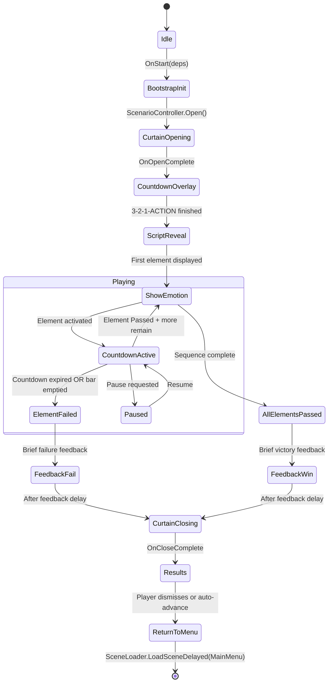

# Scene Director — Implementation Plan

> **Last Updated:** 2026-05-29
> **Unity Version:** 2022.3 LTS (URP)
> **Status:** Planning — Phase 0
> **Related Docs:** [`SceneDirector.md`](../docs/SceneDirector.md), [`developer-guide.md`](../docs/developer-guide.md), [`simon-dice-plan.md`](simon-dice-plan.md)

---

## 1. Overview & Objectives

### 1.1 Game Concept

The player stands in front of a camera on a virtual theater stage. A theatrical AR mask overlays their face, swapping between dramatic mask meshes (Happy, Surprised, Angry) based on detected emotion. An LLM-generated "script" dictates a sequence of 3–6 emotions the player must perform. A reactive virtual audience applauds correct performances and throws tomatoes at wrong ones. The game is hosted in [`Director.unity`](../Assets/Scenes/Director.unity) and orchestrated by [`SceneDirectorGame.cs`](../Assets/Scripts/Minigames/SceneDirector/SceneDirectorGame.cs).

### 1.2 Objectives

1. **Complete the existing partial implementation** — the 8 singleton controllers are scaffolded but testing-mode stubs (keyboard simulation, hardcoded sequences, hardcoded evaluation) must be replaced with live pipeline integration.
2. **Match Simon Dice quality bar** — robust state machine with guard flags, LLM-as-decorator pattern, `#if UNITY_EDITOR` debug hooks, pause handling, multi-panel UI flow, and results reporting to `GameManager`.
3. **Deliver a polished theatrical experience** — curtain animation, audience reactivity with multiple intensity levels, AR mask accuracy, audio/SFX design, and dramatic LLM commentary in Spanish.
4. **Integrate cleanly with the CubiWare architecture** — register in [`MiniGameRegistry`](../Assets/Scripts/Core/MiniGameRegistry.cs), accept [`MiniGameDependencies`](../Assets/Scripts/Core/IMiniGame.cs:3) via `IMiniGame.OnStart()`, report scores via `GameManager.AddScore()`.

---

## 2. Current State Assessment

### 2.1 What Exists (Working)

| File                                                                                             | Status          | Notes                                                                                                                                                                                                                  |
| ------------------------------------------------------------------------------------------------ | --------------- | ---------------------------------------------------------------------------------------------------------------------------------------------------------------------------------------------------------------------- |
| [`SceneDirectorGame.cs`](../Assets/Scripts/Minigames/SceneDirector/SceneDirectorGame.cs)         | ✅ Partial       | IMiniGame orchestrator, state machine skeleton, WireEvents/UnwireEvents, guarded `ResolveElement()`. Missing: ResultsPanel activation, gradual fill on bar, "Get Ready" cue, `_roundEnding` flag for OnDestroy safety. |
| [`ScenarioController.cs`](../Assets/Scripts/Minigames/SceneDirector/ScenarioController.cs)       | ✅ Complete      | Animator-driven curtain open/close with Animation Events. No changes needed for core functionality.                                                                                                                    |
| [`ScriptController.cs`](../Assets/Scripts/Minigames/SceneDirector/ScriptController.cs)            | ✅ Partial       | Emotion sequence driver with events. Currently uses hardcoded `_hardcodedSequence` — LLM generation hook is marked `// TODO`. Missing: async callback pattern for LLM, difficulty curve fields, `ScriptLLMParser`.     |
| [`CameraController.cs`](../Assets/Scripts/Minigames/SceneDirector/CameraController.cs)           | ⚠️ Testing Only  | Routes webcam feed + keyboard simulation (H/S/A/N). Must be refactored to accept real `EmotionClassifier` data.                                                                                                        |
| [`MaskController.cs`](../Assets/Scripts/Minigames/SceneDirector/MaskController.cs)               | ✅ Partial       | Positions 3D masks via `FaceLandmarkReader` data. Y-flip + ViewportToWorldPoint working. Missing: scale-bounce on swap, head rotation from `HeadPose`, RenderTexture validation warning.                               |
| [`ApprovalBarController.cs`](../Assets/Scripts/Minigames/SceneDirector/ApprovalBarController.cs) | ✅ Core Complete | Fill/drain mechanics, OnBarFilled/OnBarEmptied events, color interpolation. Missing: `_initialFillAmount` (default 0.15 head start), `_fillStartTime` tracking for SpeedBonus calculation. Note: `_warningThreshold` color logic is already correct in code.                              |
| [`AudienceController.cs`](../Assets/Scripts/Minigames/SceneDirector/AudienceController.cs)       | ⚠️ Partial       | 3-state Animator: Idle, SlightMove, React (positive/negative via IsPositive Bool). Animation Event auto-return. Missing: `ShowDialogue()` method, tomato splat particles, multiple intensity levels. Bug: `SlightMove()` logs every frame when called from `Update()` — needs early-return guard before log call. |
| [`CountdownController.cs`](../Assets/Scripts/Minigames/SceneDirector/CountdownController.cs)     | ✅ Complete      | Per-element timer with OnCountdownExpired, Start/Stop/Pause/Resume. OnTick event exposed but unused. Color warning below `_warningThreshold`.                                                                          |

### 2.2 What Does NOT Exist Yet

| Area                      | Gap                                                                                                                                                                                               |
| ------------------------- | ------------------------------------------------------------------------------------------------------------------------------------------------------------------------------------------------- |
| **Emotion Integration**   | `EmotionClassifier` is fully implemented but not wired to `SceneDirectorGame`. The keyboard simulation in `CameraController.Update()` must be replaced with live `OnEmotionChanged` subscription. |
| **LLM Script Generation** | `ScriptController.StartSequence()` has `// TODO` for LLM. No `ScriptLLMParser` exists. `EndRound()` uses hardcoded evaluation strings.                                                            |
| **LLM Audience Dialogue** | No mid-round audience lines. `AudienceController.ShowDialogue(string, float)` not yet implemented.                                                                                                |
| **Results Panel**         | UI panel described in docs but not created in Director.unity. No activation/fade-in logic in `EndRound()`.                                                                                        |
| **Score Display**         | No live score label in the Script panel. `_deps.GameManager.AddScore()` is called but never displayed to the player during gameplay.                                                              |
| **CountdownOverlay**      | No "3, 2, 1, ¡ACCIÓN!" pre-game countdown. Simon Dice has this.                                                                                                                                   |
| **Pause Panel**           | No pause functionality. Simon Dice supports pausing during specific phases.                                                                                                                       |
| **Audio System**          | No audio exists. No `GameAudioController` integration. No AudioSource, no AudioClip assignments.                                                                                                  |
| **Build Registration**    | `Director.unity` not in `EditorBuildSettings.asset`. Not registered in `MiniGameRegistry._scenePaths` or static constructor.                                                                      |
| **MainMenu Button**       | No button in MainMenu to launch Scene Director.                                                                                                                                                   |
| **Tomato Particles**      | No particle system for tomato splats on screen.                                                                                                                                                   |
| **Gesture Bonuses**       | No gesture integration (thumbs down = instant fill, etc.) — documented as future in SceneDirector.md.                                                                                             |

### 2.3 Comparison: SceneDirector vs Simon Dice

| Feature                   | Simon Dice                                                                                          | SceneDirector (Current)                         | Gap                                                             |
| ------------------------- | --------------------------------------------------------------------------------------------------- | ----------------------------------------------- | --------------------------------------------------------------- |
| State machine guard flags | `_roundAlreadyJudged`, `GamePhase.Generating`                                                       | `_elementResolved` only                         | Needs `_roundEnding`, `_betweenElements`, `_resultsShowing`     |
| LLM pattern               | Decorator — game logic pre-determined, LLM generates flavor text. Fallback to templates on error.   | Not wired                                       | Adopt same decorator pattern                                    |
| Editor debug              | `#if UNITY_EDITOR` ContextMenu debug starters                                                       | Not present                                     | Add ContextMenu starters for each game phase                    |
| Pause handling            | Valid only during Playing phase                                                                     | Not implemented                                 | Add pause support                                               |
| UI panels                 | StartMenuPanel, CountdownPanel, GameplayHUD, FeedbackPanel, PausePanel, VictoryPanel, GameOverPanel | Only GameplayHUD + ResultsPanel stub            | Add CountdownOverlay, FeedbackOverlay, PausePanel               |
| Results                   | Stores to GameManager, shows detailed stats                                                         | Only calls `GameManager.AddScore()` per element | Populate ResultsPanel, call `GameManager.CollectMinigameData()` |

---

## 3. Game Flow & State Machine

### 3.1 Complete State Machine



### 3.2 State Enum & Guard Flags

Add to [`SceneDirectorGame.cs`](../Assets/Scripts/Minigames/SceneDirector/SceneDirectorGame.cs):

```csharp
private enum GamePhase { Idle, Bootstrapping, CurtainOpening, CountdownOverlay,
                          ScriptReveal, Playing, BetweenElements, ElementFeedback,
                          CurtainClosing, Results, Returning }
private GamePhase _phase = GamePhase.Idle;

// Guard flags
private bool _roundEnding;     // true once EndRound() starts — blocks double-fire
private bool _resultsShowing;  // true while ResultsPanel is displayed
private bool _paused;
private int  _elementsPassed;  // cumulative count — populated in ResolveElement(true), used in MinigameSessionData
```

**Phase Transition Rules & Critical Ordering:**

- **`GamePhase.BetweenElements`** — set at the **very top** of `ActivateElementWithDelay`, **before** the `yield return WaitForSeconds(...)`. This lets pause/end-round checks know the game is between elements during the wait.
- **`_elementResolved = false`** — reset also at the **very top** of `ActivateElementWithDelay` (before the yield, not after). Resetting after the yield leaves a window where stale bar/countdown events from the previous element can fire `ResolveElement()` during the delay.
- **`_roundEnding`** — set to `true` at the **very first line** of `EndRound()`. `EndRound()` must then call `StopAllCoroutines()` to cancel any `ActivateElementWithDelay` coroutine still waiting on its yield. Without this, both coroutines run concurrently, the bar/countdown re-activate mid-EndRound.
- **First element skip** — `ActivateElementWithDelay` must check `ScriptController.Instance.CurrentIndex == 0` and skip the `_betweenElementDelay` wait for the first element. There is no previous reaction to wait for; skipping removes 1.5s of silent dead time at game start.
- **`_resultsShowing`** prevents curtain-close from being triggered twice.
- All public methods (Pause, Resume) validate `_phase` before acting.

**Correct `ActivateElementWithDelay` structure:**

```csharp
private IEnumerator ActivateElementWithDelay(ScriptElement element)
{
    // Reset guard and phase FIRST — before any yield — prevents stale events
    _elementResolved = false;
    _phase = GamePhase.BetweenElements;

    // Skip delay for the first element (no previous audience reaction to wait for)
    if (ScriptController.Instance.CurrentIndex > 0)
        yield return new WaitForSeconds(_betweenElementDelay);

    // If EndRound started during the delay, abort
    if (_roundEnding) yield break;

    _phase = GamePhase.Playing;
    AudienceController.Instance?.SetIdle();
    CountdownController.Instance.StartCountdown(element.TimeLimit);
    ApprovalBarController.Instance.Activate(element.RequiredEmotion);
}
```

**Correct `EndRound()` structure (prevent coroutine race):**

```csharp
private IEnumerator EndRound(bool won)
{
    if (_roundEnding) yield break;  // guard against double-fire
    _roundEnding = true;
    _phase = GamePhase.ElementFeedback;

    // Cancel ActivateElementWithDelay if it's still waiting in its yield
    // Note: StopAllCoroutines kills this coroutine too, so immediately re-launch body
    StopAllCoroutines();
    StartCoroutine(EndRoundBody(won));
}

private IEnumerator EndRoundBody(bool won)
{
    _playing = false;   // stop Update() audience polling only NOW (after coroutine cancel)
    // ... evaluation, delay, curtain close ...
}
```

> **Win timing note:** `OnSequenceComplete` fires synchronously inside `PassCurrentElement()`. The audience React animation takes up to 2.5s (big applause). Set `_endRoundDelay` to **at least 3.0s** on win to avoid the curtain clipping the audience animation. Alternatively, listen for `AudienceController.OnReactComplete_AnimEvent` before closing.

**Correct `OnDestroy` safety:**

```csharp
private void OnDestroy()
{
    StopAllCoroutines(); // prevent MissingReferenceException from delayed coroutines
    UnwireEvents();
    // Release GameManager if scene was force-unloaded mid-round
    if (_playing || _roundEnding)
        _deps?.GameManager?.EndGame();
}
```

### 3.3 Simon Dice Reference State Pattern

From [`SimonGame.cs`](../Assets/Scripts/Minigames/Simon/SimonGame.cs) patterns to adopt:
- `GamePhase` enum with explicit transitions
- `_roundAlreadyJudged` → `_roundEnding` + `_elementResolved` (SceneDirector equivalent)
- `StartRound()` guarded by `_phase == GamePhase.Idle || _phase == GamePhase.BetweenRounds`
- Editor ContextMenu for each phase entry point
- `StopAllCoroutines()` on transitions that cancel in-flight async work

---

## 4. Curtain Animation Design

### 4.1 Curtain Art Style

**Recommendation: Dual red velvet curtains (LeftCurtain + RightCurtain) that slide apart horizontally.**

Rationale:
- Classic theater aesthetic, instantly readable as "stage curtain"
- Horizontal slide is simpler to animate than a rising curtain (no masking complex shapes)
- Two separate GameObjects allow each curtain to animate independently
- Red velvet texture with gold trim matches the theatrical "Director de Escena" theme

**Alternative considered:** Single rising curtain. Rejected because: (a) rising curtain reveals from bottom, which looks unnatural when the camera feed (face) is typically centered; (b) horizontal split reveals from center outward, putting focus on the player's face immediately.

### 4.2 Curtain GameObject Structure

```
Scenario (Canvas child)
├── CurtainLeft  (RectTransform anchored left, Image with red curtain sprite)
│   └── Sliding animation: anchoredPosition.x from 0 → -screenWidth/2
├── CurtainRight (RectTransform anchored right, Image with red curtain sprite)
│   └── Sliding animation: anchoredPosition.x from 0 → +screenWidth/2
└── CurtainTop (optional — decorative valence/fringe, static or slight scale)
```

### 4.3 Animator Setup

The existing [`ScenarioController`](../Assets/Scripts/Minigames/SceneDirector/ScenarioController.cs) uses two triggers (`Open`, `Close`) on a single Animator. This design remains valid with two curtains — the Animator controls both curtain RectTransforms simultaneously.

**Animator States:**
- `Closed` — both curtains at center (covered). Default state.
- `Opening` — animation clip: Left slides left, Right slides right. Duration: ~1.0–1.2 seconds.
- `Open` — curtains fully retracted. Loop or hold.
- `Closing` — animation clip: Left slides right, Right slides left. Duration: ~1.0–1.2 seconds.

**Animation Events (already implemented):**
- `OnOpenComplete_AnimEvent()` — last frame of `Opening` clip
- `OnCloseComplete_AnimEvent()` — last frame of `Closing` clip

### 4.4 Curtain as Stage Mask

The CurtainLeft/CurtainRight Images sit at the highest sort order in the Canvas (last children in hierarchy), so they render on top of everything — the camera feed, the AR mask, the HUD, and the audience. This naturally masks the stage area when closed.

**Key constraint:** The `Scenario` GameObject must be the **last child** of the Canvas (renders on top). Currently the Canvas child order is:
```
CameraDisplay → Scenario → Audience → ApprovalBar → Countdown → Script → ResultsPanel → CameraElement
```

**Fix:** Move `Scenario` to be the last sibling in the Canvas hierarchy (after `CameraElement`) so the curtain always renders on top of everything.

### 4.5 Curtain Sprite Asset

Need: A high-resolution red curtain sprite (or two — left half + right half) at 1920×1080. Options:
1. **Single full-screen sprite** stretched across both CurtainLeft and CurtainRight (use Image fill origin or UV offset to show correct half)
2. **Two separate sprites** — left curtain half and right curtain half, each on their own Image
3. **9-slice sprite** if curtain has ornate borders that mustn't stretch

**Recommendation:** Option 2 (separate halves) — simplest to set up, no shader tricks needed.

### 4.6 Multiple Curtain Stages (Optional Enhancement)

For extra drama, the curtain could close partially between elements ("mini close" at 30% → reopen) to give a sense of scene changes. This is a **Phase 2 polish item** — not required for MVP.

---

## 5. AR Mask System (No Vuforia)

### 5.1 Current Pipeline

```
WebCamTexture → CameraFeedCtrl (Bootstrap singleton)
                   │
                   ├── CameraDisplay RawImage (direct texture — shows webcam in canvas)
                   │
                   └── FaceLandmarkReader (nose-tip + face scale from MediaPipe landmarks)
                          │
                          └── MaskController.UpdatePosition()
                                 │
                                 ├── NoseTip (Landmark 4) → viewport (Y flip) → ViewportToWorldPoint
                                 ├── FaceScale × _scaleMultiplier → localScale
                                 └── SwapMesh(EmotionLabel) → activate correct mask child
                                        │
Stage Camera (Layer=StageLayer, Target Texture=StageRT)
   │
   └── Renders MaskRoot + children (only StageLayer objects)
          │
          └── StageRT (RenderTexture 640×480) → CameraDisplay RawImage.Texture
```

**The composite effect:** The RawImage shows StageRT (which contains the 3D mask rendered over a transparent/cleared background). The webcam feed is shown through the same RawImage.

### 5.2 RenderTexture Compositing Design Decision

**Current approach (needs verification):** The CameraDisplay RawImage likely needs to show BOTH the webcam feed AND the mask. This requires compositing. Two options:

**Option A: Background quad in Stage Layer**
- Place a large quad in the Stage Layer behind MaskRoot, textured with the webcam feed
- Stage Camera renders both the webcam quad + mask into StageRT
- CameraDisplay RawImage shows StageRT (composited)
- **Pros:** Single RawImage, clean pipeline
- **Cons:** Webcam texture must be routed to the quad material; quad must fill the Stage Camera's view

**Option B: Two overlapping RawImages**
- Lower RawImage: shows webcam feed directly (from CameraFeedCtrl)
- Upper RawImage: shows StageRT (mask only, rendered on transparent background)
- **Pros:** Simpler compositing — Unity's alpha blending does the work
- **Cons:** Must ensure both RawImages stay perfectly aligned

**Recommendation: Option A** — cleaner, single RawImage, aligns with the existing `_cameraDisplay` setup. The background quad is a simple Plane or Quad primitive assigned to StageLayer, with a material that samples the WebCamTexture.

### 5.3 Mask Positioning Improvements

Current [`MaskController.UpdatePosition()`](../Assets/Scripts/Minigames/SceneDirector/MaskController.cs:87) is solid but can be enhanced:

1. **Head rotation** — Add yaw/pitch/roll from `FaceLandmarkReader.HeadPose` when available. The TODO at line 103-106 is the hook.
2. **Depth adaptation** — Scale `_maskDepth` based on `FaceScale` so the mask doesn't clip through the background quad when the player is close.
3. **Smoothing** — Apply a lightweight position EMA to reduce jitter from landmark noise. A `_positionSmooth = 0.3f` (Inspector-tunable) would stabilize the mask without noticeable lag.

```csharp
// Smoothing addition in UpdatePosition():
private Vector3 _smoothPosition;
_smoothPosition = Vector3.Lerp(_smoothPosition, targetPosition, _positionSmooth * Time.deltaTime * 30f);
_maskRoot.position = _smoothPosition;
```

### 5.4 Mask Art Style

**Theatrical drama masks** — the classic comedy/tragedy theater masks:
- **Happy Mask:** Smiling comedy mask — wide grin, rosy cheeks, bright gold/white
- **Surprised Mask:** Wide-eyed drama mask — O-shaped mouth, raised eyebrows, silver/white
- **Angry Mask:** Frowning tragedy mask — furrowed brows, downturned mouth, dark red/crimson
- **Neutral:** No mask (or a subtle blank white mask with neutral expression)

**3D Mesh Requirements:**
- Each mask ≈ 500–2000 triangles (simple enough for mobile, detailed enough to read)
- Textured with painted-on theatrical details (rouge, eye shadow, lip color)
- Pivot of the mesh aligned to the nose-tip (origin/pivot of the mesh represents the contact point with the nose-tip) for perfect alignment when positioned at the nose-tip landmark
- Uniform scale so all masks are similarly sized

**Fallback:** If 3D models aren't ready, use 2D sprite masks in Screen Space (identical pipeline but with Image components instead of MeshRenderers). This requires Stage Camera to render UI/. The current 3D approach is preferred for depth realism.

### 5.5 Mask Transition (Scale-Bounce)

When the mask swaps between emotions, a brief scale-bounce coroutine adds polish:

```csharp
// In MaskController, called from SwapMesh():
public void SwapWithBounce(int newIndex)
{
    GameObject newMask = _maskObjects[newIndex];
    if (newMask == null) return;
    
    // Deactivate old, activate new at 0.1 scale
    // Coroutine: lerp newMask scale 0.1→1.0 over 0.15s with overshoot
    StartCoroutine(BounceIn(newMask.transform));
}
```

This is a **Phase 2 polish item** — only visible after real 3D models exist.

### 5.6 Stage Camera Validation

Add validation warning in [`MaskController.Awake()`](../Assets/Scripts/Minigames/SceneDirector/MaskController.cs:53):

```csharp
if (_stageCamera != null && _stageCamera.targetTexture == null)
    ServiceLogger.Instance.LogWarning(LogServiceName, 
        "Stage Camera has no Target Texture assigned. Masks will not be visible.");
```

### 5.7 StageLayer Setup

**Must be done in Unity Editor:**
1. Edit → Project Settings → Tags and Layers → User Layer 8 → name it `StageLayer`
2. Select `MaskRoot` and all mask children → set Layer to `StageLayer`
3. Stage Camera: Culling Mask = **only** `StageLayer`
4. Main Camera: Culling Mask = **Everything except** `StageLayer`

---

## 6. Emotion Detection Integration

### 6.1 Remove Keyboard Simulation

The current testing code in [`CameraController.Update()`](../Assets/Scripts/Minigames/SceneDirector/CameraController.cs:48-61) must be replaced. Strategy:

1. Keep the H/S/A/N simulation but **only under `#if UNITY_EDITOR`** and only when a `[SerializeField] private bool _editorSimulation = false` is checked. This preserves the ability to test without a camera.
2. In editor simulation mode, key inputs (H/S/A/N) update a `SimulatedEmotion` property on `CameraController`.
3. The primary path is live `EmotionClassifier` subscription.

### 6.2 Wiring EmotionClassifier to SceneDirectorGame

The hook already exists in [`SceneDirectorGame.WireEvents()`](../Assets/Scripts/Minigames/SceneDirector/SceneDirectorGame.cs:113-116):

```csharp
// Uncomment and enhance:
var classifier = FindFirstObjectByType<EmotionClassifier>();
if (classifier != null)
{
    classifier.OnEmotionChanged += OnEmotionChanged_Confirmed;
    // Also set classifier enabled
    classifier.SetEnabled(true);
}
```

**Two data paths needed:**

| Path                  | Source                               | Rate                                | Consumer                                     | Purpose                                          |
| --------------------- | ------------------------------------ | ----------------------------------- | -------------------------------------------- | ------------------------------------------------ |
| **Confirmed emotion** | `EmotionClassifier.OnEmotionChanged` | On change (after hold + hysteresis) | `CameraController.SetMaskEmotion()`          | Swap AR mask (stable, no flicker)                |
| **Raw top emotion**   | `EmotionClassifier` continuous       | Every frame                         | `ApprovalBarController.SetDetectedEmotion()` | Drive fill/drain bar (responsive, no hold delay) |

The `EmotionClassifier` already has `CurrentEmotion` property (the confirmed one). We need to add a **raw frame-by-frame best emotion** property for the approval bar:

```csharp
// Add to EmotionClassifier.cs:
/// <summary>
/// The winning emotion THIS FRAME, before temporal hold and hysteresis.
/// Used for continuous UI feedback (approval bar) while OnEmotionChanged
/// drives discrete state changes (mask swap).
/// </summary>
public EmotionLabel RawTopEmotion { get; private set; } = EmotionLabel.Neutral;
```

Update `EmotionClassifier.Update()` to set `RawTopEmotion` each frame (using raw scores before hold logic).

To avoid conflict between testing mode and live mode, and ensure `SetDetectedEmotion` is driven from a single place, consolidate inside `SceneDirectorGame.Update()`:

```csharp
private void Update()
{
    if (!_playing || _paused) return;
    
    EmotionLabel activeEmotion = EmotionLabel.Neutral;
    
    if (_editorSimulation)
    {
        // Query simulated emotion from CameraController
        activeEmotion = CameraController.Instance != null ? CameraController.Instance.SimulatedEmotion : EmotionLabel.Neutral;
        
        // In editor simulation, immediately set the mask emotion when it changes
        if (CameraController.Instance != null && activeEmotion != _lastSimulatedEmotion)
        {
            _lastSimulatedEmotion = activeEmotion;
            CameraController.Instance.SetMaskEmotion(activeEmotion);
        }
    }
    else if (_classifier != null)
    {
        // Query live frame-by-frame raw emotion
        activeEmotion = _classifier.RawTopEmotion;
    }
    
    // Single point of entry for approval bar polling
    ApprovalBarController.Instance?.SetDetectedEmotion(activeEmotion);
    
    // Audience subtle reaction
    if (ApprovalBarController.Instance != null && ApprovalBarController.Instance.IsActive)
    {
        if (ApprovalBarController.Instance.IsCorrect)
        {
            AudienceController.Instance?.SlightMove();
        }
        else if (AudienceController.Instance?.CurrentState == AudienceController.AudienceState.SlightMove)
        {
            AudienceController.Instance?.SetIdle();
        }
    }
}
```

### 6.3 Confidence Thresholds & Game Feel

The `EmotionClassifier` already has sophisticated smoothing (EMA), temporal hold (0.15s), hysteresis, and head-pose gating — all Inspector-tunable. For the Scene Director game specifically:

| Parameter            | Recommended Value   | Rationale                                                                                 |
| -------------------- | ------------------- | ----------------------------------------------------------------------------------------- |
| `_holdSeconds`       | 0.10s (not 0.15s)   | Player needs responsive mask swaps — 150ms feels sluggish for a game                      |
| `_minHeadConfidence` | 0.45 (not 0.50)     | Slightly more tolerant — the player will be looking at the screen, not directly at camera |
| `_hysteresis`        | 0.05 (keep default) | Prevents rapid flickering between emotions                                                |

These overrides should be applied at game start via `EmotionClassifier.SetEnabled(true)` — the classifier's existing Inspector values are the baseline, but SceneDirectorGame can tweak them via public setters.

### 6.4 Neutral Required State

Should the game require the player to return to Neutral between emotions? **Yes, with a short grace period.**

**Design:**
1. When an element starts (e.g., "Show HAPPY"), the player has the full countdown duration.
2. If the player is already showing Happy from the previous element, the bar immediately begins filling — no penalty.
3. When the bar fills and the element passes, there's a 1.5s `_betweenElementDelay`. During this delay, the next emotion is shown but the bar is not yet active. This gives the player time to transition their expression.
4. If the countdown starts and the player is still showing the previous emotion instead of the new required one, the bar drains — natural negative feedback.

**No explicit "neutral required" state is needed.** The between-element delay + bar drain on wrong emotion handles transitions naturally.

### 6.5 Emotion Transition Smoothness

The mask swap is already instantaneous in [`MaskController.SetEmotion()`](../Assets/Scripts/Minigames/SceneDirector/MaskController.cs:70). The `EmotionClassifier.OnEmotionChanged` fires only after temporal hold, so the mask swap is already debounced. No additional smoothing needed for the mask.

For the approval bar, the continuous `RawTopEmotion` polling means the bar responds frame-by-frame to raw scores — no hold delay, feels responsive. The bar's `_fillRate` (0.35/s) and `_drainRate` (0.20/s) naturally smooth the player experience.

---

## 7. LLM Script Generation

### 7.1 Architecture: LLM as Decorator

Following the Simon Dice pattern where LLM generates flavor text rather than core game logic:

```
Core Game Logic (Pre-determined)     LLM Flavor Layer (Decorator)
─────────────────────────────────    ─────────────────────────────
Emotion sequence structure            Theatrical script narrative
 (3-6 emotions, time limits)         (dramatic Spanish text)
                                     ↓
Scoring rules                        Performance evaluation
 (fill bar, countdown)               (witty Spanish commentary)
                                     ↓
Audience states                      Audience dialogue lines
 (Idle, SlightMove, React)           ("¡Bravo!", "¡Tomates!")
```

**Key principle:** The LLM NEVER determines win/lose. The game logic is deterministic. The LLM decorates it with entertaining text. If the LLM call fails, hardcoded fallback templates are used automatically.

### 7.2 LLM Prompt Design

**System Prompt (Spanish theater director persona):**
```
Eres un director de teatro dramático español. Hablas con pasión, usas 
metáforas teatrales, y te diriges al jugador como si fuera un actor en 
tu escenario. Tus respuestas son breves (máximo 2 oraciones), dramáticas, 
y siempre en español. Usas palabras como "¡Bravo!", "¡Magnífico!", 
"¡Desastroso!", "¡El público exige más!"
```

**Sequence Generation Prompt (on game start):**
```
Genera una secuencia de {3-6} emociones para una actuación teatral.
Formato JSON exacto (DEBE ser un único objeto raíz con "script" e "intro", no un array directo):
{"script":[{"e":1,"t":5},{"e":2,"t":5},{"e":3,"t":5}],"intro":"Tu texto introductorio dramático aquí"}
Donde e: 1=Happy 2=Surprised 3=Angry, t: segundos de límite.
```

**Evaluation Prompt (on round end):**
```
El jugador acaba de {ganar/perder} la actuación teatral.
Pasó {X} de {Y} emociones. Puntaje: {Z}.
Evalúa su actuación en UNA oración dramática en español, como un director 
de teatro hablándole a su actor. Sé witty y teatral.
```

**Audience Dialogue Prompt (mid-round, optional Phase 2):**
```
La audiencia está viendo a un actor intentar expresar la emoción {EMOCIÓN}.
Está {acertando/fallando}. Dale a la audiencia UNA línea corta en español 
(como un heckler o un fan). Máximo 8 palabras.
```

### 7.3 LLM Integration Points

| Integration Point          | Where                               | LLM Call                                           | Fallback                                      |
| -------------------------- | ----------------------------------- | -------------------------------------------------- | --------------------------------------------- |
| **Script generation**      | `SceneDirectorGame` coroutine       | Generate 3-6 emotion sequence with narrative intro | Hardcoded `_hardcodedSequence` from Inspector |
| **Performance evaluation** | `SceneDirectorGame.EndRound()`      | Generate witty Spanish commentary                  | Hardcoded strings already in code             |
| **Audience dialogue**      | `AudienceController.ShowDialogue()` | Generate contextual audience heckle/cheer          | Pre-defined templates in a `string[]` array   |

### 7.4 LLM Call Flow

```
SceneDirectorGame (via _deps.LLM)
    │
    ├── Try: _deps.LLM.Ask(systemPrompt, generationPrompt, onSuccess, onError)
    │       │
    │       └── onSuccess: Parse JSON via ScriptLLMParser
    │              │
    │              ├── Valid → ScriptController.Instance.LoadSequence(parsedElements)
    │              │           DisplayIntroText(parsed.intro)
    │              │
    │              └── Invalid JSON → onError handler
    │
    └── onError / Fallback: ScriptController.Instance.LoadSequence(hardcoded)
```

### 7.5 New File: ScriptLLMParser.cs

```csharp
// Assets/Scripts/Minigames/SceneDirector/ScriptLLMParser.cs
namespace ARcadeRush.Minigames.SceneDirector
{
    [Serializable]
    public struct ScriptLLMResponse
    {
        public ScriptLLMElement[] script;
        public string intro;
    }
    
    [Serializable]
    public struct ScriptLLMElement
    {
        public int e; // EmotionLabel int: 1=Happy, 2=Surprised, 3=Angry
        public int t; // time limit in seconds
    }
    
    public static class ScriptLLMParser
    {
        public static bool TryParse(string json, out List<ScriptElement> elements, out string intro)
        {
            // Validation:
            // - Reject bare JSON arrays (e.g. if json trimmed starts with '[') to fail gracefully on incorrect LLM format.
            // - JsonUtility parsing using ScriptLLMResponse wrapper:
            // - script array must have 3-6 elements
            // - e values must be 1-3
            // - t values must be 3-8
            // - intro must be non-null and not empty
            // On failure → elements = null, intro = null, return false and log clear warning.
        }
    }
}
```

### 7.6 LLM Configuration

- **Model:** `llama-3-8b-8192` (already configured in GroqLLMService)
- **Max tokens:** 120 (keep it tight — structured JSON + short intro)
- **Temperature:** 0.7 (creative but not chaotic)
- **Timeout:** 5 seconds (if response takes longer, use fallback)

### 7.7 Async Pattern & LLM Loading State

The sequence generation must support async LLM calls. Since `SceneDirectorGame` has access to `_deps.LLM`, the coroutine resides there instead of coupling `ScriptController` to the LLM service.

`SceneDirectorGame` starts the generation process concurrently with the curtain opening and `CountdownOverlay`:

```csharp
private IEnumerator GenerateSequenceAsync()
{
    _sequenceReady = false;
    
    // 1. Start LLM Ask call asynchronously
    string prompt = $"Genera una secuencia de {_sequenceLength} emociones...";
    _deps.LLM.Ask(systemPrompt, prompt, 
        onSuccess: json => {
            if (ScriptLLMParser.TryParse(json, out var elements, out var intro)) {
                ScriptController.Instance.LoadSequence(elements);
                DisplayIntroText(intro);
                _sequenceReady = true;
            } else {
                LoadFallbackSequence();
            }
        },
        onError: _ => LoadFallbackSequence()
    );
    
    // 2. Wait until the CurtainOpen animation AND CountdownOverlay are both finished
    yield return StartCoroutine(PlayCountdownOverlay());
    
    // 3. If LLM is still generating, show a loading state over the HUD
    if (!_sequenceReady)
    {
        SetLoadingUIActive(true); // "Cargando guion..."
        yield return new WaitUntil(() => _sequenceReady);
        SetLoadingUIActive(false);
    }
    
    // 4. Start gameplay
    _phase = GamePhase.Playing;
    ScriptController.Instance.StartFirstElement(); // Starts OnElementStarted flow
}

private void LoadFallbackSequence()
{
    ScriptController.Instance.LoadSequence(new List<ScriptElement>(_hardcodedSequence));
    _sequenceReady = true;
}
```

---

## 8. Audience Reactivity System

### 8.1 Current State System & Log Spam Prevention

The [`AudienceController`](../Assets/Scripts/Minigames/SceneDirector/AudienceController.cs) already supports three states via Animator:
- `Idle` — waiting
- `SlightMove` — excited (continuous while correct emotion held)
- `React` — big reaction (plays once, auto-returns to Idle)

**Animator Parameters:**
| Name         | Type    | Purpose                                 |
| ------------ | ------- | --------------------------------------- |
| `SlightMove` | Bool    | True while player holds correct emotion |
| `React`      | Trigger | Fires big reaction animation            |
| `IsPositive` | Bool    | True = applause, False = tomatoes       |

**State Change & Log Spam Prevention:**
- To prevent flooding the Unity console with thousands of `"Audience → SlightMove"` logs every frame, `AudienceController.SlightMove()` must check if the `SlightMove` animator parameter is already true:
  ```csharp
  public void SlightMove()
  {
      if (_animator != null && _animator.GetBool("SlightMove")) return; // Guard logic
      ServiceLogger.Instance.LogInfo(LogServiceName, "Audience → SlightMove");
      _animator?.SetBool("SlightMove", true);
  }
  ```
- **Audience Reset on Resolve:** Inside `ResolveElement()`, we must call `AudienceController.Instance?.SetIdle()` to clear `SlightMove` state, ensuring the audience returns to a neutral baseline before playing the discrete win/loss reaction or entering the between-elements delay.

### 8.2 Multiple Intensity Levels (Enhancement)

The current `IsPositive` Bool is a binary. For richer audience reactivity, add a **reaction intensity** float parameter:

| Condition                                            | `IsPositive` | Intensity | Visual                                                       |
| ---------------------------------------------------- | ------------ | --------- | ------------------------------------------------------------ |
| Element passed quickly (bar filled in < 50% of time) | true         | 1.0       | Standing ovation — animated sprites jump, confetti particles |
| Element passed normally                              | true         | 0.5       | Polite applause — clapping animation                         |
| Element passed barely (bar filled in > 80% of time)  | true         | 0.2       | Scattered claps — half-hearted                               |
| Element failed early (bar emptied in < 30% of time)  | false        | 1.0       | Rotten tomatoes deluge — many splats, booing                 |
| Element failed normally                              | false        | 0.5       | Boos + single tomato                                         |
| Countdown expired                                    | false        | 0.3       | Audience groans, confused murmurs                            |

**Implementation:** Add `_intensity` Float parameter to the Animator. `ReactPositive(float intensity)` and `ReactNegative(float intensity)` overloads set it before firing the React trigger. The Animator blends between clips based on intensity.

For MVP (Phase 1), the binary `IsPositive` approach is sufficient. Intensity is **Phase 2 polish**.

### 8.3 Tomato Splat System

**On negative reaction, spawn tomato particle bursts that splat on the screen (Canvas).**

New component: `TomatoSplatController.cs`

```csharp
public class TomatoSplatController : MonoBehaviour
{
    [SerializeField] private ParticleSystem _tomatoParticles;
    [SerializeField] private Image[] _splatDecals;  // Pre-placed hidden Images
    [SerializeField] private float _splatDuration = 2f;
    
    public void Splat(int count, float intensity)
    {
        // 1. Burst particles from off-screen top/bottom toward center
        // 2. Randomly show _splatDecals at screen positions
        // 3. Fade out splats over _splatDuration
    }
}
```

**Particle Setup:** Use Unity's built-in Particle System with a tomato splat sprite. Emit from screen edges, move toward center with slight arc. On collision (with screen bounds), play splat sub-emitter.

**Sprite Decals:** 3-5 pre-placed Images with tomato splat sprites (red splatters on transparent). Initially alpha=0. On Splat(), randomly choose 1-3 to fade in/out.

### 8.4 Audience Dialogue Bubble

Add `ShowDialogue(string text, float duration)` to [`AudienceController`](../Assets/Scripts/Minigames/SceneDirector/AudienceController.cs):

```csharp
public void ShowDialogue(string text, float duration)
{
    if (_dialogueText != null)
    {
        _dialogueText.text = text;
        _dialogueText.gameObject.SetActive(true);
        StartCoroutine(HideDialogueAfter(duration));
    }
}
```

**UI Setup:** Add a `TextMeshProUGUI` positioned above `AudienceSprite` in the Canvas. Styled as a speech bubble (background Image + text). Anchored to the audience area.

### 8.5 Audience Sprite Asset

**MVP:** Single audience image (crowd silhouette or simple illustration). Animator drives it — SlightMove shifts position slightly, React plays a 2-3 frame sprite sheet.

**Phase 2:** Full sprite sheet with 3+ frames per state, distinct positive/negative animations. Crowd characters with visible faces/arms for expressiveness.

---

## 9. Approval Bar & Countdown Mechanics

### 9.1 Approval Bar — Current Assessment

The [`ApprovalBarController`](../Assets/Scripts/Minigames/SceneDirector/ApprovalBarController.cs) is functionally complete but has some design refinements needed:

| Aspect                 | Current                      | Recommended                                                                                                                  |
| ---------------------- | ---------------------------- | ---------------------------------------------------------------------------------------------------------------------------- |
| Fill rate              | 0.35/s                       | Keep. With 5s countdown, fills in ~2.85s if perfect. Feels fair.                                                             |
| Drain rate             | 0.20/s                       | Keep. Drains in 5s from full. Slower than fill (punishes but not brutally).                                                  |
| Initial fill           | 0.0                          | **Add `_initialFillAmount` (default 0.15)** — gives player a head start so minor expression drift doesn't immediately drain. |
| Reset between elements | Yes (via `Activate()`)       | Keep. Fresh bar per element is correct.                                                                                      |
| Color gradient         | Lerp red→green by fillAmount | Keep. Good visual feedback.                                                                                                  |

### 9.2 Bar Fill Visualization

**Current:** Image with Type=Filled, Horizontal. Color lerps `_colorDraining`→`_colorFilling`. Good.

**Enhancements (Phase 2):**
- Particle burst at bar edges when filling fast (excitement feedback)
- Screen-shake micro-impulse when bar hits 100%
- Glow/pulse on the `CORRECT` text when bar > 0.7

### 9.3 Countdown — Current Assessment

The [`CountdownController`](../Assets/Scripts/Minigames/SceneDirector/CountdownController.cs) is complete and well-designed. No core changes needed.

**Enhancements:**
| Aspect          | Current             | Recommended                                                                    |
| --------------- | ------------------- | ------------------------------------------------------------------------------ |
| Visual urgency  | Color shift at <35% | Add pulsing animation on TimeText at <30% (scale pulse 1.0→1.2→1.0 every 0.5s) |
| Audio tick      | Not present         | Add AudioSource with tick SFX at <3 seconds remaining                          |
| Screen vignette | Not present         | Phase 2: darken screen edges as time runs low                                  |

### 9.4 Per-Element Time Limits

**Configurable via Inspector on `ScriptElement.TimeLimit`.**
- Default: 5 seconds for all elements
- LLM can vary (3-8 seconds) — shorter for "easy" emotions, longer for transitions
- Difficulty curve: `_sequenceLength` (3-6) + per-element `TimeLimit` decreases across sequence

Add to [`ScriptController`](../Assets/Scripts/Minigames/SceneDirector/ScriptController.cs):
```csharp
[SerializeField] private int _sequenceLength = 3;     // Range 3-6
[SerializeField] private float _timeLimitStart = 6f;  // First element
[SerializeField] private float _timeLimitEnd = 3f;    // Last element (linearly interpolated)
```

### 9.5 What Happens When...

| Event                | Bar                                         | Countdown                                   | Next                                                      |
| -------------------- | ------------------------------------------- | ------------------------------------------- | --------------------------------------------------------- |
| Bar fills            | Deactivate (no event)                       | Stop (no event)                             | `ResolveElement(true)` → audience applauds → next element |
| Bar empties          | Deactivate + fire OnBarEmptied              | Stop (no event)                             | `ResolveElement(false)` → audience boos → round ends      |
| Countdown expires    | Deactivate (no event)                       | Fire OnCountdownExpired                     | `ResolveElement(false)` → audience boos → round ends      |
| Both fire same frame | `_elementResolved` guard blocks second call | `_elementResolved` guard blocks second call | Only first to reach `ResolveElement()` wins               |

This is already correctly implemented with the `_elementResolved` guard in [`ResolveElement()`](../Assets/Scripts/Minigames/SceneDirector/SceneDirectorGame.cs:183).

---

## 10. Win/Lose Conditions & Scoring

### 10.1 Win Condition

**Player completes ALL elements in the sequence** (bar fills for every emotion before countdown expires).

→ `ScriptController.OnSequenceComplete` fires → `EndRound(won: true)`

To ensure the player sees the last element's feedback overlay (takes 0.8s) and the audience positive reaction completes (takes up to 2.5s), the `EndRound` coroutine will wait for `_endRoundDelay` (increased to at least 3.0s) before calling `ScenarioController.Instance.Close()` to close the curtain.

### 10.2 Lose Conditions

**Any of these triggers an immediate round loss:**

1. **Approval bar fully drains** — `ApprovalBarController.OnBarEmptied` → `ResolveElement(false)`
2. **Countdown expires** — `CountdownController.OnCountdownExpired` → `ResolveElement(false)`

In both cases, only the current element fails, but the round ends immediately (no retry). This is a design choice for dramatic tension — each element matters.

**Alternative considered:** Limited retries (3 lives). Rejected for MVP — adds complexity to the state machine (retry state, lives counter UI). Can be added as Phase 2.

### 10.3 Scoring & Speed Bonus Formula

```
Final Score = (Elements Passed × _pointsPerElement) × SpeedBonus
```

Where:
- `Elements Passed` = number of elements where bar filled before countdown expired (tracked in `private int _elementsPassed` on `SceneDirectorGame`)
- `_pointsPerElement` = 100 (Inspector-configurable)
- `SpeedBonus` = average of per-element speed multipliers:
  - Bar filled in < 40% of time limit → ×1.5
  - Bar filled in 40-70% of time limit → ×1.2
  - Bar filled in > 70% of time limit → ×1.0
  - Countdown expired → ×0 (element failed, no points for it)

**How Speed Bonus is Tracked in Code:**
1. `SceneDirectorGame` maintains a list `private List<float> _speedMultipliers = new List<float>();`.
2. When `ActivateElementWithDelay` completes and gameplay becomes active for the element:
   ```csharp
   _elementActiveTime = Time.time;
   ```
3. In `ResolveElement(passed: true)`, the time taken to fill the bar is calculated:
   ```csharp
   float fillTime = Time.time - _elementActiveTime;
   float percentUsed = fillTime / currentElement.TimeLimit;
   
   float multiplier = 1.0f;
   if (percentUsed < 0.4f) multiplier = 1.5f;
   else if (percentUsed < 0.7f) multiplier = 1.2f;
   
   _speedMultipliers.Add(multiplier);
   _elementsPassed++;
   
   _deps.GameManager.AddScore((int)(_pointsPerElement * multiplier));
   ```
4. On round end, the average speed bonus is computed from `_speedMultipliers` to show on the ResultsPanel and report to the GameManager.

**Example:** 3-element sequence, player passes 3:
- Element 1 (5s): filled in 1.8s (36%) → 100 × 1.5 = 150 points
- Element 2 (5s): filled in 3.0s (60%) → 100 × 1.2 = 120 points
- Element 3 (5s): filled in 4.2s (84%) → 100 × 1.0 = 100 points
- **Total: 370**

If player fails element 3: 150 + 120 + 0 = **270**.

### 10.4 Performance Evaluations

**LLM-generated (primary):** See Section 7.2 for prompt design.

**Hardcoded fallbacks:**

| Condition                                     | Headline           | Evaluation                                                                     |
| --------------------------------------------- | ------------------ | ------------------------------------------------------------------------------ |
| Perfect (all elements, avg speed bonus ≥ 1.4) | "¡OVACIÓN DE PIE!" | "¡Una actuación legendaria! El público se pondrá de pie durante generaciones." |
| Win (all elements)                            | "¡BRAVO!"          | "¡Magnífica actuación! El público aplaude con entusiasmo."                     |
| Partial (some elements passed)                | "¡BUEN INTENTO!"   | "La audiencia reconoce tu esfuerzo, pero esperaban más."                       |
| Early fail (0-1 elements)                     | "¡ABUCHEADO!"      | "¡El público enfurecido exige un reembolso!"                                   |
| Total fail (no elements passed)               | "¡DESASTRE TOTAL!" | "Los actores son escoltados fuera del escenario entre una lluvia de tomates."  |

### 10.5 Results Data Reporting

In `EndRound()`, report the final results to `GameManager` using the codebase's standard `MinigameSessionData` struct from `CubiWare.Core.Interfaces`:

```csharp
float avgSpeedBonus = _speedMultipliers.Count > 0 ? _speedMultipliers.Average() : 0f;

var sessionData = new MinigameSessionData
{
    MinigameName = "SceneDirector",
    Score = _deps.GameManager.Score,
    Completed = won,
    StartTime = _startTime,
    EndTime = DateTime.Now,
    DurationSeconds = (float)(DateTime.Now - _startTime).TotalSeconds,
    CustomStats = new Dictionary<string, object>
    {
        ["ElementsPassed"] = _elementsPassed,
        ["TotalElements"] = ScriptController.Instance.TotalElements,
        ["AvgSpeedBonus"] = avgSpeedBonus,
        ["Won"] = won
    }
};

_deps.GameManager.CollectMinigameData(sessionData);
```

---

## 11. UI Flow & Panel Design

### 11.1 Complete Panel Flow

Following Simon Dice's multi-panel pattern:

```
StartMenuPanel  →  CountdownOverlay  →  GameplayHUD  →  FeedbackOverlay  →  ResultsPanel
 (optional)         (3,2,1,ACCIÓN)     (during play)    (brief pass/fail)    (end screen)
```

### 11.2 Panel Specifications

#### CountdownOverlay (NEW)

**Purpose:** Dramatic pre-game countdown: 3 → 2 → 1 → ¡ACCIÓN!

**Components:**
- Full-screen semi-transparent black overlay (Image, alpha 0.5)
- Large TextMeshProUGUI centered, font size 120, bold
- Shows "3" (1s) → "2" (1s) → "1" (1s) → "¡ACCIÓN!" (0.5s) → fade out

**Flow:** After curtain opens → `OnOpenComplete` → start countdown overlay.
- **LLM Latency Gating:** If the async LLM sequence generation call has not finished when the countdown reaches 0, the text changes to "Cargando guion..." and the overlay remains active. Once `_sequenceReady` is true, it shows "¡ACCIÓN!", fades out, and starts the gameplay.

**New script or integrated:** Add to `SceneDirectorGame` as a coroutine `PlayCountdownOverlay()`. No separate controller needed.

#### GameplayHUD (EXISTING — needs enhancement)

**Current panels that form the HUD:**
- `Script` — CurrentEmotionText, NextEmotionText, ProgressText, EmotionIcon
- `ApprovalBar` — FillBar, FeedbackText
- `Countdown` — FillBar, TimeText

**Add:**
- **Live Score Text** in the Script panel (e.g., top-right corner: "Score: 150")
- **Pause Button** (small icon, top-left corner) — opens PausePanel

#### FeedbackOverlay (NEW)

**Purpose:** Brief visual feedback after each element pass/fail.

**Components:**
- Large TextMeshProUGUI centered: "¡CORRECTO!" (green) or "¡FALLADO!" (red)
- CanvasGroup for fade-in/out over 0.8s total (0.2s fade in, 0.4s hold, 0.2s fade out)
- On fail, also triggers audience tomato splats simultaneously

**Flow:** `ResolveElement()` → show FeedbackOverlay → wait `_betweenElementDelay` → next element (last element skips delay and waits for `_endRoundDelay` before curtain close)

**New script or integrated:** Add to `SceneDirectorGame` as coroutine `ShowElementFeedback(bool passed)`. No separate controller needed.

#### PausePanel (NEW)

**Purpose:** Pause overlay with Resume / Quit buttons.

**Components:**
- Semi-transparent background (blocks raycasts)
- "PAUSED" text
- Resume button → `SceneDirectorGame.Resume()`
- Quit to Menu button → `SceneDirectorGame.QuitToMenu()` → `OnEnd()`

**When valid:** Only during `GamePhase.Playing` (during an active element). Not during curtain animations, countdown overlay, feedback, or results.

**Script:** Add `Pause()` / `Resume()` / `QuitToMenu()` methods to `SceneDirectorGame`. UI wiring via `OnClick` listeners in the Editor.

#### ResultsPanel (EXISTING stub — needs full implementation)

**Already described in [`SceneDirector.md`](../docs/SceneDirector.md) lines 409-441.** Components:
- `HeadlineText` (TMP, large): "¡BRAVO!" / "¡ABUCHEADO!" etc.
- `EvaluationText` (TMP, medium): LLM or hardcoded evaluation
- `ScoreText` (TMP, large): "Score: 370"
- `ElementsPassedText` (TMP, small): "3 / 3 elementos"
- `PlayAgainButton` → reload Director scene
- `MainMenuButton` → return to MainMenu

**Activation (Option B - Player-dismiss):**
1. Once the game ends, the curtain closes: `ScenarioController.Instance.Close()`.
2. Once the curtain is closed (`OnCurtainClose` event), `ResultsPanel`'s `CanvasGroup` alpha is faded 0→1 over 0.5s and `interactable = true` is set.
3. The `ResultsPanel` is placed higher in the Canvas child hierarchy than the `Scenario` curtains so it remains visible and interactive on top of the closed curtains.
4. The minigame remains in the `Results` phase until the player clicks one of the buttons:
   - `PlayAgainButton` reloads the current scene.
   - `MainMenuButton` triggers `OnEnd()` to exit and return to the main menu.

### 11.3 Canvas Child Order (Final)

```
Canvas (Screen Space - Overlay, sort order = top-to-bottom in hierarchy)
├── CameraDisplay (RawImage — webcam + AR mask composite)
├── Audience (AudienceSprite + speech bubble)
├── ApprovalBar (FillBar + FeedbackText)
├── Countdown (FillBar + TimeText)
├── Script (CurrentEmotionText, NextEmotionText, ProgressText, EmotionIcon, ScoreText, PauseButton)
├── ResultsPanel (HeadlineText, EvaluationText, ScoreText, ElementsPassedText, PlayAgainButton, MainMenuButton)
├── FeedbackOverlay (pass/fail text + CanvasGroup)
├── CountdownOverlay (3-2-1 text + CanvasGroup)
├── PausePanel (background + buttons)
└── Scenario (CurtainLeft + CurtainRight) ← MUST BE LAST (renders on top of everything)
```

---

## 12. Audio/SFX Plan

### 12.1 Audio Architecture

Use the existing [`GameAudioController`](../Assets/Scripts/Core/GameAudioController.cs) pattern from the Shooter minigame for consistency. SceneDirector gets its own `SceneDirectorAudio` component or integrates with the global controller.

**Audio Sources needed:**
- `bgMusicSource` — looping background ambience
- `sfxSource` — one-shot sound effects (shared)
- `audienceSource` — audience murmurs and reactions

### 12.2 Audio Asset List

| ID                 | Sound                                 | Type  | Duration | Trigger                                                            |
| ------------------ | ------------------------------------- | ----- | -------- | ------------------------------------------------------------------ |
| `curtain_open`     | Heavy velvet curtain whoosh           | SFX   | ~1.0s    | `ScenarioController.Open()`                                        |
| `curtain_close`    | Heavy velvet curtain whoosh (reverse) | SFX   | ~1.0s    | `ScenarioController.Close()`                                       |
| `countdown_tick`   | Sharp tick / metronome                | SFX   | 0.1s     | Each second of CountdownOverlay + last 3s of per-element countdown |
| `countdown_go`     | Dramatic sting / bell                 | SFX   | 0.5s     | "¡ACCIÓN!" reveal                                                  |
| `emotion_chime`    | Pleasant chime / bell                 | SFX   | 0.3s     | Element passed (bar filled)                                        |
| `emotion_buzzer`   | Harsh buzzer / wrong answer           | SFX   | 0.5s     | Element failed                                                     |
| `applause_small`   | Polite clapping                       | SFX   | 1.5s     | Element passed (normal)                                            |
| `applause_big`     | Standing ovation roar                 | SFX   | 2.5s     | All elements passed / perfect score                                |
| `boo_small`        | Scattered boos                        | SFX   | 1.0s     | Element failed                                                     |
| `boo_big`          | Angry crowd roar                      | SFX   | 2.0s     | Round lost badly                                                   |
| `tomato_splat`     | Wet splat impact                      | SFX   | 0.3s     | Per tomato in negative reaction                                    |
| `audience_murmur`  | Ambient crowd murmur                  | Loop  | ∞        | During Playing phase (low volume)                                  |
| `audience_excited` | Excited crowd murmur                  | Loop  | ∞        | During SlightMove (higher volume, crossfade from murmur)           |
| `victory_sting`    | Dramatic orchestral sting             | Music | 3.0s     | On win Results show                                                |
| `defeat_sting`     | Sad trombone / dramatic defeat        | Music | 3.0s     | On lose Results show                                               |

### 12.3 Audio Implementation

**New file: `SceneDirectorAudio.cs`**

```csharp
[RequireComponent(typeof(AudioSource))]
public class SceneDirectorAudio : MonoBehaviour
{
    public static SceneDirectorAudio Instance { get; private set; }
    
    [Header("Audio Clips")]
    [SerializeField] private AudioClip _curtainOpen;
    [SerializeField] private AudioClip _curtainClose;
    [SerializeField] private AudioClip _countdownTick;
    [SerializeField] private AudioClip _countdownGo;
    [SerializeField] private AudioClip _emotionChime;
    [SerializeField] private AudioClip _emotionBuzzer;
    [SerializeField] private AudioClip _applauseSmall;
    [SerializeField] private AudioClip _applauseBig;
    [SerializeField] private AudioClip _booSmall;
    [SerializeField] private AudioClip _booBig;
    [SerializeField] private AudioClip _tomatoSplat;
    [SerializeField] private AudioClip _audienceMurmur;
    [SerializeField] private AudioClip _audienceExcited;
    [SerializeField] private AudioClip _victorySting;
    [SerializeField] private AudioClip _defeatSting;
    
    // Public methods: PlayCurtainOpen(), PlayCurtainClose(), PlayEmotionChime(), etc.
    // Audience crossfade: CrossfadeAudience(AudienceLevel level)
}
```

**Integration points:**
- Wire audio calls in `SceneDirectorGame` event handlers (`OnElementStarted`, `ResolveElement`, `EndRound`, etc.)
- `CountdownController.OnTick` → tick audio at ≤3s remaining
- `AudienceController.SlightMove()` → crossfade to excited murmur
- `AudienceController.SetIdle()` → crossfade to calm murmur

### 12.4 Audio Asset Sourcing

For MVP, source from:
- **Freesound.org** — free CC0/CC-BY sound effects (curtain whoosh, applause, boos, ticks)
- **Existing project assets** — `Assets/Weapons of Choice FREE - Komposite Sound/` already has some usable SFX
- **Unity Asset Store** — free sound effect packs

---

## 13. File Changes & New Files

### 13.1 Existing Files — Modifications Required

| File                                                                                             | Changes                                                                                                                                                                                                                                                                                                                                                                                                                                                                         |
| ------------------------------------------------------------------------------------------------ | ------------------------------------------------------------------------------------------------------------------------------------------------------------------------------------------------------------------------------------------------------------------------------------------------------------------------------------------------------------------------------------------------------------------------------------------------------------------------------- |
| [`SceneDirectorGame.cs`](../Assets/Scripts/Minigames/SceneDirector/SceneDirectorGame.cs)         | **Major.** Add `GamePhase` enum + guard flags. Add `PlayCountdownOverlay()` coroutine with LLM latency waiting. Add `ShowElementFeedback()` coroutine. Add `Pause()`/`Resume()` method. Add single `_useLLM` bypass toggle. Add `_elementsPassed` + `_speedMultipliers` tracking and calculations. Call `_classifier.SetEnabled(false)` in `OnEnd()`. Add null checks for `ScenarioController.Instance.Open()`. Add `#if UNITY_EDITOR` ContextMenu debug starters. |
| [`ScriptController.cs`](../Assets/Scripts/Minigames/SceneDirector/ScriptController.cs)           | **Medium.** Remove LLM generation logic (moved to `SceneDirectorGame`). Add `_sequenceLength`, `_timeLimitStart`, `_timeLimitEnd` difficulty fields. Add `ShowIntro(string)` method. Add intro text UI reference.                                                                                                                                                                                                                                                                |
| [`CameraController.cs`](../Assets/Scripts/Minigames/SceneDirector/CameraController.cs)           | **Medium.** Keyboard simulation updates public `SimulatedEmotion` property. Expose `SetMaskEmotion(EmotionLabel)` which only drives `_maskController`. Remove direct `SetDetectedEmotion()` calls on the bar to avoid conflicts.                                                                                                                                                                                                                                         |
| [`MaskController.cs`](../Assets/Scripts/Minigames/SceneDirector/MaskController.cs)               | **Small.** Add StageCamera RenderTexture validation warning in `Awake()`. Add position smoothing. Ensure mask pivot is nose-tip aligned. Add scale-bounce `SwapWithBounce()` coroutine (Phase 2).                                                                                                                                                                                                                                                                                |
| [`ApprovalBarController.cs`](../Assets/Scripts/Minigames/SceneDirector/ApprovalBarController.cs) | **Small.** Add `_initialFillAmount` field.                                                                                                                                                                                                                                                                                                                                                                                                                                      |
| [`AudienceController.cs`](../Assets/Scripts/Minigames/SceneDirector/AudienceController.cs)       | **Small.** Add `ShowDialogue(string, float)` method and `_dialogueText` UI reference. Add early return in `SlightMove()` if parameter is already true to avoid console log spam. Add `ReactPositive(float intensity)` / `ReactNegative(float intensity)` overloads (Phase 2).                                                                                                                                                                                                  |
| [`CountdownController.cs`](../Assets/Scripts/Minigames/SceneDirector/CountdownController.cs)     | **No changes** — functionally complete. Audio tick triggered externally via `OnTick` event.                                                                                                                                                                                                                                                                                                                                                                                     |
| [`EmotionClassifier.cs`](../Assets/Scripts/Face/EmotionClassifier.cs)                            | **Small.** Add `RawTopEmotion` property updated each frame before hold logic.                                                                                                                                                                                                                                                                                                                                                                                                   |
| [`MiniGameRegistry.cs`](../Assets/Scripts/Core/MiniGameRegistry.cs)                              | **Small.** Add `"Director"` to `_scenePaths` with path `"Assets/Scenes/Director.unity"`. Add `TryRegister("Director", "ARcadeRush.Minigames.SceneDirector.SceneDirectorGame")` in static constructor.                                                                                                                                                                                                                                                                           |
| [`IMiniGame.cs`](../Assets/Scripts/Core/IMiniGame.cs)                                            | **No changes** — interface is complete as-is.                                                                                                                                                                                                                                                                                                                                                                                                                                   |

### 13.2 New Files

| File                                                              | Purpose                                                                               |
| ----------------------------------------------------------------- | ------------------------------------------------------------------------------------- |
| `Assets/Scripts/Minigames/SceneDirector/SceneDirectorAudio.cs`    | Audio singleton — holds all AudioClip references and play methods.                    |
| `Assets/Scripts/Minigames/SceneDirector/ScriptLLMParser.cs`       | Static parser for LLM JSON response → `List<ScriptElement>` + intro string.           |
| `Assets/Scripts/Minigames/SceneDirector/TomatoSplatController.cs` | Manages tomato particle bursts and screen splat decals on negative audience reaction. |

### 13.3 Scene Changes (Director.unity — Unity Editor)

| Change                                                                                                                           | Priority   |
| -------------------------------------------------------------------------------------------------------------------------------- | ---------- |
| Register `Director.unity` in **File → Build Settings**                                                                           | ⛔ BLOCKING |
| Create `StageRT` RenderTexture asset (640×480)                                                                                   | ⛔ BLOCKING |
| Assign Stage Camera → Target Texture = StageRT                                                                                   | ⛔ BLOCKING |
| Assign CameraDisplay RawImage → Texture = StageRT                                                                                | ⛔ BLOCKING |
| Create `StageLayer` in Project Settings → Tags and Layers                                                                        | ⛔ BLOCKING |
| Assign Masks and Stage background quad to StageLayer                                                                             | ⛔ BLOCKING |
| Set Stage Camera Culling Mask = StageLayer only                                                                                  | ⛔ BLOCKING |
| Set Main Camera Culling Mask = Everything except StageLayer                                                                      | ⛔ BLOCKING |
| Create ResultsPanel with children (HeadlineText, EvaluationText, ScoreText, ElementsPassedText, PlayAgainButton, MainMenuButton) | ⛔ BLOCKING |
| Create CountdownOverlay panel (full-screen overlay + TMP text)                                                                   | HIGH       |
| Create FeedbackOverlay panel (pass/fail text + CanvasGroup)                                                                      | HIGH       |
| Create PausePanel with Resume/Quit buttons                                                                                       | HIGH       |
| Add ScoreText in Script panel                                                                                                    | HIGH       |
| Add PauseButton in Script panel                                                                                                  | MEDIUM     |
| Create CurtainLeft + CurtainRight Images in Scenario                                                                             | HIGH       |
| Reorder Canvas children (Scenario last)                                                                                          | HIGH       |
| Add audience speech bubble TextMeshProUGUI above AudienceSprite                                                                  | MEDIUM     |
| Add TomatoSplatController GameObject with ParticleSystem                                                                         | MEDIUM     |
| Add SceneDirectorAudio GameObject with AudioSources                                                                              | MEDIUM     |
| Assign `_emotionSprites` (Happy, Surprised, Angry icons) in ScriptController                                                     | MEDIUM     |
| Assign `_maskObjects[1]`, `[2]`, `[3]` (placeholder or real 3D masks)                                                            | MEDIUM     |
| Create Audience Animator controller with Idle/SlightMove/React states                                                            | HIGH       |
| Create Scenario Animator controller with Closed/Opening/Open/Closing states                                                      | HIGH       |
| Wire Animation Events on Open/Close clips                                                                                        | HIGH       |
| Wire Animation Events on React clip                                                                                              | HIGH       |
| Add MainMenu button for Scene Director in MainMenu scene                                                                         | HIGH       |

### 13.4 New Assets Required

| Asset                                            | Type                                         | Priority | Source                      |
| ------------------------------------------------ | -------------------------------------------- | -------- | --------------------------- |
| Curtain sprite (left half + right half)          | 2D Sprite (1920×540 each)                    | HIGH     | Custom art or asset store   |
| Happy mask 3D model                              | .fbx mesh                                    | MEDIUM   | Custom modeling             |
| Surprised mask 3D model                          | .fbx mesh                                    | MEDIUM   | Custom modeling             |
| Angry mask 3D model                              | .fbx mesh                                    | MEDIUM   | Custom modeling             |
| Audience sprite sheet (3 states × 2-3 frames)    | 2D Sprite sheet                              | HIGH     | Custom art or asset store   |
| Tomato splat sprite                              | 2D Sprite (256×256)                          | MEDIUM   | Custom art                  |
| Emotion icons (Happy, Surprised, Angry, Neutral) | 2D Sprites (128×128)                         | MEDIUM   | Custom art or emoji set     |
| Emotion icon sprites                             | Assign to `ScriptController._emotionSprites` | MEDIUM   | Custom art                  |
| All audio clips (see Section 12.2)               | AudioClip                                    | MEDIUM   | Freesound.org / asset store |
| Stage background quad material                   | Material (Unlit/Texture)                     | HIGH     | Unity built-in              |

---

## 14. Prefab & Scene Structure

### 14.1 Director.unity Final Hierarchy

```
Director.unity
├── Directional Light
├── Main Camera (depth=-1, Culling Mask: Everything except StageLayer)
├── Stage Camera (depth=0, Culling Mask: StageLayer, Target Texture=StageRT)
├── StageBackground (Quad, Layer=StageLayer, material with WebCamTexture)
├── MaskRoot (Layer=StageLayer, MaskController)
│   ├── HappyMask (Layer=StageLayer, MeshRenderer)
│   ├── SurprisedMask (Layer=StageLayer, MeshRenderer)
│   └── AngryMask (Layer=StageLayer, MeshRenderer)
├── Canvas (Screen Space - Overlay)
│   ├── CameraDisplay (RawImage, Texture=StageRT, stretch full screen)
│   ├── Audience (AudienceController, Animator)
│   │   ├── AudienceSprite (Image)
│   │   └── DialogueBubble (TextMeshProUGUI, hidden by default)
│   ├── ApprovalBar (ApprovalBarController)
│   │   ├── BarBackground (Image)
│   │   ├── FillBar (Image, Type=Filled)
│   │   └── FeedbackText (TextMeshProUGUI)
│   ├── Countdown (CountdownController)
│   │   ├── FillBar (Image, Type=Filled)
│   │   └── TimeText (TextMeshProUGUI)
│   ├── Script (ScriptController)
│   │   ├── IntroText (TextMeshProUGUI, for LLM intro)
│   │   ├── CurrentEmotionText (TextMeshProUGUI)
│   │   ├── NextEmotionText (TextMeshProUGUI)
│   │   ├── ProgressText (TextMeshProUGUI)
│   │   ├── EmotionIcon (Image)
│   │   ├── ScoreText (TextMeshProUGUI)        ← NEW
│   │   └── PauseButton (Button)               ← NEW
│   ├── ResultsPanel (CanvasGroup, alpha=0)    ← NEW/CREATE
│   │   ├── HeadlineText (TextMeshProUGUI)
│   │   ├── EvaluationText (TextMeshProUGUI)
│   │   ├── ScoreText (TextMeshProUGUI)
│   │   ├── ElementsPassedText (TextMeshProUGUI)
│   │   ├── PlayAgainButton (Button)
│   │   └── MainMenuButton (Button)
│   ├── FeedbackOverlay (CanvasGroup, alpha=0) ← NEW
│   │   └── FeedbackText (TextMeshProUGUI, large, centered)
│   ├── CountdownOverlay (CanvasGroup, alpha=0)← NEW
│   │   └── CountdownText (TextMeshProUGUI, huge, centered)
│   ├── PausePanel (CanvasGroup, alpha=0)      ← NEW
│   │   ├── Background (Image, semi-transparent)
│   │   ├── PausedText (TextMeshProUGUI)
│   │   ├── ResumeButton (Button)
│   │   └── QuitButton (Button)
│   ├── TomatoSplatController (ParticleSystem) ← NEW
│   └── Scenario (ScenarioController, Animator) ← MUST BE LAST
│       ├── CurtainLeft (Image, anchored left)
│       └── CurtainRight (Image, anchored right)
├── EventSystem
├── SceneDirectorGame (SceneDirectorGame + IMiniGame)
├── SceneDirectorAudio (AudioSources)           ← NEW
├── FaceLandmarkReader
└── EmotionClassifier
```

### 14.2 Prefabs to Create

For reuse and easier setup, create these prefabs in `Assets/Prefabs/SceneDirector/`:

| Prefab                            | Contents                                                                                                                |
| --------------------------------- | ----------------------------------------------------------------------------------------------------------------------- |
| `SceneDirectorHUD.prefab`         | Script panel with all children (CurrentEmotionText, NextEmotionText, ProgressText, EmotionIcon, ScoreText, PauseButton) |
| `ApprovalBar.prefab`              | ApprovalBar panel with BarBackground, FillBar, FeedbackText                                                             |
| `CountdownBar.prefab`             | Countdown panel with FillBar, TimeText                                                                                  |
| `ResultsPanel.prefab`             | ResultsPanel with all children                                                                                          |
| `TheatricalMask_Happy.prefab`     | HappyMask mesh with material (3D model)                                                                                 |
| `TheatricalMask_Surprised.prefab` | SurprisedMask mesh with material (3D model)                                                                             |
| `TheatricalMask_Angry.prefab`     | AngryMask mesh with material (3D model)                                                                                 |
| `TomatoSplatParticles.prefab`     | ParticleSystem pre-configured for tomato splats                                                                         |

---

## 15. Integration Checklist

### 15.1 Build & Registry

- [ ] Add `Director.unity` to **File → Build Settings** → note build index
- [ ] Update [`MiniGameRegistry._scenePaths`](../Assets/Scripts/Core/MiniGameRegistry.cs:28) — add `{ "Director", "Assets/Scenes/Director.unity" }`
- [ ] Update [`MiniGameRegistry` static constructor](../Assets/Scripts/Core/MiniGameRegistry.cs:47) — add `TryRegister("Director", "ARcadeRush.Minigames.SceneDirector.SceneDirectorGame")`
- [ ] Update [`SceneDirectorGame.SceneIndex`](../Assets/Scripts/Minigames/SceneDirector/SceneDirectorGame.cs:40) to match build index
- [ ] Add Scene Director button in MainMenu scene → calls `SceneLoader.LoadSceneAsync("Director")`

### 15.2 Dependencies (via MiniGameDependencies)

| Dependency         | Usage in SceneDirector                                                                                                  |
| ------------------ | ----------------------------------------------------------------------------------------------------------------------- |
| `deps.GameManager` | `AddScore()`, `EndGame()`, `CollectMinigameData()`, `OnScoreChanged` event for live score display                       |
| `deps.Camera`      | `CameraController.BindFeed(deps.Camera)` — routes WebCamTexture to RawImage                                             |
| `deps.MediaPipe`   | Already accessed via `FaceLandmarkReader` singleton (which subscribes to `MediaPipeController.Instance.OnFaceDetected`) |
| `deps.LLM`         | `_deps.LLM.Ask()` in `SceneDirectorGame.GenerateSequenceAsync()` and `SceneDirectorGame.EvaluatePerformanceAsync()`     |

### 15.3 Scene Load Flow

```
Bootstrap → MainMenu → Director.unity
                             │
               SceneLoader.LoadSceneAsync("Director")
                             │
               SceneLoader finds SceneDirectorGame (IMiniGame)
                             │
               SceneDirectorGame.OnStart(deps)
                             │
               ┌─────────────┼─────────────┐
               │             │             │
          Bind camera    Wire events    Set enabled
          to RawImage    (5 controllers) (EmotionClassifier)
                             │
               ScenarioController.Open() (guarded by null checks)
                             │
                     [Curtain opens...]
```

### 15.4 Scene Unload Flow

```
SceneDirectorGame.OnEnd()
    │
    ├── UnwireEvents()
    ├── _classifier.SetEnabled(false) (disable detector to save CPU)
    ├── _deps.GameManager.EndGame()
    └── SceneLoader.LoadSceneDelayed(_mainMenuSceneIndex, 0.5f)
```

**Safety:** If `OnDestroy` fires before `OnCurtainClose` (e.g., scene force-unload), the `_roundEnding` flag causes `OnDestroy` → `OnEnd()` directly, preventing `GameManager` from getting stuck in `GameState.Playing`.

---

## 16. Testing & Debug Hooks

### 16.1 Editor Simulation Mode

Keep keyboard simulation as an **editor-only debug tool**:

In [`CameraController`](../Assets/Scripts/Minigames/SceneDirector/CameraController.cs):
```csharp
#if UNITY_EDITOR
[Header("Editor Simulation")]
[SerializeField] private bool _editorSimulation = false;
// In Update(): if (_editorSimulation) { H/S/A/N key handling }
#endif
```

When `_editorSimulation = true`, the keyboard simulation runs. When false (or in builds), only the live `EmotionClassifier` path is active.

### 16.2 ContextMenu Debug Starters

Add to [`SceneDirectorGame`](../Assets/Scripts/Minigames/SceneDirector/SceneDirectorGame.cs):

```csharp
#if UNITY_EDITOR
[ContextMenu("Debug: Start from Curtain Open")]
private void DebugStartFromCurtainOpen() { /* skip bootstrap, jump to OnCurtainOpen */ }

[ContextMenu("Debug: Start from Playing (element 1)")]
private void DebugStartFromPlaying() { /* skip curtain, start first element */ }

[ContextMenu("Debug: Trigger Win")]
private void DebugTriggerWin() { /* simulate all elements passed */ }

[ContextMenu("Debug: Trigger Lose")]
private void DebugTriggerLose() { /* simulate element fail */ }

[ContextMenu("Debug: Show Results (win)")]
private void DebugShowResultsWin() { /* jump to results with win data */ }

[ContextMenu("Debug: Show Results (lose)")]
private void DebugShowResultsLose() { /* jump to results with lose data */ }
#endif
```

These create right-click menu items on the `SceneDirectorGame` component in the Inspector.

### 16.3 LLM Bypass Mode

Add to [`SceneDirectorGame`](../Assets/Scripts/Minigames/SceneDirector/SceneDirectorGame.cs):
```csharp
[SerializeField] private bool _useLLM = false;
```
When `_useLLM = false` (default), both the sequence generation and performance evaluation bypass their LLM calls. The game immediately loads the `_hardcodedSequence` via `ScriptController.Instance.LoadSequence()` and uses the local evaluation fallbacks in `EndRound()`. Set to `true` to test full live LLM integration.

### 16.4 Debug Overlay

Optional: Add an in-game debug overlay showing:
- Current detected emotion (raw + confirmed)
- Emotion confidence scores (N/H/S/A)
- Approval bar fill amount
- Current state machine phase
- FPS

This can be a simple `DebugTrackerUI`-style panel, toggled with a key (e.g., F3).

### 16.5 Test Scenarios

| Scenario                  | How to Test                                                                                                         |
| ------------------------- | ------------------------------------------------------------------------------------------------------------------- |
| Full win loop             | Editor simulation: H for Happy, S for Surprised, A for Angry. Hold each until bar fills.                            |
| Fail on element 2         | Show correct for element 1, then show wrong emotion for element 2 (let bar drain or countdown expire).              |
| Countdown expire          | Don't press any key — let timer run out.                                                                            |
| Pause/Resume              | Press Pause button (or Esc key) during active element.                                                              |
| LLM sequence generation   | Enable `_useLLM` on ScriptController. Check ServiceLogger for parsed JSON.                                          |
| LLM evaluation            | Complete a round. Check ServiceLogger for LLM response.                                                             |
| LLM failure fallback      | Disconnect internet or set invalid API key. Verify hardcoded fallback is used.                                      |
| Scene unload during round | Close the scene while playing (simulate crash). Verify `_roundEnding` guard prevents stuck `GameManager`.           |
| Rapid emotion changes     | Alternately press H/S rapidly. Verify mask doesn't flicker (hold logic) but bar responds smoothly.                  |
| Face detection lost       | Cover camera. Verify mask hides (`HeadConfidence < 0.2f` check in MaskController). Bar holds last detected emotion. |

---

## 17. Implementation Sequence (Ordered Phases)

### Phase 0: Project Setup (BLOCKING — must be first)

1. **Register Director.unity in Build Settings** — File → Build Settings → Add Open Scenes
2. **Create StageRT RenderTexture** — `Assets/RenderTextures/StageRT.renderTexture` (640×480)
3. **Create StageLayer** — Project Settings → Tags and Layers → User Layer 8 = "StageLayer"
4. **Update MiniGameRegistry** — Add Director to `_scenePaths` and static constructor
5. **Update SceneDirectorGame.SceneIndex** to match build index
6. **Wire MainMenu button** — Add Director button in MainMenu scene

### Phase 1: Core Game Loop Completion

1. **Add `GamePhase` enum + guard flags** to [`SceneDirectorGame.cs`](../Assets/Scripts/Minigames/SceneDirector/SceneDirectorGame.cs)
2. **Add `_roundEnding` safety** — OnDestroy calls OnEnd() if round was ending
3. **Add `PlayCountdownOverlay()`** coroutine in SceneDirectorGame
4. **Add `ShowElementFeedback()`** coroutine in SceneDirectorGame
5. **Add ResultsPanel activation** in `EndRound()` — CanvasGroup fade-in, populate text fields
6. **Add live score display** — subscribe to `GameManager.OnScoreChanged`, update ScoreText
7. **Add ScoreText and PauseButton** in Script panel (Unity Editor)
8. **Add Pause/Resume logic** in SceneDirectorGame
9. **Create PausePanel** in Director.unity

### Phase 2: Emotion Integration

1. **Add `RawTopEmotion`** to [`EmotionClassifier.cs`](../Assets/Scripts/Face/EmotionClassifier.cs)
2. **Wire `EmotionClassifier.OnEmotionChanged`** in SceneDirectorGame.WireEvents()
3. **Wire continuous bar polling** in SceneDirectorGame.Update() using `RawTopEmotion`
4. **Guard keyboard simulation** behind `#if UNITY_EDITOR` + `_editorSimulation` bool
5. **Test with real camera** — verify mask swaps and bar fills with real expressions

### Phase 3: LLM Integration

1. **Create [`ScriptLLMParser.cs`](../Assets/Scripts/Minigames/SceneDirector/ScriptLLMParser.cs)** — JSON parsing + validation
2. **Refactor `ScriptController.StartSequence()`** to coroutine pattern for async LLM
3. **Wire LLM sequence generation** with fallback to `_hardcodedSequence`
4. **Wire LLM evaluation** in `SceneDirectorGame.EndRound()` with fallback to hardcoded strings
5. **Add intro text display** in ScriptController (`ShowIntro(string)`)
6. **Add `_sequenceLength` / `_timeLimitStart` / `_timeLimitEnd`** difficulty fields
7. **Add `_initialFillAmount`** to ApprovalBarController (head start for player)

### Phase 4: UI Panels & Curtain

1. **Create FeedbackOverlay panel** in Director.unity (CanvasGroup + TMP text)
2. **Create CountdownOverlay panel** in Director.unity
3. **Create ResultsPanel** in Director.unity (if not already done)
4. **Create CurtainLeft + CurtainRight Images** in Scenario
5. **Create Scenario Animator controller** (Closed → Opening → Open → Closing states)
6. **Wire Animation Events** on Open/Close clips
7. **Reorder Canvas children** (Scenario last)
8. **Add Stage background quad** for RenderTexture compositing

### Phase 5: Audience & Feedback

1. **Create Audience Animator controller** (Idle, SlightMove, React states)
2. **Add `ShowDialogue()`** to [`AudienceController.cs`](../Assets/Scripts/Minigames/SceneDirector/AudienceController.cs)
3. **Add dialogue bubble** TextMeshProUGUI in Audience panel
4. **Create [`TomatoSplatController.cs`](../Assets/Scripts/Minigames/SceneDirector/TomatoSplatController.cs)**
5. **Create tomato splat particles** and decal sprites
6. **Wire tomato splats** to `AudienceController.ReactNegative()`

### Phase 6: Audio

1. **Create [`SceneDirectorAudio.cs`](../Assets/Scripts/Minigames/SceneDirector/SceneDirectorAudio.cs)**
2. **Source all audio clips** (see Section 12.2)
3. **Wire audio calls** in SceneDirectorGame event handlers
4. **Wire countdown tick** via `CountdownController.OnTick`
5. **Crossfade audience ambience** with audience states

### Phase 7: Polish & Testing

1. **Add `#if UNITY_EDITOR` ContextMenu debug starters**
2. **End-to-end testing** — all scenarios in Section 16.5
3. **Performance profiling** — verify no GC alloc spikes in Update()
4. **Edge case testing** — double scene load, camera disconnect, LLM timeout
5. **Difficulty tuning** — adjust `_fillRate`, `_drainRate`, `_initialFillAmount`, per-element `TimeLimit`
6. **Placeholder asset validation** — note which sprites/models/audio are still placeholder

### Phase 8: Phase 2 Enhancements (Post-MVP)

1. Multiple audience intensity levels
2. Mask scale-bounce animation on swap
3. Gesture bonuses (thumbs down = instant fill, etc.)
4. Screen vignette on low countdown
5. Mini-curtain-close between elements
6. LLM audience dialogue mid-round
7. Emotion accuracy stat reporting
8. High score persistence via `GameManager.DataStore`

---

## Appendix A: Quick Reference — Key Files

| File                                                                                                                                    | Purpose                                     |
| --------------------------------------------------------------------------------------------------------------------------------------- | ------------------------------------------- |
| [`Assets/Scenes/Director.unity`](../Assets/Scenes/Director.unity)                                                                       | Scene Director scene                        |
| [`Assets/Scripts/Minigames/SceneDirector/SceneDirectorGame.cs`](../Assets/Scripts/Minigames/SceneDirector/SceneDirectorGame.cs)         | IMiniGame orchestrator                      |
| [`Assets/Scripts/Minigames/SceneDirector/ScenarioController.cs`](../Assets/Scripts/Minigames/SceneDirector/ScenarioController.cs)       | Curtain singleton                           |
| [`Assets/Scripts/Minigames/SceneDirector/ScriptController.cs`](../Assets/Scripts/Minigames/SceneDirector/ScriptController.cs)           | Emotion sequence driver                     |
| [`Assets/Scripts/Minigames/SceneDirector/CameraController.cs`](../Assets/Scripts/Minigames/SceneDirector/CameraController.cs)           | Webcam feed + emotion entry point           |
| [`Assets/Scripts/Minigames/SceneDirector/MaskController.cs`](../Assets/Scripts/Minigames/SceneDirector/MaskController.cs)               | 3D AR mask positioning                      |
| [`Assets/Scripts/Minigames/SceneDirector/ApprovalBarController.cs`](../Assets/Scripts/Minigames/SceneDirector/ApprovalBarController.cs) | Per-emotion fill/drain bar                  |
| [`Assets/Scripts/Minigames/SceneDirector/AudienceController.cs`](../Assets/Scripts/Minigames/SceneDirector/AudienceController.cs)       | 3-state audience animator                   |
| [`Assets/Scripts/Minigames/SceneDirector/CountdownController.cs`](../Assets/Scripts/Minigames/SceneDirector/CountdownController.cs)     | Per-element timer                           |
| [`Assets/Scripts/Face/EmotionClassifier.cs`](../Assets/Scripts/Face/EmotionClassifier.cs)                                               | Emotion detection (EMA + hold + hysteresis) |
| [`Assets/Scripts/Face/FaceLandmarkReader.cs`](../Assets/Scripts/Face/FaceLandmarkReader.cs)                                             | 10 face metrics + face position/scale       |
| [`Assets/Scripts/Core/MiniGameRegistry.cs`](../Assets/Scripts/Core/MiniGameRegistry.cs)                                                 | Scene → build index mapping                 |
| [`Assets/Scripts/Core/IMiniGame.cs`](../Assets/Scripts/Core/IMiniGame.cs)                                                               | IMiniGame interface + MiniGameDependencies  |
| [`Assets/Scripts/Core/GameManager.cs`](../Assets/Scripts/Core/GameManager.cs)                                                           | Score tracking + game state                 |
| [`Assets/Scripts/Core/SceneLoader.cs`](../Assets/Scripts/Core/SceneLoader.cs)                                                           | Async scene loading + IMiniGame discovery   |
| [`docs/SceneDirector.md`](../docs/SceneDirector.md)                                                                                     | Existing Scene Director technical docs      |

## Appendix B: Key Design Decisions

| Decision                 | Chosen                                                                | Alternative Rejected                                                                |
| ------------------------ | --------------------------------------------------------------------- | ----------------------------------------------------------------------------------- |
| Curtain style            | Dual red velvet curtains sliding horizontally                         | Single rising curtain (less theatrical, worse face centering)                       |
| AR compositing           | Background quad in StageLayer + RenderTexture                         | Two overlapping RawImages (more alignment risk)                                     |
| LLM role                 | Decorator only (flavor text) — game logic is deterministic            | LLM-driven game logic (less predictable, harder to test)                            |
| Emotion data paths       | Two paths: confirmed (mask swap) + raw (bar polling)                  | Single confirmed path (bar feels sluggish with 150ms hold)                          |
| Element fail consequence | Immediate round end                                                   | Limited retries (3 lives) — simpler state machine for MVP                           |
| Neutral requirement      | No explicit neutral state — between-element delay handles transitions | Required neutral between emotions (feels unnatural)                                 |
| Bar reset                | Fresh bar per element                                                 | Carrying over bar between elements (would reward previous success, punish recovery) |
