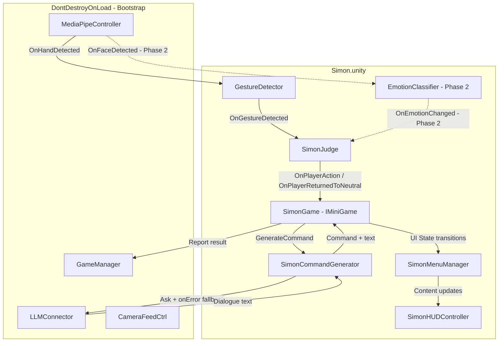
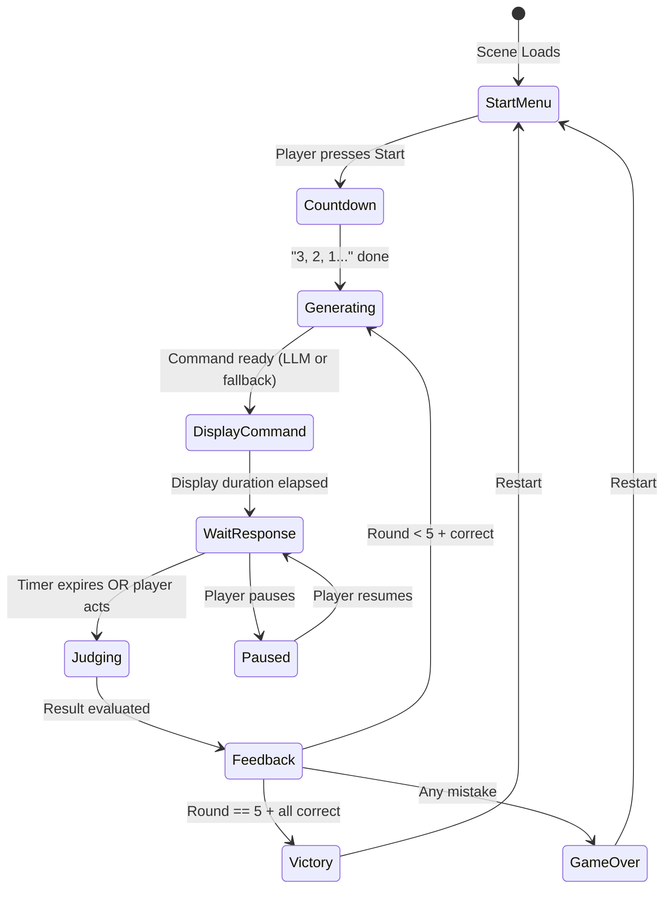

# Simón Dice — Minigame Plan (v3 — Hardened)

> **Date:** 2026-05-28
> **Unity Version:** 2022.3 LTS (URP)
> **Namespace:** `ARcadeRush.Minigames.Simon`
> **Status:** 🔶 Awaiting user approval
> **Revision:** v3 — incorporates codebase-verified fixes for all v2 falencias

---

## 0. Changes from v2 (Summary of Fixes)

| # | Falencia | Severidad | Fix aplicado |
|---|----------|-----------|--------------|
| F1 | Timer de respuesta iniciaba antes de que el LLM respondiera | 🔴 Bloqueante | Timer inicia en `onComplete` callback del LLM, no tras duración fija |
| F2 | `SimonJudge` no tenía guard contra evaluación múltiple por ronda | 🔴 Bloqueante | Flag `_actionAlreadyRegistered` + `_roundAlreadyJudged` |
| F3 | Race condition timeout vs acción del jugador | 🔴 Bloqueante | Guard `_roundAlreadyJudged` en `SimonGame` |
| F4 | `GestureDetector` emite `"None"` como gesto — sin filtro | 🔴 Bloqueante | `SimonJudge` ignora `"None"` explícitamente |
| F5 | Gesto previo sostenido antes del monitoreo → no se detecta transición | 🟡 Medio | `SimonJudge.StartMonitoring()` lee `CurrentDetectedGesture` como estado inicial |
| F6 | Distribución de "Simón dice" puramente aleatoria — posible 5/5 verdaderas | 🟡 Medio | `SimonCommandGenerator` garantiza mínimo 1 falsa en 5 rondas via pre-planning |
| F7 | Scene path `MG_Simon.unity` ≠ `MiniGameRegistry._scenePaths["Simon"]` = `Simon.unity` | 🟡 Medio | Escena renombrada a `Simon.unity` para alinearse con registry existente |
| F8 | `MiniGameRegistry.TryRegister` usa `Type.GetType(string)` con riesgo de fallo | 🟡 Medio | Usar `MiniGameRegistry.Register<SimonGame>()` genérico desde `SimonGame.OnStart()` |
| F9 | Sin `OnDestroy` cleanup — memory leaks y NullReferenceException | 🟡 Medio | `SimonJudge` y `SimonGame` implementan `OnDestroy` con unsubscribe |
| F10 | `_thisSceneIndex` hardcodeado sin validación | 🟢 Menor | Obtener via `SceneManager.GetActiveScene().buildIndex` en `OnStart()` |
| F11 | Fallback template `"{0}, ¡lo ordena Simón!"` contiene "Simón" — confuso en ronda sin "Simón dice" | 🟢 Menor | Template movido a lista de `SaysSimonDice = true` solamente |
| F12 | `SimonCommand` como `struct` con `string` genera boxing | 🟢 Menor | Cambiado a `class` |
| F13 | Estado `Generating` no contemplado — posible doble `StartRound()` | 🟡 Medio | Nuevo estado `Generating` en máquina de estados interna |
| F14 | `LLMConnector.Ask()` tiene `onError` callback — no manejado en v2 | 🟡 Medio | `SimonCommandGenerator` usa `onError` para activar fallback automático |

---

## 1. Game Concept

A "Simon Says" minigame in AR. Commands are displayed as **text in the UI** (no 3D character). The player must:
- **OBEY** if the command says "Simón dice…" (perform the gesture or emotion)
- **STAY STILL/NEUTRAL** if the command does NOT say "Simón dice…"
- Complete **5 consecutive rounds** without making a mistake.

**Detection modes:** Hand gestures (Phase 1) + facial emotions (Phase 2 — future).

---

## 2. Architecture Overview

```
Scene: Simon.unity
├── [SimonGameController]
│   └── SimonGame.cs — IMiniGame orchestrator (rounds, timer, LLM, judging)
│
├── [SimonMenuManager]
│   └── SimonMenuManager.cs — UI state manager (activates/deactivates canvases/panels)
│
├── Canvas_SimonHUD
│   └── SimonHUDController.cs — dialogue text, timer, round counter, feedback overlays
│
├── HandController (reused — GestureDetector + Hand3DProjector)
├── FaceController (reused — EmotionClassifier + FaceLandmarkReader) [Phase 2 only]
└── ARCamera (reused from Bootstrap)
```

### 2.1 Key Design: No SimonHeadAnchor

Commands are displayed as **plain text in the UI**, not anchored to a head position.

### 2.2 SimonMenuManager

Separates UI state management from HUD content. `SimonMenuManager` knows the game state (StartMenu, Countdown, Playing, Paused, GameOver, Victory) and activates/deactivates the correct panels. `SimonGameController` calls `SimonMenuManager` to transition states; `SimonMenuManager` calls `SimonHUDController` for content updates.

### 2.3 Dependency Diagram



Dotted lines = Phase 2 only.

---

## 3. Data Model

### 3.1 Command Types

```csharp
public enum SimonActionType
{
    Gesture,  // Player must perform a hand gesture
    Emotion   // Player must show a facial emotion (Phase 2)
}

public enum SimonGestureTarget
{
    OpenHand,
    ClosedFist,
    Point,
    Pinch,
    ThumbDown
}

public enum SimonEmotionTarget
{
    Happy,
    Surprised,
    Angry
    // Neutral is implicitly the "don't do anything" state
}
```

### 3.2 Command Structure

> [!IMPORTANT]
> **v3 Fix (F12):** Changed from `struct` to `class` to avoid boxing with `string` field + event delegates.

```csharp
public class SimonCommand
{
    public bool   SaysSimonDice;          // True = "Simón dice...", False = regular command
    public SimonActionType ActionType;    // Gesture or Emotion
    public SimonGestureTarget GestureTarget; // Only valid if ActionType == Gesture
    public SimonEmotionTarget EmotionTarget; // Only valid if ActionType == Emotion
    public string DialogueText;           // LLM-generated phrase
}
```

### 3.3 Round Result

```csharp
public enum RoundResult
{
    None,
    Correct,      // Player obeyed correctly (or stayed still when needed)
    WrongAction,  // Player did a gesture/emotion when Simón did NOT say "Simón dice"
    Timeout,      // Player didn't respond in time when Simón DID say "Simón dice"
    WrongGesture  // Player did the wrong gesture/emotion (not the one requested)
}
```

### 3.4 Menu State

```csharp
public enum SimonMenuState
{
    StartMenu,   // Title + start button visible
    Countdown,   // "3, 2, 1..." before first round
    Playing,     // Active round — HUD visible (dialogue, timer, round counter)
    Feedback,    // Brief correct/wrong feedback card
    Paused,      // Pause overlay
    GameOver,    // Failure screen with reason
    Victory      // Success screen with stats
}
```

### 3.5 Internal Game Phase (NEW — v3)

> [!IMPORTANT]
> **v3 Fix (F13):** Internal phase enum prevents double `StartRound()` calls during LLM async wait.

```csharp
/// <summary>
/// Internal state tracked by SimonGame to prevent re-entrant calls.
/// NOT the same as SimonMenuState (which controls UI panels).
/// </summary>
private enum GamePhase
{
    Idle,           // Before game starts or after game ends
    Countdown,      // Countdown animation running
    Generating,     // Waiting for LLM/command generation (NEW)
    DisplayCommand, // Command text shown, player reading
    WaitResponse,   // Timer ticking, monitoring player input
    Judging,        // Evaluating round result
    Feedback,       // Showing correct/wrong feedback
    Ended           // Game over or victory
}
```

---

## 4. Game State Machine



### 4.1 Detailed Round Flow

> [!IMPORTANT]
> **v3 Fixes applied:**
> - **(F1)** Timer starts AFTER command generation completes, not after fixed delay
> - **(F3)** `_roundAlreadyJudged` guard prevents timeout + action race condition
> - **(F4)** `"None"` gesture is filtered out by SimonJudge
> - **(F5)** Pre-existing gesture is captured at monitoring start

```
Round N begins → GamePhase = Generating
    │
    ├─► SimonCommandGenerator.GenerateCommand() (async):
    │     - saysSimonDice: from pre-planned distribution (see §6.3)
    │     - actionType: Gesture (100% in Phase 1)
    │     - specific target: randomly picked from enum
    │     - LLM call → generates natural dialogue text
    │     - If LLM fails (onError) → automatic fallback to templates
    │
    ▼
CommandDisplay → GamePhase = DisplayCommand (2-3 seconds)
    │  HUD shows dialogue text in UI panel
    │  If "Simón dice" → highlight SIMON DICE prefix in green
    │  If NOT "Simón dice" → highlight the command in orange/yellow
    │  Timer is NOT ticking yet (player reads without pressure)
    │
    ▼
PlayerResponse → GamePhase = WaitResponse (e.g. 5 seconds timer)
    │  ⚡ Timer starts HERE (after display phase, after LLM latency)
    │  SimonJudge.StartMonitoring() called:
    │    1. Reads GestureDetector.CurrentDetectedGesture as baseline
    │    2. Subscribes to OnGestureDetected
    │    3. Sets _isMonitoring = true, _actionAlreadyRegistered = false
    │  
    │  Player can:
    │    - Do nothing (staying Neutral)
    │    - Perform a gesture → SimonJudge fires OnPlayerAction ONCE
    │
    ▼
Judgment → GamePhase = Judging
    │  ⚡ _roundAlreadyJudged = true (prevents double evaluation)
    │  SimonJudge.StopMonitoring() called immediately
    │
    │  +--------------+------------------+---------------+
    │  |SaysSimonDice | Player Action    | Result        |
    │  +--------------+------------------+---------------+
    │  | TRUE         | Correct gesture  | CORRECT       |
    │  | TRUE         | Wrong gesture    | WrongGesture  |
    │  | TRUE         | Nothing/timeout  | Timeout       |
    │  | FALSE        | Stayed neutral   | CORRECT       |
    │  | FALSE        | Did ANY gesture  | WrongAction   |
    │  | FALSE        | Showed ANY emot. | WrongAction   |
    │  +--------------+------------------+---------------+
    │
    ▼
Feedback → GamePhase = Feedback (1.5 seconds)
    │  CORRECT: green checkmark card
    │  WRONG: red X card
    │
    ▼
Next round (GamePhase → Generating) OR Game Over / Victory (GamePhase → Ended)
```

---

## 5. Files to Create

### 5.1 Phase 1 — Core + Gestures (Immediate)

| # | File | Namespace | Purpose |
|---|------|-----------|---------|
| 1 | `Assets/Scripts/Minigames/Simon/SimonGame.cs` | `ARcadeRush.Minigames.Simon` | IMiniGame orchestrator — round management, timer, state machine, coordinates MenuManager + HUD |
| 2 | `Assets/Scripts/Minigames/Simon/SimonJudge.cs` | `ARcadeRush.Minigames.Simon` | Evaluates player gesture against expected command (extensible to emotions later) |
| 3 | `Assets/Scripts/Minigames/Simon/SimonCommandGenerator.cs` | `ARcadeRush.Minigames.Simon` | Generates randomized commands + LLM dialogue for natural variety |
| 4 | `Assets/Scripts/UI/SimonMenuManager.cs` | `ARcadeRush.UI` | UI state manager — activates/deactivates panels based on `SimonMenuState` |
| 5 | `Assets/Scripts/UI/SimonHUDController.cs` | `ARcadeRush.UI` | HUD content: dialogue text, timer bar, round counter (X/5), feedback overlays (✓/✗) |

### 5.2 Phase 2 — Emotions (Future)

| # | File | Namespace | Purpose |
|---|------|-----------|---------|
| 6 | `Assets/Scripts/Face/EmotionCompatibilityWrapper.cs` | `ARcadeRush.Face` | Thin wrapper ensuring EmotionClassifier outputs are compatible with SimonJudge's expected interface |
| — | *(Modify)* `SimonJudge.cs` | `ARcadeRush.Minigames.Simon` | Add emotion monitoring alongside gesture monitoring |
| — | *(Modify)* `SimonCommandGenerator.cs` | `ARcadeRush.Minigames.Simon` | Enable emotion command generation |

### 5.3 Scene & Resources

> [!WARNING]
> **v3 Fix (F7):** Scene MUST be named `Simon.unity` to match existing [`MiniGameRegistry._scenePaths`](file:///c:/Users/manu/Documents/CubiWare/Assets/Scripts/Core/MiniGameRegistry.cs#L36) entry `{ "Simon", "Assets/Scenes/Simon.unity" }`.

| # | File | Purpose |
|---|------|---------|
| 7 | `Assets/Scenes/Simon.unity` | Simón Dice scene |

### 5.4 Modified Files

| # | File | Change |
|---|------|--------|
| 8 | [`MiniGameRegistry.cs`](file:///c:/Users/manu/Documents/CubiWare/Assets/Scripts/Core/MiniGameRegistry.cs#L55) | Replace `TryRegister("Simon", null)` with `TryRegister("Simon", "ARcadeRush.Minigames.Simon.SimonGame")` — OR use `Register<SimonGame>()` from `SimonGame.OnStart()` (see §6.1) |
| 9 | [`MainMenuController.cs`](file:///c:/Users/manu/Documents/CubiWare/Assets/Scripts/UI/MainMenuController.cs) | Add "Simón Dice" button that loads `Simon` scene |

---

## 6. Detailed Class Designs

### 6.1 SimonGame.cs

> [!IMPORTANT]
> **v3 Fixes applied:**
> - **(F1)** Timer starts in `onComplete` callback, not after fixed delay
> - **(F3)** `_roundAlreadyJudged` guard prevents double evaluation
> - **(F8)** Uses `Register<SimonGame>()` at registration (fallback: string-based already in registry)
> - **(F9)** `OnDestroy` unsubscribes from all events
> - **(F10)** `SceneIndex` uses `SceneManager.GetActiveScene().buildIndex` as fallback
> - **(F13)** `GamePhase` enum prevents re-entrant `StartRound()` calls

```csharp
namespace ARcadeRush.Minigames.Simon
{
    public class SimonGame : MonoBehaviour, IMiniGame
    {
        // ── Serialized Fields ──────────────────────────────────────────
        [Header("References")]
        [SerializeField] private SimonMenuManager _menuManager;
        [SerializeField] private SimonHUDController _hud;
        [SerializeField] private SimonJudge _judge;
        [SerializeField] private SimonCommandGenerator _commandGenerator;
        [SerializeField] private GestureDetector _gestureDetector;
        // [SerializeField] private EmotionClassifier _emotionClassifier; // Phase 2

        [Header("Game Settings")]
        [SerializeField] private int _maxRounds = 5;
        [SerializeField] private int _mainMenuSceneIndex = 1;

        [Header("Timing")]
        [SerializeField] private float _commandDisplayDuration = 2.5f;
        [SerializeField] private float _responseTimePerRound = 5f;
        [SerializeField] private float _feedbackDuration = 2f;
        [SerializeField] private float _roundTransitionDelay = 1.5f;

        // ── IMiniGame ───────────────────────────────────────────────────
        // v3 Fix (F10): fallback to runtime scene index
        public int SceneIndex => _cachedSceneIndex;
        private int _cachedSceneIndex;

        public void OnStart(MiniGameDependencies deps);
        public void OnEnd();

        // ── State ───────────────────────────────────────────────────────
        private int _currentRound = 0;
        private int _correctStreak = 0;
        private SimonCommand _currentCommand;
        private MiniGameDependencies _deps;
        
        // v3 Fix (F3): race condition guard
        private bool _roundAlreadyJudged;
        
        // v3 Fix (F13): internal phase prevents re-entrant calls
        private GamePhase _phase = GamePhase.Idle;
        
        private bool _hasGameEnded;
        private bool _isPaused;

        // ── Lifecycle ───────────────────────────────────────────────────
        
        private void Awake()
        {
            _cachedSceneIndex = SceneManager.GetActiveScene().buildIndex;
        }
        
        // v3 Fix (F9): cleanup on destroy
        private void OnDestroy()
        {
            // Unsubscribe from judge events
            if (_judge != null)
            {
                _judge.OnPlayerAction -= HandlePlayerAction;
                _judge.OnPlayerReturnedToNeutral -= HandlePlayerNeutral;
            }
            // Unsubscribe from menu events
            if (_menuManager != null)
            {
                _menuManager.OnStartClicked -= StartGame;
                _menuManager.OnMainMenuClicked -= LoadMainMenu;
                _menuManager.OnResumeClicked -= ResumeGame;
                _menuManager.OnRestartClicked -= RestartGame;
            }
        }
    }
}
```

**Key methods (updated for v3):**
- `OnStart(deps)` — subscribes to `_judge` and `_menuManager` events, caches deps, shows StartMenu
- `StartGame()` — called from StartMenu button → sets `_phase = Countdown`, begins countdown
- `StartRound()` — **guards on `_phase != Generating`** → sets `_phase = Generating`, calls `_commandGenerator.GenerateCommand()` with callback
- `OnCommandReady(SimonCommand cmd)` — callback from generator → sets `_phase = DisplayCommand`, shows dialogue, starts display timer
- `BeginResponsePhase()` — called after display timer → sets `_phase = WaitResponse`, starts response timer, calls `_judge.StartMonitoring()`
- `HandlePlayerAction(string gesture)` — receives from SimonJudge → **checks `_roundAlreadyJudged`** → if false, calls `JudgeRound()`
- `HandleTimeout()` — timer expired → **checks `_roundAlreadyJudged`** → if false, calls `JudgeRound()` with timeout
- `JudgeRound(string playerAction, bool timedOut)` — sets `_roundAlreadyJudged = true`, `_phase = Judging`, applies truth table, calls `ShowFeedback()`
- `ShowFeedback(RoundResult)` — sets `_phase = Feedback`, correct/wrong → transitions
- `EndGame(bool won)` — sets `_phase = Ended`, transitions to Victory or GameOver
- `OnEnd()` — follows ShooterGame pattern: creates `MinigameSessionData`, reports to GameManager, unsubscribes all
- `PauseGame()` / `ResumeGame()` — handles pause (only valid when `_phase == WaitResponse`)
- `RestartGame()` — returns to StartMenu state, resets all counters
- `LoadMainMenu()` — loads main menu scene via `SceneLoader.Instance`

### 6.2 SimonJudge.cs

> [!IMPORTANT]
> **v3 Fixes applied:**
> - **(F2)** `_actionAlreadyRegistered` flag prevents multiple event firings per round
> - **(F4)** Filters out `"None"` gesture from `OnGestureDetected`
> - **(F5)** Reads `GestureDetector.CurrentDetectedGesture` at monitoring start to detect pre-held gestures
> - **(F9)** `OnDestroy` unsubscribes from `GestureDetector`

```csharp
namespace ARcadeRush.Minigames.Simon
{
    /// <summary>
    /// Monitors GestureDetector during the response phase.
    /// Phase 2: also monitors EmotionClassifier.
    /// Reports any detected action to SimonGame for evaluation.
    ///
    /// IMPORTANT — GestureDetector behavior (verified from source):
    ///   - Already has 5-frame debounce (_requiredStableFrames)
    ///   - Fires OnGestureDetected only on TRANSITIONS (not every frame)
    ///   - Fires "None" as a valid gesture transition
    ///   - Exposes CurrentDetectedGesture for polling
    /// 
    /// This means SimonJudge does NOT need frame-level debounce, but MUST:
    ///   1. Filter out "None" events
    ///   2. Fire OnPlayerAction only ONCE per round (_actionAlreadyRegistered)
    ///   3. Capture pre-existing gesture at monitoring start
    /// </summary>
    public class SimonJudge : MonoBehaviour
    {
        [SerializeField] private GestureDetector _gestureDetector;
        // [SerializeField] private EmotionClassifier _emotionClassifier; // Phase 2

        /// <summary>Fired when the player performs any detectable action (once per round).</summary>
        public event Action<string> OnPlayerAction;
        /// <summary>Fired when the player returned to neutral after performing an action.</summary>
        public event Action OnPlayerReturnedToNeutral;

        private bool _isMonitoring = false;
        
        // v3 Fix (F2): prevents multiple firings per round
        private bool _actionAlreadyRegistered = false;
        
        // v3 Fix (F5): baseline gesture at monitoring start
        private string _baselineGesture = "None";

        /// <summary>
        /// Begin monitoring. Captures current gesture as baseline.
        /// If player is already holding a non-None gesture, it becomes the baseline
        /// and won't be reported — only a NEW gesture transition will fire.
        /// </summary>
        public void StartMonitoring()
        {
            _isMonitoring = true;
            _actionAlreadyRegistered = false;
            
            // v3 Fix (F5): capture current gesture as baseline
            _baselineGesture = _gestureDetector != null 
                ? _gestureDetector.CurrentDetectedGesture 
                : "None";
                
            // Subscribe to events
            if (_gestureDetector != null)
            {
                _gestureDetector.OnGestureDetected += HandleGestureDetected;
            }
        }

        public void StopMonitoring()
        {
            _isMonitoring = false;
            
            // Unsubscribe from events
            if (_gestureDetector != null)
            {
                _gestureDetector.OnGestureDetected -= HandleGestureDetected;
            }
        }

        public void ResetState()
        {
            _actionAlreadyRegistered = false;
            _baselineGesture = "None";
        }

        private void HandleGestureDetected(string gestureName)
        {
            if (!_isMonitoring) return;
            
            // v3 Fix (F4): filter out "None" — not a player action
            if (gestureName == "None")
            {
                // Player returned to neutral
                if (_actionAlreadyRegistered)
                {
                    OnPlayerReturnedToNeutral?.Invoke();
                }
                return;
            }
            
            // v3 Fix (F5): if gesture matches baseline, it's pre-held — ignore
            if (gestureName == _baselineGesture)
            {
                return;
            }
            
            // v3 Fix (F2): fire only ONCE per monitoring session
            if (_actionAlreadyRegistered) return;
            _actionAlreadyRegistered = true;
            
            OnPlayerAction?.Invoke(gestureName);
        }

        // v3 Fix (F9): cleanup on destroy
        private void OnDestroy()
        {
            StopMonitoring();
        }
    }
}
```

### 6.3 SimonCommandGenerator.cs

> [!IMPORTANT]
> **v3 Fixes applied:**
> - **(F6)** Pre-plans distribution of "Simón dice" vs false commands to guarantee minimum 1 false
> - **(F11)** `"¡lo ordena Simón!"` template moved to `SaysSimonDice = true` list only
> - **(F14)** Uses `LLMConnector.Ask()` `onError` callback for automatic fallback

```csharp
namespace ARcadeRush.Minigames.Simon
{
    /// <summary>
    /// Generates Simon Says commands with LLM-powered natural dialogue.
    /// Game-logic parameters are pre-determined; LLM only decorates with natural language.
    /// Falls back to template phrases if LLM is unavailable.
    ///
    /// v3: Pre-plans the entire game's "Simón dice" distribution at game start
    /// to guarantee at least 1-2 false commands per 5-round game.
    /// </summary>
    public class SimonCommandGenerator : MonoBehaviour
    {
        [Header("Distribution")]
        [Tooltip("Minimum number of 'false' (no Simón dice) rounds per game.")]
        [SerializeField] private int _minFalseRounds = 1;
        [Tooltip("Maximum number of 'false' rounds per game.")]
        [SerializeField] private int _maxFalseRounds = 2;

        [Header("LLM")]
        [SerializeField] private bool _useLLM = true;
        [SerializeField] private string _systemPrompt =
            "Eres Simón, un personaje excéntrico que dirige un juego de \"Simón dice\" en español. " +
            "Tu personalidad es divertida, a veces sarcástica, a veces motivadora.\n\n" +
            "REGLAS:\n" +
            "- Cuando debas decir \"Simón dice\", SIEMPRE empieza la frase con \"Simón dice: \".\n" +
            "- Cuando NO debas decirlo, NUNCA uses la frase \"Simón dice\" ni la palabra \"Simón\".\n" +
            "- Varía tu tono entre rondas: amable, exigente, gracioso, misterioso.\n" +
            "- Mantén cada orden en máximo 15 palabras.\n" +
            "- Usas español latino neutro.";

        // ── Pre-planned distribution ──────────────────────────────────────
        private bool[] _roundPlan; // true = saysSimonDice for each round

        /// <summary>
        /// Pre-plans the "Simón dice" distribution for the entire game.
        /// Guarantees [_minFalseRounds, _maxFalseRounds] false commands.
        /// Call once at game start (before first round).
        /// </summary>
        public void PlanGame(int totalRounds)
        {
            _roundPlan = new bool[totalRounds];
            int falseCount = UnityEngine.Random.Range(_minFalseRounds, _maxFalseRounds + 1);
            falseCount = Mathf.Clamp(falseCount, 0, totalRounds);

            // Fill all as true, then randomly assign false positions
            for (int i = 0; i < totalRounds; i++) _roundPlan[i] = true;

            // Fisher-Yates to pick random false positions
            var indices = new List<int>();
            for (int i = 0; i < totalRounds; i++) indices.Add(i);
            for (int i = indices.Count - 1; i > 0; i--)
            {
                int j = UnityEngine.Random.Range(0, i + 1);
                (indices[i], indices[j]) = (indices[j], indices[i]);
            }
            for (int i = 0; i < falseCount; i++) _roundPlan[indices[i]] = false;
        }

        /// <summary>
        /// Generates a command asynchronously. Uses pre-planned distribution.
        /// If LLM fails, automatically falls back to template phrases.
        /// </summary>
        public void GenerateCommand(int round, int maxRounds, LLMConnector llm, Action<SimonCommand> onComplete)
        {
            bool saysSimonDice = _roundPlan != null && round < _roundPlan.Length
                ? _roundPlan[round]
                : UnityEngine.Random.value < 0.6f; // safety fallback

            var gestureTarget = (SimonGestureTarget)UnityEngine.Random.Range(
                0, System.Enum.GetValues(typeof(SimonGestureTarget)).Length);

            var cmd = new SimonCommand
            {
                SaysSimonDice = saysSimonDice,
                ActionType = SimonActionType.Gesture,
                GestureTarget = gestureTarget,
            };

            if (!_useLLM || llm == null)
            {
                cmd.DialogueText = GenerateFallbackText(cmd);
                onComplete?.Invoke(cmd);
                return;
            }

            string gestureName = GestureNames[gestureTarget];
            string condition = saysSimonDice
                ? "DEBES decir \"Simón dice\"."
                : "NO debes decir \"Simón dice\" ni usar la palabra \"Simón\".";

            string userPrompt = $"Ronda {round + 1} de {maxRounds}.\n{condition}\n" +
                                $"El jugador debe hacer el gesto \"{gestureName}\".\n" +
                                "Genera UNA sola orden en español.";

            // v3 Fix (F14): use onError callback for automatic fallback
            llm.Ask(_systemPrompt, userPrompt,
                onComplete: (response) =>
                {
                    cmd.DialogueText = response.Trim();
                    onComplete?.Invoke(cmd);
                },
                onError: (error) =>
                {
                    Debug.LogWarning($"[SimonCommandGenerator] LLM failed ({error}), using fallback.");
                    cmd.DialogueText = GenerateFallbackText(cmd);
                    onComplete?.Invoke(cmd);
                }
            );
        }

        /// <summary>Generates dialogue text using template phrases (no LLM).</summary>
        private string GenerateFallbackText(SimonCommand cmd);
    }
}
```

**Fallback templates (v3 — fixed F11):**
```csharp
private static readonly string[] FallbackTemplates_SimonDice = {
    "Simón dice: {0}",
    "Simón dice que hagas {0}",
    "{0}, ¡lo ordena Simón!"   // v3: moved from shared → SimonDice-only
};

private static readonly string[] FallbackTemplates_NoSimonDice = {
    "¡{0}!",                     // v3: removed "Simón" from all templates
    "{0} ahora mismo",
    "¡Rápido, {0}!"
};

private static readonly Dictionary<SimonGestureTarget, string> GestureNames = new() {
    { SimonGestureTarget.OpenHand,   "mano abierta" },
    { SimonGestureTarget.ClosedFist, "puño cerrado" },
    { SimonGestureTarget.Point,      "señala con el dedo" },
    { SimonGestureTarget.Pinch,      "pellizco" },
    { SimonGestureTarget.ThumbDown,  "pulgar abajo" },
};
```

### 6.4 SimonMenuManager.cs

```csharp
namespace ARcadeRush.UI
{
    /// <summary>
    /// Centralized UI state manager for the Simón Dice minigame.
    /// Knows the current SimonMenuState and activates/deactivates the correct
    /// UI panels/canvases. Acts as a bridge between SimonGame (logic) and
    /// SimonHUDController (content).
    ///
    /// UI Hierarchy:
    /// Canvas_Simon
    /// ├── StartMenuPanel
    /// │   ├── TitleText ("SIMÓN DICE")
    /// │   ├── StartButton
    /// │   └── MainMenuButton
    /// ├── CountdownPanel
    /// │   └── CountdownText ("3", "2", "1", "¡YA!")
    /// ├── GameplayHUD
    /// │   ├── DialoguePanel
    /// │   │   ├── DialogueBackground (Image — speech bubble style)
    /// │   │   └── DialogueText (TMP_Text — Simon's words)
    /// │   ├── RoundCounter (TMP_Text — "Ronda 3 / 5")
    /// │   ├── TimerBar (Image fill)
    /// │   └── TimerText (TMP_Text — "4.2s")
    /// ├── FeedbackPanel
    /// │   ├── CheckmarkCard (GameObject — green ✓)
    /// │   └── CrossCard (GameObject — red ✗)
    /// ├── PausePanel
    /// │   ├── PauseText ("PAUSA")
    /// │   ├── ResumeButton
    /// │   └── MainMenuButton
    /// ├── VictoryPanel
    /// │   ├── VictoryText ("¡GANASTE!")
    /// │   ├── StatsText ("5/5 rondas")
    /// │   └── RestartButton
    /// └── GameOverPanel
    ///     ├── GameOverText ("¡PERDISTE!")
    ///     ├── ReasonText ("Hiciste un gesto cuando no debías")
    ///     └── RestartButton
    /// </summary>
    public class SimonMenuManager : MonoBehaviour
    {
        // ── Serialized Fields ──────────────────────────────────────────
        [Header("Panels")]
        [SerializeField] private GameObject _startMenuPanel;
        [SerializeField] private GameObject _countdownPanel;
        [SerializeField] private GameObject _gameplayHUDPanel;
        [SerializeField] private GameObject _feedbackPanel;
        [SerializeField] private GameObject _pausePanel;
        [SerializeField] private GameObject _victoryPanel;
        [SerializeField] private GameObject _gameOverPanel;

        [Header("Start Menu")]
        [SerializeField] private Button _startButton;
        [SerializeField] private Button _mainMenuButton_Start;

        [Header("Pause")]
        [SerializeField] private Button _resumeButton;
        [SerializeField] private Button _mainMenuButton_Pause;

        [Header("Game Over")]
        [SerializeField] private TMP_Text _gameOverReasonText;
        [SerializeField] private Button _restartButton_GameOver;

        [Header("Victory")]
        [SerializeField] private TMP_Text _victoryStatsText;
        [SerializeField] private Button _restartButton_Victory;

        [Header("Countdown")]
        [SerializeField] private TMP_Text _countdownText;

        [Header("HUD Reference")]
        [SerializeField] private SimonHUDController _hudController;

        // ── Events (forwarded to SimonGame) ─────────────────────────────
        public event Action OnStartClicked;
        public event Action OnMainMenuClicked;
        public event Action OnResumeClicked;
        public event Action OnRestartClicked;

        // ── Public API ───────────────────────────────────────────────────
        public SimonMenuState CurrentState { get; private set; }

        /// <summary>Transition to a new menu state. Handles panel activation.</summary>
        public void SetState(SimonMenuState newState);

        /// <summary>Show countdown sequence (3, 2, 1, YA!) and callback when done.</summary>
        public IEnumerator RunCountdown(Action onComplete);

        /// <summary>Show feedback card (correct/wrong) for a duration.</summary>
        public IEnumerator ShowFeedback(bool correct, float duration);

        /// <summary>Show game over with a reason and rounds completed.</summary>
        public void ShowGameOver(string reason, int roundsCompleted);

        /// <summary>Show victory with rounds completed.</summary>
        public void ShowVictory(int roundsCompleted);

        // ── Internal ─────────────────────────────────────────────────────
        private void DeactivateAllPanels();
        private void WireButtonEvents();
        private void UnwireButtonEvents();
        
        // v3 Fix (F9): cleanup
        private void OnDestroy()
        {
            UnwireButtonEvents();
        }
    }
}
```

**Key design decisions:**
- `SetState(SimonMenuState)` deactivates all panels, then activates only the relevant one
- `SimonMenuManager` owns button event wiring; `SimonGame` subscribes to its events
- `SimonMenuManager` delegates content updates (dialogue text, timer, round counter) to `SimonHUDController`
- Countdown and Feedback are temporary states handled via coroutines
- `OnDestroy` unwires button events to prevent dangling listeners

### 6.5 SimonHUDController.cs (Revised — no head anchor)

```csharp
namespace ARcadeRush.UI
{
    /// <summary>
    /// Pure HUD content controller for the Simón Dice minigame.
    /// Does NOT handle panel visibility — that's SimonMenuManager's job.
    /// Assumes its parent GameObject (GameplayHUD) is already active when called.
    ///
    /// Displays:
    ///   - Dialogue text (in a static UI panel, not anchored to head)
    ///   - Round counter
    ///   - Timer bar + text
    ///   - "Simón dice" prefix highlighting
    /// </summary>
    public class SimonHUDController : MonoBehaviour
    {
        // ── Serialized Fields ──────────────────────────────────────────
        [Header("Dialogue")]
        [SerializeField] private TMP_Text _dialogueText;
        [SerializeField] private GameObject _dialoguePanel;
        [SerializeField] private Color _simonDiceColor = Color.green;
        [SerializeField] private Color _noSimonDiceColor = new Color(1f, 0.6f, 0f); // orange

        [Header("HUD")]
        [SerializeField] private TMP_Text _roundCounterText;
        [SerializeField] private Image _timerFillBar;
        [SerializeField] private TMP_Text _timerText;

        // ── Public API ───────────────────────────────────────────────────
        public void ShowDialogue(string text, bool saysSimonDice);
        public void HideDialogue();
        public void UpdateRoundCounter(int round, int maxRounds);
        public void UpdateTimer(float remaining, float total);
        public void ResetAll();  // Clear all displays for new game
    }
}
```

---

## 7. LLM Integration — Prompt Design

### 7.1 System Prompt

```
Eres Simón, un personaje excéntrico que dirige un juego de "Simón dice" en español.
Tu personalidad es divertida, a veces sarcástica, a veces motivadora.

REGLAS:
- Cuando debas decir "Simón dice", SIEMPRE empieza la frase con "Simón dice: ".
- Cuando NO debas decirlo, NUNCA uses la frase "Simón dice" ni la palabra "Simón".
- Varía tu tono entre rondas: amable, exigente, gracioso, misterioso.
- Mantén cada orden en máximo 15 palabras.
- Usas español latino neutro.
```

> [!WARNING]
> **v3 Fix (F11):** Added explicit rule "ni la palabra 'Simón'" to system prompt. Without this, the LLM might generate "Simón quiere que hagas X" without the "dice" prefix, confusing the player.

### 7.2 User Prompt (per round)

```
Ronda {roundNumber} de {maxRounds}.
{saysSimonDiceCondition}
El jugador debe hacer el gesto "{gestureName}".
Genera UNA sola orden en español.
```

**Example — saysSimonDice = true, gesture = ClosedFist:**
```
Ronda 3 de 5.
DEBES decir "Simón dice".
El jugador debe hacer el gesto "puño cerrado".
Genera UNA sola orden en español.
```

**Example — saysSimonDice = false, gesture = ThumbDown:**
```
Ronda 2 de 5.
NO debes decir "Simón dice" ni usar la palabra "Simón".
El jugador debe hacer el gesto "pulgar abajo".
Genera UNA sola orden en español.
```

### 7.3 LLM Response Handling

Game logic (`saysSimonDice`, action type, target) is **always pre-determined** — the LLM only decorates with natural language. This prevents LLM hallucination from breaking game logic.

> [!IMPORTANT]
> **v3 Fix (F14):** If `LLMConnector.Ask()` calls `onError` (network failure, rate limit after retry, auth failure), `SimonCommandGenerator` automatically uses fallback templates. The player never sees an error — the game continues seamlessly.

```csharp
// LLM success path:
llm.Ask(systemPrompt, userPrompt,
    onComplete: (response) => {
        cmd.DialogueText = response.Trim();
        onComplete?.Invoke(cmd);
    },
    onError: (error) => {
        // Automatic fallback — player doesn't notice
        cmd.DialogueText = GenerateFallbackText(cmd);
        onComplete?.Invoke(cmd);
    }
);
```

---

## 8. Integration with Existing Infrastructure

### 8.1 IMiniGame Registration

> [!WARNING]
> **v3 Fix (F7 + F8):** Two registration approaches. Prefer Option A.

**Option A — Update static registration (recommended):**

In [`MiniGameRegistry.cs`](file:///c:/Users/manu/Documents/CubiWare/Assets/Scripts/Core/MiniGameRegistry.cs#L55), change:
```csharp
TryRegister("Simon", null);  // Placeholder
```
To:
```csharp
TryRegister("Simon", "ARcadeRush.Minigames.Simon.SimonGame");
```

**Option B — Runtime registration from SimonGame.OnStart() (fallback):**
```csharp
// In SimonGame.OnStart():
CubiWare.Core.MiniGameRegistry.Register<SimonGame>("Simon");
```

> [!NOTE]
> The scene path is already registered in `_scenePaths` as `{ "Simon", "Assets/Scenes/Simon.unity" }` (line 36). No change needed there. But the scene file MUST be named `Simon.unity`, not `MG_Simon.unity`.

### 8.2 MainMenu Button

Add a "Simón Dice" button in the MainMenu scene that calls:
```csharp
SceneLoader.Instance.LoadScene(MiniGameRegistry.GetSceneIndex("Simon"));
```

### 8.3 Build Settings

Add `Simon.unity` to Build Settings:
```
0: Bootstrap
1: MainMenu
2: DummyTest
3: Shooter
4: Simon (Simón Dice)
...
```

---

## 9. Open Questions for Review

> [!IMPORTANT]
> **Q1 — Command distribution:** The plan now guarantees 1-2 false commands per game (configurable via `_minFalseRounds` / `_maxFalseRounds`). Are these defaults acceptable?

> [!IMPORTANT]
> **Q2 — Wrong gesture penalty:** If Simón says "Simón dice: puño cerrado" and the player shows OpenHand instead, is that:
> - (A) Immediate game over (strict — only one chance)
> - (B) A strike — the player can try again within the same timer?

> [!IMPORTANT]
> **Q3 — "Staying neutral" detection:** When Simón does NOT say "Simón dice", the player must stay neutral. How long before we judge it correct?
> - (A) The full response time (5s) without doing anything
> - (B) A shorter window (e.g., 2s) — once they pass it, they're safe
>
> **Implementation note:** If (B), `SimonGame` needs a second configurable timer `_neutralConfirmDuration`. The `_responseTimePerRound` timer still runs, but if the player hasn't acted after `_neutralConfirmDuration` seconds, the round is judged correct early.

> [!IMPORTANT]
> **Q4 — Dialogue display vs. response timer:** ✅ **RESOLVED in v3.** Timer now starts AFTER the display phase ends. The player always has a full reading phase + full response phase.

> [!IMPORTANT]
> **Q5 — Audio/sounds:** Do you want simple SFX for correct/wrong feedback? TTS (text-to-speech) for Simon's voice would add significant complexity — recommend SFX only for v1.

> [!IMPORTANT]
> **Q6 — Future 3D character:** When ready to add a 3D Simón character, a new `SimonHeadAnchor.cs` can be created. The `SimonMenuManager` architecture already supports this: the dialogue panel can be reparented to follow the head anchor without changing any controller logic.

---

## 10. Implementation Order

### Phase 1 — Gestures Only

| # | Task | Dependencies |
|---|------|--------------|
| P1.1 | Create `SimonMenuManager.cs` — UI state machine, panel activation, button events, `OnDestroy` cleanup | None |
| P1.2 | Create `SimonHUDController.cs` — dialogue text, timer bar, round counter | None |
| P1.3 | Create `SimonJudge.cs` — gesture monitoring with `_actionAlreadyRegistered` guard, `"None"` filter, baseline capture, `OnDestroy` cleanup | GestureDetector |
| P1.4 | Create `SimonCommandGenerator.cs` — `PlanGame()` pre-distribution, LLM + `onError` fallback, fixed templates | LLMConnector |
| P1.5 | Create `SimonGame.cs` — IMiniGame, `GamePhase` state machine, `_roundAlreadyJudged` guard, round orchestration, `OnDestroy` cleanup | All scripts above |
| P1.6 | Create `Simon.unity` scene — wire all references in Inspector | All scripts above |
| P1.7 | Update `MiniGameRegistry.cs` — register SimonGame type | SimonGame.cs |
| P1.8 | Add "Simón Dice" button to MainMenu | MiniGameRegistry updated |
| P1.9 | Add `Simon` to Build Settings (index 4) | Scene exists |
| P1.10 | Test full flow: start → 5 gesture rounds → victory | All above |
| P1.11 | Test failure: wrong gesture, timeout, wrong action (no Simón dice) | All above |
| P1.12 | Test LLM integration + automatic fallback when API unavailable | All above |
| P1.13 | Test race condition: player acts on final frame of timer | All above |
| P1.14 | Test pre-held gesture: hold ClosedFist → round starts expecting ClosedFist → verify it requires release + re-hold | All above |

### Phase 2 — Emotions (Future)

| # | Task | Dependencies |
|---|------|--------------|
| P2.1 | Create `EmotionCompatibilityWrapper.cs` — normalizes EmotionClassifier output | EmotionClassifier |
| P2.2 | Modify `SimonJudge.cs` — add emotion monitoring | EmotionCompatibilityWrapper |
| P2.3 | Modify `SimonCommandGenerator.cs` — enable emotion command generation | None |
| P2.4 | Wire EmotionClassifier in `Simon.unity` scene | All Phase 2 scripts |
| P2.5 | Test mixed gesture + emotion rounds | All above |

---

## 11. Verification Checklist (Phase 1)

### Core Flow
- [ ] Scene loads from Bootstrap (additive loading)
- [ ] Start menu shows "SIMÓN DICE" title + start button + main menu button
- [ ] Pressing Start triggers countdown (3, 2, 1, ¡YA!)
- [ ] Dialogue text appears in UI panel (not anchored to head)
- [ ] "Simón dice" prefix is visually distinct (green) from non-Simón commands (orange)
- [ ] Timer bar counts down during response phase **only** (not during display phase)
- [ ] Round counter shows "Ronda X / 5"

### Correct Outcomes
- [ ] **Correct — obeyed:** Green checkmark feedback, round advances
- [ ] **Correct — stayed still:** Green checkmark, round advances
- [ ] Victory after 5 consecutive correct rounds
- [ ] Victory screen shows "5/5 rondas completadas"

### Failure Outcomes
- [ ] **Wrong — did gesture when not told:** Red X, game over screen with reason
- [ ] **Wrong — timeout when told:** Red X, game over screen (reason: "No reaccionaste a tiempo")
- [ ] **Wrong — wrong gesture:** Red X, game over screen (reason: "Hiciste el gesto incorrecto")
- [ ] Game over screen shows reason + rounds completed (e.g., "3/5")

### Navigation
- [ ] Restart button returns to StartMenu state
- [ ] Main Menu button loads MainMenu scene
- [ ] Pause works during gameplay (pause panel, resume button)

### LLM
- [ ] LLM generates varied dialogue (check Console for different texts each round)
- [ ] LLM fallback works **automatically** when API unavailable (template phrases used, no error shown to player)

### v3 Specific — Robustness
- [ ] **Race condition guard:** Player acts on final frame of timer → only ONE evaluation occurs
- [ ] **Pre-held gesture:** Player holds ClosedFist before round → gesture not immediately reported
- [ ] **"None" filter:** `SimonJudge` never fires `OnPlayerAction` with `"None"`
- [ ] **Distribution:** At least 1 false ("no Simón dice") command appears in every 5-round game
- [ ] **No double StartRound:** Rapidly clicking or edge cases don't call `StartRound()` twice (guarded by `GamePhase.Generating`)
- [ ] **Event cleanup:** Zero `NullReferenceException` after scene unload (all `OnDestroy` cleanup runs)
- [ ] Zero NullReferenceExceptions in 3 full game cycles
- [ ] Gesture detection: OpenHand, ClosedFist, Point, Pinch, ThumbDown all recognized
- [ ] No references to SimonHeadAnchor anywhere in code
- [ ] Scene named `Simon.unity` (not `MG_Simon.unity`) — matches MiniGameRegistry

---

*ARcade Rush — Simón Dice Plan v3 (Hardened) · PUCV 2026*
