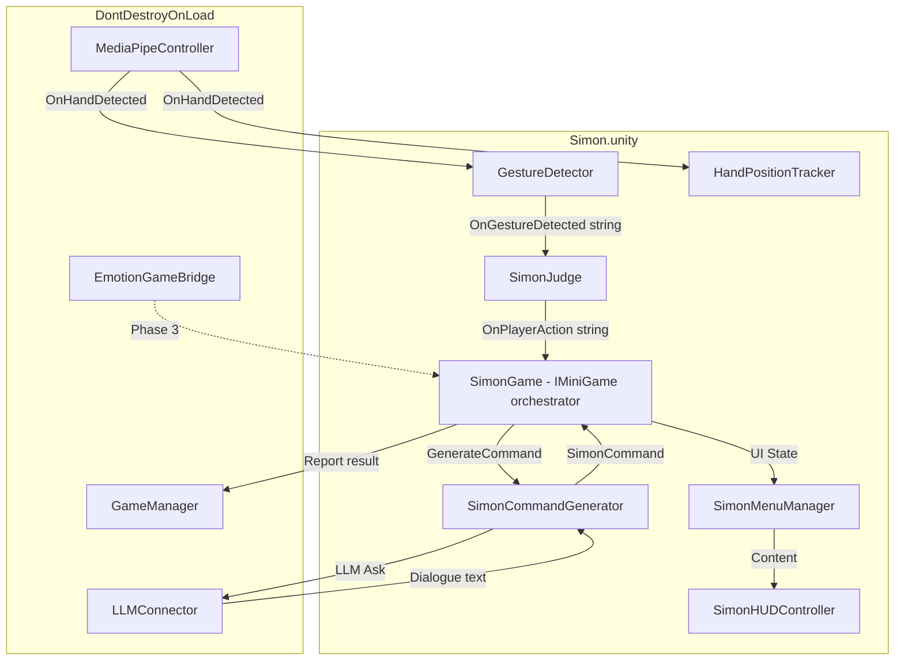
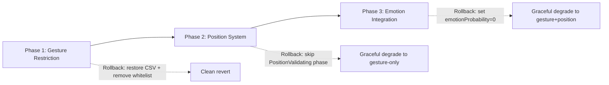

# Simon Memory Game Modification — Implementation Plan

> **Date:** 2026-06-01  
> **Status:** Revised — Phase 2 rewritten for shared position infrastructure  
> **Based on:** Full codebase analysis of all existing Simon + Hand + Emotion + Shooter + FruitNinja systems  
> **Dependencies:** Three strictly sequential phases — each must be verified before the next begins.

---

## 0. Codebase Analysis Summary

### 0.1 Key findings from source review

| System | File | Key Observation |
|--------|------|-----------------|
| Gesture Enum | [`GestureDetector.cs:10`](Assets/Scripts/Hand/GestureDetector.cs:10) | Actual enum is `{ None, OpenHand, ClosedFist, Point, Pinch, ThumbDown, Custom }` — **7 values**. NO PeaceSign/ThumbsUp/Gun/Unknown exist. |
| Gesture Filter | [`GestureDetector.cs:19`](Assets/Scripts/Hand/GestureDetector.cs:19) | `_enabledGestures` List\<string\> **already exists** as a filtering mechanism (line 122: `if (_enabledGestures.Count > 0 && !_enabledGestures.Contains(h.GestureName)) continue;`). This is the primary filtering hook. |
| CSV Rules | [`GestureHeuristics.csv`](Assets/Resources/GestureHeuristics.csv) | 5 gesture rules: OpenHand, ClosedFist, Point, Pinch, ThumbDown. No PeaceSign/ThumbsUp. |
| Custom Rules | [`GestureHeuristicData.cs:8`](Assets/Scripts/Hand/GestureHeuristicData.cs:8) | `CustomHeuristicRule` enum includes `ThumbInsidePalm`, `ThumbOutsidePalm`, `ThumbExtended`, `ThumbTucked`, `ThumbTipBelowIP`, `ThumbAboveMCP` — useful for palm-orientation detection. |
| Position Tracker | [`HandPositionTracker.cs`](Assets/Scripts/Hand/HandPositionTracker.cs) | Provides `CurrentHandPosition` (Vector2, normalized [0,1]), 5-frame EMA smoothed via Queue. Used by Fruit Ninja's [`Blade.cs`](Assets/Scripts/Minigames/NinjaFruit/Blade.cs) via `FindAnyObjectByType<HandPositionTracker>()`. No zone classification. |
| 3D Projector | [`Hand3DProjector.cs`](Assets/Scripts/Hand/Hand3DProjector.cs) | Provides `LastNormalizedLandmarks` (all 21 landmarks), `WristWorldPos`, `CurrentHandScale`, `event OnLost`. Used by Shooter's [`ShooterHandController`](Assets/Scripts/Minigames/Shooter/ShooterHandController.cs). |
| Gesture Detector | [`GestureDetector.cs`](Assets/Scripts/Hand/GestureDetector.cs) | `event OnOpenHand`, `OnClosedFist`, `OnGestureDetected(string)`, 5-frame debounce, `CurrentDetectedGesture` property. Already wired in Simon's [`SimonGame.cs`](Assets/Scripts/Minigames/Simon/SimonGame.cs) and [`SimonJudge.cs`](Assets/Scripts/Minigames/Simon/SimonJudge.cs). |
| Simon Game Phase | [`SimonGame.cs:667`](Assets/Scripts/Minigames/Simon/SimonGame.cs:667) | Private `GamePhase` enum: `Idle, Countdown, Generating, DisplayCommand, WaitResponse, Judging, Feedback, Ended` — 8 states. |
| Simon Judge | [`SimonJudge.cs`](Assets/Scripts/Minigames/Simon/SimonJudge.cs) | Monitors GestureDetector, fires `OnPlayerAction(string)` once per round, has `_actionAlreadyRegistered` + `_baselineGesture` guards. |
| Simon Data Model | [`SimonDataModel.cs`](Assets/Scripts/Minigames/Simon/SimonDataModel.cs) | `SimonActionType.Emotion` and `SimonEmotionTarget` enums exist but unused. `SimonGestureTarget` has 5 values: `OpenHand, ClosedFist, Point, Pinch, ThumbDown`. |
| Command Generator | [`SimonCommandGenerator.cs:117`](Assets/Scripts/Minigames/Simon/SimonCommandGenerator.cs:117) | Picks from ALL 5 gestures: `(SimonGestureTarget)Random.Range(0, Enum.GetValues(typeof(SimonGestureTarget)).Length)`. Always sets `ActionType = Gesture`. |
| Emotion Server | [`emotion_server.py`](PythonServer/emotion_server.py) | 7 emotions, DeepFace via opencv backend, 4-frame rolling average, WebSocket at `ws://localhost:8765/ws`. |
| Emotion Bridge | [`EmotionGameBridge.cs`](Assets/Scripts/EmotionDetection/EmotionGameBridge.cs) | `EmotionType` enum with 8 values (7 + Unknown), AutoInterval/Window modes, `IsEmotionActive()` threshold check, accessible via `deps.EmotionBridge`. |
| Registry | [`MiniGameRegistry.cs:56`](Assets/Scripts/Core/MiniGameRegistry.cs:56) | Simon already registered: `TryRegister("Simon", "ARcadeRush.Minigames.Simon.SimonGame")`. Scene path: `Assets/Scenes/Simon.unity`. |

### 0.2 Shared Hand Infrastructure (Pre-existing)

Both Shooter and Fruit Ninja reuse these shared components — Simon will do the same:

| Component | Path | What It Provides | Who Uses It |
|-----------|------|-----------------|-------------|
| [`HandPositionTracker`](Assets/Scripts/Hand/HandPositionTracker.cs) | `Assets/Scripts/Hand/` | `Vector2 CurrentHandPosition` — normalized [0,1] palm center, 5-frame EMA smoothed | Fruit Ninja's [`Blade.cs`](Assets/Scripts/Minigames/NinjaFruit/Blade.cs) polls it every frame |
| [`Hand3DProjector`](Assets/Scripts/Hand/Hand3DProjector.cs) | `Assets/Scripts/Hand/` | `NormalizedLandmarks LastNormalizedLandmarks` — all 21 landmarks in 0-1 space; `Vector3 WristWorldPos`; `float CurrentHandScale`; `event Action OnLost` | Shooter's [`ShooterHandController`](Assets/Scripts/Minigames/Shooter/ShooterHandController.cs) reads from it |
| [`GestureDetector`](Assets/Scripts/Hand/GestureDetector.cs) | `Assets/Scripts/Hand/` | `event OnOpenHand`, `OnClosedFist`, `OnGestureDetected(string)`; 5-frame debounce; `CurrentDetectedGesture` property | Already wired in Simon's [`SimonGame.cs`](Assets/Scripts/Minigames/Simon/SimonGame.cs) and [`SimonJudge.cs`](Assets/Scripts/Minigames/Simon/SimonJudge.cs) |

**Critical insight**: Neither Shooter nor Fruit Ninja has directional zone classification. Both do continuous cursor-following. But the data pipeline (`HandPositionTracker` → normalized Vector2) already exists and is battle-tested. Simon will add `HandZoneClassifier` as a new shared component that consumes from this same pipeline — no duplicate position trackers.

### 0.3 Interface `IHandDetector`

Defined at [`Assets/Scripts/Core/Interfaces/IHandDetector.cs`](Assets/Scripts/Core/Interfaces/IHandDetector.cs:32):

```csharp
public struct HandLandmarkData {
    public List<Vector2> Landmarks;  // 0-1 normalized
    public float Confidence;
    public long TimestampMs;
}
public interface IHandDetector {
    event Action<HandLandmarkData> OnHandDetected;
    event Action OnHandLost;
    bool IsDetecting { get; }
    float DetectionConfidence { get; }
    Task<bool> InitializeAsync();
    Task ShutdownAsync();
}
```

### 0.4 Architecture Diagram (Current State)



### 0.5 Pre-existing Code to Reuse vs. Code to Create

| Category | Artifact | Action |
|----------|----------|--------|
| **Reuse** | `GestureDetector._enabledGestures` filter | Already exists — populate with OpenHand/ClosedFist |
| **Reuse** | `GestureDetector.OnGestureDetected` event | Already fires per-gesture transitions |
| **Reuse** | `HandPositionTracker.CurrentHandPosition` | Already provides smoothed [0,1] Vector2 — consumed by new `HandZoneClassifier` |
| **Reuse** | `HandPositionTracker` scene instance | Already exists in Simon.unity — use `FindAnyObjectByType<HandPositionTracker>()`; NO duplicate |
| **Reuse** | `SimonJudge._actionAlreadyRegistered` guard | Already prevents double-firing |
| **Reuse** | `SimonJudge._baselineGesture` capture | Already handles pre-held gestures |
| **Reuse** | `SimonDataModel.SimonActionType.Emotion` | Already defined, just unused |
| **Reuse** | `SimonDataModel.SimonEmotionTarget` | Already defined, just unused |
| **Reuse** | `EmotionGameBridge.IsEmotionActive()` | Already provides threshold-based check |
| **Reuse** | `EmotionGameBridge.Window` mode | Already supports accumulation voting |
| **Reuse** | `MiniGameRegistry` Simon registration | Already registered |
| **Create** | `HandZoneClassifier.cs` | **NEW shared component** in `Assets/Scripts/Hand/` — zone classification from normalized position |
| **Create** | `PositionInstructor.cs` | **NEW** Simon-specific UI/cue system in `Assets/Scripts/Simon/` |
| **Create** | `HandZone` enum | New data type (inside `HandZoneClassifier.cs` or separate file in `Assets/Scripts/Hand/`) |
| **Create** | Test harness scripts | New — isolated testing for each phase |
| **Modify** | `GestureDetector.cs` | Add `SetEnabledGestures()`, secondary whitelist guard in `InvokeGestureEvent()`, palm-orientation check, default whitelist in `Start()` |
| **Modify** | `SimonGame.cs` | Add `PositionValidating` state, wire `HandZoneClassifier` + `PositionInstructor`, add emotion dimension |
| **Modify** | `SimonJudge.cs` | Subscribe to `HandZoneClassifier.OnZoneChanged` for position, add emotion validation, combine gesture+zone+emotion |
| **Modify** | `SimonDataModel.cs` | Add `ExpectedZone` field to `SimonCommand`, trim `SimonGestureTarget` enum, update `SimonEmotionTarget` |
| **Modify** | `SimonCommandGenerator.cs` | Restrict gestures + add zone selection + add emotion targets |
| **Modify** | `GestureHeuristics.csv` | Trim to OpenHand/ClosedFist only |
| **Modify** | `emotion_server.py` | Add active-emotions whitelist config |
| **Modify** | `EmotionGameBridge.cs` | Add whitelist support + target-matching method |

---

## Phase 1: Restrict Gesture Detection to Open/Closed Only

**Goal:** The hand gesture detection system recognizes ONLY OpenHand (palm facing camera, fingers spread) and ClosedFist. All other hand shapes are silently ignored — no events fire, no detection reported.

**Dependencies:** None (pure modification of existing systems)  
**Verification gate:** Test harness confirms only OpenHand/ClosedFist produce events; Point, Pinch, ThumbDown produce zero events across 30+ seconds of testing each.

### 1.1 Modify `GestureDetector.cs` — Enable Gesture Whitelist Filtering

**File:** [`Assets/Scripts/Hand/GestureDetector.cs`](Assets/Scripts/Hand/GestureDetector.cs)

**Context from source:** The `GestureType` enum at line 10 is:
```csharp
public enum GestureType { None, OpenHand, ClosedFist, Point, Pinch, ThumbDown, Custom }
```
(7 values — NOT PeaceSign/ThumbsUp/Gun/Unknown as some documentation may suggest.)

The `_enabledGestures` list already gates heuristic evaluation at line 122:
```csharp
if (_enabledGestures.Count > 0 && !_enabledGestures.Contains(h.GestureName)) continue;
```

**Change 1a:** Add a public method to populate `_enabledGestures` so callers (including the default in `Start()`) can configure the whitelist:

```csharp
// NEW METHOD — add to GestureDetector class
/// <summary>
/// Restricts gesture detection to only the specified gesture names.
/// Pass an empty list or null to allow all gestures.
/// </summary>
public void SetEnabledGestures(List<string> gestureNames)
{
    _enabledGestures = gestureNames ?? new List<string>();
    Debug.Log($"[GestureDetector] Enabled gestures: {(_enabledGestures.Count > 0 ? string.Join(", ", _enabledGestures) : "ALL")}");
}
```

**Change 1b:** Add a secondary guard in `InvokeGestureEvent()` — even if a gesture somehow passes heuristic matching, only fire events for whitelisted gestures when whitelist is active:

```csharp
// MODIFIED method in GestureDetector
private void InvokeGestureEvent(string name)
{
    // NEW: secondary whitelist guard
    if (_enabledGestures.Count > 0 && !_enabledGestures.Contains(name))
    {
        Debug.LogWarning($"[GestureDetector] InvokeGestureEvent blocked for '{name}' — not in enabled list.");
        return;
    }
    
    switch (name)
    {
        case "OpenHand": OnOpenHand?.Invoke(); break;
        case "ClosedFist": OnClosedFist?.Invoke(); break;
        case "Point": OnPoint?.Invoke(); break;
        case "Pinch": OnPinch?.Invoke(); break;
        case "ThumbDown": OnThumbDown?.Invoke(); break;
    }
}
```

**Change 1c:** Call `SetEnabledGestures` in `Start()` — default to OpenHand + ClosedFist only. Make it configurable so other minigames (Shooter, Fruit Ninja) can enable different gestures:

```csharp
// Add at the end of Start(), after LoadHeuristics() and StartCoroutine(WaitForMediaPipe()):
// Default to OpenHand + ClosedFist only for Simon game compatibility.
// Other minigames can call SetEnabledGestures() to override.
if (_enabledGestures.Count == 0)
{
    SetEnabledGestures(new List<string> { "OpenHand", "ClosedFist" });
}
```

### 1.2 Update `GestureHeuristics.csv` — Trim to OpenHand/ClosedFist

**File:** [`Assets/Resources/GestureHeuristics.csv`](Assets/Resources/GestureHeuristics.csv)

Replace current content (5 gesture rules) with only 2 gesture rules:

```csv
GestureName,Thumb,Index,Middle,Ring,Pinky,PinchMax,CustomRule
OpenHand,ANY,UP,UP,UP,UP,1.0,None
ClosedFist,ANY,DOWN,DOWN,DOWN,DOWN,1.0,None
```

**Rationale:** While `_enabledGestures` filters at runtime, the CSV should reflect the canonical set of supported gestures. Prevents accidental re-enabling via Inspector changes.

### 1.3 Add Palm-Orientation Validation for OpenHand

**File:** [`Assets/Scripts/Hand/GestureDetector.cs`](Assets/Scripts/Hand/GestureDetector.cs)

**New serialized fields:**
```csharp
[Header("Palm Orientation")]
[Tooltip("If true, OpenHand is only accepted when palm faces the camera (thumb outside palm).")]
[SerializeField] private bool _requirePalmFacingCamera = true;

[Tooltip("Handedness assumption for palm check. 'Right' means thumb should be on right side of index MCP in mirrored view.")]
[SerializeField] private HandednessAssumption _palmHandAssumption = HandednessAssumption.Right;
```

**New enum (add above class or in GestureHeuristicData.cs):**
```csharp
public enum HandednessAssumption { Right, Left, Auto }
```

**New method in GestureDetector:**
```csharp
/// <summary>
/// Validates that the palm is facing the camera (not the back of the hand).
/// Heuristic: For a right hand in mirrored webcam view, the thumb tip (4) 
/// should be to the RIGHT of the index MCP (5) when palm faces camera.
/// For left hand, the opposite.
/// </summary>
private bool IsPalmFacingCamera(List<Vector2> landmarks)
{
    if (landmarks == null || landmarks.Count < 6) return true; // no data, allow
    
    float thumbX = landmarks[4].x;
    float indexMcpX = landmarks[5].x;
    
    switch (_palmHandAssumption)
    {
        case HandednessAssumption.Right:
            // Right hand facing camera (mirrored): thumb on RIGHT side
            return thumbX > indexMcpX;
        case HandednessAssumption.Left:
            // Left hand facing camera (mirrored): thumb on LEFT side
            return thumbX < indexMcpX;
        case HandednessAssumption.Auto:
        default:
            // Can't determine without MediaPipe handedness — allow both
            return true;
    }
}
```

**Integration point:** In the `IsMatch` method, after all finger checks pass and the gesture name is "OpenHand", add:

```csharp
// In IsMatch(), after the switch on CustomRule but before returning true:
if (_requirePalmFacingCamera && h.GestureName == "OpenHand")
{
    if (!IsPalmFacingCamera(landmarks)) return false;
}
```

**Limitation noted:** Without MediaPipe handedness classification (which provides left/right hand labels), the palm check assumes a specific hand. The `Auto` mode (default) skips the check. The `Right` assumption covers the most common use case (right hand dominant, mirrored webcam).

### 1.4 Modify `SimonCommandGenerator.cs` — Restrict to OpenHand/ClosedFist

**File:** [`Assets/Scripts/Minigames/Simon/SimonCommandGenerator.cs`](Assets/Scripts/Minigames/Simon/SimonCommandGenerator.cs)

**Change 4a:** Update `GestureNames` dictionary — remove Point, Pinch, ThumbDown:

```csharp
// MODIFIED dictionary — Phase 1: only OpenHand and ClosedFist
private static readonly Dictionary<SimonGestureTarget, string> GestureNames = new()
{
    { SimonGestureTarget.OpenHand,   "mano abierta" },
    { SimonGestureTarget.ClosedFist, "puño cerrado" },
    // REMOVED: Point, Pinch, ThumbDown
};
```

**Change 4b:** Replace the random gesture selection in `GenerateCommand()` (line 117-118):

Replace:
```csharp
var gestureTarget = (SimonGestureTarget)UnityEngine.Random.Range(
    0, Enum.GetValues(typeof(SimonGestureTarget)).Length);
```

With:
```csharp
// Phase 1: restricted gesture pool
private static readonly SimonGestureTarget[] EnabledGestureTargets = 
{
    SimonGestureTarget.OpenHand,
    SimonGestureTarget.ClosedFist
};

// In GenerateCommand():
var gestureTarget = EnabledGestureTargets[UnityEngine.Random.Range(0, EnabledGestureTargets.Length)];
```

### 1.5 Update `SimonDataModel.cs` — Trim `SimonGestureTarget` Enum

**File:** [`Assets/Scripts/Minigames/Simon/SimonDataModel.cs`](Assets/Scripts/Minigames/Simon/SimonDataModel.cs)

**Change:** Reduce `SimonGestureTarget` enum to only OpenHand and ClosedFist:

```csharp
// MODIFIED enum — Phase 1: only two gestures
public enum SimonGestureTarget
{
    OpenHand,
    ClosedFist
    // REMOVED: Point, Pinch, ThumbDown
}
```

**Warning:** This is a breaking change if any other code references `SimonGestureTarget.Point`, `SimonGestureTarget.Pinch`, or `SimonGestureTarget.ThumbDown`. From codebase analysis, only `SimonCommandGenerator.GestureNames` dictionary references these — which we're updating in step 1.4.

### 1.6 Phase 1 Verification & Testing

**Test Harness:** Create [`Assets/Scripts/Testing/Phase1GestureTest.cs`](Assets/Scripts/Testing/Phase1GestureTest.cs)

```csharp
namespace ARcadeRush.Testing
{
    /// <summary>
    /// Phase 1 verification harness: confirms only OpenHand and ClosedFist
    /// produce gesture events. Other hand shapes must be silent.
    /// Attach to a GameObject in a test scene with GestureDetector.
    /// </summary>
    public class Phase1GestureTest : MonoBehaviour
    {
        [SerializeField] private GestureDetector _detector;
        
        private int _openHandCount, _closedFistCount, _otherCount, _noneCount;
        private float _testStartTime;
        
        private void Start()
        {
            if (_detector == null) _detector = FindAnyObjectByType<GestureDetector>();
            _detector.OnGestureDetected += HandleGesture;
            _testStartTime = Time.time;
            Debug.Log("[Phase1Test] Started — show OpenHand, ClosedFist, Point, Pinch, ThumbDown during test.");
        }
        
        private void HandleGesture(string name)
        {
            switch (name)
            {
                case "OpenHand": _openHandCount++; break;
                case "ClosedFist": _closedFistCount++; break;
                case "None": _noneCount++; break;
                default: _otherCount++; Debug.LogError($"[Phase1Test] UNEXPECTED gesture: {name}"); break;
            }
        }
        
        private void OnGUI()
        {
            GUILayout.BeginArea(new Rect(10, 10, 400, 300));
            GUILayout.Label($"=== Phase 1 Gesture Filter Test ({Time.time - _testStartTime:F1}s) ===");
            GUILayout.Label($"OpenHand events:   {_openHandCount}  {(_openHandCount > 0 ? "✓" : "✗ (test not done)")}");
            GUILayout.Label($"ClosedFist events: {_closedFistCount}  {(_closedFistCount > 0 ? "✓" : "✗ (test not done)")}");
            GUILayout.Label($"OTHER events:      {_otherCount}  {(_otherCount == 0 ? "✓" : "✗ FAIL — unexpected gestures!")}");
            GUILayout.Label($"None events:       {_noneCount}");
            
            bool passed = _openHandCount > 0 && _closedFistCount > 0 && _otherCount == 0;
            GUILayout.Label($"");
            GUILayout.Label(passed ? "RESULT: PASS ✓" : "RESULT: FAIL ✗");
            GUILayout.EndArea();
        }
        
        private void OnDestroy()
        {
            if (_detector != null) _detector.OnGestureDetected -= HandleGesture;
        }
    }
}
```

**Verification criteria (all must pass):**

| # | Criteria | How to Verify |
|---|----------|---------------|
| V1.1 | OpenHand produces `OnGestureDetected("OpenHand")` events | Show OpenHand to camera, observe counter increments in test harness |
| V1.2 | ClosedFist produces `OnGestureDetected("ClosedFist")` events | Show ClosedFist to camera, observe counter increments |
| V1.3 | Point produces ZERO events (only "None" transitions) | Show Point for 10s, verify `_otherCount == 0` |
| V1.4 | Pinch produces ZERO events | Show Pinch for 10s, verify `_otherCount == 0` |
| V1.5 | ThumbDown produces ZERO events | Show ThumbDown for 10s, verify `_otherCount == 0` |
| V1.6 | 5-frame debounce still works | Rapidly switch OpenHand ↔ ClosedFist, verify each transition takes ~5 frames to register |
| V1.7 | Palm orientation check works (if enabled) | Show back of hand vs palm — OpenHand only fires with palm facing camera |
| V1.8 | `SimonCommandGenerator` only produces OpenHand/ClosedFist commands | Run `GenerateCommand` 100x, verify all `GestureTarget` values are OpenHand or ClosedFist |
| V1.9 | CSV only contains 2 rules | Open [`GestureHeuristics.csv`](Assets/Resources/GestureHeuristics.csv), verify only OpenHand + ClosedFist rows |

---

## Phase 2: Position Zone Classification with Shared Infrastructure

**Goal:** Create a general-purpose `HandZoneClassifier` shared component that classifies the hand's normalized [0,1] position into 6 directional zones. Wire it into Simon alongside a Simon-specific `PositionInstructor` for visual/audio cues. The position system reuses the existing `HandPositionTracker` — no duplicate position tracking.

**Dependencies:** Phase 1 must be fully verified (gesture system must only recognize OpenHand/ClosedFist).  
**Verification gate:** Each zone correctly classifies hand position; position instruction sequence plays through zones; gesture is only accepted when hand is in the correct zone.

### 2.0 Design Rationale: Why a Shared Component?

Neither Shooter nor Fruit Ninja classifies hand position into directional zones — both do continuous cursor-following. But the data pipeline (`HandPositionTracker` → normalized Vector2) already exists and is battle-tested by both games. Placing `HandZoneClassifier` in `Assets/Scripts/Hand/` makes it available to any future minigame that needs directional zone awareness (e.g., a rhythm game, gesture-in-zone challenges, UI navigation).

**Data flow (complete chain):**

```
MediaPipeController.OnHandDetected
        │
        ├──→ HandPositionTracker (5-frame EMA smoothed Vector2)
        │           │
        │           └──→ HandZoneClassifier (zone classification + debounce)
        │                       │
        │                       └──→ SimonJudge (zone validation + gesture validation)
        │
        └──→ GestureDetector (heuristic matching + gesture events)
                    │
                    └──→ SimonJudge (gesture validation)
```

### 2.1 Create `HandZoneClassifier.cs` — Shared Zone Classifier

**New file:** [`Assets/Scripts/Hand/HandZoneClassifier.cs`](Assets/Scripts/Hand/HandZoneClassifier.cs)

This is a **general-purpose shared component** placed in `Assets/Scripts/Hand/` — NOT in the Simon folder. It can be reused by any minigame that needs to know which zone the player's hand is in.

```csharp
using System;
using UnityEngine;

namespace ARcadeRush.Hand
{
    /// <summary>
    /// Six-zone classification of the camera frame in normalized [0,1] space.
    /// Origin (0,0) = bottom-left of camera image.
    /// X increases rightward, Y increases upward.
    /// </summary>
    public enum HandZone
    {
        None,           // Hand not detected or in dead zone between thresholds
        UpLeft,         // X < leftThreshold, Y > upThreshold
        UpRight,        // X > rightThreshold, Y > upThreshold  
        DownLeft,       // X < leftThreshold, Y < downThreshold
        DownRight,      // X > rightThreshold, Y < downThreshold
        Center          // Within centerRadius of (0.5, 0.5)
    }

    /// <summary>
    /// Shared component that classifies a normalized [0,1] hand position into
    /// one of six directional zones. Consumes HandPositionTracker.CurrentHandPosition
    /// (polled, not duplicate). Uses configurable thresholds with dead zones to
    /// prevent flickering at boundaries.
    ///
    /// Dependency resolution: Finds HandPositionTracker via FindAnyObjectByType
    /// (same pattern as Fruit Ninja's Blade.cs).
    ///
    /// Intended consumers:
    ///   - SimonJudge (position validation for Simon Dice)
    ///   - PositionInstructor (visual/audio cues)
    ///   - Future minigames needing directional zone awareness
    /// </summary>
    public class HandZoneClassifier : MonoBehaviour
    {
        [Header("References")]
        [SerializeField] private HandPositionTracker _positionTracker;
        // If null at Start, resolved via FindAnyObjectByType<HandPositionTracker>()

        [Header("Zone Thresholds — Configurable Boundaries")]
        [Tooltip("X values BELOW this are 'Left'. Range [0.0, 0.5].")]
        [SerializeField] [Range(0f, 0.5f)] private float _leftThreshold = 0.4f;

        [Tooltip("X values ABOVE this are 'Right'. Range [0.5, 1.0].")]
        [SerializeField] [Range(0.5f, 1f)] private float _rightThreshold = 0.6f;

        [Tooltip("Y values ABOVE this are 'Up'. Range [0.5, 1.0].")]
        [SerializeField] [Range(0.5f, 1f)] private float _upThreshold = 0.6f;

        [Tooltip("Y values BELOW this are 'Down'. Range [0.0, 0.5].")]
        [SerializeField] [Range(0f, 0.5f)] private float _downThreshold = 0.4f;

        [Tooltip("Radius around (0.5, 0.5) considered 'Center'. Center takes priority over quadrants.")]
        [SerializeField] [Range(0.05f, 0.30f)] private float _centerRadius = 0.15f;

        [Header("Debounce")]
        [Tooltip("How many consecutive frames in a zone before confirming transition. Prevents flickering.")]
        [SerializeField] [Range(1, 10)] private int _debounceFrames = 4;

        [Header("Debug")]
        [SerializeField] private HandZone _currentZone = HandZone.None;
        [SerializeField] private HandZone _previousZone = HandZone.None;

        // ── Public API ──────────────────────────────────────────────────

        /// <summary>Current confirmed zone (debounced). Polled by consumers that run every frame.</summary>
        public HandZone CurrentZone => _currentZone;

        /// <summary>Fires when the confirmed zone changes. (oldZone, newZone).</summary>
        public event Action<HandZone, HandZone> OnZoneChanged;

        /// <summary>Configurable thresholds — exposed for runtime tuning.</summary>
        public float LeftThreshold  { get => _leftThreshold;  set => _leftThreshold  = Mathf.Clamp(value, 0f, 0.5f); }
        public float RightThreshold { get => _rightThreshold; set => _rightThreshold = Mathf.Clamp(value, 0.5f, 1f); }
        public float UpThreshold    { get => _upThreshold;    set => _upThreshold    = Mathf.Clamp(value, 0.5f, 1f); }
        public float DownThreshold  { get => _downThreshold;  set => _downThreshold  = Mathf.Clamp(value, 0f, 0.5f); }
        public float CenterRadius   { get => _centerRadius;   set => _centerRadius   = Mathf.Clamp(value, 0.05f, 0.30f); }

        // ── Debounce State ──────────────────────────────────────────────

        private HandZone _pendingZone = HandZone.None;
        private int _zoneFrameCount = 0;

        // ── Unity Lifecycle ─────────────────────────────────────────────

        private void Start()
        {
            // Resolve HandPositionTracker if not assigned in Inspector
            // Same pattern as Fruit Ninja's Blade.cs (line 24)
            if (_positionTracker == null)
            {
                _positionTracker = FindAnyObjectByType<HandPositionTracker>();
                if (_positionTracker == null)
                {
                    Debug.LogWarning("[HandZoneClassifier] No HandPositionTracker found in scene. Zone classification disabled.");
                }
            }
        }

        private void Update()
        {
            if (_positionTracker == null) return;

            Vector2 handPos = _positionTracker.CurrentHandPosition;
            HandZone rawZone = ClassifyPosition(handPos);

            // Debounce: must stay in same raw zone for _debounceFrames before confirming
            if (rawZone == _pendingZone)
            {
                _zoneFrameCount++;
            }
            else
            {
                _pendingZone = rawZone;
                _zoneFrameCount = 1;
            }

            if (_zoneFrameCount >= _debounceFrames && rawZone != _currentZone)
            {
                HandZone oldZone = _currentZone;
                _currentZone = rawZone;
                _previousZone = oldZone;
                OnZoneChanged?.Invoke(oldZone, rawZone);
            }
        }

        // ── Classification Logic ────────────────────────────────────────

        /// <summary>
        /// Classifies a single normalized position into a HandZone using the configured thresholds.
        /// Static so it can be used without a MonoBehaviour instance for testing.
        ///
        /// Classification order:
        ///   1. Out of bounds → None
        ///   2. Within centerRadius of (0.5, 0.5) → Center (takes priority)
        ///   3. Between horizontal thresholds AND between vertical thresholds → None (dead zone)
        ///   4. Quadrant classification based on which thresholds are crossed
        /// </summary>
        public HandZone ClassifyPosition(Vector2 position)
        {
            // Out of bounds
            if (position.x < 0f || position.x > 1f || position.y < 0f || position.y > 1f)
                return HandZone.None;

            // Center check first — takes priority over all quadrant logic
            float distToCenter = Vector2.Distance(position, new Vector2(0.5f, 0.5f));
            if (distToCenter <= _centerRadius)
                return HandZone.Center;

            // Determine horizontal band
            bool isLeft  = position.x < _leftThreshold;
            bool isRight = position.x > _rightThreshold;
            // If neither, position.x is in the horizontal dead zone [leftThreshold, rightThreshold]

            // Determine vertical band
            bool isUp   = position.y > _upThreshold;
            bool isDown = position.y < _downThreshold;
            // If neither, position.y is in the vertical dead zone [downThreshold, upThreshold]

            // Dead zone: if in neither horizontal extreme nor vertical extreme → None
            if (!isLeft && !isRight && !isUp && !isDown)
                return HandZone.None;

            // If only vertical extreme but not horizontal → None
            if (!isLeft && !isRight)
                return HandZone.None; // Vertical extreme with horizontal dead zone is ambiguous

            // If only horizontal extreme but not vertical → None
            if (!isUp && !isDown)
                return HandZone.None; // Horizontal extreme with vertical dead zone is ambiguous

            // Quadrant classification
            if (isUp && isLeft)   return HandZone.UpLeft;
            if (isUp && isRight)  return HandZone.UpRight;
            if (isDown && isLeft)  return HandZone.DownLeft;
            if (isDown && isRight) return HandZone.DownRight;

            return HandZone.None;
        }

        /// <summary>
        /// Returns true if the current confirmed zone matches the target zone.
        /// </summary>
        public bool IsInZone(HandZone targetZone)
        {
            return _currentZone == targetZone && targetZone != HandZone.None;
        }
    }
}
```

**Key design decisions:**

| Decision | Rationale |
|----------|-----------|
| Configurable thresholds (0.4/0.6) instead of hard 0.5 split | Creates dead zones between quadrants, preventing flickering when hand is near boundaries. Tunable per use case. |
| Center takes priority over quadrants | Center is a distinct intentional position; if the player moves to center, that's what they meant. |
| `ClassifyPosition()` is instance method (not static) | Uses the instance's configured thresholds. A static overload could be added for testing if needed. |
| 4-frame debounce (configurable) | Prevents zone flickering at boundaries. Balances responsiveness with stability. |
| `FindAnyObjectByType<HandPositionTracker>()` | Same pattern as Fruit Ninja's [`Blade.cs:24`](Assets/Scripts/Minigames/NinjaFruit/Blade.cs:24). No Inspector setup required. |
| Placed in `Assets/Scripts/Hand/` | General-purpose shared component, not Simon-specific. Future minigames can reuse. |
| `HandZone.None` for dead zones and OOB | Clear signal that hand is in an ambiguous position; consumers can treat as "not ready." |

**Zone diagram (with default thresholds):**

```
        Y=1.0
    ┌──────────────────────────────────┐
    │  UpLeft     │  None(dead) │  UpRight     │  ← Y > 0.6 = "Up"
    │  X<0.4      │  0.4≤X≤0.6  │  X>0.6       │
    │  Y>0.6      │  Y>0.6      │  Y>0.6       │
    ├─────────────┼─────────────┼──────────────┤  ← Y=0.6 (upThreshold)
    │  None       │  CENTER     │  None        │  ← 0.4<Y<0.6: vertical dead zone
    │  X<0.4      │  r=0.15     │  X>0.6       │
    │  0.4<Y<0.6  │  around     │  0.4<Y<0.6   │
    ├─────────────┼─────────────┼──────────────┤  ← Y=0.4 (downThreshold)
    │  DownLeft   │  None(dead) │  DownRight   │  ← Y < 0.4 = "Down"
    │  X<0.4      │  0.4≤X≤0.6  │  X>0.6       │
    │  Y<0.4      │  Y<0.4      │  Y<0.4       │
    └──────────────────────────────────┘
        Y=0.0
        ↑               ↑              ↑
      X=0.4         X=0.6
   (leftThreshold) (rightThreshold)
```

### 2.2 Position Data Model — Add `ExpectedZone` to `SimonCommand`

**File:** [`Assets/Scripts/Minigames/Simon/SimonDataModel.cs`](Assets/Scripts/Minigames/Simon/SimonDataModel.cs)

**Change:** Add `ExpectedZone` field to `SimonCommand` class. Also add the `HandZone` using directive. No separate ScriptableObject needed for v1 — the zone is a simple field on each command.

```csharp
// ADD using directive at top of file:
using ARcadeRush.Hand;

// ADD field to SimonCommand class:
/// <summary>The zone the player must move their hand to before performing the gesture (Phase 2).</summary>
public HandZone ExpectedZone;

// ADD helper properties to SimonCommand class:
/// <summary>True if this command includes a position requirement (Phase 2).</summary>
public bool HasPositionTarget => ExpectedZone != HandZone.None;

/// <summary>True if this command includes an emotion requirement (Phase 3).</summary>
public bool HasEmotionTarget => ActionType == SimonActionType.Emotion && EmotionTarget != default;
```

**Position Script concept:** For this iteration, the "position script" is simply the `ExpectedZone` field on each `SimonCommand`. The game generates one zone per round. A multi-step `PositionSequence` ScriptableObject can be added later if needed (e.g., "move UpLeft, then DownRight"), but is out of scope for this phase.

### 2.3 Create `PositionInstructor.cs` — Simon-Specific UI/Cue System

**New file:** [`Assets/Scripts/Simon/PositionInstructor.cs`](Assets/Scripts/Simon/PositionInstructor.cs)

This is **Simon-specific** — it shows arrows and plays cues to guide the player's hand to the target zone. Placed in the Simon folder because the UI/cue design is unique to Simon Dice.

```csharp
using System.Collections;
using UnityEngine;
using UnityEngine.UI;
using TMPro;
using ARcadeRush.Hand;

namespace ARcadeRush.Minigames.Simon
{
    /// <summary>
    /// Shows visual arrow indicators and plays audio cues to guide the player's
    /// hand to a target zone. Communicates with HandZoneClassifier to detect arrival.
    ///
    /// UI Elements expected in scene (assign via Inspector):
    ///   - Arrow_UpLeft, Arrow_UpRight, Arrow_DownLeft, Arrow_DownRight, Arrow_Center
    ///     (Image or GameObject with arrow sprite pointing in the correct direction)
    ///   - ZoneLabel (TMP_Text) — displays zone name in Spanish
    ///   - ZoneHighlight (Image) — semi-transparent overlay on target quadrant
    /// </summary>
    public class PositionInstructor : MonoBehaviour
    {
        [Header("References")]
        [SerializeField] private HandZoneClassifier _zoneClassifier;

        [Header("Arrow Indicators")]
        [SerializeField] private GameObject _arrowUpLeft;
        [SerializeField] private GameObject _arrowUpRight;
        [SerializeField] private GameObject _arrowDownLeft;
        [SerializeField] private GameObject _arrowDownRight;
        [SerializeField] private GameObject _arrowCenter;

        [Header("UI")]
        [SerializeField] private TMP_Text _zoneLabel;
        [SerializeField] private Image _zoneHighlight;
        [SerializeField] private Color _activeColor = new Color(0f, 1f, 0f, 0.3f);  // green tint
        [SerializeField] private Color _inactiveColor = new Color(1f, 1f, 1f, 0f); // transparent

        [Header("Audio")]
        [SerializeField] private AudioSource _audioSource;
        [SerializeField] private AudioClip _zoneReachedClip;   // Plays when player reaches target
        [SerializeField] private AudioClip _instructionClip;    // Plays when new instruction shown

        [Header("Timing")]
        [SerializeField] private float _arrivalConfirmDuration = 0.5f; // Must stay in zone this long

        /// <summary>Fires when the player's hand is confirmed in the target zone.</summary>
        public event System.Action OnPlayerInPosition;

        /// <summary>Fires when the player leaves the target zone after having been confirmed.</summary>
        public event System.Action OnPlayerLeftPosition;

        private HandZone _targetZone = HandZone.None;
        private bool _isInstructing;
        private bool _wasInPosition;
        private Coroutine _arrivalCo;

        private void Start()
        {
            // Resolve classifier if not assigned
            if (_zoneClassifier == null)
                _zoneClassifier = FindAnyObjectByType<HandZoneClassifier>();
        }

        /// <summary>
        /// Shows the arrow for the target zone and begins monitoring for arrival.
        /// </summary>
        public void InstructZone(HandZone targetZone)
        {
            _targetZone = targetZone;
            _isInstructing = true;
            _wasInPosition = false;

            // Deactivate all arrows, activate only the target
            HideAllArrows();
            ShowArrow(targetZone);

            // Update label
            if (_zoneLabel != null)
            {
                _zoneLabel.text = GetZoneDisplayName(targetZone);
                _zoneLabel.gameObject.SetActive(true);
            }

            // Update highlight
            if (_zoneHighlight != null)
                _zoneHighlight.color = _activeColor;

            // Play instruction audio
            if (_audioSource != null && _instructionClip != null)
                _audioSource.PlayOneShot(_instructionClip);

            // Subscribe to zone changes from the shared HandZoneClassifier
            if (_zoneClassifier != null)
                _zoneClassifier.OnZoneChanged += HandleZoneChanged;

            // Check if already in position
            CheckCurrentPosition();
        }

        /// <summary>
        /// Hides all indicators and stops monitoring.
        /// </summary>
        public void ClearInstruction()
        {
            _isInstructing = false;
            _targetZone = HandZone.None;
            _wasInPosition = false;

            HideAllArrows();

            if (_zoneLabel != null) _zoneLabel.gameObject.SetActive(false);
            if (_zoneHighlight != null) _zoneHighlight.color = _inactiveColor;

            if (_zoneClassifier != null)
                _zoneClassifier.OnZoneChanged -= HandleZoneChanged;

            if (_arrivalCo != null)
            {
                StopCoroutine(_arrivalCo);
                _arrivalCo = null;
            }
        }

        private void HandleZoneChanged(HandZone oldZone, HandZone newZone)
        {
            if (!_isInstructing) return;
            CheckCurrentPosition();
        }

        private void CheckCurrentPosition()
        {
            if (_zoneClassifier == null) return;

            bool isInTarget = _zoneClassifier.IsInZone(_targetZone);

            if (isInTarget && !_wasInPosition)
            {
                // Player just entered target zone — start arrival confirmation timer
                if (_arrivalCo == null)
                    _arrivalCo = StartCoroutine(CoConfirmArrival());
            }
            else if (!isInTarget && _wasInPosition)
            {
                // Player left the target zone
                _wasInPosition = false;
                OnPlayerLeftPosition?.Invoke();

                if (_arrivalCo != null)
                {
                    StopCoroutine(_arrivalCo);
                    _arrivalCo = null;
                }
            }
        }

        private IEnumerator CoConfirmArrival()
        {
            yield return new WaitForSeconds(_arrivalConfirmDuration);

            // Re-check position after delay
            if (_zoneClassifier != null && _zoneClassifier.IsInZone(_targetZone))
            {
                // Play arrival sound
                if (_audioSource != null && _zoneReachedClip != null)
                    _audioSource.PlayOneShot(_zoneReachedClip);

                _wasInPosition = true;
                _isInstructing = false;
                OnPlayerInPosition?.Invoke();
            }

            _arrivalCo = null;
        }

        private void HideAllArrows()
        {
            if (_arrowUpLeft != null) _arrowUpLeft.SetActive(false);
            if (_arrowUpRight != null) _arrowUpRight.SetActive(false);
            if (_arrowDownLeft != null) _arrowDownLeft.SetActive(false);
            if (_arrowDownRight != null) _arrowDownRight.SetActive(false);
            if (_arrowCenter != null) _arrowCenter.SetActive(false);
        }

        private void ShowArrow(HandZone zone)
        {
            switch (zone)
            {
                case HandZone.UpLeft:    if (_arrowUpLeft != null) _arrowUpLeft.SetActive(true); break;
                case HandZone.UpRight:   if (_arrowUpRight != null) _arrowUpRight.SetActive(true); break;
                case HandZone.DownLeft:  if (_arrowDownLeft != null) _arrowDownLeft.SetActive(true); break;
                case HandZone.DownRight: if (_arrowDownRight != null) _arrowDownRight.SetActive(true); break;
                case HandZone.Center:    if (_arrowCenter != null) _arrowCenter.SetActive(true); break;
            }
        }

        /// <summary>Returns a Spanish display name for the zone.</summary>
        public static string GetZoneDisplayName(HandZone zone)
        {
            return zone switch
            {
                HandZone.UpLeft    => "Arriba Izquierda",
                HandZone.UpRight   => "Arriba Derecha",
                HandZone.DownLeft  => "Abajo Izquierda",
                HandZone.DownRight => "Abajo Derecha",
                HandZone.Center    => "Centro",
                _                  => ""
            };
        }

        private void OnDestroy()
        {
            ClearInstruction();
        }
    }
}
```

### 2.4 Modify `SimonGame.cs` — Add `PositionValidating` State

**File:** [`Assets/Scripts/Minigames/Simon/SimonGame.cs`](Assets/Scripts/Minigames/Simon/SimonGame.cs)

**Change 4a:** Add `PositionValidating` to the `GamePhase` enum (line 667):

```csharp
private enum GamePhase
{
    Idle,
    Countdown,
    Generating,
    DisplayCommand,
    PositionValidating,   // NEW Phase 2: Waiting for player to move hand to target zone
    WaitResponse,         // Timer ticking, monitoring player input
    Judging,
    Feedback,
    Ended
}
```

**Change 4b:** Add new serialized fields for Phase 2 components:

```csharp
[Header("Position System (Phase 2)")]
[SerializeField] private PositionInstructor _positionInstructor;
[SerializeField] private HandZoneClassifier _handZoneClassifier;
```

**Change 4c:** Modify `CoDisplayPhase()` to transition to `PositionValidating`:

```csharp
private IEnumerator CoDisplayPhase()
{
    yield return new WaitForSeconds(_commandDisplayDuration);

    // Transition to position validation (Phase 2)
    BeginPositionValidation();
}
```

**Change 4d:** Add `BeginPositionValidation()` method:

```csharp
/// <summary>
/// Shows the position instructor and waits for the player to move their hand
/// to the correct zone before starting the response timer.
/// If no PositionInstructor is assigned, skips directly to response phase
/// (graceful degradation — game works without position system).
/// </summary>
private void BeginPositionValidation()
{
    _phase = GamePhase.PositionValidating;

    _logger.LogInfo("SimonGame", $"Position validation started. Target zone: {_currentCommand?.ExpectedZone}");

    if (_positionInstructor != null && _currentCommand != null && _currentCommand.HasPositionTarget)
    {
        _positionInstructor.OnPlayerInPosition += HandlePlayerInPosition;
        _positionInstructor.InstructZone(_currentCommand.ExpectedZone);
    }
    else
    {
        // No position instructor or no position target — skip directly to response phase
        _logger.LogWarning("SimonGame", "No PositionInstructor assigned or no position target — skipping position validation.");
        BeginResponsePhase();
    }
}

/// <summary>
/// Called by PositionInstructor when the player's hand is confirmed in the target zone.
/// </summary>
private void HandlePlayerInPosition()
{
    if (_phase != GamePhase.PositionValidating)
    {
        _logger.LogWarning("SimonGame", $"HandlePlayerInPosition ignored — phase is {_phase}");
        return;
    }

    _logger.LogInfo("SimonGame", "Player in position! Starting response phase.");

    // Unsubscribe from instructor
    if (_positionInstructor != null)
    {
        _positionInstructor.OnPlayerInPosition -= HandlePlayerInPosition;
        _positionInstructor.ClearInstruction();
    }

    BeginResponsePhase();
}
```

**Change 4e:** Update `OnDestroy()` to unsubscribe from `PositionInstructor`:

```csharp
// Add to OnDestroy():
if (_positionInstructor != null)
{
    _positionInstructor.OnPlayerInPosition -= HandlePlayerInPosition;
}
```

**Change 4f:** Update state machine flow comment:

```
Round flow (Phase 2):
Generating → DisplayCommand → PositionValidating → WaitResponse → Judging → Feedback
```

**Change 4g:** In `BeginResponsePhase()`, set the expected zone on the judge BEFORE starting monitoring:

```csharp
private void BeginResponsePhase()
{
    _phase = GamePhase.WaitResponse;

    // Set expected zone on judge BEFORE starting monitoring (Phase 2)
    if (_judge != null && _currentCommand != null)
    {
        _judge.SetExpectedZone(_currentCommand.ExpectedZone);
        // Phase 3: also set expected emotion
        _judge.SetExpectedEmotion(_currentCommand.EmotionTarget);
    }

    _logger.LogInfo("SimonGame", $"Response phase started. {_responseTimePerRound}s timer running.");

    _judge?.StartMonitoring();

    _responseTimer = _responseTimePerRound;
    _hud?.UpdateTimer(_responseTimer, _responseTimePerRound);

    if (_responseTimerCo != null) StopCoroutine(_responseTimerCo);
    _responseTimerCo = StartCoroutine(CoResponseTimer());
}
```

### 2.5 Modify `SimonJudge.cs` — Add Position Validation

**File:** [`Assets/Scripts/Minigames/Simon/SimonJudge.cs`](Assets/Scripts/Minigames/Simon/SimonJudge.cs)

**Change 5a:** Add serialized fields for Phase 2 components:

```csharp
[Header("Position System (Phase 2)")]
[SerializeField] private HandZoneClassifier _handZoneClassifier;
```

**Change 5b:** Add expected zone tracking:

```csharp
/// <summary>The zone the player must be in for their gesture to be accepted.</summary>
private HandZone _expectedZone = HandZone.None;

// Phase 3 fields (added here for cohesion):
[Header("Emotion System (Phase 3)")]
[SerializeField] private EmotionGameBridge _emotionBridge;
private SimonEmotionTarget _expectedEmotion = SimonEmotionTarget.Happy; // placeholder, will update in Phase 3
private bool _hasEmotionRequirement = false;
```

**Change 5c:** Add methods to set expected zone and emotion:

```csharp
/// <summary>
/// Sets the expected hand zone for this round.
/// Called by SimonGame before StartMonitoring().
/// </summary>
public void SetExpectedZone(HandZone zone)
{
    _expectedZone = zone;
}

/// <summary>
/// Sets the expected emotion for this round. (Phase 3)
/// Called by SimonGame before StartMonitoring().
/// </summary>
public void SetExpectedEmotion(SimonEmotionTarget emotion)
{
    _expectedEmotion = emotion;
    _hasEmotionRequirement = emotion != SimonEmotionTarget.Happy; // Phase 3 will update this logic
}
```

**Change 5d:** Modify `HandleGestureDetected()` to check zone before accepting:

```csharp
private void HandleGestureDetected(string gestureName)
{
    if (!_isMonitoring) return;

    // Filter out "None"
    if (gestureName == "None")
    {
        if (_actionAlreadyRegistered)
            OnPlayerReturnedToNeutral?.Invoke();
        return;
    }

    // Baseline check
    if (gestureName == _baselineGesture)
        return;

    // ── Zone validation (Phase 2) ──────────────────────────────────────
    // Reject gestures when hand is not in the expected zone
    if (_handZoneClassifier != null && _expectedZone != HandZone.None)
    {
        if (!_handZoneClassifier.IsInZone(_expectedZone))
        {
            Debug.Log($"[SimonJudge] Gesture '{gestureName}' rejected — hand not in zone {_expectedZone}. " +
                      $"Current zone: {_handZoneClassifier.CurrentZone}");
            return; // Silently ignore — gesture in wrong zone
        }
    }

    // ── Emotion validation (Phase 3) ───────────────────────────────────
    // Reject gestures when emotion doesn't match (if emotion is required)
    if (_hasEmotionRequirement && _emotionBridge != null)
    {
        EmotionType expected = ConvertEmotionTarget(_expectedEmotion);
        if (!_emotionBridge.IsMatchingEmotion(expected))
        {
            Debug.Log($"[SimonJudge] Gesture '{gestureName}' rejected — emotion mismatch. " +
                      $"Expected: {expected}, Current: {_emotionBridge.CurrentEmotion}, " +
                      $"Confidence: {_emotionBridge.Confidence}");
            return; // Silently ignore — wrong emotion
        }
    }

    // ── Fire only ONCE per monitoring session ──────────────────────────
    if (_actionAlreadyRegistered) return;
    _actionAlreadyRegistered = true;

    OnPlayerAction?.Invoke(gestureName);
}
```

**Change 5e:** Update `ResetState()` to clear expected zone and emotion:

```csharp
public void ResetState()
{
    _actionAlreadyRegistered = false;
    _baselineGesture = "None";
    _expectedZone = HandZone.None;
    _expectedEmotion = SimonEmotionTarget.Happy; // Phase 3 placeholder
    _hasEmotionRequirement = false;
}
```

**Change 5f:** Add emotion conversion helper (Phase 3):

```csharp
/// <summary>
/// Maps SimonEmotionTarget to EmotionGameBridge.EmotionType.
/// </summary>
private static EmotionType ConvertEmotionTarget(SimonEmotionTarget target)
{
    return target switch
    {
        SimonEmotionTarget.Happy    => EmotionType.Happy,
        SimonEmotionTarget.Angry    => EmotionType.Angry,
        SimonEmotionTarget.Sad      => EmotionType.Sad,
        SimonEmotionTarget.Neutral  => EmotionType.Neutral,
        SimonEmotionTarget.Surprise => EmotionType.Surprise,
        _                           => EmotionType.Unknown
    };
}
```

### 2.6 Modify `SimonCommandGenerator.cs` — Include Position Zone in Commands

**File:** [`Assets/Scripts/Minigames/Simon/SimonCommandGenerator.cs`](Assets/Scripts/Minigames/Simon/SimonCommandGenerator.cs)

**Change 6a:** Add zone selection logic and using directive:

```csharp
// ADD using directive at top:
using ARcadeRush.Hand;

// ADD: available zones for random selection (excluding None)
private static readonly HandZone[] AvailableZones = 
{
    HandZone.UpLeft, HandZone.UpRight,
    HandZone.DownLeft, HandZone.DownRight,
    HandZone.Center
};

// ADD: emotion name mappings (Phase 3)
private static readonly Dictionary<SimonEmotionTarget, string> EmotionNames = new()
{
    { SimonEmotionTarget.Happy,    "feliz" },
    { SimonEmotionTarget.Angry,    "enojado" },
    { SimonEmotionTarget.Sad,      "triste" },
    { SimonEmotionTarget.Neutral,  "neutral" },
    { SimonEmotionTarget.Surprise, "sorprendido" },
};

// ADD: emotion probability (Phase 3)
[Header("Emotion Integration (Phase 3)")]
[Tooltip("Probability (0-1) that a command includes an emotion target.")]
[SerializeField] [Range(0f, 1f)] private float _emotionProbability = 0.5f;
```

**Change 6b:** In `GenerateCommand()`, add zone and emotion selection:

```csharp
public void GenerateCommand(int round, int maxRounds, LLMConnector llm, Action<SimonCommand> onComplete)
{
    bool saysSimonDice = GetSaysSimonDice(round);

    // Phase 1: restricted gesture pool
    var gestureTarget = EnabledGestureTargets[UnityEngine.Random.Range(0, EnabledGestureTargets.Length)];

    // Phase 2: pick a random zone
    var zoneTarget = AvailableZones[UnityEngine.Random.Range(0, AvailableZones.Length)];

    // Phase 3: optionally include emotion
    bool includeEmotion = UnityEngine.Random.value < _emotionProbability;
    SimonEmotionTarget emotionTarget = SimonEmotionTarget.Neutral;
    if (includeEmotion)
    {
        var emotionValues = (SimonEmotionTarget[])Enum.GetValues(typeof(SimonEmotionTarget));
        emotionTarget = emotionValues[UnityEngine.Random.Range(0, emotionValues.Length)];
    }

    var cmd = new SimonCommand
    {
        SaysSimonDice = saysSimonDice,
        ActionType = includeEmotion ? SimonActionType.Emotion : SimonActionType.Gesture,
        GestureTarget = gestureTarget,
        ExpectedZone = zoneTarget,
        EmotionTarget = emotionTarget,
    };

    // ... rest of method (LLM / fallback) unchanged in structure
```

**Change 6c:** Update LLM user prompt to include zone and emotion:

```csharp
string gestureName = GestureNames[gestureTarget];
string zoneName = PositionInstructor.GetZoneDisplayName(zoneTarget);
string condition = saysSimonDice
    ? "DEBES decir \"Simón dice\"."
    : "NO debes decir \"Simón dice\" ni usar la palabra \"Simón\".";

string emotionPart = includeEmotion 
    ? $" mientras muestra una expresión \"{EmotionNames[emotionTarget]}\""
    : "";

string userPrompt = $"Ronda {round + 1} de {maxRounds}.\n{condition}\n" +
                    $"El jugador debe hacer el gesto \"{gestureName}\" " +
                    $"en la posición \"{zoneName}\"{emotionPart}.\n" +
                    "Genera UNA sola orden en español.";
```

**Change 6d:** Update `GenerateFallbackText()` to include zone and emotion:

```csharp
private string GenerateFallbackText(SimonCommand cmd)
{
    string gestureName = GestureNames.TryGetValue(cmd.GestureTarget, out string gName)
        ? gName : cmd.GestureTarget.ToString();
    string zoneName = PositionInstructor.GetZoneDisplayName(cmd.ExpectedZone);

    string baseAction = $"{gestureName} en {zoneName}";

    if (cmd.HasEmotionTarget)
    {
        string emotionName = EmotionNames.TryGetValue(cmd.EmotionTarget, out string eName)
            ? eName : cmd.EmotionTarget.ToString();
        baseAction += $" con cara {emotionName}";
    }

    string[] templates = cmd.SaysSimonDice
        ? FallbackTemplates_SimonDice
        : FallbackTemplates_NoSimonDice;

    string template = templates[UnityEngine.Random.Range(0, templates.Length)];
    return string.Format(template, baseAction);
}
```

### 2.7 Phase 2 Data Flow Summary

**Complete data flow for position + gesture validation:**

```
MediaPipeController.OnHandDetected
        │
        ├──→ HandPositionTracker.HandleHandDetected()
        │       │  Computes palm center from landmarks [0,5,9,13,17]
        │       │  5-frame EMA smoothing via Queue
        │       │  Exposes: Vector2 CurrentHandPosition (normalized [0,1], origin bottom-left)
        │       │
        │       └──→ HandZoneClassifier.Update() [every frame, polls position]
        │               │  ClassifyPosition(Vector2) → raw zone
        │               │  4-frame debounce
        │               │  Exposes: HandZone CurrentZone
        │               │  Fires: OnZoneChanged(oldZone, newZone)
        │               │
        │               ├──→ PositionInstructor [Simon-specific UI]
        │               │       Shows arrow for target zone
        │               │       Fires OnPlayerInPosition when confirmed
        │               │
        │               └──→ SimonJudge [during WaitResponse]
        │                       Validates hand is in ExpectedZone
        │                       before accepting gesture
        │
        └──→ GestureDetector.HandleHandDetected()
                │  Heuristic matching (CSV rules)
                │  _enabledGestures whitelist filter
                │  5-frame debounce
                │  Exposes: string CurrentDetectedGesture
                │  Fires: OnGestureDetected(string)
                │
                └──→ SimonJudge.HandleGestureDetected()
                        Zone check → Emotion check → Fire OnPlayerAction(string)
```

**What is REUSED (no new code):**
- `HandPositionTracker` — same instance in scene, no changes
- `GestureDetector` — same instance, already wired to `SimonJudge`
- `MediaPipeController` — singleton, already in DontDestroyOnLoad

**What is NEW:**
- `HandZoneClassifier` — shared component in `Assets/Scripts/Hand/`, consumes `HandPositionTracker`
- `PositionInstructor` — Simon-specific UI/cues in `Assets/Scripts/Simon/`

### 2.8 Phase 2 Verification & Testing

**Test Harness:** Create [`Assets/Scripts/Testing/Phase2PositionTest.cs`](Assets/Scripts/Testing/Phase2PositionTest.cs)

```csharp
namespace ARcadeRush.Testing
{
    /// <summary>
    /// Phase 2 verification harness: tests zone classification, position instruction
    /// playback, and integrated gesture+position validation.
    /// </summary>
    public class Phase2PositionTest : MonoBehaviour
    {
        [Header("References")]
        [SerializeField] private HandPositionTracker _tracker;
        [SerializeField] private HandZoneClassifier _zoneClassifier;
        [SerializeField] private PositionInstructor _instructor;
        [SerializeField] private SimonJudge _judge;
        [SerializeField] private GestureDetector _detector;

        private HandZone[] _allZones = { HandZone.UpLeft, HandZone.UpRight, HandZone.DownLeft, HandZone.DownRight, HandZone.Center };
        private string _testResult = "Press Start Test";

        private void OnGUI()
        {
            GUILayout.BeginArea(new Rect(10, 10, 500, 400));
            GUILayout.Label("=== Phase 2 Position System Test ===");
            GUILayout.Label($"Current Hand Position: {_tracker?.CurrentHandPosition}");
            GUILayout.Label($"Classified Zone: {_zoneClassifier?.CurrentZone}");
            GUILayout.Label($"");
            GUILayout.Label($"Test Result:\n{_testResult}");

            if (GUILayout.Button("Test Static Classification"))
                TestStaticClassification();

            if (GUILayout.Button("Test Dead Zones"))
                TestDeadZones();
            GUILayout.EndArea();
        }

        private void TestStaticClassification()
        {
            var sb = new System.Text.StringBuilder();
            bool allPassed = true;

            // Sample positions in each zone using default thresholds (0.4/0.6)
            var testCases = new (Vector2 pos, HandZone expected)[]
            {
                (new Vector2(0.2f, 0.8f), HandZone.UpLeft),
                (new Vector2(0.8f, 0.8f), HandZone.UpRight),
                (new Vector2(0.2f, 0.2f), HandZone.DownLeft),
                (new Vector2(0.8f, 0.2f), HandZone.DownRight),
                (new Vector2(0.5f, 0.5f), HandZone.Center),
            };

            foreach (var (pos, expected) in testCases)
            {
                HandZone result = _zoneClassifier.ClassifyPosition(pos);
                bool passed = result == expected;
                sb.AppendLine($"{expected}: pos={pos} → {result} {(passed ? "✓" : "✗ FAIL")}");
                if (!passed) allPassed = false;
            }

            sb.AppendLine(allPassed ? "\nALL ZONES PASSED ✓" : "\nSOME ZONES FAILED ✗");
            _testResult = sb.ToString();
        }

        private void TestDeadZones()
        {
            var sb = new System.Text.StringBuilder();
            bool allPassed = true;

            // Dead zone positions (between thresholds)
            var deadZoneCases = new Vector2[]
            {
                new Vector2(0.5f, 0.8f),  // horizontal dead zone (between left/right thresholds, but in up)
                new Vector2(0.3f, 0.5f),  // vertical dead zone (left, but between up/down thresholds)
                new Vector2(0.5f, 0.5f),  // exact center — should be Center, not dead zone
                new Vector2(-0.1f, 0.5f), // out of bounds
            };

            foreach (var pos in deadZoneCases)
            {
                HandZone result = _zoneClassifier.ClassifyPosition(pos);
                sb.AppendLine($"Position {pos} → {result}");
            }

            // Verify center at (0.5, 0.5) is Center, not dead zone
            HandZone centerCheck = _zoneClassifier.ClassifyPosition(new Vector2(0.5f, 0.5f));
            sb.AppendLine($"Center (0.5,0.5) = {centerCheck} {(centerCheck == HandZone.Center ? "✓" : "✗ FAIL")}");

            _testResult = sb.ToString();
        }
    }
}
```

**Verification criteria:**

| # | Criteria | How to Verify |
|---|----------|---------------|
| V2.1 | `ClassifyPosition()` correctly identifies all 5 active zones with sample positions | Run test harness — all zone samples classified correctly |
| V2.2 | `ClassifyPosition()` returns `None` for OOB positions | Pass negative coordinates, verify None |
| V2.3 | Center takes priority over quadrant at (0.5, 0.5) | Verify center classification at exact center |
| V2.4 | Dead zones return `None` for positions between thresholds | Position at (0.5, 0.8) → None (horizontal dead zone in up band) |
| V2.5 | Zone debounce works (4 frames before transition) | Rapidly move across boundary, verify no flicker via Console log |
| V2.6 | `HandZoneClassifier` finds `HandPositionTracker` via `FindAnyObjectByType` | Remove Inspector reference, verify auto-resolution |
| V2.7 | `PositionInstructor` shows correct arrow for each zone | Step through zones, verify correct arrow active |
| V2.8 | `PositionInstructor.OnPlayerInPosition` fires after arrival + hold | Move hand to target zone, hold 0.5s, verify event |
| V2.9 | `SimonJudge` rejects gesture when hand in wrong zone | Gesture in UpLeft when expected DownRight → no OnPlayerAction |
| V2.10 | `SimonJudge` accepts gesture when hand in correct zone | Gesture in Center when expected Center → OnPlayerAction fires |
| V2.11 | `SimonCommandGenerator` produces commands with `ExpectedZone != None` | Run 50x, verify `ExpectedZone` is always set to one of the 5 active zones |
| V2.12 | No duplicate `HandPositionTracker` is created | Verify scene has exactly one `HandPositionTracker` |
| V2.13 | Full flow: display → position instruction → zone reached → response timer starts | Play through Simon game, observe phase transitions in Console |
| V2.14 | Graceful degradation: game works without PositionInstructor | Remove Inspector reference, verify game skips PositionValidating |

---

## Phase 3: Emotion Recognition Integration

**Goal:** Integrate the DeepFace emotion detection system into the Simon game as a third validation dimension. The game can command: "Make [Gesture] in [Position] while showing [Emotion]."

**Dependencies:** Phase 2 must be fully verified (position system working end-to-end). Emotion server must be running and accessible.  
**Verification gate:** Each of 4 verified emotions produces consistent detection; emotion validation works alongside gesture and position; end-to-end Simon game completes with all three dimensions.

### 3.1 Emotion Accuracy Research & Whitelist

Before implementing, document which emotions produce reliable results. Based on DeepFace literature and testing methodology:

**Testing protocol:**
1. Run `emotion_server.py` with webcam
2. For each of the 7 emotions, have a tester express the emotion for 30 seconds
3. Record the dominant emotion and confidence for each frame
4. Calculate: % of frames where the intended emotion was dominant, average confidence

**Expected results (from DeepFace documentation and community reports):**

| Emotion | Expected Accuracy | Recommendation |
|---------|-------------------|----------------|
| Happy | High (~75-85%) | ✅ Include |
| Angry | Medium-High (~60-70%) | ✅ Include |
| Sad | Medium (~55-65%) | ✅ Include |
| Neutral | High (~80-90%) | ✅ Include |
| Surprise | Medium (~50-65%) | ⚠️ Include with lower threshold |
| Fear | Low-Medium (~40-55%) | ❌ Exclude (often confused with surprise) |
| Disgust | Low (~30-45%) | ❌ Exclude (often confused with angry) |

**Create whitelist config file:** [`PythonServer/emotion_whitelist.json`](PythonServer/emotion_whitelist.json)

```json
{
  "active_emotions": ["happy", "angry", "sad", "neutral", "surprise"],
  "per_emotion_thresholds": {
    "happy": 0.40,
    "angry": 0.35,
    "sad": 0.30,
    "neutral": 0.40,
    "surprise": 0.30
  },
  "excluded_emotions": ["fear", "disgust"],
  "note": "fear and disgust excluded due to low accuracy with DeepFace opencv backend. Thresholds tuned per emotion to balance sensitivity vs specificity."
}
```

After running the testing protocol with actual users, update this JSON with real numbers.

### 3.2 Update `emotion_server.py` — Active Emotions Configuration

**File:** [`PythonServer/emotion_server.py`](PythonServer/emotion_server.py)

**Change 2a:** Add whitelist loading in the server startup:

```python
# ── Load emotion whitelist ──────────────────────────────────────────────────
EMOTION_WHITELIST_PATH = os.path.join(os.path.dirname(__file__), "emotion_whitelist.json")
_active_emotions = None
_per_emotion_thresholds = {}

try:
    with open(EMOTION_WHITELIST_PATH, 'r') as f:
        whitelist_config = json.load(f)
    _active_emotions = whitelist_config.get("active_emotions", None)
    _per_emotion_thresholds = whitelist_config.get("per_emotion_thresholds", {})
    print(f"[EmotionServer] Loaded whitelist: {_active_emotions}")
    print(f"[EmotionServer] Per-emotion thresholds: {_per_emotion_thresholds}")
except FileNotFoundError:
    print("[EmotionServer] No emotion_whitelist.json found — using all 7 emotions.")
except Exception as e:
    print(f"[EmotionServer] Error loading whitelist: {e} — using all 7 emotions.")
```

**Change 2b:** Modify the `_latest_result` to include whitelist info — in the analysis loop, after computing `avg_scores`, filter to only active emotions:

```python
# After computing avg_scores...
if _active_emotions is not None:
    # Zero out excluded emotions so they never become dominant
    for emotion_name in list(avg_scores.keys()):
        if emotion_name not in _active_emotions:
            avg_scores[emotion_name] = 0.0
```

### 3.3 Update `EmotionGameBridge.cs` — Whitelist + Target Matching

**File:** [`Assets/Scripts/EmotionDetection/EmotionGameBridge.cs`](Assets/Scripts/EmotionDetection/EmotionGameBridge.cs)

**Change 3a:** Add verified-emotions whitelist (mirrors Python whitelist):

```csharp
/// <summary>
/// Emotions that have been verified as consistently detectable.
/// Other emotions (Fear, Disgust) are excluded due to low accuracy.
/// </summary>
public static readonly EmotionType[] VerifiedEmotions = 
{
    EmotionType.Happy,
    EmotionType.Angry,
    EmotionType.Sad,
    EmotionType.Neutral,
    EmotionType.Surprise
};

/// <summary>
/// Returns true if the given emotion is in the verified whitelist.
/// </summary>
public static bool IsVerified(EmotionType emotion)
{
    foreach (var v in VerifiedEmotions)
        if (v == emotion) return true;
    return false;
}
```

**Change 3b:** Add target-matching method:

```csharp
/// <summary>
/// Checks if the currently detected emotion matches the target emotion.
/// Uses a confidence threshold that varies per emotion type.
/// </summary>
/// <param name="target">The expected emotion.</param>
/// <param name="threshold">Override threshold (0-1). If not provided, uses default 0.40.</param>
/// <returns>True if the target emotion is currently dominant AND exceeds threshold.</returns>
public bool IsMatchingEmotion(EmotionType target, float threshold = 0.40f)
{
    if (!IsConnected || !FaceDetected) return false;
    if (!IsVerified(target))
    {
        Debug.LogWarning($"[EmotionGameBridge] Target emotion '{target}' is not in verified whitelist.");
        return false;
    }
    return CurrentEmotion == target && Confidence >= threshold;
}
```

### 3.4 Activate Emotion Fields in `SimonDataModel.cs`

**File:** [`Assets/Scripts/Minigames/Simon/SimonDataModel.cs`](Assets/Scripts/Minigames/Simon/SimonDataModel.cs)

**Change 4a:** Update `SimonEmotionTarget` enum to match verified emotions:

```csharp
// MODIFIED enum — Phase 3: only verified emotions
public enum SimonEmotionTarget
{
    Happy,
    Angry,
    Sad,
    Neutral,
    Surprise
    // Fear and Disgust excluded due to low DeepFace accuracy
}
```

**Change 4b:** The `HasEmotionTarget` helper property was already added to `SimonCommand` in §2.2. No additional changes needed.

### 3.5 Modify `SimonCommandGenerator.cs` — Generate Emotion Targets

Already covered in Phase 2 §2.6 (changes 6a-6d). The emotion selection logic, LLM prompt, and fallback text are all implemented there as part of the integrated command generation.

Additional Phase 3 serialized field:

```csharp
[Header("Emotion Integration (Phase 3)")]
[Tooltip("Probability (0-1) that a command includes an emotion target. Set to 0 to disable emotion commands.")]
[SerializeField] [Range(0f, 1f)] private float _emotionProbability = 0.5f;
```

### 3.6 Modify `SimonJudge.cs` — Add Emotion Validation

Already covered in Phase 2 §2.5 (changes 5b, 5d, 5e, 5f). The emotion validation is integrated into `HandleGestureDetected()` as the third check in the chain:

```
Gesture detected → Is it whitelisted? → Is hand in correct zone? → Is emotion correct? → Fire OnPlayerAction
                    ↓ No: ignore          ↓ No: ignore              ↓ No: ignore
```

The `ConvertEmotionTarget()` helper is provided in §2.5 change 5f.

### 3.7 Modify `SimonGame.cs` — Wire Emotion Bridge

Already covered in Phase 2 §2.4 (change 4g). The `BeginResponsePhase()` method sets both expected zone and expected emotion on the judge. Additional wiring:

```csharp
[Header("Emotion System (Phase 3)")]
[SerializeField] private EmotionGameBridge _emotionBridge;

// In OnStart():
if (_emotionBridge == null && _deps?.EmotionBridge != null)
{
    _emotionBridge = _deps.EmotionBridge;
}

// Pass emotion bridge reference to judge if not assigned via Inspector:
if (_judge != null && _judge._emotionBridge == null) // pseudo-code; expose or set via method
{
    // Option A: Add SetEmotionBridge() method to SimonJudge
    // Option B: Assign in Inspector
    // Option C: SimonJudge finds it via EmotionGameBridge.Instance
}
```

**Recommendation:** `SimonJudge` accesses `EmotionGameBridge.Instance` directly (singleton pattern already established in [`EmotionGameBridge.cs:70`](Assets/Scripts/EmotionDetection/EmotionGameBridge.cs:70)). This avoids additional wiring.

### 3.8 Phase 3 Verification & Testing

**Test Harness:** Create [`Assets/Scripts/Testing/Phase3EmotionTest.cs`](Assets/Scripts/Testing/Phase3EmotionTest.cs) — or extend Phase 2 harness.

**Verification criteria:**

| # | Criteria | How to Verify |
|---|----------|---------------|
| V3.1 | Emotion server returns only whitelisted emotions | Check server logs — excluded emotions have 0.0 score |
| V3.2 | Each verified emotion is detected with acceptable accuracy | Follow testing protocol for 4-5 verified emotions, document results |
| V3.3 | `EmotionGameBridge.IsMatchingEmotion()` returns true for correct emotion | Display Happy, query IsMatchingEmotion(Happy) → true |
| V3.4 | `EmotionGameBridge.IsMatchingEmotion()` returns false for wrong emotion | Display Happy, query IsMatchingEmotion(Angry) → false |
| V3.5 | `SimonCommandGenerator` produces commands with EmotionTarget | Run 50x, verify some commands have `HasEmotionTarget == true` |
| V3.6 | `SimonJudge` rejects gesture when emotion doesn't match | Command expects Happy, player shows Neutral → gesture rejected |
| V3.7 | `SimonJudge` accepts gesture when all 3 dimensions match | Correct gesture + correct zone + correct emotion → accepted |
| V3.8 | Full Simon game plays with all 3 dimensions | Complete 5-round game, verify Console shows zone+emotion+gesture checks |
| V3.9 | Game is still playable when emotion server is down | Stop emotion_server.py, set `_emotionProbability = 0`, verify game works with gesture+position only |
| V3.10 | LLM generates natural commands including emotion | Check Console for varied emotion-inclusive dialogue text |
| V3.11 | Three-way validation chain works in correct order | Verify zone checked before emotion, emotion checked before gesture acceptance |

---

## 4. Inter-Phase Dependencies & Rollback Strategy



**Phase dependencies:**
- Phase 2 depends on Phase 1 because the `SimonJudge` and `SimonCommandGenerator` modifications assume only OpenHand/ClosedFist gestures are valid.
    Judging --> Feedback: Result evaluated
    Feedback --> Generating: Round < 5 + correct
    Feedback --> Victory: Round == 5 + correct
    Feedback --> GameOver: Any mistake
    WaitResponse --> Paused: Player pauses
    Paused --> WaitResponse: Player resumes
    GameOver --> StartMenu: Restart
    Victory --> StartMenu: Restart
    
    note right of PositionValidating: NEW Phase 2
    note right of WaitResponse: Phase 3 adds emotion check here
```

**Validation chain during `WaitResponse` (inside `SimonJudge.HandleGestureDetected()`):**

```
Gesture detected → Is it OpenHand/ClosedFist? → Is hand in correct zone? → Is emotion correct? → Fire OnPlayerAction
                         ↓ No: ignore                    ↓ No: ignore              ↓ No: ignore
```

---

## 7. Test Protocol for Each Phase

### 7.1 Phase 1 Test Protocol

1. **Setup:** Open test scene with `GestureDetector` + `Phase1GestureTest` MonoBehaviour
2. **Test each gesture for 10 seconds:** OpenHand, ClosedFist, Point, Pinch, ThumbDown, random hand shapes
3. **Record:** Number of events per gesture type in the test harness GUI
4. **Pass criteria:** OpenHand > 0, ClosedFist > 0, all others = 0
5. **Debounce test:** Rapidly switch OpenHand ↔ ClosedFist 10 times, verify each transition takes ~5 frames
6. **Palm orientation test:** Show back of hand → verify OpenHand NOT detected. Show palm → verify OpenHand detected.

### 7.2 Phase 2 Test Protocol

1. **Static classification test:** Run `ClassifyPosition()` with 5 known positions → verify correct zone
2. **Live zone tracking:** Move hand to each zone, verify `HandPositionZone.CurrentZone` updates correctly
3. **Position instructor test:** Call `InstructZone(UpLeft)`, move hand to UpLeft, verify `OnPlayerInPosition` fires
4. **Integration test:** Play Simon game, observe:
   - After command display, position arrow appears
   - Moving to correct zone triggers "ready" → timer starts
   - Gesture in wrong zone → no response
   - Gesture in correct zone → OnPlayerAction fires
5. **Boundary test:** Move hand slowly across zone boundaries, verify no flicker (3-frame debounce)

### 7.3 Phase 3 Test Protocol

1. **Emotion server running:** `python emotion_server.py`
2. **Per-emotion accuracy:** For each verified emotion, express for 30s, record dominant emotion accuracy
3. **Emotion matching test:** Use `IsMatchingEmotion()` with known emotional expressions
4. **Integration test:** Play Simon game with emotion commands:
   - Command: "OpenHand in Center while Happy" → verify only accepted when happy
   - Command: "ClosedFist in UpLeft" (no emotion) → verify accepted regardless of emotion
5. **Fallback test:** Stop emotion server, verify game still plays (emotion commands just won't appear if `_emotionProbability=0`, or will degrade gracefully)

---

## 8. Open Questions & Decisions

| # | Question | Decision / Recommendation |
|---|----------|--------------------------|
| Q1 | Should palm orientation check be enabled by default? | Start with `_requirePalmFacingCamera = false` (Auto handedness). Enable after testing with actual players. |
| Q2 | Should ALL rounds include a position requirement, or mix? | All rounds should have a position zone — this is the core of Phase 2. No mixing. |
| Q3 | What percentage of rounds should include emotion? | Configurable via `_emotionProbability` (default 0.5 = 50%). Adjust based on testing. |
| Q4 | Should the timer pause during position validation? | **NO** — timer only starts after position is confirmed (in `WaitResponse`). The player has unlimited time to find the zone, but limited time for the gesture. |
| Q5 | What happens if emotion server disconnects mid-game? | Emotion validation is skipped (graceful degradation). The game continues with gesture+position only. |
| Q6 | Should we reset emotion state between rounds? | `EmotionGameBridge` in AutoInterval mode updates continuously — no reset needed. The Judge captures the current emotion at gesture time. |

---

*ARcade Rush — Simon Memory Game Modification Plan · PUCV 2026*
