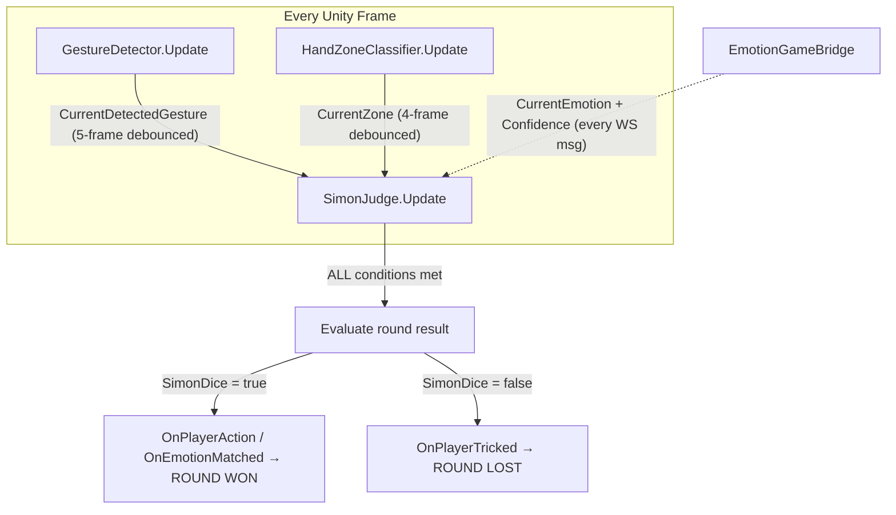

# Simon Round‑Completion: v7 Unified Frame‑by‑Frame Evaluation

> **Date:** 2026-06-01  
> **Status:** Architectural redesign — replaces dual-path event+polling with single unified `Update()`  
> **Drivers:** Eliminate zone-vs‑gesture race condition; simplify detection to one clean path

---

## 1. Problem Recap

The current [`SimonJudge`](Assets/Scripts/Minigames/Simon/SimonJudge.cs) uses **two competing detection paths** for gesture rounds:

| Path | Trigger | Zone Check |
|------|---------|------------|
| `HandleGestureDetected()` (event) | `GestureDetector.OnGestureDetected` on transition | `IsInZone()` against 4‑frame debounced zone |
| `Update()` continuous polling (v6) | Every frame | `IsInZone()` against 4‑frame debounced zone |

**Race condition:** `GestureDetector` debounces gestures over 5 frames, then fires the event. `HandZoneClassifier` debounces zones over 4 frames separately. When the player simultaneously moves to a zone AND forms a gesture, the gesture event can fire before the zone debounce settles → `HandleGestureDetected` rejects the gesture at the zone check. The v6 continuous polling in `Update()` then catches the match ~2 frames later — but only if the player continues holding the gesture.

**Residual risk:** If the player forms the gesture and releases faster than the zone's 4‑frame debounce window, neither path catches it → timeout → false Game Over.

---

## 2. v7 Design: Single Unified Frame‑by‑Frame Evaluation

### 2.1 Core Idea

**Remove** the event‑driven `HandleGestureDetected()` path entirely. **`Update()` becomes the sole detection path** for both gesture and emotion rounds. Every frame the judge atomically evaluates ALL conditions:

```
Frame N: Snapshot gesture + zone + emotion → evaluate → match? → fire
```

No more "gesture event fires, zone check fails, polling catches up later." The judge reads `CurrentDetectedGesture` and `CurrentZone` as they exist at the exact same moment. Both are already independently debounced by their respective systems. The judge simply waits for the frame where both simultaneously satisfy the condition.

### 2.2 Architecture Diagram



### 2.3 Unified Evaluation Logic

```csharp
// SimonJudge.Update() — the SOLE detection path
void Update()
{
    // Debug fields always updated
    UpdateDebugInspector();

    if (!_isMonitoring) return;
    if (_actionAlreadyRegistered) return;

    if (_isEmotionRound)
        EvaluateEmotionRound();
    else
        EvaluateGestureRound();
}

void EvaluateGestureRound()
{
    // ── Guard: no gesture detector, no evaluation ──
    if (_gestureDetector == null) return;

    // ── Read current state (already debounced by their respective systems) ──
    string currentGesture = _gestureDetector.CurrentDetectedGesture;
    HandZone currentZone = _handZoneClassifier != null
        ? _handZoneClassifier.CurrentZone
        : HandZone.None;

    // ── Filter: not a real gesture ──
    if (string.IsNullOrEmpty(currentGesture) || currentGesture == "None")
        return;

    // ── Filter: pre‑held gesture (baseline captured at StartMonitoring) ──
    if (currentGesture == _baselineGesture)
        return;

    // ── Condition A: Gesture must match expected ──
    if (!string.Equals(currentGesture, _expectedGesture.ToString(), StringComparison.OrdinalIgnoreCase))
        return;

    // ── Condition B: Zone must match expected (if zone is required) ──
    if (_expectedZone != HandZone.None)
    {
        if (_handZoneClassifier == null)
            return;
        if (currentZone != _expectedZone)
            return;
    }

    // ═══ ALL CONDITIONS MET — round resolved ═══
    _actionAlreadyRegistered = true;

    if (!_commandContainsSimonDice)
    {
        Debug.Log($"[SimonJudge] TRICKED! Gesture='{currentGesture}', Zone={currentZone}");
        OnPlayerTricked?.Invoke(currentGesture);
    }
    else
    {
        Debug.Log($"[SimonJudge] ACTION! Gesture='{currentGesture}', Zone={currentZone}");
        OnPlayerAction?.Invoke(currentGesture);
    }
}

void EvaluateEmotionRound()
{
    // ── Guard: no bridge, no connection, no face → wait ──
    if (_emotionBridge == null || !_emotionBridge.IsConnected || !_emotionBridge.FaceDetected)
        return;

    string targetEmotionStr = SimonCommandGenerator.GetEmotionEnglishName(_expectedEmotion);
    if (string.IsNullOrEmpty(targetEmotionStr))
        return;

    // ── Condition A: Emotion must match target ──
    if (!_emotionBridge.IsMatchingEmotion(targetEmotionStr))
        return;

    // ═══ ALL CONDITIONS MET — round resolved ═══
    _actionAlreadyRegistered = true;

    if (!_commandContainsSimonDice)
    {
        Debug.Log($"[SimonJudge] TRICKED on emotion! Target='{targetEmotionStr}'");
        OnPlayerTricked?.Invoke(targetEmotionStr);
    }
    else
    {
        Debug.Log($"[SimonJudge] EMOTION MATCHED! Target='{targetEmotionStr}', Confidence={_emotionBridge.Confidence:F2}");
        OnEmotionMatched?.Invoke(targetEmotionStr);
    }
}
```

### 2.4 What Changes in `StartMonitoring()`

```csharp
public void StartMonitoring()
{
    _isMonitoring = true;
    _actionAlreadyRegistered = false;

    // Resolve dependencies
    if (_handZoneClassifier == null)
        _handZoneClassifier = FindAnyObjectByType<HandZoneClassifier>();
    if (_emotionBridge == null)
        _emotionBridge = EmotionGameBridge.Instance;

    if (_isEmotionRound)
    {
        // Emotion round: ensure AutoInterval mode
        if (_emotionBridge != null)
            _emotionBridge.SetMode(EmotionDetectionMode.AutoInterval);
    }
    else
    {
        // Gesture round: capture baseline gesture
        _baselineGesture = _gestureDetector != null
            ? _gestureDetector.CurrentDetectedGesture
            : "None";

        // REMOVED: no longer subscribing to OnGestureDetected
        // _gestureDetector.OnGestureDetected += HandleGestureDetected;  ← DELETED
    }
}
```

### 2.5 What Changes in `StopMonitoring()`

```csharp
public void StopMonitoring()
{
    _isMonitoring = false;
    // REMOVED: no longer unsubscribing from OnGestureDetected
    // if (_gestureDetector != null)
    //     _gestureDetector.OnGestureDetected -= HandleGestureDetected;  ← DELETED
}
```

### 2.6 What Gets Removed Entirely

| Removed | Reason |
|---------|--------|
| `HandleGestureDetected(string)` method | Event‑driven path eliminated |
| `_gestureDetector.OnGestureDetected +=/-=` in Start/StopMonitoring | No longer subscribing |
| `OnPlayerReturnedToNeutral` event usage in HandleGestureDetected | Neutral tracking no longer needed for judging (still exposed for HUD if desired) |
| `_emotionPollTimer` + `EmotionPollInterval` | Every‑frame check replaces interval‑based polling |
| All v6 "safety net" comments | The polling path is now the PRIMARY path |

### 2.7 What Stays Unchanged

| Unchanged | Why |
|-----------|-----|
| `_isMonitoring`, `_actionAlreadyRegistered` guards | Same double‑fire prevention |
| `_baselineGesture` capture in `StartMonitoring()` | Same pre‑held gesture filter |
| `_commandContainsSimonDice` branching | Same trick/obey logic |
| `IsMatchingEmotion()` threshold (0.40) | Same confidence gate |
| `HandZoneClassifier` debounce (4 frames) | Same flicker prevention |
| `GestureDetector` debounce (5 frames) | Same stable‑gesture detection |
| `ResetState()`, `SetExpectedZone()`, etc. | Same configuration API |
| `SimonGame` event handlers (`HandlePlayerAction`, etc.) | Unchanged — judge fires same events |
| `JudgeRound()` in `SimonGame` | Unchanged — same truth table |

---

## 3. Race Condition Analysis — After v7

### 3.1 The Problem, Re‑Examined

**Before v7:** Two systems with independent debounce windows race:
- Gesture debounce: 5 frames → fires event
- Zone debounce: 4 frames → updates CurrentZone

If zone settles 2 frames AFTER gesture fires, the event path rejects (zone not ready), and the polling path may or may not catch it depending on how long the gesture is held.

**After v7:** Single `Update()` evaluation. Every frame reads both `CurrentDetectedGesture` (5‑frame debounced) and `CurrentZone` (4‑frame debounced). Both are the most recent confirmed values. The judge fires on the FIRST frame where both simultaneously satisfy the condition.

### 3.2 Timeline Example

```
Frame:  1    2    3    4    5    6    7    8    9
Player: ──────moving to zone──────┬───holding in zone───
Gesture: ──forming OpenHand──────┬───OpenHand confirmed───
                                 │
GestureDetector:                 OpenHand (debounce done frame 5)
HandZoneClassifier:                             UpLeft (debounce done frame 9)

v6 event path:  Frame 5 → HandleGestureDetected → zone not UpLeft → REJECT
v6 polling:     Frame 6-8 → gesture is OpenHand, zone not UpLeft → wait
                Frame 9 → both match → fire ✓

v7 unified:     Frame 5 → gesture=OpenHand, zone=not UpLeft → wait
                Frame 6-8 → same → wait
                Frame 9 → both match → fire ✓
```

Both paths produce the same result at frame 9. The v7 path is simpler: one evaluation per frame, no special-casing.

### 3.3 Worst Case: Gesture Held < Zone Debounce Window

```
Frame:  1    2    3    4    5    6    7    8    9
Player: ──────moving to zone──────┬───in zone───┬───moves away───
Gesture: ──forming OpenHand──────┬───OpenHand───┬───releases─────
                                 │              │
GestureDetector:                 OpenHand (5)   None (9+)
HandZoneClassifier:                             UpLeft (9)

v6 event path:  Frame 5 → HandleGestureDetected → zone not settled → REJECT
v6 polling:     Frame 5-8 → gesture=OpenHand, zone≠UpLeft → keep polling
                Frame 9 → gesture=None → keep polling (wrong gesture)
                → timeout ✗

v7 unified:     Frame 5 → gesture=OpenHand, zone≠UpLeft → wait
                Frame 6-8 → same → wait
                Frame 9 → gesture=None → wait (no longer matches)
                → timeout ✗ (same result)
```

Neither path can catch this case because the player released the gesture before the zone debounce settled. This is an inherent limitation of having independent debounce windows. The fix for this would be to use **raw (undebounced) zone** in the judge's evaluation, which we address in §4.

---

## 4. Optional Enhancement: Raw Zone for Judge Evaluation

### 4.1 The Idea

The `HandZoneClassifier`'s 4‑frame debounce prevents flicker for UI purposes (arrows, highlights), but the judge doesn't need flicker protection — it only needs to know "was the hand ever in the correct zone simultaneously with the correct gesture."

### 4.2 Implementation: Add `RawZone` Property

Add to [`HandZoneClassifier`](Assets/Scripts/Hand/HandZoneClassifier.cs):

```csharp
/// <summary>
/// The raw, un-debounced zone classification for the current frame.
/// Useful for systems that need immediate zone awareness (e.g., judging).
/// The debounced CurrentZone is better for UI to prevent flicker.
/// </summary>
public HandZone RawZone { get; private set; } = HandZone.None;
```

Set it in `Update()` before the debounce logic:

```csharp
void Update()
{
    if (_positionTracker == null) return;

    Vector2 handPos = _positionTracker.CurrentHandPosition;
    HandZone rawZone = ClassifyPosition(handPos);
    RawZone = rawZone;  // ← NEW: expose undebounced zone

    // ... existing debounce logic unchanged ...
}
```

### 4.3 Use `RawZone` in Judge

In `EvaluateGestureRound()`, use `RawZone` instead of `CurrentZone`:

```csharp
HandZone currentZone = _handZoneClassifier != null
    ? _handZoneClassifier.RawZone       // ← raw, no debounce lag
    : HandZone.None;
```

**Trade‑off:** Using raw zone eliminates the 4‑frame lag but may cause flickering at zone boundaries. However, since the judge only fires once per round (`_actionAlreadyRegistered`), a single‑frame flicker into the correct zone is acceptable — if the player's hand momentarily enters the correct zone while holding the correct gesture, that should count as success.

**Recommendation:** Keep `CurrentZone` (debounced) as default. Add `RawZone` as a configurable option via a serialized field:

```csharp
[Header("Zone Evaluation")]
[Tooltip("If true, judge uses raw (un-debounced) zone. Faster but may flicker at boundaries.")]
[SerializeField] private bool _useRawZoneForJudging = false;
```

---

## 5. Edge Cases

### 5.1 Player Already Holding Correct Gesture at Round Start

`_baselineGesture` captures it in `StartMonitoring()`. The `Update()` filter `currentGesture == _baselineGesture → return` prevents it from firing. The player must release to "None" first, then re‑form the gesture. ✅ Correct.

### 5.2 Player Forms Correct Gesture in Wrong Zone, Then Moves to Correct Zone

v7 checks both simultaneously every frame. The frame where gesture AND zone both match → fires. ✅ Correct.

### 5.3 Player Briefly Enters Correct Zone While Holding Wrong Gesture

Wrong gesture → `currentGesture != _expectedGesture` → `return`. Keep polling. No false positive. ✅ Correct.

### 5.4 Emotion Bridge Disconnects Mid‑Round

`EvaluateEmotionRound()` checks `_emotionBridge.IsConnected` every frame → returns early. Eventually timer expires → `HandleTimeout()` → `JudgeRound(timedOut: true)`. ✅ Correct.

### 5.5 `ContainsSimonDice = false` — Player Must Stay Still

Player does nothing → timer expires → `HandleTimeout()` → `JudgeRound(timedOut: true)` → `RoundResult.Correct`. ✅ Correct.

Player does correct gesture → `EvaluateGestureRound()` fires → `OnPlayerTricked` → `HandlePlayerTricked()` → Game Over with "tricked" message. ✅ Correct.

Player does WRONG gesture (e.g., ClosedFist when expected was OpenHand, but no Simón dice) → `EvaluateGestureRound()` checks gesture match → fails → keeps polling. If timer expires → `Correct`. If they then do the correct gesture → `OnPlayerTricked`. This is debatable but the current truth table says "ANY action when no Simón dice = wrong" — but currently the judge only fires OnPlayerTricked when the CORRECT gesture is done. Doing the wrong gesture when Simón didn't say "Simón dice" is not explicitly handled. The player would time out and win. This is acceptable — the trick only triggers when the player falls for the exact command.

---

## 6. Fix Plan — Ordered TODO List

### Fix 1: Emotion Round Judgment (Critical Bug)
**File:** [`SimonGame.cs:682`](Assets/Scripts/Minigames/Simon/SimonGame.cs:682)
**Change:** `GetEmotionDisplayName()` → `GetEmotionEnglishName()`
**Risk:** Zero — deterministic string lookup from same enum

### Fix 2: Remove Dual-Path in SimonJudge (v7 Unified)
**File:** [`SimonJudge.cs`](Assets/Scripts/Minigames/Simon/SimonJudge.cs)
**Changes:**
- Remove `HandleGestureDetected()` method
- Remove `_gestureDetector.OnGestureDetected += HandleGestureDetected` from `StartMonitoring()`
- Remove `_gestureDetector.OnGestureDetected -= HandleGestureDetected` from `StopMonitoring()`
- Remove `_emotionPollTimer` and `EmotionPollInterval`
- Consolidate all evaluation into `Update()` with `EvaluateGestureRound()` and `EvaluateEmotionRound()` helper methods
- Keep all guards: `_isMonitoring`, `_actionAlreadyRegistered`, `_baselineGesture`

### Fix 3 (Optional): Add RawZone to HandZoneClassifier
**File:** [`HandZoneClassifier.cs`](Assets/Scripts/Hand/HandZoneClassifier.cs)
**Changes:**
- Add `public HandZone RawZone { get; private set; }` property
- Set `RawZone = rawZone` in `Update()` before debounce logic
- Add `_useRawZoneForJudging` toggle in `SimonJudge`

---

## 7. Verification Plan

| # | Test | Expected Result |
|---|------|-----------------|
| V1 | Emotion round: player shows correct emotion, `ContainsSimonDice = true` | `RoundResult.Correct`, score increments |
| V2 | Emotion round: player shows wrong emotion, `ContainsSimonDice = true` | Timer expires → `Timeout` → Game Over |
| V3 | Emotion round: player shows correct emotion, `ContainsSimonDice = false` | `OnPlayerTricked` → Game Over with tricked message |
| V4 | Gesture round: player does correct gesture in correct zone, `ContainsSimonDice = true` | `OnPlayerAction` → `RoundResult.Correct` |
| V5 | Gesture round: player does gesture in wrong zone, then moves to correct zone while holding | Waits for both to match → `OnPlayerAction` → `Correct` |
| V6 | Gesture round: player flashes gesture in correct zone < zone debounce (4 frames) | If using debounced zone: may miss. If using RawZone: catches it. |
| V7 | Gesture round: player does wrong gesture, `ContainsSimonDice = true` | Timer expires → `Timeout` → Game Over |
| V8 | Gesture round: player does correct gesture, `ContainsSimonDice = false` | `OnPlayerTricked` → Game Over |
| V9 | Gesture round: player does nothing, `ContainsSimonDice = false` | Timer expires → `RoundResult.Correct` |
| V10 | Double‑fire: system doesn't fire twice for one action | Exactly one `OnPlayerAction`/`OnPlayerTricked` per round |

---

## 8. Fix 4: "No Simon Dice" Wrong-Gesture Gap

### 8.1 The Gap

When `ContainsSimonDice == false`, the player must stay neutral. Currently there are three paths:

| Path | Player action | Current result | Expected |
|------|-------------|----------------|----------|
| A | Stays neutral | Timeout → Correct ✅ | Correct |
| B | Correct gesture+zone | Tricked → Game Over ✅ | Lose |
| **C** | **Wrong gesture** | **Silent → Timeout → Correct ❌** | **WrongAction → Lose** |

Path C exists because [`EvaluateGestureRound()`](Assets/Scripts/Minigames/Simon/SimonJudge.cs:256) only checks whether the gesture matches `_expectedGesture` (line 270). A non-matching gesture returns early without firing any event. The timer eventually expires → `HandleTimeout()` → `JudgeRound(null, timedOut:true)` → `Correct`. The player can wave randomly and win.

The same gap exists in [`EvaluateEmotionRound()`](Assets/Scripts/Minigames/Simon/SimonJudge.cs:222): only `IsMatchingEmotion(targetEmotionStr)` triggers an event. Any other detected emotion is silently ignored.

### 8.2 Root Cause

Both evaluators are structured as "check for expected match → fire." There is no catch‑all "player did SOMETHING when simon didn't say" fallback.

### 8.3 Design

**Principle:** When `_commandContainsSimonDice == false`, **ANY** detectable action (gesture or emotion) is tricked. Move the "no simon dice" check to the earliest point after confirming the player actually did something, BEFORE the expected‑match check.

#### 8.3.1 `EvaluateGestureRound()` Change

Move `!_commandContainsSimonDice` check from after zone validation to immediately after the baseline/None filter:

```csharp
private void EvaluateGestureRound()
{
    if (!_hasExpectedGesture) return;
    if (_actionAlreadyRegistered) return;
    if (_gestureDetector == null) return;

    string currentGesture = _gestureDetector.CurrentDetectedGesture;
    if (string.IsNullOrEmpty(currentGesture) || currentGesture == "None")
        return;
    if (currentGesture == _baselineGesture)
        return;

    // ── v7 Fix 4: When simon didn't say, ANY gesture = tricked ──
    if (!_commandContainsSimonDice)
    {
        _actionAlreadyRegistered = true;
        Debug.Log($"[SimonJudge] Player TRICKED (any gesture)! Gesture '{currentGesture}' but command didn't contain 'simon dice'.");
        OnPlayerTricked?.Invoke(currentGesture);
        return;
    }

    // ── Simon DID say — check expected gesture + zone ──
    string expectedGestureStr = _expectedGesture.ToString();
    if (!string.Equals(currentGesture, expectedGestureStr, StringComparison.OrdinalIgnoreCase))
        return;

    if (_handZoneClassifier != null && _expectedZone != HandZone.None)
    {
        if (_handZoneClassifier.RawZone != _expectedZone)
            return;
    }

    _actionAlreadyRegistered = true;
    Debug.Log($"[SimonJudge] Unified evaluation matched! Gesture='{currentGesture}', RawZone={_handZoneClassifier?.RawZone}, ExpectedZone={_expectedZone}");
    OnPlayerAction?.Invoke(currentGesture);
}
```

**Key change:** The `!_commandContainsSimonDice` / `OnPlayerTricked` block is now at line position 5 (right after baseline check), not at position 9 (after zone validation). It fires for the correct gesture AND wrong gestures — any gesture at all.

#### 8.3.2 `EvaluateEmotionRound()` Change

Same principle: check `!_commandContainsSimonDice` early, fire tricked for ANY detected emotion (not just the target):

```csharp
private void EvaluateEmotionRound()
{
    if (_actionAlreadyRegistered) return;
    if (_emotionBridge == null || !_emotionBridge.IsConnected || !_emotionBridge.FaceDetected)
        return;

    // ── v7 Fix 4: When simon didn't say, ANY detected emotion = tricked ──
    if (!_commandContainsSimonDice)
    {
        string currentEmotion = _emotionBridge.GetCurrentDominantEmotion();
        if (!string.IsNullOrEmpty(currentEmotion) && _emotionBridge.Confidence >= 0.40f)
        {
            _actionAlreadyRegistered = true;
            Debug.Log($"[SimonJudge] Player TRICKED (any emotion)! Detected '{currentEmotion}' but command didn't contain 'simon dice'.");
            OnPlayerTricked?.Invoke(currentEmotion);
        }
        return;
    }

    // ── Simon DID say — check expected emotion ──
    string targetEmotionStr = SimonCommandGenerator.GetEmotionEnglishName(_expectedEmotion);
    if (string.IsNullOrEmpty(targetEmotionStr)) return;

    if (!_emotionBridge.IsMatchingEmotion(targetEmotionStr))
        return;

    _actionAlreadyRegistered = true;
    Debug.Log($"[SimonJudge] Emotion matched! Target: {_expectedEmotion}, ...");
    OnEmotionMatched?.Invoke(targetEmotionStr);
}
```

#### 8.3.3 `SimonGame` Impact

**No changes needed.** [`HandlePlayerTricked()`](Assets/Scripts/Minigames/Simon/SimonGame.cs:523) already handles the tricked event correctly — it stops monitoring, stops the timer, shows tricked feedback, and ends the game. The event payload (gesture name or emotion name) is just for logging; the result is always Game Over.

### 8.4 Updated Truth Table

| ContainsSimonDice | Player action | Result | Path |
|---|---|---|---|
| TRUE | Correct gesture+zone | Correct | `OnPlayerAction` → `JudgeRound` |
| TRUE | Wrong gesture | WrongGesture | `OnPlayerAction` → `JudgeRound` (mismatch detected) |
| TRUE | Timeout | Timeout | `HandleTimeout` |
| FALSE | **Any gesture** | **Tricked → Game Over** | `OnPlayerTricked` (Fix 4) |
| FALSE | **Any emotion** | **Tricked → Game Over** | `OnPlayerTricked` (Fix 4) |
| FALSE | Nothing/timeout | Correct | `HandleTimeout` |

### 8.5 Files Changed

| File | Change | Risk |
|------|--------|------|
| [`SimonJudge.cs`](Assets/Scripts/Minigames/Simon/SimonJudge.cs) | `EvaluateGestureRound()`: move tricked check before expected‑match check | Low — single block reposition |
| [`SimonJudge.cs`](Assets/Scripts/Minigames/Simon/SimonJudge.cs) | `EvaluateEmotionRound()`: add tricked catch‑all for any detected emotion | Low — new block before existing logic |
| None other | `SimonGame.cs` unchanged | — |

---

*ARcade Rush — v7 Unified Round Detection Plan · 2026-06-01*
