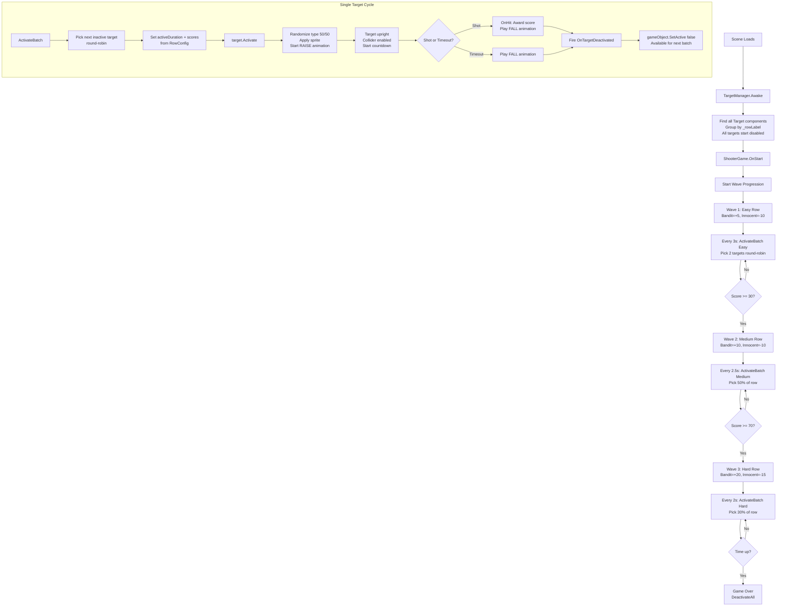

# Target Logic Redesign — Architecture Plan

> **Status:** Final — Ready for Implementation  
> **Author:** Architect mode  
> **Date:** 2026-05-09

---

## Overview

Replace the unimplemented `TargetSpawner` with a **pre-placed target** system. Targets are placed in the scene by the designer, each tagged with a **row label** (a single-word difficulty descriptor). A new [`TargetManager`](Assets/Scripts/Minigames/Shooter/TargetManager.cs) reads all targets from the scene at startup, groups them by row, and provides activation/deactivation APIs. [`ShooterGame`](Assets/Scripts/Minigames/Shooter/ShooterGame.cs) acts as the **controller**, deciding when and which row(s) to activate in waves.

All targets start **disabled** (`activeSelf = false`). Debug mode can override this.

---

## Architecture

```
MG_Shooter.unity
├── ShooterGameController
│   └── ShooterGame.cs (IMiniGame — controls pacing)
├── TargetManager (new)
│   └── TargetManager.cs — groups targets, schedules activation/timeout
├── Target_001 (pre-placed, disabled by default)
│   └── Target.cs — randomized type on activation, raise/fall animation, auto-timeout
├── Target_002 (pre-placed, disabled)
│   └── Target.cs
├── ... (more targets)
└── HandController
    └── ShooterHandController.cs (unchanged)
```

### Data Flow

```
TargetManager.Awake()
  │  Find all Target components in scene
  │  Group by _rowLabel → Dictionary<string, List<Target>>
  │  Store row configs (activation count, duration, interval, points)
  │
ShooterGame.OnStart()
  │  Tell TargetManager to begin
  │  Start wave progression coroutine
  │
TargetManager.ActivateBatch(rowLabel)
  │  Pick X inactive targets (round-robin)
  │  For each: target.Activate()
  │    → Target randomizes type (50/50 Bandit/Innocent)
  │    → Target sets score values from RowConfig
  │    → Target plays RAISE animation (reverse of fall)
  │    → Target enables collider
  │    → Target starts countdown timer
  │
  │  When target is shot OR timer expires:
  │    → target.Deactivate() → plays FALL animation → disables
  │    → TargetManager is notified (target becomes available again)
```

---

## Component Details

### 1. [`Target.cs`](Assets/Scripts/Minigames/Shooter/Target.cs) — Modifications

#### New/Changed Fields

| Field | Type | Default | Description |
|-------|------|---------|-------------|
| `_rowLabel` | `string` | `"Easy"` | Row/difficulty label — set per-target in Inspector |
| `_targetId` | `int` | `0` | Unique ID for ordering within a row |
| `_raiseDuration` | `float` | `0.5f` | Duration of the raise-up animation (mirrors fall) |
| `OnTargetDeactivated` | `System.Action<Target>` | — | Event fired when target deactivates (shot or timeout) |

**Removed:** `_type` is no longer pre-assigned — randomized on each activation.

#### Scoring Per Row (set by TargetManager via RowConfig)

| Row | Bandit Score | Innocent Score |
|-----|-------------|----------------|
| Easy | +5 | -10 |
| Medium | +10 | -10 |
| Hard | +20 | -15 |

The `Target` receives score values from `TargetManager` when activated, overriding its serialized defaults.

#### Raise Animation (New — Reverse of Fall)

The raise animation is the exact reverse of [`CoFallAndReturn()`](Assets/Scripts/Minigames/Shooter/Target.cs:118).

1. Target starts at the **bottom position** — the same pivot-based position where the fall animation ends
2. Animates upward to `_startPosition` (the original position before any fall)
3. Uses the same pivot point and rotation math, just in reverse
4. After raise completes: enable collider, start active countdown

```csharp
private IEnumerator CoRaiseAndActivate()
{
    // Start at fall-end position: rotated 90° at the bottom pivot
    Vector3 pivot = _startPosition - transform.up * _spriteHalfHeight;
    Vector3 pivotToCenter = _startPosition - pivot;
    Vector3 fallAxis = transform.right;

    // End rotation (fall end)
    Quaternion endRot = Quaternion.AngleAxis(90f, fallAxis);

    float elapsed = 0f;
    while (elapsed < _raiseDuration)
    {
        elapsed += Time.deltaTime;
        float t = Mathf.SmoothStep(0f, 1f, elapsed / _raiseDuration);
        float angle = 90f * (1f - t);  // 90 → 0 (reverse of fall)

        transform.rotation = Quaternion.AngleAxis(angle, fallAxis);
        transform.position = pivot + Quaternion.AngleAxis(angle, fallAxis) * pivotToCenter;
        yield return null;
    }

    // Fully upright
    transform.rotation = Quaternion.identity;
    transform.position = _startPosition;

    // Enable interaction
    if (_collider != null) _collider.enabled = true;
    _isAnimating = false;
}
```

#### Deactivation (Fall + Return)

- **When shot (`OnHit()`):** Play fall animation as before. On completion, fire `OnTargetDeactivated` and `gameObject.SetActive(false)`.
- **When timeout:** Same fall animation + deactivation sequence. The player sees the target fall even if they didn't shoot it.

#### Activate() Method (New Public)

```csharp
public void Activate(TargetType forcedType, int banditScore, int innocentScore, float activeDuration)
{
    _isAnimating = true;
    _banditScore = banditScore;
    _innocentScore = innocentScore;
    _activeDuration = activeDuration;

    // Randomize or use forced type (debug mode)
    _type = forcedType;
    ApplySprite();

    // Ensure we start at the bottom position
    // (handled by setting position before raise)
    transform.position = _startPosition - transform.up * _spriteHalfHeight;
    transform.rotation = Quaternion.AngleAxis(90f, transform.right);

    _fallCo = StartCoroutine(CoRaiseAndActivate());
}
```

---

### 2. [`TargetManager.cs`](Assets/Scripts/Minigames/Shooter/TargetManager.cs) — New File

#### Row Configuration

```csharp
[System.Serializable]
public class RowConfig
{
    [Tooltip("Must match _rowLabel on Target GameObjects in this row.")]
    public string label;

    public ActivationMode mode;    // Fixed or Percentage

    [Tooltip("Used when mode = Fixed")]
    public int fixedCount = 2;

    [Tooltip("Used when mode = Percentage (0.0 - 1.0)")]
    [Range(0f, 1f)]
    public float percentage = 0.5f;

    [Header("Scoring")]
    public int banditScore = 5;
    public int innocentScore = -10;

    [Header("Timing")]
    [Tooltip("How long each activated target stays active (seconds).")]
    public float activeDuration = 3f;

    [Tooltip("Cooldown between activation batches for this row (seconds).")]
    public float activationCooldown = 2f;
}

public enum ActivationMode { Fixed, Percentage }
```

#### Public API

| Method | Description |
|--------|-------------|
| `void Initialize()` | Scans scene for `Target` components, groups by `_rowLabel`. Called in `Awake()`. |
| `bool ActivateBatch(string rowLabel)` | Activates next batch from the given row. Round-robin selection. Returns false if row is exhausted or on cooldown. |
| `Target[] GetActiveTargets(string rowLabel)` | Returns currently active targets in a row. |
| `int GetAvailableCount(string rowLabel)` | How many inactive targets remain in a row. |
| `int GetTotalCount(string rowLabel)` | Total targets in a row (active + inactive). |
| `void DeactivateTarget(Target target)` | Deactivate a specific target (called by Target on hit or timeout). |
| `void DeactivateAll()` | Emergency stop — deactivate all active targets. |

#### Round-Robin Selection

`TargetManager` maintains a `Dictionary<string, int>` tracking the last activated index per row. Each `ActivateBatch()` call increments this index cyclically, ensuring fair distribution across all targets in the row.

```
Row "Easy" has 4 targets: [A, B, C, D]
  Batch 1: pick 2 → A, B  (index advances to 2)
  Batch 2: pick 2 → C, D  (index advances to 4 → wraps to 0)
  Batch 3: pick 2 → A, B  (repeat)
```

---

### 3. [`ShooterGame.cs`](Assets/Scripts/Minigames/Shooter/ShooterGame.cs) — Rewrite

#### Changes from Current

| Current | New |
|---------|-----|
| `[SerializeField] TargetSpawner _targetSpawner` | `[SerializeField] TargetManager _targetManager` |
| `_targetSpawner.StartSpawning()` | `_targetManager.Initialize()` (called in Awake) |
| `_targetSpawner.StopSpawning()` | `_targetManager.DeactivateAll()` |
| No wave logic | `CoWaveProgression()` coroutine |

#### Wave Progression

Based on **score thresholds**:

```csharp
private IEnumerator CoWaveProgression()
{
    // Wave 1 — Easy row (runs until score >= 30)
    yield return CoRunRowWave("Easy", scoreThreshold: 30, batchInterval: 3f);

    // Brief pause / transition
    yield return new WaitForSeconds(1f);

    // Wave 2 — Medium row (runs until score >= 70)
    yield return CoRunRowWave("Medium", scoreThreshold: 70, batchInterval: 2.5f);

    yield return new WaitForSeconds(1f);

    // Wave 3 — Hard row (runs until timer ends)
    yield return CoRunRowWave("Hard", scoreThreshold: int.MaxValue, batchInterval: 2f);
}

private IEnumerator CoRunRowWave(string rowLabel, int scoreThreshold, float batchInterval)
{
    while (_deps.GameManager.CurrentScore < scoreThreshold && _isPlaying)
    {
        bool activated = _targetManager.ActivateBatch(rowLabel);
        if (!activated)
        {
            // Row exhausted — wait for targets to be available again
            yield return new WaitForSeconds(1f);
            continue;
        }
        yield return new WaitForSeconds(batchInterval);
    }
}
```

---

## Mermaid Diagram



---

## Scene Setup (Unity Editor)

### Pre-Placed Target GameObjects

All under a parent `Targets` GameObject, each child starts **disabled**:

```
Targets (empty parent)
├── Target_Easy_01 → Target: rowLabel="Easy",   targetId=1
├── Target_Easy_02 → Target: rowLabel="Easy",   targetId=2
├── Target_Easy_03 → Target: rowLabel="Easy",   targetId=3
├── Target_Med_01  → Target: rowLabel="Medium", targetId=1
├── Target_Med_02  → Target: rowLabel="Medium", targetId=2
├── Target_Med_03  → Target: rowLabel="Medium", targetId=3
├── Target_Hard_01 → Target: rowLabel="Hard",   targetId=1
├── Target_Hard_02 → Target: rowLabel="Hard",   targetId=2
└── Target_Hard_03 → Target: rowLabel="Hard",   targetId=3
```

### TargetManager Inspector

```
TargetManager (GameObject)
└── TargetManager (script)
    ├── Row Configs (size=3)
    │   ├── [0] label="Easy"
    │   │     mode=Fixed(2), banditScore=5, innocentScore=-10
    │   │     activeDuration=4s, cooldown=3s
    │   ├── [1] label="Medium"
    │   │     mode=Percentage(0.5), banditScore=10, innocentScore=-10
    │   │     activeDuration=3s, cooldown=2.5s
    │   └── [2] label="Hard"
    │         mode=Percentage(0.3), banditScore=20, innocentScore=-15
    │         activeDuration=2.5s, cooldown=2s
    └── Target Parent (optional) → Transform reference to scan under
```

---

## Files Changed

| File | Action | Summary |
|------|--------|---------|
| [`Assets/Scripts/Minigames/Shooter/Target.cs`](Assets/Scripts/Minigames/Shooter/Target.cs) | **Modify** | Add `_rowLabel`, `_targetId`, `_raiseDuration`, `OnTargetDeactivated`; new `Activate()` method; random type 50/50 in activation; raise animation (reverse of fall); auto-timeout coroutine; fall on timeout |
| [`Assets/Scripts/Minigames/Shooter/TargetManager.cs`](Assets/Scripts/Minigames/Shooter/TargetManager.cs) | **Create** | Scene target scanner, row grouping, `RowConfig` with scoring/timing, round-robin `ActivateBatch()`, cooldown tracking |
| [`Assets/Scripts/Minigames/Shooter/ShooterGame.cs`](Assets/Scripts/Minigames/Shooter/ShooterGame.cs) | **Rewrite** | Replace `TargetSpawner` with `TargetManager`; add `CoWaveProgression()` with Easy(30pts) → Medium(70pts) → Hard(end) |
| [`docs/shooter_implementation.md`](docs/shooter_implementation.md) | **Update** | New section for target logic redesign; replace spawner references with TargetManager docs |

---

## Summary of Key Decisions

| Decision | Choice |
|----------|--------|
| Row assignment | Manual `_rowLabel` string per target in Inspector |
| Row labels | Single-word difficulty descriptors (e.g., "Easy", "Medium", "Hard") |
| Activation count | Configurable per row: Fixed or Percentage of total targets in that row |
| Target selection | Round-robin across inactive targets in the row |
| Random type | 50/50 Bandit/Innocent on each activation |
| Scoring per row | Easy: +5/-10, Medium: +10/-10, Hard: +20/-15 |
| Raise animation | Exact reverse of fall — pivot-based rotation from 90° down to upright |
| Timeout behavior | Plays fall animation, then deactivates (same as being shot without score) |
| Wave progression | Score-based: Easy until 30pts, Medium until 70pts, Hard until timer ends |
| Default state | All targets disabled (debug mode can show them placed) |
